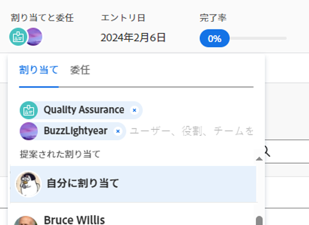

# スマート割り当ての実行

<!--Audited: 07/2024-->

<!--keep the yellow around the Rate card job roles and the Preview intro for those-->

このページでハイライト表示されている情報は、まだ一般に利用できない機能を示します。すべての顧客に対してプレビュー環境でのみ使用できるか、または迅速リリースを有効にした顧客の実稼動環境でのみ使用できます。

迅速リリースについて詳しくは、[組織での迅速リリースを有効または無効にする](/help/quicksilver/administration-and-setup/set-up-workfront/configure-system-defaults/enable-fast-release-process.md)を参照してください。

現在のリリースについて詳しくは、[2024年第 4 四半期リリースの概要](/help/quicksilver/product-announcements/product-releases/24-q4-release-activity/24-q4-release-overview.md)を参照してください。

スマート割り当てを使用して、作業の完了に最適なユーザーを特定できます。

スマート割り当ては、作業アイテムをリソースに割り当てる際に Adobe Workfront に表示される、ユーザー、役割またはチームに関する提案です。Workfront は、業務に最も適したリソースを決定するアルゴリズムに基づいて提案します。

Workfrontには、タスクとイシューに異なる機能を持つスマート割り当てを計算する 2 つのアルゴリズムがあります。

スマート割り当ての決定に使用される基準について詳しくは、[スマート割り当ての概要](/help/quicksilver/manage-work/tasks/assign-tasks/smart-assignments.md)を参照してください。

## アクセス要件

+++ 展開すると、この記事の機能のアクセス要件が表示されます。

<table style="table-layout:auto"> 
 <col> 
 <col> 
 <tbody> 
  <tr> 
   <td role="rowheader">Adobe Workfront プラン</td> 
   <td> 
任意
 </td> 
  </tr> 
  <tr> 
   <td role="rowheader">Adobe Workfront プラン*</td> 
   <td> 
新規：標準

      または
      
現在：ワーク以上
 </td> 
  </tr> 
  <tr> 
   <td role="rowheader">アクセスレベル設定</td> 
   <td> 
タスクおよびイシューに対する編集アクセス権
 
プロジェクトに対する表示以上のアクセス権
  </td> 
  </tr> 
  <tr> 
   <td role="rowheader">オブジェクト権限</td> 
   <td> 
タスクやイシューに対する割り当てを行う権限の付与
 </td> 
  </tr> 
 </tbody> 
</table>

*詳しくは、[Workfront ドキュメントのアクセス要件 ](/help/quicksilver/administration-and-setup/add-users/access-levels-and-object-permissions/access-level-requirements-in-documentation.md) を参照してください。

+++

## スマート割り当ての実行

スマート割り当ては、Workfront で割り当てを行うほとんどの場所で使用できます。

1. 次のエリアに移動し、「**割り当て**」または「**割り当て先**」フィールドをクリックします。

   * タスクまたはイシューのリストやレポート
   * タスクまたはイシューのヘッダー
   * タスクまたはイシューの概要パネル
   *  新規タスク  またはイシューをプロジェクトに追加する際の  新規タスク  または新規イシューボックス
   * ホームエリアにリストされた項目の「割り当て」フィールド
   * ワークロードバランサーのタスクまたはイシュー

1. 「割り当て」フィールドにカーソルを置き、2 秒間待ちます。

   イシューの場合、スマート割り当ては次のセクションに表示されます。

   * **ユーザーとチーム**
   * **担当業務**

   

   タスクについては、割り当てが特定されたアルゴリズムの計算のフェーズに応じて、スマート割り当てが次のセクションに表示されます。

   * **提案された割り当て**：タスクスマート割り当てアルゴリズムの最初のフェーズで識別された割り当てを表示します。
   * **ユーザーとチーム**、**担当業務** または **評価カードの担当業務**：タスクスマート割り当てのアルゴリズム計算の第 2 段階で特定された割り当て。

   

   詳しくは、[スマート割り当ての概要](../../../manage-work/tasks/assign-tasks/smart-assignments.md)を参照してください。

1. 名前をクリックして、レコメンデーションリストのリソースを選択します。

1. （オプション）「**自分に割り当て**」をクリックして、作業アイテムを自分に割り当てます。

   >[!TIP]
   >
   >候補の提案がない場合、候補リストは開きません。

1. （オプション）スマート割り当てリストから候補ユーザーの 1 人を使用しない場合は、目的のリソースの名前を入力していき、リストに名前が表示されたらそれを選択します。
1. 「**入力**」をクリックして割り当てを行います。

   選択したユーザーがタスクまたはイシューに割り当てられます。
