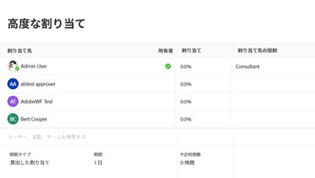

# タスクに関するユーザーと役割の割り当て時間を管理

タスクにユーザーまたはロールを割り当てると、タスクを完了するために一定時間作業に割り当てられます。 タスクの期間の種類が「単純」の場合、各ユーザーまたはジョブの役割がタスクに割り当てられたときに割り当てられる時間数を手動で変更できます。

## アクセス要件

この記事の手順を実行するには、次のアクセス権が必要です。

<table style="table-layout:auto"> 
 <col> 
 <col> 
 <tbody> 
  <tr> 
   <td role="rowheader">Adobe Workfront plan*</td> 
   <td> 
任意
 </td> 
  </tr> 
  <tr> 
   <td role="rowheader">Adobe Workfront license*</td> 
   <td> 
仕事以上
 </td> 
  </tr> 
  <tr> 
   <td role="rowheader">アクセスレベル設定*</td> 
   <td> 
タスクへのアクセスを編集
 
注意：まだアクセス権がない場合は、Workfront管理者に、アクセスレベルに追加の制限を設定しているかどうかを問い合わせてください。 Workfront管理者がアクセスレベルを変更する方法について詳しくは、 <a href="../../../administration-and-setup/add-users/configure-and-grant-access/create-modify-access-levels.md" class="MCXref xref">カスタムアクセスレベルの作成または変更</a>.
 </td> 
  </tr> 
  <tr> 
   <td role="rowheader">オブジェクト権限</td> 
   <td> 
タスクに権限を付与するか、それ以上の権限を付与する
 
割り当て時間を更新する権限を編集（タスクの編集ボックス）
 
追加のアクセス権のリクエストについて詳しくは、 <a href="../../../workfront-basics/grant-and-request-access-to-objects/request-access.md" class="MCXref xref">オブジェクトへのアクセスのリクエスト </a>.
 </td> 
  </tr> 
 </tbody> 
</table>

&#42;保有しているプラン、ライセンスの種類、アクセス権を確認するには、Workfront管理者に問い合わせてください。

## タスクの割り当て時間を変更する際の考慮事項

>[!IMPORTANT]
>
>タスクの各割り当てに対する割り当てを手動で変更すると、タスクの [ 予定時間 ] がそれに応じて更新される場合があります。 詳しくは、 [ユーザー割り当て管理時のタスク計画時間の更新](../../../manage-work/tasks/task-information/planned-hours.md#update) 記事内 [計画時間の概要](../../../manage-work/tasks/task-information/planned-hours.md).

* タスクに割り当てられた個々のリソースに割り当てられた時間の合計は、タスクの予定時間を表します。
* 1 つのタスクに 1 人のユーザーまたは役割の割り当てがある場合、そのユーザーまたは役割に割り当てられた時間数は、タスクの予定時間と一致します。
* 複数の割り当てを行う場合、タスクの期間の種類が [ 簡易 ] の場合は、既定で、各ユーザーまたはジョブの役割に同じ時間が割り当てられます。 詳しくは、次の記事を参照してください。

   * [タスクの期間と期間のタイプの概要](../../../manage-work/tasks/taskdurtn/task-duration-and-duration-type.md)
   * [期間タイプの概要：シンプル](../../../manage-work/tasks/taskdurtn/simple-duration-type.md)

* タスクの期間タイプがシンプルの場合は、各ユーザーまたはジョブの役割に割り当てられた時間数を手動で変更して、タスクの割り当て先の一部が他のタスクよりも作業時間が長くなる可能性があることを示すことができます。
* タスクに割り当てられたチームに割り当てられた時間数を変更することはできません。
* 問題のユーザーまたはジョブの役割の割り当てを手動で変更することはできません。
* また、ワークロードバランサーを使用して、タスクや問題に対するユーザーの日別、週別、月別の割り当てを管理することもできます。 詳しくは、 [ワークロードバランサーでのユーザー割り当ての管理](../../../resource-mgmt/workload-balancer/manage-user-allocations-workload-balancer.md).

## タスクのユーザーまたは役割の割り当て時間を変更する

1. 割り当て時間を変更する割り当てのタスクに移動します。
1. 次をクリック： **詳細** メニュー  タスク名の横にあるをクリックし、 **編集**&#x200B;を、 **割り当て**.

   または

   次をクリック： **割り当て** 領域を選択し、 **詳細**.

1. 次を確認します。 **期間のタイプ** のタスクが **シンプル**.
1. を変更します。 **配分** タスクの担当者ごとに これは、タスクの期間全体に対する、このタスクへの各割り当ての全割り当てです。 これにより、タスクの全体的な予定時間が更新される場合もあります。

   

1. 「**保存**」をクリックします。
