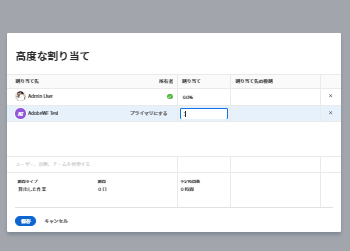

# タスクに対するユーザーまたは役割の配分率の管理

配分率は、割り当てられたリソースが 1 日に 1 回のタスクで作業する予定の時間を表します。タスクの期間中にリソースが配分される、（ユーザーまたはプロジェクトのスケジュールに従った）作業日の割合です。

>[!NOTE]
>
>ユーザーを作業に割り当てる場合、ユーザーのスケジュールに応じた空き時間は、タスクやイシューの予定日と見込日に影響します。スケジュールについて詳しくは、[スケジュールの作成](../../../administration-and-setup/set-up-workfront/configure-timesheets-schedules/create-schedules.md)を参照してください。

## アクセス要件

この記事の手順を実行するには、次のアクセス権が必要です。

<table style="table-layout:auto"> 
 <col> 
 <col> 
 <tbody> 
  <tr> 
   <td role="rowheader">Adobe Workfront プラン*</td> 
   <td> 
任意
 </td> 
  </tr> 
  <tr> 
   <td role="rowheader">Adobe Workfront ライセンス*</td> 
   <td> 
ワークまたはそれ以上
 </td> 
  </tr> 
  <tr> 
   <td role="rowheader">アクセスレベル設定*</td> 
   <td> 
タスクへのアクセスを編集
 
メモ：まだアクセス権がない場合は、アクセスレベルに追加の制限が設定されていないかどうか Workfront 管理者にお問い合わせください。Workfront 管理者がアクセスレベルを変更する方法について詳しくは、<a href="../../../administration-and-setup/add-users/configure-and-grant-access/create-modify-access-levels.md" class="MCXref xref">カスタムアクセスレベルの作成または変更</a>を参照してください。
 </td> 
  </tr> 
  <tr> 
   <td role="rowheader">オブジェクト権限</td> 
   <td> 
タスクに対する参加以上の権限
 
タスクの編集ボックスで配分率を更新するための編集権限
 
追加のアクセス権のリクエストについて詳しくは、<a href="../../../workfront-basics/grant-and-request-access-to-objects/request-access.md" class="MCXref xref">オブジェクトへのアクセス権のリクエスト</a>を参照してください。
 </td> 
  </tr> 
 </tbody> 
</table>

&#42;保有するプラン、ライセンスタイプ、アクセス権を確認するには、Workfront 管理者に問い合わせてください。

## タスクの配分率の変更に関する考慮事項

* デフォルトでは、ユーザーは、割り当てられているタスクに対して同じ割合の時間が配分されます。
* タスクの「期間タイプ」が「予定作業」または「残存作業時間の優先」の場合のみ、タスクに割り当てられたユーザーおよび担当業務の配分率を手動で変更できます。

  詳しくは、[タスク期間と期間タイプの概要](../../../manage-work/tasks/taskdurtn/task-duration-and-duration-type.md)を参照してください。

* タスクに割り当てられたチームの配分率は変更できません。
* イシューに割り当てられたユーザーと担当業務の配分率は変更できません。

## タスクに対するユーザーまたは役割の配分率を変更

1. 配分率を変更するリソースを持つタスクに移動します。
1. タスク名の横にある&#x200B;**その他**&#x200B;メニュー  をクリックし、「**編集**」をクリックします。

   または

   タスクヘッダーにある&#x200B;**割り当て**&#x200B;エリアを選択し、「**詳細**」をクリックします。

1. タスクの&#x200B;**期間タイプ**&#x200B;が次のいずれかであることを確認します。

   * 予定作業
   * 残存作業時間の優先

   >[!TIP]
   >
   >* 期間タイプが予定割り当て時間の場合、Workfront は次の数式を使用して各担当者の配分率を計算します。`Allocation Percentage = (Work Required / Number of days in the Duration) / Number of hours per work day / Number of assignees`
   >* 期間タイプがシンプルの場合、配分率ではなく、各リソースに割り当てられた時間を見積もることができます。

1. 「**割り当て**」をクリックし、タスクの担当者ごとに&#x200B;**割り当て**&#x200B;を変更します。

   変更できるのは、ユーザーと担当業務の割り当てに関する配分率のみです。

   タスクに割り当てられたチームの配分率は変更できません。

   

1. 「**保存**」をクリックします。
