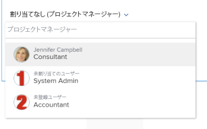

# スマート割り当ての概要

タスクとタスクの割り当てを管理する場合、スマート割り当てを使用して、作業を完了するのが最適なユーザーを特定できます。 スマート割り当てとは、ジョブに最も適したリソースを決定するアルゴリズムに基づいて作業項目をリソースに割り当てる際にAdobe Workfrontが表示する提案です。

>[!NOTE]
>
>スマート割り当てでは、ユーザーの可用性は考慮されません。 ただし、スケジュールに従って使用できる場合は、タスクの計画日と予定日に影響し、タスクが割り当てられた際に問題が発生します。 スケジュールについて詳しくは、 [スケジュールの作成](../../../administration-and-setup/set-up-workfront/configure-timesheets-schedules/create-schedules.md).

この記事には、スマート割り当てに関する一般的な情報が含まれています。 スマート割り当てを使用してタスクとタスクをユーザーに割り当てる方法については、 [スマート割り当てを行う](../../../manage-work/tasks/assign-tasks/make-smart-assignments.md).

## スマート割り当ての概要

スマート割り当てを使用する際は、次の点に注意してください。

* このアルゴリズムは、タスクと問題に対して独立して機能します。 つまり、Workfrontは問題とタスクに関する基準に従って個別にリストを作成するので、問題の推奨ユーザーのリストがタスクの推奨ユーザーのリストと異なる場合があります。
* スマート割り当てでは、ジョブの役割やチームを推奨しません。 代わりに、タスクやイシューを完了するのに最適なユーザーの提案になります。
* 提案された割り当ては、常にアクティブなユーザーです。
* 最初にリストされたユーザーは、タスクに最も適した一致である必要があります。

## スマート割り当て候補の検索

スマート割り当ては、次のタスクまたはタスクを割り当てることができる領域で表示できます。

* タスク、タスクリスト、またはレポート

   

* タスクまたはイシューのヘッダー

   

* タスクまたは問題の概要パネル

   

* 「ホーム」領域にリストされた項目の「割り当て」フィールド

   

<!--removed for scheduling deprecation: 

* Resource Scheduling

  

  >[!CAUTION]
  >
  >Resource Scheduling is a deprecated feature. For more information, see [Deprecation of Resource Scheduling tools in Adobe Workfront](../../../resource-mgmt/resource-mgmt-overview/deprecate-resource-scheduling.md).

-->
* ワークロードバランサー

   

## スマート割り当て条件

スマート割り当てでは、独自のアルゴリズムに基づいて上位 50 件のレコメンデーションが表示されます。

次の条件の組み合わせに基づいて、「スマート割り当て」ドロップダウンリストでユーザーが推奨されます（最も重要な条件から最も重要でない条件の順に表示されます）。

* 過去 30 日間に、割り当てを行ったユーザーによって他の作業項目に割り当てられたユーザー。 この条件に一致する最初の 50 人のユーザーが表示されます。 最も頻繁に割り当てられたユーザーが最初に表示されます。

   作業項目がチームまたはロールに割り当てられている場合は、以下の既存の割り当てを考慮して、提案されたユーザーのリストがさらにフィルタリングされます。 この場合、候補のリストには次のユーザーのみが表示されます。

   * ホームチームが作業項目に割り当てられたユーザー。
   * 作業項目に割り当てられた役割がプライマリロールのユーザーです。

      >[!TIP]
      >
      >* If <!--you're not part of any team and --> タスクまたはタスクに割り当てられた役割やチームがありません。Workfrontには、過去 30 日間（最大 50 人）に割り当てられたすべてのユーザーが表示されます。
      >* 過去 30 日間に割り当てを行っていない場合は、割り当てられたチームに属しているユーザー、または作業項目に割り当てられたロールを持つユーザーのみが、スマート割り当てリストに表示されます。

<!--the commented out piece in the tip above was live before but I am not totally sure that smart assignments look at your team. I think they look JUST at the team/ role assigned to the work item; see this help site request for more info: https://experience.adobe.com/#/@adobeinternalworkfront/so:hub-Hub/workfront/issue/62fd222200037eb87572c5b6ad6bf53e/overview -->
<!--

<h3>Smart assignments criteria for the Production environment</h3>

(NOTE: drafted,this was the case BEFORE we updated the logic in the WB - with the 21.4 release)

Smart assignments display on tasks and issues when the following conditions are met:

<ul>
<li>The task or issue is subordinate to a parent task or issue that has a user, team, or job role currently assigned. </li>
</ul>

Smart assignments display the top twenty recommendations based on a proprietary algorithm that uses your own team information.

Users are recommended in the smart assignments drop-down list based on a combination of the following criteria (listed in order from most important to least important):

<ul>
<li>The user has the team assigned to the task or issue designated as their Home Team</li>
<li>The user is also assigned to the parent task</li>
<li>The user has the same primary job role as is currently assigned to the task or issue</li>
<li>The user has the team assigned to the parent task or issue designated as their Home Team</li>
<li>The user is associated with the same primary job role currently assigned to the parent task</li>
<li>The user is a member of the same team as the user who assigned the task or issue and the team is designated as their Home Team</li>
<li>The user is a member of the same Home Group as the user who is assigning the task or issue</li>
<li>The user has the same primary job role as the user who is assigning the task or issue.</li>
</ul>

-->

<!--

<h2>Make smart assignments</h2>

(NOTE:&nbsp;this was moved to its own article: make-smart-assignments.) 

Smart assignments are available in most locations where you can make assignments in Workfront.

You can use smart assignments on tasks and issues that have previously been assigned to a job role or a team.
 <note type="note">
You must have a Plan or a Work license and have at least Contribute permissions to a task or an issue to be able to make assignments to the task or the issue. You must have the Make Assignments option enabled in your permission level to make assignments.
</note>

To use smart assignments:

<ol>
<li value="1">Navigate to an issue or a task and click one of the following fields to edit them:  
<ul>
<li>
The <strong>Assignments</strong> field in the task or issue header
</li>
<li>The <strong>Assignments</strong> field of a task or issue list using in-line editing in a task or issue list. </li>
<li>The <strong>Assignee</strong> field after you have clicked <strong>Advanced</strong> from a task or an issue. </li>
</ul></li>
<li value="2"> 
Place your cursor in the assignment field, and wait for two seconds, then the <strong>Suggestions</strong> list is displayed.
 
Users displayed in this list are the smart assignment suggestions for the task or the issue. 
 
  
 </li>
<li value="3"> 
Select the user in the recommendations list by clicking their name. 
 
If there are no suggestions, the suggestion list does not open.
 </li>
<li value="4">(Optional) If you do not want to use one of the recommended users from the smart assignments list, start typing the name of the desired user and select the name when it appears in the list.</li>
<li value="5">Click <strong>Enter</strong> to make the assignment. </li>
</ol>

-->
