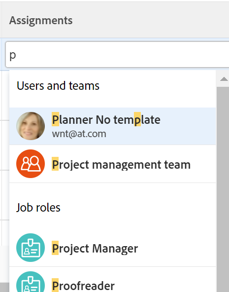

# スマート割り当ての概要

<!--Audited: 07/2024-->

<!--keep the yellow around the Rate card job roles and the Preview intro for those-->

このページでハイライト表示されている情報は、まだ一般に利用できない機能を示します。すべての顧客に対してプレビュー環境でのみ使用できるか、または迅速リリースを有効にした顧客の実稼動環境でのみ使用できます。

迅速リリースについて詳しくは、[組織での迅速リリースを有効または無効にする](/help/quicksilver/administration-and-setup/set-up-workfront/configure-system-defaults/enable-fast-release-process.md)を参照してください。

現在のリリースについて詳しくは、[2024年第 4 四半期リリースの概要](/help/quicksilver/product-announcements/product-releases/24-q4-release-activity/24-q4-release-overview.md)を参照してください。

タスクとイシューの割り当てを管理する場合、スマート割り当てを使用すると、作業を完了するのに最適なユーザーを特定できます。スマート割り当ては、作業アイテムをリソースに割り当てる際に、その作業に最も適したリソースを決定するアルゴリズムに基づいて Adobe Workfront が示す提案です。スマート割り当てでは、ユーザー、担当業務、チームを指定できます。

>[!NOTE]
>
>ユーザーを提案する場合、スマート割り当てはユーザーの空き時間を考慮しません。ただし、スケジュールに従った稼動状況は、タスクの予定日と見込日に影響し、タスクが割り当てられた際に問題が発生します。スケジュールについて詳しくは、[スケジュールの作成](../../../administration-and-setup/set-up-workfront/configure-timesheets-schedules/create-schedules.md)の記事を参照してください。

この記事には、スマート割り当てに関する一般的な情報が含まれています。スマート割り当てを使用してタスクとイシューをユーザーに割り当てる方法について詳しくは、[スマート割り当てを行う](../../../manage-work/tasks/assign-tasks/make-smart-assignments.md)を参照してください。

## スマート割り当ての概要

スマート割り当てを使用する際は、次の点を考慮してください。

*  アルゴリズムは、タスクと問題に対して独立して機能します。 つまり、Workfrontは、イシューとタスクに個別に関連する条件に従ってリストを作成するので、イシューの推奨ユーザーのリストとタスクの推奨ユーザーのリストが異なる場合があります。
<!--not sure this is accurate: * Smart assignments do not recommend job roles or teams. Instead, they are suggestions of users who are best fit to complete a task or an issue. -->
* 推奨される割り当ては、常にアクティブユーザー、担当業務またはチームです。
* 最初にリストされるリソースは、そのタスクに最も一致するリソースである必要があります。

## スマート割り当て候補の検索

スマート割り当ては、タスクまたはイシューを割り当てることができる次のエリアで表示できます。

* 割り当て列のイシューのリストまたはレポート

  

* 割り当て列のタスク リストまたはレポート

  

* 「割り当て」フィールドのタスクヘッダー

  

* 「割り当て」フィールドのイシューヘッダー

  

* 割り当てエリアのタスクまたはイシューの概要パネル

  

* タスクをプロジェクトに追加するときは、[ 新しいタスク ] ボックスの [ 割り当て ] フィールド

  

<!--this is not possible in the new home  - we have Summary there: 
* The Assignments field for an item listed in the Home area, when you open a task or issue

  
-->

* タスクまたはイシューを割り当てる際のこの割り当て先エリアのワークロードバランサー

  

## スマート割り当て条件

スマート割り当ては、タスクに対する場合とイシューに対する場合とで異なります。

### タスクに対するスマート割り当て条件

タスクのスマート割り当ての計算は、2 つの異なるアルゴリズムを使用する 2 つのフェーズ  で機能します。

 スマート割り当てを見つけたアルゴリズムに応じて、割り当ては「割り当て」フィールドの 2 つの異なるセクションに表示されます。 詳しくは、[ スマート割り当てを行う ](/help/quicksilver/manage-work/tasks/assign-tasks/make-smart-assignments.md) を参照してください。

#### タスクに対するスマート割り当て計算の第 1 フェーズ

スマート割り当てを計算する第 1 フェーズでは、Workfront は割り当てごとに類似性スコアを計算します。

>[!NOTE]
>
>スマート割り当て計算の第 1 フェーズは、次のタスクエリアには適用されません。
>
>* ワークロードバランサーでの一括割り当て。
>* ボード上の接続されたカード。

類似性スコアの計算と、割り当てが一覧表示される順序は、次の点を考慮に入れています。

* タスク、プロジェクト、ポートフォリオの名前が割り当てようとしているタスクと同じである既存の割り当てには、100％のスコアが付けられます。既存の割り当てのタスクのプロジェクト名とポートフォリオ名も、割り当てようとしているタスクのプロジェクト名とポートフォリオ名と一致している必要があります。

* 他の割り当てで既存のタスクと一致するのが一部の情報のみである場合、スコアは 100％未満になります。

  例えば、「マイポートフォリオ」というポートフォリオの「マイプロジェクト」というプロジェクトの「マイタスクその 2」というタスクを割り当てようとしていて、「マイポートフォリオ」というポートフォリオの「マイプロジェクト」というプロジェクトの「マイタスク」という既存のタスクがある場合、既存のタスクと割り当てようとしているタスクの名前は似ていますが、同一ではないため、「マイタスク」に割り当てられているユーザーのスコアは 95％になります。

  >[!TIP]
  >
  >  Workfront は、タスク、プロジェクトおよびポートフォリオの「名前」フィールドのみで一致を検索し、他のフィールドでは一致を検索しません。

* システム内の多数のタスクに似たような名前が割り当てられていると、割り当てのスコアが高くなる可能性があります。例えば、システム内で名前に「AI」を含むタスクの 50％に「開発」というチームが割り当てられていて、名前に「AI」を含む別のタスクを割り当てようとする場合、「開発」チームのスコアは高くなります。この場合、プロジェクト名やポートフォリオ名はそれほど重要ではありません。

* このスコアリングのしくみを考慮して、最初の 7 つの提案がスマート割り当てとしてスコアの降順で表示されます。スコアが 40％未満の割り当ては表示されません。

* スコアが同じ割り当てが複数ある場合、割り当てが行われた日付の順に最新の日付から表示されます。

  例えば、Rick が今日早くに類似のタスクに割り当てられ、Jennifer が 2 日前に類似のタスクに割り当てられた場合、Rick が最初に表示されます。

* このフェーズで特定された割り当ては、    タスクの「割り当て」フィールドの **提案された割り当て** セクション。

* この計算を使用して一致がない場合、スマート割り当ての第 2 フェーズが開始し、別のアルゴリズムを使用して計算されます。

#### タスクのスマート割り当て計算の第 2 フェーズ

タスクのスマート割り当ての最初のステップで一致が見つからなかった場合、Workfront はタスクのスマート割り当てをイシューの計算と同じ方法で計算します。

詳しくは、この記事の[タスクとイシューのスマート割り当て条件](#smart-assignments-criteria-for-tasks-and-issues)を参照してください。

このフェーズで識別された割り当ては、「割り当て」フィールドの **ユーザーとチーム**、**担当業務の割り当て**、および **評価カードの役割** セクションに一覧表示されます。  評価カードについて詳しくは、[ 評価カードの管理 ](/help/quicksilver/administration-and-setup/set-up-workfront/configure-system-defaults/manage-rate-cards.md) を参照してください。<!--keep the rate cards roles in yellow after the release of assignments to Prod-->

### タスクとイシューのスマート割り当て条件

>[!NOTE]
>
>次の条件は、タスクのスマート割り当て計算の最初のフェーズで一致するものが見つからなかった場合にのみ、タスクに適用されます。 詳しくは、[タスクのスマート割り当て計算の第 1 フェーズ](#first-phase-of-smart-assignment-calculation-for-tasks)を参照してください。次の条件は、デフォルトで常にイシューに適用されます。

次の条件の組み合わせに基づいて、スマート割り当てドロップダウンリストでユーザー候補が提示されます（最も重要候補から最も重要でない候補の順に表示されます）。

1. 過去 30 日間に、割り当てを行ったユーザーによって他の作業アイテムに割り当てられたユーザー。この条件に一致する最初の 50 名のユーザーが表示されます。最も頻繁に割り当てられたユーザーが最初に表示されます。

2. 作業アイテムがチームまたは役割に割り当てられている場合は、以下の既存の割り当てを考慮して、候補に挙げられたユーザーのリストがさらにフィルタリングされます。この場合、候補のリストには次のユーザーのみが表示されます。

   * ホームチームが作業アイテムに割り当てられているユーザー。
   * プライマリ役割が、作業アイテムに割り当てられているユーザーです。

>[!TIP]
>
>* タスクまたはイシューに割り当てられた役割やチームがない場合、Workfront は過去 30 日間に割り当てられたすべてのユーザー（最大 50 名）を表示します。
>
>* 過去 30 日間に割り当てを行っていない場合は、割り当てられたチームに属しているユーザー、または自身の役割が作業アイテムに割り当てられているユーザーのみが、スマート割り当てリストに表示されます。

<!--the commented out piece in the tip above was live before but I am not totally sure that smart assignments look at your team. I think they look JUST at the team/ role assigned to the work item; see this help site request for more info: https://experience.adobe.com/#/@adobeinternalworkfront/so:hub-Hub/workfront/issue/62fd222200037eb87572c5b6ad6bf53e/overview -->
<!--

<h3>Smart assignments criteria for the Production environment</h3>

(NOTE: drafted,this was the case BEFORE we updated the logic in the WB - with the 21.4 release)

Smart assignments display on tasks and issues when the following conditions are met:

<ul>
<li>The task or issue is subordinate to a parent task or issue that has a user, team, or job role currently assigned. </li>
</ul>

Smart assignments display the top twenty recommendations based on a proprietary algorithm that uses your own team information.

Users are recommended in the smart assignments drop-down list based on a combination of the following criteria (listed in order from most important to least important):

<ul>
<li>The user has the team assigned to the task or issue designated as their Home Team</li>
<li>The user is also assigned to the parent task</li>
<li>The user has the same primary job role as is currently assigned to the task or issue</li>
<li>The user has the team assigned to the parent task or issue designated as their Home Team</li>
<li>The user is associated with the same primary job role currently assigned to the parent task</li>
<li>The user is a member of the same team as the user who assigned the task or issue and the team is designated as their Home Team</li>
<li>The user is a member of the same Home Group as the user who is assigning the task or issue</li>
<li>The user has the same primary job role as the user who is assigning the task or issue.</li>
</ul>

-->

<!--

<h2>Make smart assignments</h2>

(NOTE:&nbsp;this was moved to its own article: make-smart-assignments.) 

Smart assignments are available in most locations where you can make assignments in Workfront.

You can use smart assignments on tasks and issues that have previously been assigned to a job role or a team.
 <note type="note">
You must have a Plan or a Work license and have at least Contribute permissions to a task or an issue to be able to make assignments to the task or the issue. You must have the Make Assignments option enabled in your permission level to make assignments.
</note>

To use smart assignments:

<ol>
<li value="1">Navigate to an issue or a task and click one of the following fields to edit them:  
<ul>
<li>
The <strong>Assignments</strong> field in the task or issue header
</li>
<li>The <strong>Assignments</strong> field of a task or issue list using in-line editing in a task or issue list. </li>
<li>The <strong>Assignee</strong> field after you have clicked <strong>Advanced</strong> from a task or an issue. </li>
</ul></li>
<li value="2"> 
Place your cursor in the assignment field, and wait for two seconds, then the <strong>Suggestions</strong> list is displayed.
 
Users displayed in this list are the smart assignment suggestions for the task or the issue. 
 
  
 </li>
<li value="3"> 
Select the user in the recommendations list by clicking their name. 
 
If there are no suggestions, the suggestion list does not open.
 </li>
<li value="4">(Optional) If you do not want to use one of the recommended users from the smart assignments list, start typing the name of the desired user and select the name when it appears in the list.</li>
<li value="5">Click <strong>Enter</strong> to make the assignment. </li>
</ol>

-->
