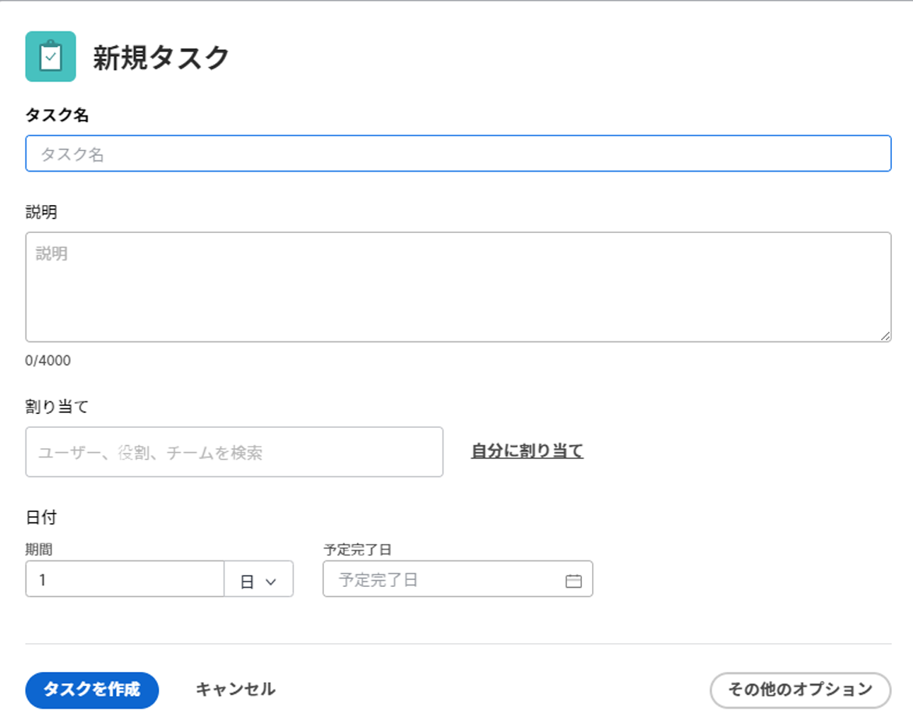

# 繰り返しタスクの作成

単一のプロジェクトの一部として繰り返す必要のあるタスクに対して、繰り返しタスクを作成できます。

既存の繰り返しタスクの編集の影響を含む、繰り返しタスクの一般情報については、 [繰り返しタスクの概要](../../../manage-work/tasks/manage-tasks/recurring-tasks-overview.md).

## アクセス要件

この記事の手順を実行するには、次のアクセス権が必要です。

<table style="table-layout:auto"> 
 <col> 
 <col> 
 <tbody> 
  <tr> 
   <td role="rowheader">Adobe Workfront plan*</td> 
   <td> 
任意
 </td> 
  </tr> 
  <tr> 
   <td role="rowheader">Adobe Workfront license*</td> 
   <td> 
仕事以上
 </td> 
  </tr> 
  <tr> 
   <td role="rowheader">アクセスレベル設定*</td> 
   <td> 
タスクおよびプロジェクトへのアクセスを編集
 
注意：まだアクセス権がない場合は、Workfront管理者に、アクセスレベルに追加の制限を設定しているかどうかを問い合わせてください。 タスクへのアクセスについて詳しくは、 <a href="../../../administration-and-setup/add-users/configure-and-grant-access/grant-access-tasks.md" class="MCXref xref">タスクへのアクセス権の付与</a>. Workfront管理者がアクセスレベルを変更する方法について詳しくは、 <a href="../../../administration-and-setup/add-users/configure-and-grant-access/create-modify-access-levels.md" class="MCXref xref">カスタムアクセスレベルの作成または変更</a>. 
 </td> 
  </tr> 
  <tr> 
   <td role="rowheader">オブジェクト権限</td> 
   <td> 
タスクを追加する機能以上を持つ、プロジェクトに権限を付与する
 
タスクを作成すると、タスクに対する「権限を管理」が自動的に付与されます
 
 タスク権限について詳しくは、 <a href="../../../workfront-basics/grant-and-request-access-to-objects/share-a-task.md" class="MCXref xref">タスクの共有 </a>. 
 
追加の権限のリクエストについて詳しくは、 <a href="../../../workfront-basics/grant-and-request-access-to-objects/request-access.md" class="MCXref xref">オブジェクトへのアクセスのリクエスト </a>.
 </td> 
  </tr> 
 </tbody> 
</table>

&#42;保有しているプラン、ライセンスの種類、アクセス権を確認するには、Workfront管理者に問い合わせてください。

## 繰り返しタスクの作成

>[!NOTE]
>
>既存のタスクを変更して定期タスクを作成することはできません。 タスクはゼロから作成する必要があります。

1. 定期的なタスクを作成するプロジェクトに移動し、 **タスク** 」セクションを使用して、
1. クリック **新規タスク**.

   [ 新しいタスク ] ダイアログボックスが表示されます。

   

1. クリック **その他のオプション** 次に、 **タスク名** フィールドに入力します。
1. 新しいタスクを追加した場合と同じ方法で、タスクの更新を続行します。 新しいタスクの追加の詳細については、 [プロジェクトでのタスクの作成](../../../manage-work/tasks/create-tasks/create-tasks-in-project.md).

   >[!TIP]
   >
   >   新しい定期的なタスクで表示される期間と予定時間は、各繰り返しの期間と予定時間です。 親タスクの期間は、最も早いタスクの計画開始日から最も遅いタスクの計画完了日までの時間です。 親タスクの予定時間は、すべての繰り返しからのすべての予定時間の合計です。

1. クリック **概要** をクリックします。
1. 下にスクロールして **繰り返しスケジュール** 「 」セクションで、 **これを定期的なタスクにする** オプション。

   

1. 内 **頻度** ドロップダウンリストで、タスクを実行する時間単位の数と時間単位の種類を選択します。 次のオプションから選択します。

   <table style="table-layout:auto"> 
    <col> 
    <col> 
    <thead> 
     <tr> 
      <th>繰り返しタイプ</th> 
      <th>説明</th> 
     </tr> 
    </thead> 
    <tbody> 
     <tr> 
      <td role="rowheader"><strong>日</strong> </td> 
      <td> 
選択した頻度に応じて、タスクは毎日、2 日ごと、3 日ごとなどに繰り返されます。 最大 6 日ごとに繰り返すタスクを設定できます。 デフォルト設定は 1 日です。 
 </td> 
     </tr> 
     <tr> 
      <td role="rowheader"><strong>営業日</strong> </td> 
      <td> 
 タスクは、選択したケイデンスに応じて、毎日、2 営業日ごと、3 営業日ごとなどに繰り返されます。 最大 6 営業日ごとに繰り返すタスクを設定できます。
 
このオプションでは、システム管理者が定義したデフォルトのスケジュールを使用します。 <a href="../../../administration-and-setup/set-up-workfront/configure-timesheets-schedules/create-schedules.md" class="MCXref xref">スケジュールの作成</a>.
 </td> 
     </tr> 
     <tr> 
      <td role="rowheader"><strong>週</strong> </td> 
      <td> 
 タスクは、選択したケイデンスに応じて、毎週、2 週間ごと、3 週間ごとなどに繰り返されます。
 
内 <strong>繰り返し</strong> 「 」フィールドで、各タスクを実行する曜日を選択します。 複数の日を選択できます。 
 </td> 
     </tr> 
     <tr> 
      <td role="rowheader"><strong>月</strong> </td> 
      <td> 
選択した頻度に応じて、タスクは毎月、2 か月ごと、3 か月ごとなどに繰り返されます。 1 ～ 12 か月を選択できます。 
 
内 <strong>繰り返し</strong> 「 」フィールドで、タスクを実行する際に次のオプションから選択します。
 
       <ul> 
        <li> 
<strong>毎月日に &lt;month date=""&gt;</strong> 
 
1 ～ 30 日までの日数を選択するか、 <strong>last</strong>. 例えば、「毎月 30 日」を選択できます。 
 </li> 
        <li> 
<strong>毎月 &lt;number&gt; &lt;day of="" the="" week=""&gt;</strong> 
 
最初のドロップダウンメニューで、月の週数を 1 ～ 4 の数値で選択できます。または、「最後」を選択できます。 
 
2 番目のドロップダウンメニューでは、任意の曜日を選択できます。 
 
例えば、「毎月第 2 火曜日」を選択できます。 
 </li> 
       </ul> </td> 
     </tr> 
    </tbody> 
   </table>

   >[!NOTE]
   >
   >プロジェクトのスケジュールにスケジュール例外が関連付けられている場合、定期的なタスクは例外中に開始できません。 スケジュールの例外中に発生する繰り返しタスクは、例外の後に続く最初の営業日に開始するようにスケジュールされます。 スケジュールの例外の詳細については、「 [スケジュールの作成](../../../administration-and-setup/set-up-workfront/configure-timesheets-schedules/create-schedules.md).

1. 内 **開始** 「 」フィールドで、定期的なタスクを開始する日時を選択します。
1. 内 **終了** 「 」フィールドで、定期的なタスクを完了する日時を選択します

   または

   選択 **後 `<number>` 発生件数** を使用して、繰り返しタスクの発生回数を指定します。 Workfrontは、このフィールドで指定した数と同じ数の繰り返しをタスクに対して作成します。

1. クリック **タスクを作成します。**

   タスクリストが表示されます。 繰り返しタスクは親として作成され、すべての繰り返しが子として作成されます。 Workfrontは、親に入力した名前の後に数値が続く子タスクの名前を自動生成します。 親の繰り返しタスクから自動入力されるフィールドの詳細については、 [繰り返しタスクの概要](../../../manage-work/tasks/manage-tasks/recurring-tasks-overview.md).

   

1. （オプション）各繰り返しタスクを、プロジェクト内の他のタスクと同様に変更します。

   たとえば、割り当て、先行タスク、期間を追加し、ユーザー設定フィールドを含むタスクに関するその他の情報を変更することができます。

   >[!IMPORTANT]
   >
   >子を個別に変更した後に親の繰り返しを変更すると、子間または子と親間で異なる情報が発生する場合があります。 詳しくは、 [繰り返しタスクの概要](../../../manage-work/tasks/manage-tasks/recurring-tasks-overview.md).
