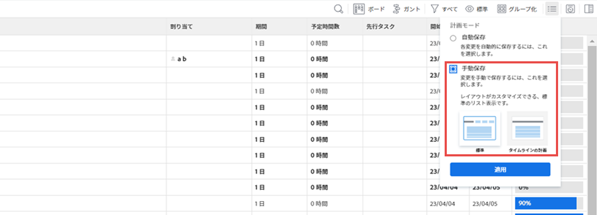
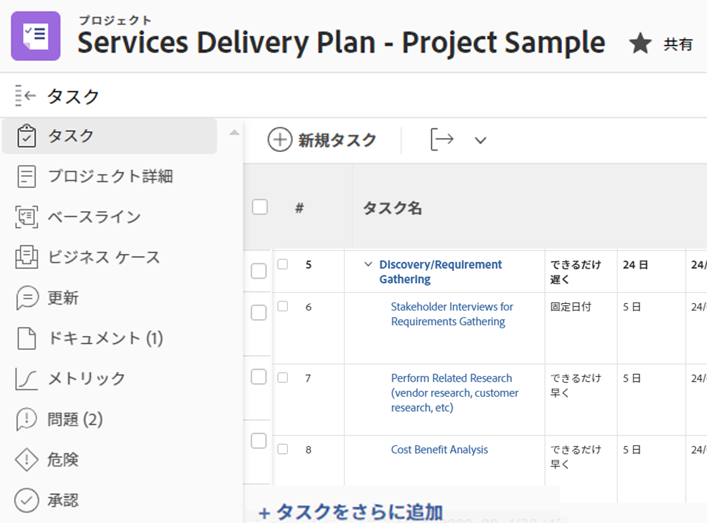
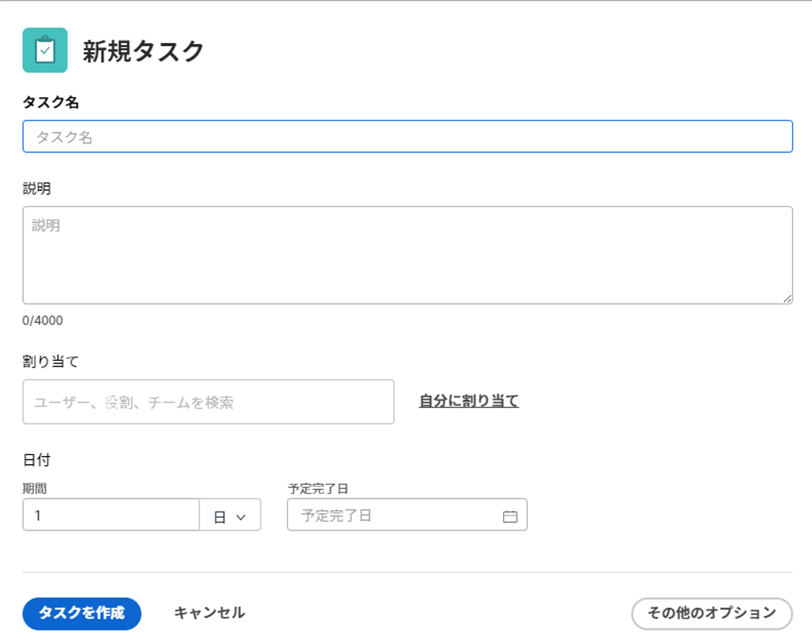
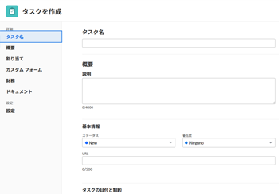

# プロジェクトでのタスクの作成

<!-- Audited: 1/2024 -->

プロジェクト内でタスクを作成できるのは、プロジェクトを作成した後だけです。

例えば、プロジェクトを作成した後に、タスクを追加して変更し、プロジェクト計画を整理することができます。プロジェクトの作成について詳しくは、[プロジェクトの作成](../../../manage-work/projects/create-projects/create-project.md)を参照してください。

プロジェクトに含まれていない個人用タスクの作成について詳しくは、 [個人用タスクの作成](../../../workfront-basics/using-home/using-the-home-area/create-work-items-in-home.md#create-a-personal-task) 記事のセクション [ホーム領域から作業項目を作成する](../../../workfront-basics/using-home/using-the-home-area/create-work-items-in-home.md).

この記事では、タスクを一から作成する方法について説明します。次の方法でタスクを作成することもできます。

* 既存のタスクをコピーまたは複製する。詳しくは、[タスクのコピーと複製](../../../manage-work/tasks/manage-tasks/copy-and-duplicate-tasks.md)を参照してください。
* あるプロジェクトから別のプロジェクトにタスクを移動する。詳しくは、[タスクを移動](../../../manage-work/tasks/manage-tasks/move-tasks.md)を参照してください。

## アクセス要件

<table style="table-layout:auto"> 
 <col> 
 <col> 
 <tbody> 
  <tr> 
   <td role="rowheader">Adobe Workfront プラン</td> 
   <td> 
任意
 </td> 
  </tr> 
  <tr> 
   <td role="rowheader"> 
Adobe Workfront ライセンス
 </td> 
   <td>
現在：作業以上
 
   または
   
新規：標準
 </td> 
  </tr> 
  <tr> 
   <td role="rowheader">アクセスレベル設定*</td> 
   <td> 
タスクおよびプロジェクトへのアクセスを編集
</td> 
  </tr> 
  <tr> 
   <td role="rowheader">オブジェクト権限</td> 
   <td> 
プロジェクトに対して、タスクを追加する機能以上を持つ参加権限
 
タスクを作成すると、タスクに対する「権限を管理」が自動的に付与される
 
 タスク権限について詳しくは、<a href="../../../workfront-basics/grant-and-request-access-to-objects/share-a-task.md" class="MCXref xref">タスクを共有</a>を参照してください。 
 
追加の権限の申請については、<a href="../../../workfront-basics/grant-and-request-access-to-objects/request-access.md" class="MCXref xref">オブジェクトの利用申請</a>を参照してください。
 </td> 
  </tr> 
 </tbody> 
</table>

この表の情報の詳細については、 [Workfrontドキュメントのアクセス要件](/help/quicksilver/administration-and-setup/add-users/access-levels-and-object-permissions/access-level-requirements-in-documentation.md).

## プロジェクトでのタスクの作成

1. タスクを作成するプロジェクトに移動します。
1. 左側のパネルの「**タスク**」をクリックします。
1. （条件付き）現在、アジャイルビューでタスクリストを表示している場合、**リスト表示**&#x200B;アイコン  をクリックして、タスクリストを表示します。
1. （オプション）**プランモード** アイコン  を選択し、**手動で保存**&#x200B;を選択し、**標準**&#x200B;または&#x200B;**タイムライン計画**&#x200B;のいずれかを選択します。これにより、デフォルトで有効になっている&#x200B;**自動保存**&#x200B;オプションが無効になります。

   

   >[!TIP]
   >
   >「手動保存」を選択すると、変更を元に戻すことができます。

1. 次のいずれかの操作を行って、新しいタスクを作成します。

   * クリック **新規タスク** をタスクリストの最上部に表示します。
   * クリック **タスクをさらに追加** をタスクリストの下部に表示します。

   

1. （条件付き）「**新規タスク**」をクリックした場合、次の操作を実行します。

   1. 「**新しいタスク**」ボックス内のフィールドの限定リストにあるフィールドのいずれかを指定し、タスクをすぐに作成する場合は「**タスクの作成**」をクリックします。

      または

      タスクのフィールドをすべてアップデートするには、「**その他のオプション**」をクリックすると「**タスクを作成**」ボックスが開きます。

      

      「**タスクを作成**」ボックスが開きます。

      

       

      >[!NOTE]
      >
      >Workfront 管理者がレイアウトテンプレートをどのように設定したかに応じて、環境によって「タスクを作成」ボックスのフィールドの表示が異なる場合があります。詳しくは、[レイアウトテンプレートを使用して詳細ビューをカスタマイズ](../../../administration-and-setup/customize-workfront/use-layout-templates/customize-details-view-layout-template.md)を参照してください。

   1. 「タスクを作成」ボックスの左側のパネルで、次のエリアに関する情報を指定します。

      * タスク名
      * 概要
      * 割り当て
      * カスタムフォーム
      * 財務
      * 設定

        タスクに関連するすべてのフィールドを定義する方法については、[タスクの編集](../../../manage-work/tasks/manage-tasks/edit-tasks.md)を参照してください。

   1. （条件付きおよびオプション）タスクを繰り返し実行する場合は、「**繰り返し頻度**」フィールドを更新します。繰り返しタスクの作成について詳しくは、[繰り返しタスクの作成](../../../manage-work/tasks/create-tasks/create-recurring-tasks.md)を参照してください。
   1. （オプション）左側のパネルの「**ドキュメント**」をクリックしてドキュメントを新しいタスクに添付し、「**ファイルを追加またはリンク**」をクリックしてコンピューターまたは別のサービスからタスクにドキュメントを追加する、またはコンピューターまたは別のサービスからドキュメントとフォルダーをリンクします。

1. （条件付き）手順 5 で「**タスクを追加**」をクリックした場合は、インライン編集を使用してタスク情報の入力を開始し、Enter キーを押します。

   <!--
   
(NOTE: ensure this stays accurate)

   -->

   特に、複数のタスクをリストに追加する場合は、このオプションを使用することをお勧めします。

   

1. （条件付き）次のいずれかを行います。

   * 手順 5 で「**新規タスク**」をクリックした場合は、「**タスクを作成**」をクリックして変更を保存し、新しいタスクをプロジェクトに追加します。

     <!--   
     
(NOTE: is this step still right?)
   
     -->

   * 手順 5 で「**タスクを追加**」をクリックした場合、次の操作を実行します。

     <!--   
     
(NOTE: is this step still right?) 
   
     -->

      1. ブラウザー内の任意の場所をクリックして変更内容を送信するか、Enter キーを押します。
      1. （オプション）タスクリストで、新しく作成したタスクを選択し、「**インデント**」をクリックします。

         これにより、新しいタスクが子タスク、または前のタスクのサブタスクになります。

         子タスクの詳細については、[タスクの概要](../../../manage-work/tasks/task-information/tasks-overview.md)を参照してください。

      1. （条件付き）「**さらにタスクを追加**」を押した後に「**自動保存**」オプションを無効にした場合は、次の操作を行うことができます。

         * いつでも「**元に戻す**」をクリックして最後の変更を元に戻したり、「**キャンセル**」をクリックしてタスクリストに加えたすべての変更を元に戻したりできます。
         * 以前に「**元に戻す**」をクリックした場合は、「**やり直し**」をクリックして、最後にキャンセルした変更を再適用できます。
         * 「**保存**」をクリックすると、タスクリストに変更を保存できます。
