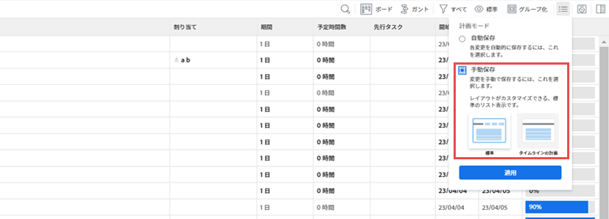
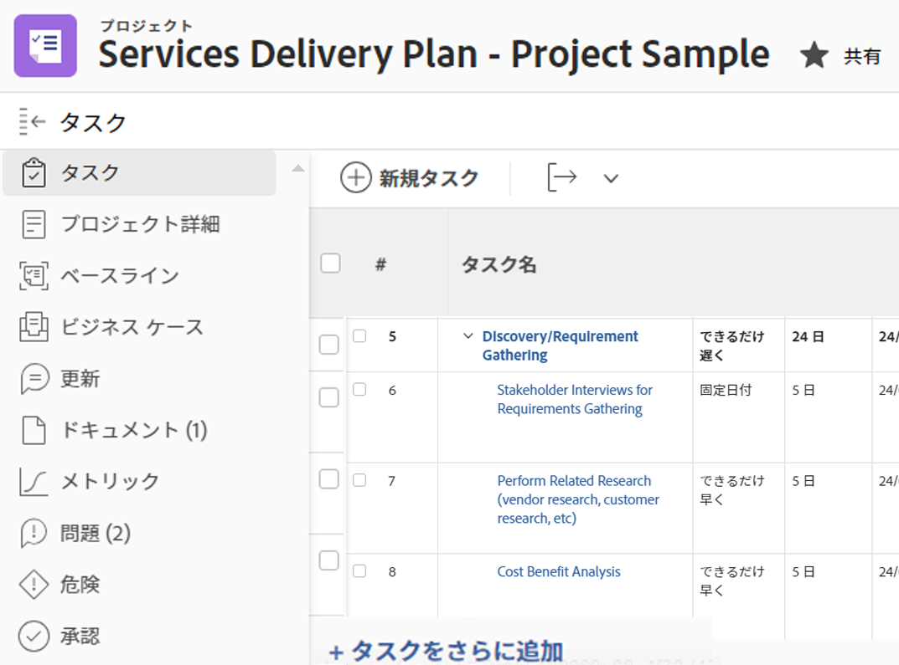
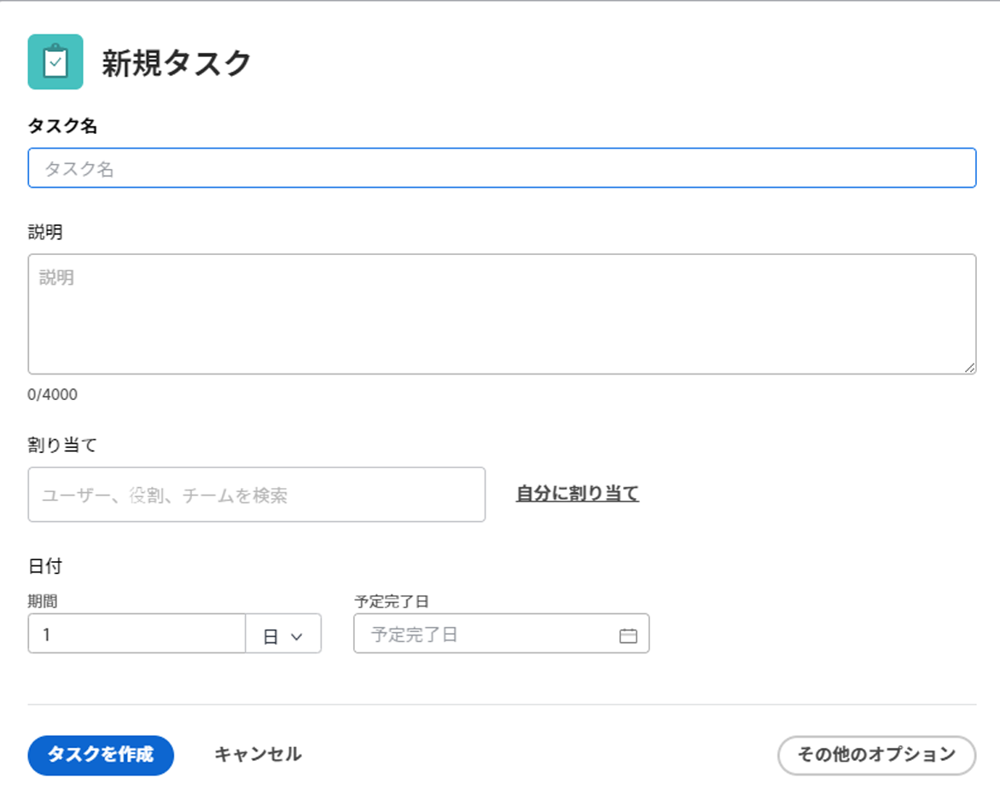
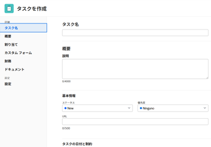
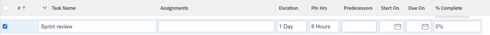

# プロジェクトでのタスクの作成

<!-- Audited: 10/2024 -->

Adobe Workfrontでは、次の方法でタスクを作成できます。

* プロジェクトの作成後、プロジェクトでタスクをゼロから作成します。

  プロジェクトを作成したら、タスクを追加して変更し、プロジェクト計画を整理できます。 プロジェクトの作成について詳しくは、[プロジェクトの作成](../../../manage-work/projects/create-projects/create-project.md)を参照してください。

* プロジェクトにテンプレートを追加して、タスクを作成します。

  詳しくは、[プロジェクトへのテンプレートの添付](/help/quicksilver/manage-work/projects/create-and-manage-templates/attach-template-to-project.md)を参照してください。

* 個人タスクを作成してプロジェクトに移動する：

  次のいずれかの操作を行って、個人タスクを作成できます。

   * アドホック作業リクエストを作成し、ユーザーに送信する
   * ホーム領域でのTo Do アイテムの作成

  プロジェクトにない個人用タスクの作成について詳しくは、[個人用タスクの作成](/help/quicksilver/workfront-basics/updating-work-items-and-viewing-updates/create-personal-tasks.md)を参照してください。

  個人用タスクをプロジェクトに移動して、作業タスクにすることができます。

この記事では、タスクをゼロから作成する方法と、個人タスクをプロジェクトに移動する方法について説明します。

次の方法でタスクを作成することもできます。

* 既存のタスクをコピーまたは複製する。詳しくは、[タスクのコピーと複製](../../../manage-work/tasks/manage-tasks/copy-and-duplicate-tasks.md)を参照してください。
* あるプロジェクトから別のプロジェクトにタスクを移動する。詳しくは、[タスクを移動](../../../manage-work/tasks/manage-tasks/move-tasks.md)を参照してください。

## アクセス要件

+++ 展開すると、この記事の機能のアクセス要件が表示されます。

<table style="table-layout:auto"> 
 <col> 
 <col> 
 <tbody> 
  <tr> 
   <td role="rowheader">Adobe Workfront パッケージ</td> 
   <td> 
任意
 </td> 
  </tr> 
  <tr> 
   <td role="rowheader">Adobe Workfront プラン</td> 
   <td> 
標準
 
   
Work またはそれ以上
 </td> 
  </tr> 
  <tr> 
   <td role="rowheader">アクセスレベル設定</td> 
   <td> 
タスクおよびプロジェクトへのアクセスを編集
 </td> 
  </tr> 
  <tr> 
   <td role="rowheader">オブジェクト権限</td> 
   <td> 
プロジェクトに対して、タスクを追加する機能以上を持つ参加権限
 
   
タスクを作成すると、タスクに対する「権限を管理」が自動的に付与される
 
    </td> 
  </tr> 
 </tbody> 
</table>

詳しくは、[Workfront ドキュメントのアクセス要件](/help/quicksilver/administration-and-setup/add-users/access-levels-and-object-permissions/access-level-requirements-in-documentation.md)を参照してください。

+++

<!--
Old:

<table style="table-layout:auto"> 
 <col> 
 <col> 
 <tbody> 
  <tr> 
   <td role="rowheader">Adobe Workfront plan</td> 
   <td> 
Any
 </td> 
  </tr> 
  <tr> 
   <td role="rowheader"> 
Adobe Workfront license
 </td> 
   <td>
Standard
 
   
Work or higher

   </td> 
  </tr> 
  <tr> 
   <td role="rowheader">Access level configurations*</td> 
   <td> 
Edit access to Tasks and Projects
</td> 
  </tr> 
  <tr> 
   <td role="rowheader">Object permissions</td> 
   <td> 
Contribute permissions to the project with ability to Add Tasks or higher
 
When you create a task you automatically receive Manage permissions to the task
 
 For information about task permissions, see <a href="../../../workfront-basics/grant-and-request-access-to-objects/share-a-task.md" class="MCXref xref">Share a task </a>. 
 
For information on requesting additional permissions, see <a href="../../../workfront-basics/grant-and-request-access-to-objects/request-access.md" class="MCXref xref">Request access to objects. </a>
 </td> 
  </tr> 
 </tbody> 
</table>
-->

## プロジェクトでのタスクの作成

プロジェクトでのタスクの作成は、テンプレートでのタスクの作成に似ています。 テンプレートにテンプレートタスクを追加する場合は、次の手順に従います。

プロジェクトにタスクを作成するには：

1. タスクを作成するプロジェクトに移動します。
1. 左側のパネルの「**タスク**」をクリックします。
1. （条件付き）現在アジャイルビューでタスクリストを表示している場合は、右上隅の「**リスト表示**」アイコン「」をクリックして、タスクリストを表示します。
1. （オプション）タスクリスト **の** プランモード  プランモードアイコンをクリックし、**手動保存**&#x200B;を選択してから、**標準**&#x200B;または&#x200B;**タイムライン計画**&#x200B;のいずれかを選択します。 これにより、デフォルトで有効になっている&#x200B;**自動保存**&#x200B;オプションが無効になります。

   

   >[!TIP]
   >
   >「手動保存」を選択すると、変更を元に戻すことができます。

1. 次のいずれかの操作を行って、新しいタスクを作成します。

   * タスクリストの最上部の「**新規タスク**」をクリックします。
   * タスクリストの下部にある「**さらにタスクを追加**」をクリックします。

   

1. （条件付き）新しいタスク **をクリックした場合は、次の操作を行います。**

   1. **新規タスク** ボックス内のフィールドの制限リストにあるフィールドのいずれかを指定し、タスクをすばやく作成する場合は、「**タスクを作成**」をクリックします。

      または

      タスクのフィールドをすべてアップデートするには、「**その他のオプション**」をクリックすると「**タスクを作成**」ボックスが開きます。

      

      「**タスクを作成**」ボックスが開きます。

      

      >[!NOTE]
      >
      >Workfront 管理者がレイアウトテンプレートをどのように設定したかに応じて、環境によって「タスクを作成」ボックスのフィールドの表示が異なる場合があります。詳しくは、[レイアウトテンプレートを使用して詳細ビューをカスタマイズ](../../../administration-and-setup/customize-workfront/use-layout-templates/customize-details-view-layout-template.md)を参照してください。

   1. 「タスクを作成」ボックスの左側のパネルで、次のエリアに関する情報を指定します。

      * タスク名
      * 概要
      * 割り当て
      * カスタムフォーム
      * 財務
      * 設定

        タスクに関連するすべてのフィールドを定義する方法については、[タスクの編集](../../../manage-work/tasks/manage-tasks/edit-tasks.md)を参照してください。

   1. （条件付きおよびオプション）タスクを繰り返し実行する場合は、「**繰り返し頻度**」フィールドを更新します。繰り返しタスクの作成について詳しくは、[繰り返しタスクの作成](../../../manage-work/tasks/create-tasks/create-recurring-tasks.md)を参照してください。
   1. （オプション）左側のパネルの「**ドキュメント**」をクリックしてドキュメントを新しいタスクに添付し、「**ファイルを追加またはリンク**」をクリックしてコンピューターまたは別のサービスからタスクにドキュメントを追加する、またはコンピューターまたは別のサービスからドキュメントとフォルダーをリンクします。

1. （条件付き）手順 5 で「**タスクを追加**」をクリックした場合は、インライン編集を使用してタスク情報の入力を開始し、Enter キーを押します。

   <!--
   
(NOTE: ensure this stays accurate)

   -->

   特に、複数のタスクをリストに追加する場合は、このオプションを使用することをお勧めします。

   

1. （条件付き）次のいずれかを行います。

   * 手順 5 で「**新規タスク**」をクリックした場合は、「**タスクを作成**」をクリックして変更を保存し、新しいタスクをプロジェクトに追加します。

     <!--   
     
(NOTE: is this step still right?)
   
     -->

   * 手順 5 で「**タスクを追加**」をクリックした場合、次の操作を実行します。

     <!--   
     
(NOTE: is this step still right?) 
   
     -->

      1. ブラウザー内の任意の場所をクリックして変更内容を送信するか、Enter キーを押します。
      1. （オプション）タスクリストで、新しく作成したタスクを選択し、「**インデント**」をクリックします。

         これにより、新しいタスクが子タスク、または前のタスクのサブタスクになります。

         子タスクについて詳しくは、[&#x200B; サブタスクの作成](/help/quicksilver/manage-work/tasks/create-tasks/create-subtasks.md)の「タスク サブタスクからサブタスクを作成する」セクションを参照してください。

      1. （条件付き）「**さらにタスクを追加**」を押した後に「**自動保存**」オプションを無効にした場合は、次の操作を行うことができます。

         * いつでも「**元に戻す**」をクリックして最後の変更を元に戻したり、「**キャンセル**」をクリックしてタスクリストに加えたすべての変更を元に戻したりできます。
         * 以前に「**元に戻す**」をクリックした場合は、「**やり直し**」をクリックして、最後にキャンセルした変更を再適用できます。
         * 「**保存**」をクリックすると、タスクリストに変更を保存できます。
   1. （オプション）タスクリストで「**先行タスク**」セクションをクリックして、タスクに先行タスクを追加します。 詳しくは、[先行タスク領域を使用した先行タスク関係の作成](/help/quicksilver/manage-work/tasks/use-prdcssrs/create-predecessors-in-predecessors-area.md)を参照してください。
   1. （オプション）タスクリストで「**サブタスク**」セクションをクリックして、子タスクを追加します。 詳しくは、[サブタスクの作成](/help/quicksilver/manage-work/tasks/create-tasks/create-subtasks.md)を参照してください。

## 個人タスクをプロジェクトに移動してタスクを作成する

1. （条件付き）自分または他のユーザーが個人用タスクを作成したことを確認します。

   詳しくは、[個人用タスクの作成](/help/quicksilver/workfront-basics/updating-work-items-and-viewing-updates/create-personal-tasks.md)を参照してください。
1. 個人タスクフィルターを作成し、タスクレポートまたはリストに適用します。

   詳しくは、[&#x200B; フィルター：個人タスク &#x200B;](/help/quicksilver/reports-and-dashboards/reports/custom-view-filter-grouping-samples/filter-personal-tasks.md)を参照してください。

   
1. 個人用タスクレポートでタスク名をクリックして開きます。

   Workfrontは、個人用タスクをリストされていない個人用プロジェクトに保存します。このプロジェクトには、常に「&lt; ユーザーのフルネーム >&#39;のタスク」というパターンに従って名前が付けられます。 例えば、個人用プロジェクトを「Rick&#39;s Tasks」という名前にすることができます。

1. タスクページから、**詳細メニュー** をクリックし、**移動**&#x200B;をクリックします。 タスクの移動について詳しくは、[&#x200B; タスクの移動](/help/quicksilver/manage-work/tasks/manage-tasks/move-tasks.md)を参照してください。

   タスクの移動が完了すると、選択したプロジェクトにタスクが表示されます。 プロジェクトタイムラインは、新しいタスクのタイムラインの影響を受ける可能性があります。
