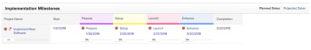

# タスクへのマイルストーンの関連付け

マイルストーンをタスクに関連付けて、プロジェクトの有効期間中に重要なステップに達したタイミングを示すことができます。

## アクセス要件

<!--drafted - replace table for P&P:

<table style="table-layout:auto"> 
 <col> 
 <col> 
 <tbody> 
  <tr> 
   <td role="rowheader">Adobe Workfront plan*</td> 
   <td> 
Any
 </td> 
  </tr> 
  <tr> 
   <td role="rowheader">Adobe Workfront license*</td> 
   <td> 
Current license: Standard
 
   Or
  
Legacy license: Work or higher
 
   </td> 
  </tr> 
  <tr> 
   <td role="rowheader">Access level configurations*</td> 
   <td> 
Edit access to Tasks
 
<b>NOTE</b>
   
   If you still don't have access, ask your Workfront administrator if they set additional restrictions in your access level. For information on how a Workfront administrator can modify your access level, see <a href="../../../administration-and-setup/add-users/configure-and-grant-access/create-modify-access-levels.md" class="MCXref xref">Create or modify custom access levels</a>.
 </td> 
  </tr> 
  <tr> 
   <td role="rowheader">Object permissions</td> 
   <td> 
Manage permissions to the task
 
For information on requesting additional access, see <a href="../../../workfront-basics/grant-and-request-access-to-objects/request-access.md" class="MCXref xref">Request access to objects </a>.
 </td> 
  </tr> 
 </tbody> 
</table>

-->

この記事の手順を実行するには、次のアクセス権が必要です。

<table style="table-layout:auto"> 
 <col> 
 <col> 
 <tbody> 
  <tr> 
   <td role="rowheader">Adobe Workfront plan*</td> 
   <td> 
任意
 </td> 
  </tr> 
  <tr> 
   <td role="rowheader">Adobe Workfront license*</td> 
   <td> 
仕事以上
 </td> 
  </tr> 
  <tr> 
   <td role="rowheader">アクセスレベル設定*</td> 
   <td> 
タスクへのアクセスを編集
 
注意：まだアクセス権がない場合は、Workfront管理者に、アクセスレベルに追加の制限を設定しているかどうかを問い合わせてください。 Workfront管理者がアクセスレベルを変更する方法について詳しくは、 <a href="../../../administration-and-setup/add-users/configure-and-grant-access/create-modify-access-levels.md" class="MCXref xref">カスタムアクセスレベルの作成または変更</a>.
 </td> 
  </tr> 
  <tr> 
   <td role="rowheader">オブジェクト権限</td> 
   <td> 
タスクに対する権限の管理
 
追加のアクセス権のリクエストについて詳しくは、 <a href="../../../workfront-basics/grant-and-request-access-to-objects/request-access.md" class="MCXref xref">オブジェクトへのアクセスのリクエスト </a>.
 </td> 
  </tr> 
 </tbody> 
</table>

&#42;保有しているプラン、ライセンスの種類、アクセス権を確認するには、Workfront管理者に問い合わせてください。

## 前提条件

マイルストーンをタスクに関連付ける前に、次の設定が必要です。

* Workfrontの管理者は、マイルストーンパスを作成する必要があります。詳しくは、 [マイルストーンパスを作成](../../../administration-and-setup/customize-workfront/configure-approval-milestone-processes/create-milestone-path.md).

* マイルストーンパスをプロジェクトに関連付けるには、プロジェクトのステータスが「計画」または「現在」である必要があります。

>[!TIP]
>
>マイルストーンビューを使用してプロジェクトのマイルストーンの進行状況の最適な概要を把握するには、親タスクを作成し、それらをプロジェクトの各主要フェーズに関連付ける必要があります。 次に、これらの親タスクをマイルストーンパスの各マイルストーンに関連付けます。

## マイルストーンとタスクの関連付け

1. プロジェクトに移動し、 **詳細** アイコン を、 **編集**.
1. の使用 **設定** 「 」セクションで、プロジェクトで使用するマイルストーンパスを設定します。
1. 「**保存**」をクリックします。

   マイルストーンパスをプロジェクトに関連付けた後、タスクにマイルストーンを割り当てることができます。

1. タスクに移動して、 **詳細** アイコン を、 **編集**.

   タスクとマイルストーンは 1 対 1 の関係にあります。 同じマイルストーンを複数のタスクに関連付けることはできません。 各タスクは、1 つのマイルストーンにリンクすることも、1 つのタスクにマイルストーンをマッピングすることもできます。

1. クリック **設定**&#x200B;を選択し、 **マイルストーン** タスクのフィールド。
1. クリック **保存**.
1. （オプション）タスクのリストで、 **ステータスアイコン** 列を使用して、マイルストーンを持つタスクを特定します。

   

1. （オプション）プロジェクトのリストで、 **マイルストーン** マイルストーンタスクの進行状況を特定するビュー。

   
