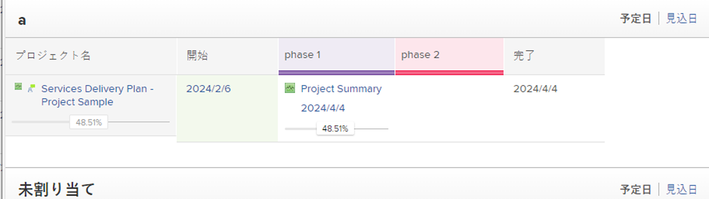

# タスクへのマイルストーンの関連付け

<!--Audited: 01/2024-->

タスクにマイルストーンを関連付けて、プロジェクトの全期間中に重要なステップに達したときに、それを示すことができます。

## アクセス要件

<table style="table-layout:auto"> 
 <col> 
 <col> 
 <tbody> 
  <tr> 
   <td role="rowheader">Adobe Workfront プラン*</td> 
   <td> 
任意
 </td> 
  </tr> 
  <tr> 
   <td role="rowheader">Adobe Workfront ライセンス*</td> 
   <td> 
新しいライセンス：標準
 
   
現在のライセンス：作業中以上
 
   </td> 
  </tr> 
  <tr> 
   <td role="rowheader">アクセスレベル設定*</td> 
   <td> 
タスクへのアクセスを編集
 
<b>メモ</b>

アクセス権がない場合は、Workfront管理者に、アクセスレベルに追加の制限を設定しているかどうかを問い合わせてください。 Workfront 管理者がアクセスレベルを変更する方法について詳しくは、<a href="../../../administration-and-setup/add-users/configure-and-grant-access/create-modify-access-levels.md" class="MCXref xref">カスタムアクセスレベルの作成または変更</a>を参照してください。
 </td>
</tr> 
  <tr> 
   <td role="rowheader">オブジェクト権限</td> 
   <td> 
タスクに対する管理権限
 
追加のアクセス権のリクエストについて詳しくは、<a href="../../../workfront-basics/grant-and-request-access-to-objects/request-access.md" class="MCXref xref">オブジェクトへのアクセス権のリクエスト</a>を参照してください。
 </td> 
  </tr> 
 </tbody> 
</table>

&#42;保有するプラン、ライセンスタイプ、アクセス権を確認するには、Workfront 管理者に問い合わせてください。

## 前提条件

タスクにマイルストーンを関連付けるには、まず以下が必要です。

* [マイルストーンパスの作成](../../../administration-and-setup/customize-workfront/configure-approval-milestone-processes/create-milestone-path.md)の説明に従って、Workfront の管理者がマイルストーンパスを作成する必要があります。

* マイルストーンパスをプロジェクトに関連付ける必要があります。

  詳しくは、[プロジェクトの編集](/help/quicksilver/manage-work/projects/manage-projects/edit-projects.md)を参照してください。

* マイルストーンパスをプロジェクトに関連付けるには、プロジェクトのステータスが「計画」または「進行中」になっている必要があります。

  >[!TIP]
  >
  >マイルストーンビューを使用してプロジェクトのマイルストーンの進行状況の概要を最も適切に把握するには、親タスクを作成し、それらをプロジェクトの各主要フェーズに関連付ける必要があります。次に、これらの親タスクをマイルストーンパスの各マイルストーンに関連付けます。

## タスクにマイルストーンを関連付け

マイルストーンパスをプロジェクトに関連付けたら、タスクにマイルストーンを割り当てることができます。

1. タスクに移動して、 **その他** アイコン  をタスク名の右にドラッグし、 **編集**.

   タスクとマイルストーンは 1 対 1 の関係にあります。同じマイルストーンを複数のタスクに関連付けることはできません。各タスクを 1 つのマイルストーンにリンクすることも、各マイルストーンを 1 つのタスクにマッピングすることもできます。

1. クリック **設定**」をクリックし、 **マイルストーン** タスクのフィールド。
1. 「**保存**」をクリックします。
1. （オプション）タスクのリストで、 **ステータスアイコン** 列を使用して、マイルストーンを持つタスクを特定します。 「ステータスアイコン」列にマイルストーンのひし形インジケータが表示されます。

   詳しくは、[Adobe Workfront でのビューの作成または編集](/help/quicksilver/reports-and-dashboards/reports/reporting-elements/create-edit-views.md)を参照してください。

   

1. （オプション）プロジェクトのリストに移動し、 **マイルストーン** マイルストーンタスクの進行状況を特定するビュー。

   
