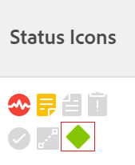
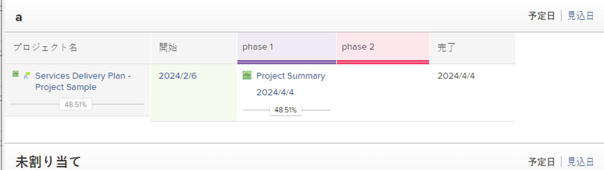

# タスクへのマイルストーンの関連付け

<!--Audited: 01/2024-->

タスクにマイルストーンを関連付けて、プロジェクトの全期間中に重要なステップに達したときに、それを示すことができます。

## アクセス要件

+++ 展開すると、この記事の機能のアクセス要件が表示されます。

<table style="table-layout:auto"> 
 <col> 
 <col> 
 <tbody> 
  <tr> 
   <td role="rowheader">Adobe Workfront パッケージ</td> 
   <td> 
任意
 </td> 
  </tr> 
  <tr> 
   <td role="rowheader">Adobe Workfront プラン</td> 
   <td> 
標準
 
   
Work またはそれ以上
 
   </td> 
  </tr> 
  <tr> 
   <td role="rowheader">アクセスレベル設定</td> 
   <td> 
タスクへのアクセスを編集
</td> 
  </tr> 
  <tr> 
   <td role="rowheader">オブジェクト権限</td> 
   <td> 
タスクに対する管理権限
</td> 
  </tr> 
 </tbody> 
</table>

詳しくは、[Workfront ドキュメントのアクセス要件](/help/quicksilver/administration-and-setup/add-users/access-levels-and-object-permissions/access-level-requirements-in-documentation.md)を参照してください。

+++

<!--
Old:

<table style="table-layout:auto"> 
 <col> 
 <col> 
 <tbody> 
  <tr> 
   <td role="rowheader">Adobe Workfront plan*</td> 
   <td> 
Any
 </td> 
  </tr> 
  <tr> 
   <td role="rowheader">Adobe Workfront license*</td> 
   <td> 
New license: Standard
 
   
Current license: Work or higher
 
   </td> 
  </tr> 
  <tr> 
   <td role="rowheader">Access level configurations*</td> 
   <td> 
Edit access to Tasks
 
<b>NOTE</b>
   
   If you don't have access, ask your Workfront administrator if they set additional restrictions in your access level. For information on how a Workfront administrator can modify your access level, see <a href="../../../administration-and-setup/add-users/configure-and-grant-access/create-modify-access-levels.md" class="MCXref xref">Create or modify custom access levels</a>.
 </td> 
  </tr> 
  <tr> 
   <td role="rowheader">Object permissions</td> 
   <td> 
Manage permissions to the task
 
For information on requesting additional access, see <a href="../../../workfront-basics/grant-and-request-access-to-objects/request-access.md" class="MCXref xref">Request access to objects </a>.
 </td> 
  </tr> 
 </tbody> 
</table>
-->

## 前提条件

タスクにマイルストーンを関連付けるには、まず以下が必要です。

* [マイルストーンパスの作成](../../../administration-and-setup/customize-workfront/configure-approval-milestone-processes/create-milestone-path.md)の説明に従って、Workfront の管理者がマイルストーンパスを作成する必要があります。

* マイルストーンパスをプロジェクトに関連付ける必要があります。

  詳しくは、[プロジェクトの編集](/help/quicksilver/manage-work/projects/manage-projects/edit-projects.md)を参照してください。

* マイルストーンパスをプロジェクトに関連付けるには、プロジェクトのステータスが「計画」または「進行中」になっている必要があります。

  >[!TIP]
  >
  >マイルストーンビューを使用してプロジェクトのマイルストーンの進行状況の概要を最も適切に把握するには、親タスクを作成し、それらをプロジェクトの各主要フェーズに関連付ける必要があります。 次に、これらの親タスクをマイルストーンパスの各マイルストーンに関連付けます。

## タスクにマイルストーンを関連付け

マイルストーンパスをプロジェクトに関連付けたら、タスクにマイルストーンを割り当てることができます。

1. タスクに移動し、タスク名の右側にある&#x200B;**詳細** アイコン をクリックしてから、**編集**&#x200B;をクリックします。

   タスクとマイルストーンの関係は1:1です。 同じマイルストーンを複数のタスクに関連付けることはできません。 各タスクを 1 つのマイルストーンにリンクすることも、各マイルストーンを 1 つのタスクにマッピングすることもできます。

1. 「**設定**」をクリックし、タスクの&#x200B;**マイルストーン**&#x200B;フィールドでマイルストーンを選択します。
1. 「**保存**」をクリックします。
1. （オプション）タスクの一覧で、**ステータスアイコン**&#x200B;の列を追加して、どのタスクにマイルストーンがあるか特定します。 「ステータスアイコン」の列にマイルストーンのひし形インジケーターが表示されます。

   詳しくは、[Adobe Workfront でのビューの作成または編集](/help/quicksilver/reports-and-dashboards/reports/reporting-elements/create-edit-views.md)を参照してください。

   

1. （オプション）プロジェクトの一覧で、**マイルストーン**&#x200B;のビューを選択して、マイルストーンタスクの進捗状況を特定します。

   
