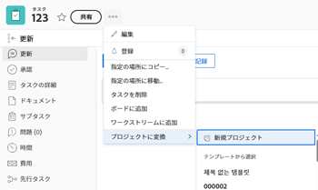

# タスクをプロジェクトに変換する

プロジェクト内のタスクの完了に必要な作業が、最初に計画した作業よりも多い場合は、タスクをプロジェクトに変換できます。

## アクセス要件

この記事の手順を実行するには、次のアクセス権が必要です。

<table style="table-layout:auto"> 
 <col> 
 <col> 
 <tbody> 
  <tr> 
   <td role="rowheader">Adobe Workfront plan*</td> 
   <td> 
任意
 </td> 
  </tr> 
  <tr> 
   <td role="rowheader">Adobe Workfront license*</td> 
   <td> 
計画 
 </td> 
  </tr> 
  <tr> 
   <td role="rowheader">アクセスレベル設定*</td> 
   <td> 
タスクおよびプロジェクトへのアクセスを編集
 
テンプレートを使用してプロジェクトに変換する場合、テンプレートへの表示またはアクセス権の上限
 
注意：まだアクセス権がない場合は、Workfront管理者に、アクセスレベルに追加の制限を設定しているかどうかを問い合わせてください。 Workfront管理者がアクセスレベルを変更する方法について詳しくは、 <a href="../../../administration-and-setup/add-users/configure-and-grant-access/create-modify-access-levels.md" class="MCXref xref">カスタムアクセスレベルの作成または変更</a>.
 </td> 
  </tr> 
  <tr> 
   <td role="rowheader">オブジェクト権限</td> 
   <td> 
タスクに対する権限の管理
 
テンプレートを使用してプロジェクトに変換する場合は、テンプレートに対する権限を表示します
 
プロジェクトを作成した後、そのプロジェクトに対する管理権限を持ちます
 
追加のアクセス権のリクエストについて詳しくは、 <a href="../../../workfront-basics/grant-and-request-access-to-objects/request-access.md" class="MCXref xref">オブジェクトへのアクセスのリクエスト </a>.
 </td> 
  </tr> 
 </tbody> 
</table>

&#42;保有しているプラン、ライセンスの種類、アクセス権を確認するには、Workfront管理者に問い合わせてください。

## タスクをプロジェクトに変換する際の考慮事項

* 元のタスクが削除されます。
* タスクの承認が削除されます。
* すべてのサブタスク、イシュー、メモは、新しいプロジェクトにまとめられます。
* ドキュメント、ドキュメントのバージョンおよび配達確認は、新しいプロジェクトに移動されます。
* すべてのサブタスクと問題のステータスと完了率は保持されます。
* タスクの共有ユーザーは、プロジェクトで共有ユーザーになります。
* プロジェクトの開始日は、タスクの開始日に設定されます。
* タスクのステータスが「新規」の場合、プロジェクトのステータスは「計画」に設定されます。
* タスクのステータスが「処理中」の場合、プロジェクトのステータスは「現在」に設定されます。
* タスクのステータスが「完了」の場合、プロジェクトのステータスは「完了」に設定されます。

## タスクをプロジェクトに変換する

1. プロジェクトに変換するタスクに移動します。
1. 次をクリック： **詳細** アイコン を、 **プロジェクトに変換**.
1. 次のいずれかのオプションを選択します。

   * **新規プロジェクト**
   * テンプレート **テンプレートから選択** セクション

      

1. クリック **続行** 表示される通知に基づいて。
1. 内 **プロジェクトに変換** ボックスで、以下を指定します。

   * **名前**:プロジェクトに名前を付けます。 デフォルト名はタスクの名前です。
   * （オプション） **説明**:このプロジェクトの目的を説明します。
   * （オプションおよび条件付き）テンプレートからプロジェクトを作成することを選択した場合、 **プロジェクトに変換** ダイアログボックス

      プロジェクトのフィールドの編集の詳細については、 [プロジェクトを編集](../../../manage-work/projects/manage-projects/edit-projects.md).

      >[!TIP]
      >
      >[ プロジェクトに変換 ] ボックスの [ 財務 ] セクションのフィールドを更新するには、アクセスレベルで財務データに対する編集アクセス権が必要です。 アクセス・レベルで財務データの表示アクセス権を持っている場合、テンプレートから新しいプロジェクトにすべての財務情報が転送され、問題の変換中に編集することはできません。 詳しくは、 [財務データへのアクセス権の付与](../../../administration-and-setup/add-users/configure-and-grant-access/grant-access-financial.md) および [テンプレートの共有](../../../workfront-basics/grant-and-request-access-to-objects/share-a-template.md).

   * （オプション） **カスタムForms** を新しいプロジェクトに追加します。

      >[!TIP]
      タスクに添付された複数オブジェクトのカスタムフォームをタスクとプロジェクトの両方で使用するように設定した場合、フォームに保存されたすべての情報は、変換時に保持されます。
      変換用のテンプレートを使用していて、テンプレートに添付されたカスタムフォームに、タスクに添付されたカスタムフォームにもカスタムフィールドが含まれている場合は、タスクのフィールド値が新しいプロジェクトで使用されます。 ただし、タスクでカスタムフィールドが空白の場合は、テンプレートの値が使用されます。

1. クリック **変更を保存**.
