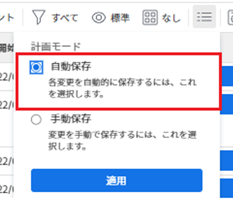
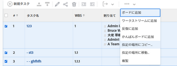
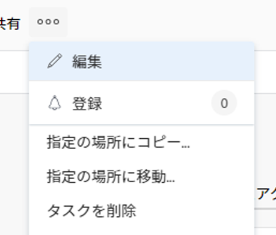
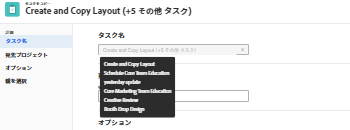
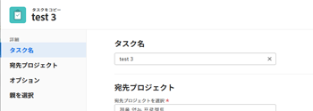
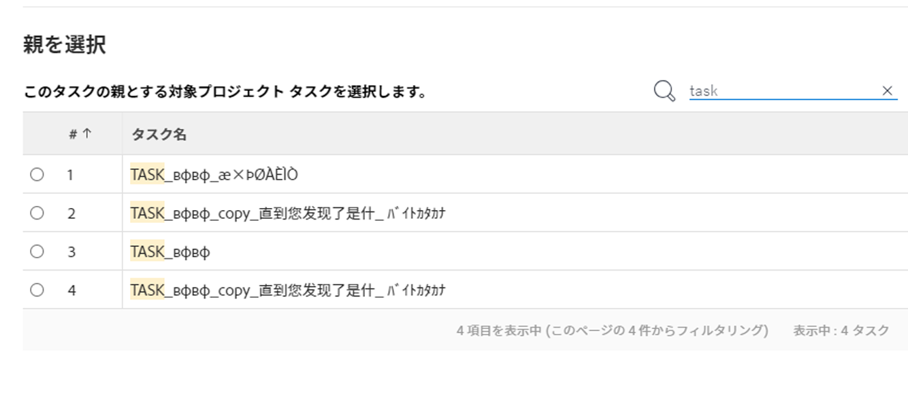
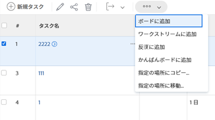

# タスクのコピーと複製

タスクをプロジェクトから別のプロジェクトにコピーすることも、同じプロジェクト内でタスクを複製することもできます。

一度に 1 つまたは複数のタスクまたは親タスクをコピーまたは複製できます。

## アクセス要件

<!-- drafted for P&P:

<table style="table-layout:auto"> 
 <col> 
 <col> 
 <tbody> 
  <tr> 
   <td role="rowheader">Adobe Workfront plan*</td> 
   <td> 
Any 
 </td> 
  </tr> 
  <tr> 
   <td role="rowheader">Adobe Workfront license*</td> 
   <td> 
Current license: Standard
 
   Or
   
Legacy license: Work or higher 
 </td> 
  </tr> 
  <tr> 
   <td role="rowheader">Access level configurations*</td> 
   <td> 
Edit access to Tasks and Projects
 
<b>NOTE</b>
   
   If you still don't have access, ask your Workfront administrator if they set additional restrictions in your access level. For information on how a Workfront administrator can modify your access level, see <a href="../../../administration-and-setup/add-users/configure-and-grant-access/create-modify-access-levels.md" class="MCXref xref">Create or modify custom access levels</a>.
 </td> 
  </tr> 
  <tr> 
   <td role="rowheader">Object permissions</td> 
   <td> 
Manage permissions to a task
 
Contribute or higher permissions to the project
 
   
For information on requesting additional access, see <a href="../../../workfront-basics/grant-and-request-access-to-objects/request-access.md" class="MCXref xref">Request access to objects </a>.
 </td> 
  </tr> 
 </tbody> 
</table>
-->

この記事の手順を実行するには、次のアクセス権が必要です。

<table style="table-layout:auto"> 
 <col> 
 <col> 
 <tbody> 
  <tr> 
   <td role="rowheader">Adobe Workfront plan*</td> 
   <td> 
任意
 </td> 
  </tr> 
  <tr> 
   <td role="rowheader">Adobe Workfront license*</td> 
   <td> 
仕事以上 
 </td> 
  </tr> 
  <tr> 
   <td role="rowheader">アクセスレベル設定*</td> 
   <td> 
タスクおよびプロジェクトへのアクセスを編集
 
<b>メモ</b>

まだアクセス権がない場合は、Workfront管理者に、アクセスレベルに追加の制限を設定しているかどうかを問い合わせてください。 Workfront管理者がアクセスレベルを変更する方法について詳しくは、 <a href="../../../administration-and-setup/add-users/configure-and-grant-access/create-modify-access-levels.md" class="MCXref xref">カスタムアクセスレベルの作成または変更</a>.
 </td>
</tr> 
  <tr> 
   <td role="rowheader">オブジェクトの権限</td> 
   <td> 
タスクに対する権限の管理 
 
プロジェクトに対する権限を投稿するか、それ以上に設定します。
 
追加のアクセス権のリクエストについて詳しくは、 <a href="../../../workfront-basics/grant-and-request-access-to-objects/request-access.md" class="MCXref xref">オブジェクトへのアクセスのリクエスト </a>.
 </td> 
  </tr> 
 </tbody> 
</table>

&#42;保有するプラン、ライセンスの種類、アクセス権を確認するには、Workfront管理者に問い合わせてください。

## タスクをコピーする際の考慮事項

タスクをコピーする際は、次の点に注意してください。

* あるプロジェクトから別のプロジェクトにタスクをコピーすると、タスクの日付が再計算される場合があります。 再計算では、新しいプロジェクトで使用されるスケジュールと、プロジェクトのスケジュール元情報が考慮されます。
* カスタムフォームはタスクと共にコピーされます。 カスタムフィールドの情報は、タスクのコピー時に [ カスタムデータのコピー ] を選択した場合にのみ、コピーされたタスクに転送されます。
* コピープロセス中に、タスクに関連付けられた一部の項目をコピー先のタスクにコピーすることを選択できます。 ただし、デフォルトでは、次のオブジェクトはコピーされたタスクに転送されません。
   * イシュー
   * ログに記録された時間数
   * ユーザーコメント <!--not sure about this, enable only if requested by users and verified by Product: System activity comments transfer to the new task if they relate to information that you specifically select to be copied. For example, if you select to copy Expenses to the new task, system comments that identify adding expenses to the task will transfer to the copied task. -->
* デフォルトでは、次の項目はコピーされたタスクに移動します。

   * マイルストーンはコピーされたタスクに転送され、元のタスクから削除されます。
   * サブタスクは新しいタスクに転送されます。

* 一度に 1 つのタスクをコピーすることも、リスト内のタスクを編集する際に複数のタスクを一度にコピーすることもできます。

## リスト内のタスクのコピー {#copy-tasks-in-a-list}

1. コピーする 1 つまたは複数のタスクを含むプロジェクトに移動します。

   または

   タスクレポートに移動します。

1. （条件付き）クリック **タスク** タスクを含むプロジェクトを開いた場合は、左側のパネルで。
1. 次をクリック： **プランモード** アイコン をクリックし、 **自動保存** 」オプションが有効になっている。

   

   >[!IMPORTANT]
   >
   >リスト内のタスクをコピーできるのは、変更を自動的に保存する場合のみです。 タスク編集時の保存オプションについて詳しくは、 [リスト内のタスクの編集](../../../manage-work/tasks/manage-tasks/edit-tasks-in-a-list.md).

1. コピーする 1 つ以上のタスクを選択し、次のいずれかの操作を行います。

   * 次をクリック： **その他のメニュー** タスクリストの上部で、「 **コピー先**.
   * 選択したタスクを右クリックし、「 **コピー先**.
   * 1 つのタスクを選択する場合、 **その他** メニュー  リスト内のタスク名の横にあるをクリックし、 **コピー先**.

   

1. 「 」の節で説明されているように、タスクのコピーを続行します。 [タスクレベルでのタスクのコピー](#copy-a-task-at-the-task-level) 手順 4 から始めます。

   <!--
      (NOTE: is this still accurate?!)
   -->

## タスクレベルでのタスクのコピー {#copy-a-task-at-the-task-level}

タスクのリスト内のタスクをコピーする以外に、タスクを開いた後でタスクをコピーすることもできます。

1. タスクを検索して、Workfrontシステム内でタスクを検索します。
1. タスクの名前をクリックして開きます。
1. 次をクリック： **その他** ドロップダウンメニュー  タスク名の横にあるをクリックし、 **コピー先**.

   

   [ タスクのコピー ] ボックスが表示されます。

1. （オプション） **タスク名**.

   >[!TIP]
   >
   >リスト内の複数のタスクをコピーする場合、このフィールドは淡色表示になり、編集できません。 「タスク名」フィールドにマウスポインターを置くと、選択したすべてのタスクのリストが表示されます。
   >
   >

1. 名前を入力 **宛先プロジェクト** タスクをコピーする場所： **宛先プロジェクトを選択** フィールドに入力します。

   >[!TIP]
   >
   >* プロジェクトの名前では、大文字と小文字が区別されます。
   >* 「参照番号」の入力を開始したり、プロジェクトの ID を入力したりすることもできます。 これは、同じ名前のプロジェクトを区別するのに役立ちます。
   >* リストには 100 個のプロジェクトのみが表示されます。

   既定では、現在のプロジェクト名が表示されます。 同じプロジェクト内のタスクをコピーする場合は、このフィールドを変更しないでください。

1. （条件付き）クリック **アクセスを要求** 選択したプロジェクトへのアクセス権を持っていない場合に、プロジェクトへのアクセス権を要求します。
1. （条件付き）タスクを宛先プロジェクトのタスクの 1 つに追加するアクセス権がある場合は、アクセス権を要求せずに、選択した宛先プロジェクトにタスクをコピーし続けます。

   

   >[!TIP]
   >
   >Workfront管理者がタスクをプロジェクトに追加できない場合、選択したプロジェクトが承認待ち、完了または無効の場合にも、同様のメッセージが表示されます。 詳しくは、 [システム全体のプロジェクト環境設定の指定](../../../administration-and-setup/set-up-workfront/configure-system-defaults/set-project-preferences.md).

1. クリック **オプション** 左側のパネルで、タスクと共にコピーしないタスク属性の選択を解除します。 デフォルトでは、すべてのオプションが選択されています。

   >[!TIP]
   >
   >選択してから選択解除 **すべて選択** すべてのオプションの選択を解除します。

   次のオプションの選択を解除すると、コピーしたタスクに転送されません。 次の表は、オプションの選択を解除した場合の動作を示しています。

   <table style="table-layout:auto"> 
    <col> 
    <col> 
    <tbody> 
     <tr> 
      <td role="rowheader">制約</td> 
      <td> 
タスク制約は、プロジェクトスケジュールモードの設定に基づいて、[ 可能な限り早く ] または [ 可能な限り遅く ] に設定されます。
 
 選択すると、タスクの現在の制約がコピーされたタスクに転送されます。 
 
注意：日付固有の制約を含むタスクを別のプロジェクトに移動またはコピーし、タスクの制約日が新しいプロジェクトの日付の外にある場合、タスク制約は「可能な限り早く」、「遅く」に変わるか、プロジェクトの計画開始日または計画完了日が調整されます。 日付固有の制約の例としては、「開始日」、「終了日」、「次の日より前に開始」、「次の日より後に開始」などがあります。 タスクの制約と、タスクの制約やプロジェクトの日付がどのように影響を受けるかについては、 <a href="../../../manage-work/tasks/task-constraints/task-constraint-overview.md" class="MCXref xref">タスク制約の概要</a> 特定の制約を探します。
 </td> 
     </tr> 
     <tr> 
      <td role="rowheader">割り当て</td> 
      <td> 
すべての割り当てがタスクから削除されます。 
 </td> 
     </tr> 
     <tr> 
      <td role="rowheader">承認プロセス</td> 
      <td>すべての承認プロセスがタスクから削除されます。</td> 
     </tr> 
     <tr> 
      <td role="rowheader">進捗状況</td> 
      <td>タスクのステータスは「新規」です。 それ以外の場合、コピーされたタスクは既存のタスクのステータスを維持します。</td> 
     </tr> 
     <tr> 
      <td role="rowheader">財務情報</td> 
      <td>タスクの財務情報が削除されます。</td> 
     </tr> 
     <tr> 
      <td role="rowheader">すべての先行タスク</td> 
      <td> 
つまり、依存関係はコピーされたタスクに引き継がれません。 
 
選択すると、コピーされたタスクのグループ内の先行タスクは保持され、その他は削除されます。
 </td> 
     </tr> 
     <tr> 
      <td role="rowheader">ドキュメント</td> 
      <td> 
タスクに添付されたドキュメントは、コピーされたタスクには転送されません。 これには、バージョン、配達確認およびリンクされたドキュメントが含まれます。
 
ドキュメントの承認は含まれません。 タスクのコピー時にドキュメント承認をコピーすることはできません。
 </td> 
     </tr> 
     <tr> 
      <td role="rowheader">リマインダー通知</td> 
      <td>タスクのリマインダーは、コピーされたタスクには転送されません。 </td> 
     </tr> 
     <tr> 
      <td role="rowheader">費用</td> 
      <td>タスクに記録された費用は、コピーされたタスクには転送されません。 </td> 
     </tr> 
     <tr> 
      <td role="rowheader">権限</td> 
      <td>Workfrontは、タスクの共有リストに表示されているすべてのエンティティの名前を削除します。 </td> 
     </tr> 
     <tr> 
      <td role="rowheader">カスタムデータ</td> 
      <td> 
カスタムフィールドの値がクリアされ、カスタムフォームがコピーされたタスクに転送されます。 
 
選択すると、カスタムフィールドのフォームと値の両方がコピーされたタスクに転送されます。 
 </td> 
     </tr> 
    </tbody> 
   </table>

1. （オプション）「 **親を選択** 左側のパネルで、コピーしたタスクの親にするタスクを、コピー先のプロジェクトで選択します。

   >[!TIP]
   >
   >リスト内の複数のタスクをコピーするように選択すると、選択したすべてのタスクが、選択した親の子になります。

   次のいずれかの操作を行って、親を選択します。

   * タスクリストで、プロジェクトプランの親の 1 つを選択します。
   * 検索アイコンをクリックします。  親タスクを名前で検索します。

   タスクがリストに表示されます。

   

1. 親が見つかったら、その親のラジオボタンを選択します。

   親タスクを選択しない場合、タスクはサブタスクではなくメインタスクとしてコピーされ、コピー先プロジェクトのタスクリストの最後に配置されます。

1. クリック **タスクをコピー**

   または

   クリック **タスクをコピー** リスト内の複数のタスクを選択する場合。
コピーされたタスクは、指定したプロジェクト上に存在し、選択した親タスクのサブタスク、またはプロジェクト上の最後のタスクのいずれかになります。

## タスクを複製

同じプロジェクトで同じタスクが必要な場合は、タスクリスト内のタスクをすばやく複製できます。

* [タスクを複製する際の考慮事項](#considerations-for-duplicating-tasks)
* [タスクを複製](#duplicate-tasks)

### タスクを複製する際の考慮事項 {#considerations-for-duplicating-tasks}

* タスクリスト内のタスクを複製できるのは、タスク番号で並べ替えられている場合のみです。
* 新しいタスクは元のタスクと同じ名前になります。
* 新しいタスクに複製する情報を選択することはできません。 デフォルトでは、元のタスクのほとんどの情報が、親関係を含む複製されたタスクに転送されます。
* 次の項目は、新しいタスクには転送されません。

   * ログに記録された時間数
   * メモ
   * イシュー
   * コピーされたタスクの同じグループに属する先行タスクのみが、その後続タスクと共にコピーされます。

     **例**

     たとえば、Task 2 とその先行タスク 1 を同時にコピーした場合、Task 2 のコピーと Task 1 のコピーが作成されます。 Task 1 のコピーは、Task 2 のコピーの前に使用されます。 ただし、タスク 2 をコピーせずにコピーした場合は、そのコピーには先行タスクは含まれません。

* 親タスクを複製すると、子タスクが選択されていない場合でも、すべての子タスクも複製されます。
* 同時に 1 つまたは複数のタスクを複製できます。

  ただし、同時に順次でない複数のタスクを複製することはできません。

* マイルストーンは新しいタスクに移動され、元のタスクから削除されます。

### タスクを複製

1. 複製する 1 つまたは複数のタスクを含むプロジェクトに移動します。
1. クリック **タスク** をクリックします。
1. 次のいずれかの操作を行います。

   * （条件付き） **プランモード** アイコン  そして **自動保存** 「 」オプションが有効な場合は、複製するタスクを選択し、 **その他のメニュー**  > **複製**.

     

   * （条件付き） **プランモード** アイコン  > **手動で保存** > **標準** または **タイムライン計画**&#x200B;次に、以下の手順を実行します。

      1. 複製する 1 つ以上のタスクを選択し、 **複製**.
      1. （オプション）「 **取り消し** 変更を元に戻し、タスクを複製しない場合。
      1. （オプションおよび条件付き）「 **やり直し** 以前に **取り消し**、変更を保持し、タスクを複製します。

      1. クリック **保存** をクリックして変更を保存します。

         タスクは複製され、元のタスクと同じプロジェクトに追加されます。
