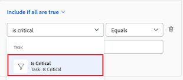

# プロジェクトのクリティカルパスの概要

<!-- Audited: 5/2025 -->

プロジェクトのクリティカルパスの特定は、Adobe Workfrontがプロジェクト内の一連のタスク（プロジェクトのタイムラインに影響を与える可能性のあるもの）にフラグを立てるための自動方法です。 プロジェクトのタイムラインに影響を与える可能性のあるタスクには、クリティカルパスタスクというフラグが付けられます。

次の機能は、プロジェクトのクリティカルパスに影響を与える可能性があります。

* プロジェクトの作業分割構造。

  詳しくは、[ プロジェクトの作業分解構造の決定 ](../../../manage-work/projects/planning-a-project/determine-project-work-breakdown-structure.md) を参照してください。

* 各タスクが完了するまでに要する時間（期間）。
* タスク間の依存関係。

  次の点に注意してください。

   * クリティカル パス上のタスクに先行タスク関係がある場合、先行タスクまたは後続タスクの日付の変更が、その先行タスクまたは後続タスクの依存関係に直接影響すると、先行タスクおよび後続タスクもクリティカル パス上に表示されます。

     >[!TIP]
     >
     >タスクの後続タスクの日付が、そのタスクの依存タスクの日付またはプロジェクトの日付に直接影響を与えていない場合、後続タスクはクリティカル パス上にありません。
     >
     >
     >     >
     >

   * サブタスクがクリティカル パス タスクと識別された場合、見込み開始日と親タスクの時間がサブタスクと同じであれば、その親タスクもクリティカル パス タスクと識別されます。

これらの機能を考慮し、最も早いタスクとプロジェクトの終了を決定するタスクの間の最長パスを使用して、クリティカルパスが計算されます。クリティカルパスの計算では、プロジェクトを長引かせることなく各タスクを開始および終了できる最も早い時間と最も遅い時間が考慮されます。このプロセスは、どのタスクが「クリティカル」（かつ最も長いパスに属する）か、どのタスクが「合計浮動小数」（プロジェクトを長引かせることなく遅延できる）かを決定します。

クリティカルパスでのタスクのアクティビティの遅延は、プロジェクトの見込み完了日に直接影響します（クリティカルパスに浮動小数はありません）。

## アクセス要件

+++ 展開すると、この記事の機能のアクセス要件が表示されます。

<table style="table-layout:auto"> 
 <col> 
 <col> 
 <tbody> 
  <tr> 
   <td role="rowheader">Adobe Workfront パッケージ</td> 
   <td> 
任意
 </td> 
  </tr> 
  <tr> 
   <td role="rowheader">Adobe Workfront プラン</td> 
   <td> 
   
標準

   
ワークまたはそれ以上

    </td> 
  </tr> 
  <tr> 
   <td role="rowheader">アクセスレベル設定</td> 
   <td> 
タスクに対する表示以上のアクセス権
</td> 
  </tr> 
  <tr> 
   <td role="rowheader">オブジェクト権限</td> 
   <td> 
タスクに対する表示以上の権限 
</td> 
  </tr> 
 </tbody> 
</table>

詳しくは、[Workfront ドキュメントのアクセス要件](/help/quicksilver/administration-and-setup/add-users/access-levels-and-object-permissions/access-level-requirements-in-documentation.md)を参照してください。

+++

<!--Old:

<table style="table-layout:auto"> 
 <col> 
 <col> 
 <tbody> 
  <tr> 
   <td role="rowheader">Adobe Workfront plan</td> 
   <td> 
Any
 </td> 
  </tr> 
  <tr> 
   <td role="rowheader">Adobe Workfront license</td> 
   <td> 
   
New: Standard

   
Or

   
Current: Work or higher

    </td> 
  </tr> 
  <tr> 
   <td role="rowheader">Access level configurations</td> 
   <td> 
View or higher access to Tasks
 
Note: If you still don't have access, ask your Workfront administrator if they set additional restrictions in your access level. For information on how a Workfront administrator can modify your access level, see <a href="../../../administration-and-setup/add-users/configure-and-grant-access/create-modify-access-levels.md" class="MCXref xref">Create or modify custom access levels</a>.
 </td> 
  </tr> 
  <tr> 
   <td role="rowheader">Object permissions</td> 
   <td> 
View or higher permissions on a task 
 
For information on requesting additional access, see <a href="../../../workfront-basics/grant-and-request-access-to-objects/request-access.md" class="MCXref xref">Request access to objects </a>.
 </td> 
  </tr> 
 </tbody> 
</table>-->

## クリティカルパスの表示

Workfront アプリケーションの次のエリアで、クリティカルパスに属するタスクを表示できます。

* [ガントチャートでクリティカルパスを表示](#view-the-critical-path-in-the-gantt-chart)
* [タスクリストまたはレポートでクリティカルパスを表示](#view-the-critical-path-in-a-task-list-or-report)

### ガントチャートでクリティカルパスを表示 {#view-the-critical-path-in-the-gantt-chart}

ガントチャートのクリティカルパスにタスクを表示する手順は、次の通りです。

{{step1-to-projects}}

1. プロジェクトリストで、プロジェクトを選択します。

1. 左側のパネルで、「**タスク**」をクリックします。 **タスク** タブが開きます。

1. タスクリストの右上隅にある「**ガントチャート**」アイコンをクリックします。

   

1. 「ガントチャート」セクションの右上隅にある **オプション** アイコン  をクリックし、表示されるドロップダウンで **クリティカルパス** オプションを選択します。 クリティカルパス上のタスクのタイムラインに赤い線が表示されるようになりました。

   

### タスクリストまたはレポートでクリティカルパスを表示 {#view-the-critical-path-in-a-task-list-or-report}

タスクのリストのクリティカルパスにあるタスクを表示する手順は、次の通りです。

{{step1-to-projects}}

1. プロジェクトリストで、プロジェクトを選択します。

1. 左側のパネルで、「**タスク**」をクリックします。 **タスク** タブが開きます。

1. **表示** アイコン  をクリックし、「**ステータス**」を選択します。 クリティカル パス上のタスクには、リストの **フラグ** 列に **クリティカル パス** フラグが表示されます。

   または

   **フィルター** アイコン  をクリックし、「**+新しいフィルター**」を選択します。
1. 最初のフィールドに「*重要*」と入力し、リストの「**タスク**」セクションの下に表示されたら選択します。

   

1. 2 番目のドロップダウンメニューで **Is true** が選択されていることを確認します。

   

1. フィルターパネルを閉じます。 タスク リストには、クリティカル パス上のタスクのみが表示されるようになりました。
