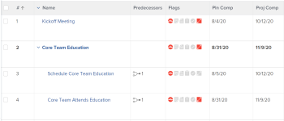

# プロジェクトのクリティカルパスの概要

プロジェクトのクリティカルパスの決定は、Adobe Workfront が、プロジェクトのタイムラインに影響を与える可能性のある、プロジェクト内の一連のタスクにフラグ付けする自動的な方法で行われます。プロジェクトのタイムラインに影響を与える可能性のあるタスクは、クリティカルパスタスクとしてフラグ付けされます。

次の機能は、プロジェクトのクリティカルパスに影響を与える可能性があります。

* プロジェクトの作業分割構造。

  作業分割構造について詳しくは、[プロジェクト内の作業分割構造を決定](../../../manage-work/projects/planning-a-project/determine-project-work-breakdown-structure.md)を参照してください。

* 各タスクが完了するまでに要する時間（期間）。
* タスク間の依存関係。

  次の点に注意してください。

   * クリティカルパスのタスクに先行タスク関係がある場合、先行タスクや後続タスクの日付の変更が依存タスクに直接影響する場合は、先行タスクや後続タスクもクリティカルパスに表示されます。

     >[!TIP]
     >
     >タスクの後続タスクの日付が、依存タスクの日付に直接影響を与えず、プロジェクトの日付にも影響を与えない場合、後続タスクはクリティカルパスには表示されません。
     >
     >
     >     >
     >

   * サブタスクをクリティカルパスタスクとして識別した場合、親タスクの見込み開始日時がサブタスクと同じであれば、親タスクもクリティカルパスタスクとして識別されます。

これらの機能を考慮し、最も早いタスクとプロジェクトの終了を決定するタスクの間の最長パスを使用して、クリティカルパスが計算されます。クリティカルパスの計算では、プロジェクトを長引かせることなく各タスクを開始および終了できる最も早い時間と最も遅い時間が考慮されます。このプロセスは、どのタスクが「クリティカル」（かつ最も長いパスに属する）か、どのタスクが「合計浮動小数」（プロジェクトを長引かせることなく遅延できる）かを決定します。

クリティカルパスでのタスクのアクティビティの遅延は、プロジェクトの見込み完了日に直接影響します（クリティカルパスに浮動小数はありません）。

## アクセス要件

この記事の手順を実行するには、次のアクセス権が必要です。

<table style="table-layout:auto"> 
 <col> 
 <col> 
 <tbody> 
  <tr> 
   <td role="rowheader">Adobe Workfront プラン*</td> 
   <td> 
任意
 </td> 
  </tr> 
  <tr> 
   <td role="rowheader">Adobe Workfront ライセンス*</td> 
   <td> 
ワークまたはそれ以上
 </td> 
  </tr> 
  <tr> 
   <td role="rowheader">アクセスレベル設定*</td> 
   <td> 
タスクに対する表示以上のアクセス権
 
メモ：まだアクセス権がない場合は、アクセスレベルに追加の制限が設定されていないかどうか Workfront 管理者にお問い合わせください。Workfront 管理者がアクセスレベルを変更する方法について詳しくは、<a href="../../../administration-and-setup/add-users/configure-and-grant-access/create-modify-access-levels.md" class="MCXref xref">カスタムアクセスレベルの作成または変更</a>を参照してください。
 </td> 
  </tr> 
  <tr> 
   <td role="rowheader">オブジェクト権限</td> 
   <td> 
タスクに対する表示以上の権限 
 
追加のアクセス権のリクエストについて詳しくは、<a href="../../../workfront-basics/grant-and-request-access-to-objects/request-access.md" class="MCXref xref">オブジェクトへのアクセス権のリクエスト</a>を参照してください。
 </td> 
  </tr> 
 </tbody> 
</table>

&#42;保有するプラン、ライセンスタイプ、アクセス権を確認するには、Workfront 管理者に問い合わせてください。

## クリティカルパスの表示

Workfront アプリケーションの次のエリアで、クリティカルパスに属するタスクを表示できます。

* [ガントチャートでクリティカルパスを表示](#view-the-critical-path-in-the-gantt-chart)
* [タスクリストまたはレポートでクリティカルパスを表示](#view-the-critical-path-in-a-task-list-or-report)

### ガントチャートでクリティカルパスを表示 {#view-the-critical-path-in-the-gantt-chart}

ガントチャートのクリティカルパスにタスクを表示する手順は、次の通りです。

1. クリティカルパスを表示するプロジェクトに移動します。
1. 左側のパネルで「**タスク**」をクリックします。
1. タスクリストの右上隅にある「**ガントチャート**」アイコンをクリックします。

   

1. **オプション**&#x200B;メニューを展開し、「**クリティカルパス**」オプションを有効にします。

   クリティカルパス上のタスクは、ガントチャートでタイムラインの上に赤い線が引かれています。

   

### タスクリストまたはレポートでクリティカルパスを表示 {#view-the-critical-path-in-a-task-list-or-report}

タスクのリストのクリティカルパスにあるタスクを表示する手順は、次の通りです。

1. クリティカルパスを表示するプロジェクトに移動します。
1. 左側のパネルで「**タスク**」をクリックします。
1. **ビュー**&#x200B;ドロップダウンメニューから、「**ステータス**」を選択します。

   クリティカルパス上のタスクには、**クリティカルパス**&#x200B;フラグが「**フラグ**」列に表示されます。

   同じビューをタスクレポートに適用できます。

   レポートの作成について詳しくは、[カスタムレポートの作成](../../../reports-and-dashboards/reports/creating-and-managing-reports/create-custom-report.md)を参照してください。

   または

   **フィルター**&#x200B;ドロップダウンメニューから、「**新規フィルター**」を選択します。

1. **フィルタールールを追加**&#x200B;をクリックし、**次の場合にのみタスクを表示**&#x200B;フィールドに「**クリティカル**」と入力を開始します。

1. 名前がリストに表示されたら、選択します。
1. 「**フィルターを保存**」をクリックします。

   リストには、クリティカルパス上のタスクのみが表示されます。
