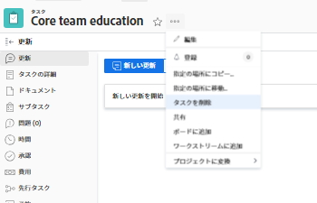

# タスクを削除します

重複している、または誤って作成された可能性のあるタスクを削除できます。

履歴情報（更新、スケジュールの変更、ステータス、その他のフィールド）を含むタスクの場合は、削除するのではなく、タスクを閉じるか、「無効」としてマークすることをお勧めします。 これにより、プロジェクトの履歴情報を保持できます。

## アクセス要件

この記事の手順を実行するには、次のアクセス権が必要です。

<table style="table-layout:auto"> 
 <col> 
 <col> 
 <tbody> 
  <tr> 
   <td role="rowheader">Adobe Workfront plan*</td> 
   <td> 
任意
 </td> 
  </tr> 
  <tr> 
   <td role="rowheader">Adobe Workfront license*</td> 
   <td> 
仕事以上
 </td> 
  </tr> 
  <tr> 
   <td role="rowheader">アクセスレベル設定*</td> 
   <td> 
削除へのアクセス権を持つタスクおよびプロジェクトへのアクセスを編集
 
注意：まだアクセス権がない場合は、Workfront管理者に、アクセスレベルに追加の制限を設定しているかどうかを問い合わせてください。 タスクへのアクセスについて詳しくは、 <a href="../../../administration-and-setup/add-users/configure-and-grant-access/grant-access-tasks.md" class="MCXref xref">タスクへのアクセス権の付与</a>. Workfront管理者がアクセスレベルを変更する方法について詳しくは、 <a href="../../../administration-and-setup/add-users/configure-and-grant-access/create-modify-access-levels.md" class="MCXref xref">カスタムアクセスレベルの作成または変更</a>. 
 </td> 
  </tr> 
  <tr> 
   <td role="rowheader">オブジェクト権限</td> 
   <td> 
タスクを追加する機能以上を持つ、プロジェクトに権限を付与する
 
タスクを作成すると、タスクに対する「権限を管理」が自動的に付与されます
 
 タスク権限について詳しくは、 <a href="../../../workfront-basics/grant-and-request-access-to-objects/share-a-task.md" class="MCXref xref">タスクの共有 </a>. 
 
追加の権限のリクエストについて詳しくは、 <a href="../../../workfront-basics/grant-and-request-access-to-objects/request-access.md" class="MCXref xref">オブジェクトへのアクセスのリクエスト </a>.
 </td> 
  </tr> 
 </tbody> 
</table>

&#42;保有しているプラン、ライセンスの種類、アクセス権を確認するには、Workfront管理者に問い合わせてください。

## タスクを削除するプロセスを理解する

* [タスクの削除に関する制限](#limitations-for-deleting-tasks)
* [タスクを削除した場合の影響](#the-impact-of-deleting-tasks)

### タスクの削除に関する制限  {#limitations-for-deleting-tasks}

* プロジェクトのステータスが「完了」の場合、タスクを削除できるのは、Workfront管理者またはグループ管理者が、プロジェクトの環境設定領域で許可している場合だけです。 プロジェクトの環境設定の詳細については、 [システム全体のプロジェクト環境設定の指定](../../../administration-and-setup/set-up-workfront/configure-system-defaults/set-project-preferences.md).

* タスクがログに記録された時間がWorkfrontまたはグループ管理者の場合は、Workfrontインスタンスでタスクと問題の環境設定を設定して、これらのタスクの削除を許可する必要があります。 これは、時間が経過したタスクを持つプロジェクトを削除しようとした場合にも当てはまります。

   <!--
  (NOTE: the last statement is NWE&nbsp;only; not possible in classic)
  -->

   時間が記録されたタスクの削除を有効にする方法について詳しくは、 [システム全体のタスクと問題の環境設定を構成](../../../administration-and-setup/set-up-workfront/configure-system-defaults/set-task-issue-preferences.md).

### タスクを削除した場合の影響 {#the-impact-of-deleting-tasks}

タスクを削除すると、タスクにリンクされている他のオブジェクトに影響を与えます。

タスクを削除すると、タスクにアタッチされている次のオブジェクトも削除されます。

* ドキュメント

   チェックアウトされたドキュメントが添付されたタスクは削除できません。 ドキュメントのチェックアウトの詳細については、 [ドキュメントをチェックアウト](../../../documents/managing-documents/check-out-documents.md).

* 問題
* サブタスク
* メモ
* 承認

Workfrontインスタンスの [ タイムシートと時間の基本設定 ] で、Workfrontの管理者がプロジェクト、タスク、または問題の削除の基本設定を構成する方法に応じて、タスクを削除する際に、次のいずれかの方法でタスクに記録された時間が処理されます。

* 後でタスクが復元された場合、プロジェクトに移動し、タスクに復元されません。
* タスクが後で復元される場合は、削除され、タスクで復元されます。

   これは、時間が経過したタスクを持つプロジェクトを削除しようとした場合にも当てはまります。

   <!--
  <MadCap:conditionalText data-mc-conditions="QuicksilverOrClassic.Draft mode">
  (NOTE: this stays NWE; not possible in classic;)
  </MadCap:conditionalText>
  -->

   ログオン時間の問題に対する削除の環境設定について詳しくは、 [タイムシートと時間の基本設定を構成する](../../../administration-and-setup/set-up-workfront/configure-timesheets-schedules/timesheet-and-hour-preferences.md).

* タスクの費用がプロジェクトに移動します。

* タスクまたはタスクの承認に割り当てられたユーザーは、プロジェクトチームに残ります。

   プロジェクトチームの詳細については、 [プロジェクトチームの概要](../../../manage-work/projects/planning-a-project/project-team-overview.md).

## タスクを削除します

* [プロジェクト内の複数のタスクを同時に削除する](#delete-multiple-tasks-in-a-project-simultaneously)
* [単一のタスクを削除](#delete-a-single-task)

### プロジェクト内の複数のタスクを同時に削除する  {#delete-multiple-tasks-in-a-project-simultaneously}

1. 次をクリック： **メインメニュー** アイコン  Adobe Workfrontの右上隅にある

1. クリック **プロジェクト**.
1. 削除するタスクを含むプロジェクト名をクリックします。
1. クリック **タスク** をクリックします。
1. 次のいずれかの操作を行います。

   1. （条件付き） **自動保存** 切り替えが有効：

      1. 削除するタスクを選択し、 **詳細**
      1. クリック **削除**&#x200B;を、 **はい、削除します** 削除を確定します。

         タスクが削除されます。
   1. （条件付き） **プランモード** アイコンと選択 **手動で保存** タスクリストに加えた変更を元に戻す場合。

      

      次の操作を実行します。

      1. 削除するタスクを選択します。
      1. クリック **削除**.
      1. （オプション）「 **取り消し** をクリックして変更を元に戻し、タスクは削除しません。
      1. クリック **やり直し** 変更を保持し、タスクを削除する場合。
      1. クリック **保存** タスクを削除します。

         タスクは、変更を保存した後にのみ削除されます。

### 単一のタスクを削除 {#delete-a-single-task}

1. 次をクリック： **メインメニュー** アイコン  Adobe Workfrontの右上隅にある

1. クリック **プロジェクト**.
1. 削除するタスクを含むプロジェクト名をクリックします。
1. クリック **タスク** 左のパネルに
1. 削除するタスクの名前をクリックします。
1. 次をクリック： **詳細** アイコン をクリックします。

   

1. クリック **タスクを削除**.
1. 削除が許可されている場合は、 **はい、削除します**.

   Workfront管理者またはグループ管理者が、時間が記録されたタスクの削除を許可していない場合があります。

   タスクの削除に必要なアクセスおよび権限の詳細については、「 [タスクの削除に関する制限](#limitations-for-deleting-tasks) 」を参照してください。

## 削除したタスクを復元

Workfrontまたはグループ管理者は、削除後 30 日以内にタスクを復元できます。詳しくは、 [削除した項目を復元](../../../administration-and-setup/manage-workfront/manage-deleted-items/restore-deleted-items.md).
