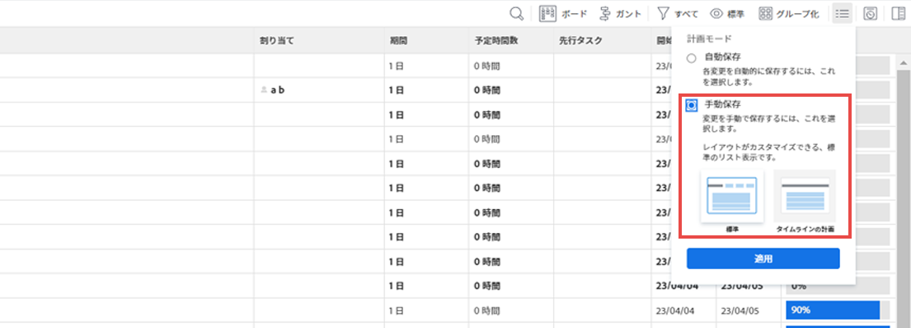

# タスクの削除

重複している、または誤って作成された可能性のあるタスクを削除できます。

履歴情報（更新、スケジュールの変更、ステータス、その他のフィールド）を含むタスクの場合は、タスクを閉じるか、削除する代わりに「無効」とマークすることをお勧めします。これにより、プロジェクトの履歴情報を保持できます。

## アクセス要件

この記事の手順を実行するには、次のアクセス権が必要です。

<table style="table-layout:auto"> 
 <col> 
 <col> 
 <tbody> 
  <tr> 
   <td role="rowheader">Adobe Workfront プラン*</td> 
   <td> 
任意
 </td> 
  </tr> 
  <tr> 
   <td role="rowheader">Adobe Workfront ライセンス*</td> 
   <td> 
ワークまたはそれ以上
 </td> 
  </tr> 
  <tr> 
   <td role="rowheader">アクセスレベル設定*</td> 
   <td> 
削除のアクセス権を持つタスクおよびプロジェクトへの編集アクセス権
 
メモ：まだアクセス権がない場合は、アクセスレベルに追加の制限が設定されていないかどうか Workfront 管理者にお問い合わせください。タスクへのアクセスについて詳しくは、<a href="../../../administration-and-setup/add-users/configure-and-grant-access/grant-access-tasks.md" class="MCXref xref">タスクへのアクセスの許可</a>を参照してください。Workfront 管理者がアクセスレベルを変更する方法について詳しくは、<a href="../../../administration-and-setup/add-users/configure-and-grant-access/create-modify-access-levels.md" class="MCXref xref">カスタムアクセスレベルの作成または変更</a>を参照してください。 
 </td> 
  </tr> 
  <tr> 
   <td role="rowheader">オブジェクト権限</td> 
   <td> 
プロジェクトに対して、タスクを追加する機能以上を持つ参加権限
 
タスクを作成すると、タスクに対する「権限を管理」が自動的に付与される
 
 タスク権限について詳しくは、<a href="../../../workfront-basics/grant-and-request-access-to-objects/share-a-task.md" class="MCXref xref">タスクを共有</a>を参照してください。 
 
追加権限の要求については、<a href="../../../workfront-basics/grant-and-request-access-to-objects/request-access.md" class="MCXref xref">オブジェクトへのアクセス権の要求</a>を参照してください。
 </td> 
  </tr> 
 </tbody> 
</table>

&#42;保有するプラン、ライセンスタイプ、アクセス権を確認するには、Workfront 管理者に問い合わせてください。

## タスクを削除するプロセスを理解する

* [タスクの削除に関する制限](#limitations-for-deleting-tasks)
* [タスクを削除した場合の影響](#the-impact-of-deleting-tasks)

### タスクの削除に関する制限  {#limitations-for-deleting-tasks}

* プロジェクトのステータスが「完了」の場合、タスクを削除できるのは、Workfront 管理者またはグループ管理者が、プロジェクトの環境設定エリアで許可している場合だけです。プロジェクトの環境設定について詳しくは、[システム全体のプロジェクト環境設定](../../../administration-and-setup/set-up-workfront/configure-system-defaults/set-project-preferences.md)を参照してください。

* タスクに記録された時間がある場合、Workfront またはグループ管理者は、Workfront インスタンスでタスクとイシューの環境設定を行うことで、これらのタスクの削除を許可する必要があります。これは、時間が記録されたタスクを持つプロジェクトを削除しようとした場合にも該当します。

  <!--
  (NOTE: the last statement is NWE&nbsp;only; not possible in classic)
  -->

  時間が記録されたイシューの削除を有効にする方法について詳しくは、[システム全体のタスクとイシューの環境設定](../../../administration-and-setup/set-up-workfront/configure-system-defaults/set-task-issue-preferences.md)を参照してください。

### タスクを削除した場合の影響 {#the-impact-of-deleting-tasks}

タスクを削除すると、タスクにリンクされている他のオブジェクトに影響を与えます。

タスクを削除すると、タスクに添付されている次のオブジェクトも削除されます。

* ドキュメント

  チェックアウトされたドキュメントが添付されたタスクは削除できません。ドキュメントのチェックアウトについて詳しくは、[ドキュメントのチェックアウト](../../../documents/managing-documents/check-out-documents.md)を参照してください。

* イシュー
* サブタスク
* メモ
* 承認

Workfront インスタンスのタイムシートおよび時間設定で、Workfront 管理者またはグループ管理者が指定したプロジェクト、タスクまたはイシューの削除に関する環境設定によって、タスクに記録される時間は、タスクを削除する際に次のいずれかの方法で処理されます。

* タスクが後で復元された場合、プロジェクトに移動して、タスクで復元されません。
* タスクが後で復元された場合、削除され、タスクで復元されます。

  これは、時間が記録されたタスクを持つプロジェクトを削除しようとした場合にも該当します。

  <!--
  <MadCap:conditionalText data-mc-conditions="QuicksilverOrClassic.Draft mode">
  (NOTE: this stays NWE; not possible in classic;)
  </MadCap:conditionalText>
  -->

  イシューに時間が記録されている場合の削除の環境設定について詳しくは、[タイムシートおよび時間設定の指定](../../../administration-and-setup/set-up-workfront/configure-timesheets-schedules/timesheet-and-hour-preferences.md)を参照してください。

* タスクの費用がプロジェクトに移動します。

* タスクまたはタスクの承認に割り当てられたユーザーは、プロジェクトチームに残ります。

  プロジェクトチームについて詳しくは、[プロジェクトチームの概要](../../../manage-work/projects/planning-a-project/project-team-overview.md)を参照してください。

## タスクの削除

* [プロジェクト内の複数のタスクを同時に削除](#delete-multiple-tasks-in-a-project-simultaneously)
* [単一のタスクの削除](#delete-a-single-task)

### プロジェクト内の複数のタスクを同時に削除する  {#delete-multiple-tasks-in-a-project-simultaneously}

1. Adobe Workfront の右上隅にある&#x200B;**メインメニュー**&#x200B;アイコン  をクリックします。

1. 「**プロジェクト**」をクリックします。
1. 削除するタスクを含むプロジェクト名をクリックします。
1. 左側のパネルの「**タスク**」をクリックします。
1. 次のいずれかの操作を行います。

   1. （条件付き）**自動保存**&#x200B;の切り替えが有効な場合：

      1. 削除するタスクを選択し、「**その他**」をクリックします。
      1. 「**削除**」をクリックし、「**はい、削除します**」をクリックして削除を確定します。

         タスクが削除されます。

   1. （条件付き）タスクリストに行った変更を元に戻す場合、「**計画モード**」アイコンをクリックし、「**手動で保存**」を選択します。

      

      次の操作を実行します。

      1. 削除するタスクを選択します。
      1. 「**削除**」をクリックします。
      1. （オプション）「**取り消し**」をクリックして変更を元に戻し、タスクを削除しないようにします。
      1. 変更を保持し、タスクを削除する場合、「**やり直し**」をクリックします。
      1. 「**保存**」をクリックして、タスクを削除します。

         タスクは、変更を保存した後にのみ削除されます。

### 単一のタスクの削除 {#delete-a-single-task}

1. Adobe Workfront の右上にある&#x200B;**メインメニュー**&#x200B;アイコン（）をクリックします。

1. 「**プロジェクト**」をクリックします。
1. 削除するタスクを含むプロジェクト名をクリックします。
1. 左側のパネルの「**タスク**」をクリックします。
1. 削除するタスクの名前をクリックします。
1. 右上にある&#x200B;**詳細**&#x200B;アイコン（）をクリックします。

   

1. 「**タスクを削除**」をクリックします。
1. 削除が許可されている場合は、「**はい、削除します**」をクリックします。

   Workfront 管理者またはグループ管理者は、時間がログに記録されたタスクの削除を許可していない場合があります。

   タスクの削除に必要なアクセス権および権限について詳しくは、この記事の[タスクの削除に関する制限](#limitations-for-deleting-tasks)を参照してください。

## 削除したタスクの復元

Workfront 管理者またはグループ管理者は、削除後 30 日以内であればタスクを復元できます。詳しくは、[削除した項目の復元](../../../administration-and-setup/manage-workfront/manage-deleted-items/restore-deleted-items.md)を参照してください。
