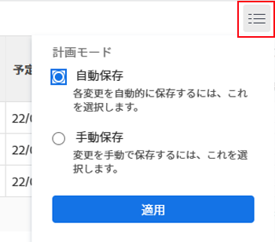
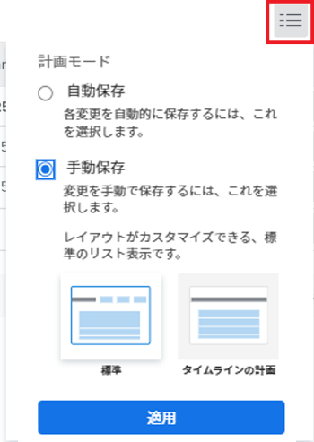
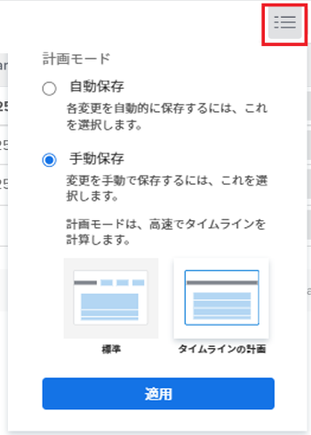
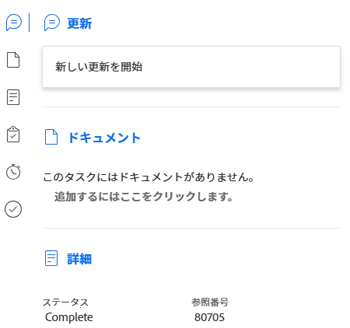

# リスト内のタスクの編集 {#edit-tasks-in-a-list}

リストに表示されるフィールドを編集することで、タスクのリスト内のタスク情報を編集できます。 タスクを編集するその他の方法については、 [タスクを編集](../../../manage-work/tasks/manage-tasks/edit-tasks.md).

## アクセス要件

この記事の手順を実行するには、次のアクセス権が必要です。

<table style="table-layout:auto"> 
 <col> 
 <col> 
 <tbody> 
  <tr> 
   <td role="rowheader">Adobe Workfront plan*</td> 
   <td> 
任意
 </td> 
  </tr> 
  <tr> 
   <td role="rowheader">Adobe Workfront license*</td> 
   <td> 
仕事以上
 </td> 
  </tr> 
  <tr> 
   <td role="rowheader">アクセスレベル設定*</td> 
   <td> 
タスクおよびプロジェクトへのアクセスを編集
 
注意：まだアクセス権がない場合は、Workfront管理者に、アクセスレベルに追加の制限を設定しているかどうかを問い合わせてください。 Workfront管理者がアクセスレベルを変更する方法について詳しくは、 <a href="../../../administration-and-setup/add-users/configure-and-grant-access/create-modify-access-levels.md" class="MCXref xref">カスタムアクセスレベルの作成または変更</a>.
 </td> 
  </tr> 
  <tr> 
   <td role="rowheader">オブジェクト権限</td> 
   <td> 
タスクとプロジェクトに権限を付与するか、それ以上の権限を付与する
 
追加のアクセス権のリクエストについて詳しくは、 <a href="../../../workfront-basics/grant-and-request-access-to-objects/request-access.md" class="MCXref xref">オブジェクトへのアクセスのリクエスト </a>.
 </td> 
  </tr> 
 </tbody> 
</table>

&#42;保有しているプラン、ライセンスの種類、アクセス権を確認するには、Workfront管理者に問い合わせてください。

## リスト内のタスクの編集に関する考慮事項 {#considerations-about-editing-tasks-in-a-list}

リスト内のタスクを編集すると、複数のタスクを同時に変更する簡単な方法で、変更がプロジェクトタイムラインに与える影響を明確に確認できます。

リスト内のタスクを編集する際は、次の点に注意してください。

* 編集ボックスでタスクを編集する際にタスクに対する管理権限が必要な場合とは異なり、タスクに対する Contribute 権限を持つリスト内のタスクのみを編集できます。 これにより、タスクに関する次の制限付き情報を編集できます。

   * 説明
   * ステータス
   * 完了率
   * カスタムフォーム情報

      >[!NOTE]
      >
      >リスト内のタスクのカスタムフィールドは、フィールドを更新する権限を持っている場合にのみ編集できます。

   * ログ時間
   * 割り当ての変更
   * 財務情報の表示
   * 費用、タスクまたは問題を追加

* 次のリストでタスクを編集できます。

   * プロジェクトのタスクセクション
   * プロジェクトの「サブタスク」セクション
   * タスクレポート

      >[!NOTE]
      >
      >デフォルトでは、Workfrontはタスクに対する変更を「サブタスク」セクションまたはタスクレポートに自動的に保存します。

* タスクに加えた変更をWorkfrontがリストに保存するタイミングを制御できます。 変更は自動的に保存することも、手動で保存することもできます。

   タスクに加えた変更をWorkfrontがリストに保存する際の設定について詳しくは、 [リスト内のタスクを編集する際に保存オプションを選択する](#select-a-save-option-when-editing-tasks-in-a-list) 」の節を参照してください。

## リスト内のタスクを編集する際に保存オプションを選択する {#select-a-save-option-when-editing-tasks-in-a-list}

リスト内のタスクに対して行った変更を、発生時に自動的に保存する場所や、各変更を手動で保存する場合は、どこで保存するかを指定できます。

>[!IMPORTANT]
>
>タスクを自動で保存するか、手動で保存するかに応じて、リストのタスクを編集する際に他のユーザーの情報を上書きする場合があります。 他のユーザーと同時に行ったタスクに対する変更をWorkfrontが保存する方法について詳しくは、 [タスクリスト内の同時変更の保存の概要](../../../manage-work/tasks/manage-tasks/save-concurrent-changes-in-a-task-list.md).

更新タイプとして [ 自動 ] または [ 自動 ] または [ 変更時 ] が選択されているプロジェクトのリストに変更を保存すると、Workfrontは、プロジェクト内およびプロジェクト間のすべての依存関係と共に、プロジェクトタイムラインを更新します。 プロジェクトが大きい場合や、依存関係が多い場合は、タイムラインの計算に時間がかかる場合があります。 タスクリストを編集する方法の中には、変更を保存する方法に応じて、他の方法よりも速く編集できるものもあります。

タスクに加えた変更をWorkfrontがリストに保存するタイミングを制御できます。 次のシナリオが存在します。 

* 更新のたびに、Workfrontで自動的に変更を保存することができます。

   詳しくは、 [リスト内のタスクを編集し、変更を自動的に保存する](#edit-tasks-in-a-list-and-automatically-save-changes) 」を参照してください。

* 「保存」ボタンを使用して手動で複数の変更を一度に適用するタイミングを制御できます。

   詳しくは、 [リスト内のタスクを編集し、変更を手動で保存する](#edit-tasks-in-a-list-and-manually-save-changes) 」を参照してください。

### リスト内のタスクを編集し、変更を自動的に保存する {#edit-tasks-in-a-list-and-automatically-save-changes}

>[!TIP]
>
>プロジェクトに 2,000 を超えるタスクがある場合や、多くの依存関係がある場合は、変更を保存したり、すべてのプロジェクトの依存関係を保存する時間が長くなる可能性があります。

タスクリストの変更を自動的に保存する場合は、次の点に注意してください。

* タスクリストにカスタムビューを適用し、更新するためのアクセス権を持つタスク関連のフィールドを編集できます。
* 自動保存された変更を元に戻すことはできません。 これはデフォルト設定です。
* プロジェクトの [ 更新の種類 ] が [ 自動 ] または [ 自動 ]、[ 変更時 ] の場合、変更のたびに、プロジェクトのタイムラインと、プロジェクト内とプロジェクト間の依存関係がすべて自動的に再計算されます。 プロジェクトの更新タイプについては、 [プロジェクトの更新タイプを選択](../../../manage-work/projects/manage-projects/select-project-update-type.md).

リスト内のタスクを編集し、変更を自動的に保存するには、次の手順に従います。

1. プロジェクトに移動し、 **タスク** 」セクションに入力します。
1. 次をクリック： **プランモードメニュー**  をリストの最上部に追加し、 **自動保存** 」オプションが選択されている。

   

1. 手動で更新する権限を持つフィールドを編集します。

   

1. （オプション）を押します。 **エスケープ** 変更をキャンセルする場合。
1. Enter キーを押して、変更内容をタスクやプロジェクトタイムラインに保存します。
1. （オプション）変更するタスクを右クリックします。

   または

   次をクリック： **詳細** メニュー  をタスク名の右にクリックします。

1. （オプション）次のオプションから選択します。

   <table style="table-layout:auto"> 
    <col> 
    <col> 
    <tbody> 
     <tr> 
      <td role="rowheader"><strong>新しいタブで開く</strong></td> 
      <td>タスクを新しいブラウザータブで開きます。 </td> 
     </tr> 
     <tr> 
      <td role="rowheader"><strong>編集</strong></td> 
      <td>
を開きます。 <strong>タスクを編集</strong> 」ボックスに移動します。このボックスでタスクを編集できます。

タスクの編集について詳しくは、 <a href="#edit-tasks-in-a-list" class="MCXref xref">リスト内のタスクの編集</a>.
</td> 
     </tr> 
     <tr> 
      <td role="rowheader">削除</td> 
      <td>
タスクを削除します。

タスクの削除について詳しくは、 <a href="../../../manage-work/tasks/manage-tasks/delete-tasks.md" class="MCXref xref">タスクを削除</a>.
</td> 
     </tr> 
     <tr> 
      <td role="rowheader">インデント</td> 
      <td>
タスクを 1 レベルずつインデントします。 

このオプションは、スタンドアロンタスクでのみ表示されます。
</td> 
     </tr> 
     <tr> 
      <td role="rowheader">アウトデント</td> 
      <td>
タスクを 1 レベルずつインデントします。 

このオプションは、子タスクにのみ表示されます。 
</td> 
     </tr> 
     <tr> 
      <td role="rowheader">タスクを上に挿入</td> 
      <td>選択したタスクの上にタスクを挿入します。</td> 
     </tr> 
     <tr> 
      <td role="rowheader">タスクを下に挿入</td> 
      <td>選択したタスクの下にタスクを挿入します</td> 
     </tr> 
     <tr> 
      <td role="rowheader">複製</td> 
      <td>
同じプロジェクト内にタスクの重複バージョンを作成します。 
</td> 
     </tr> 
     <tr> 
      <td role="rowheader">指定の場所にコピー</td> 
      <td>
タスクを別のプロジェクトにコピーします。

タスクのコピーと複製について詳しくは、 <a href="../../../manage-work/tasks/manage-tasks/copy-and-duplicate-tasks.md" class="MCXref xref">タスクのコピーと複製</a>.
</td> 
     </tr> 
     <tr> 
      <td role="rowheader">指定の場所に移動</td> 
      <td>
タスクを別のプロジェクトに移動します。

タスクの移動について詳しくは、 <a href="../../../manage-work/tasks/manage-tasks/move-tasks.md" class="MCXref xref">タスクを移動</a>.
</td> 
     </tr> 
    </tbody> 
   </table>

   変更は自動的に保存され、元に戻すことはできません。

### リスト内のタスクを編集し、変更を手動で保存する {#edit-tasks-in-a-list-and-manually-save-changes}

リスト内のタスクに加えた変更を手動で保存できます。 この方法で変更を保存する場合、保存前に変更を元に戻すことができます。

>[!TIP]
>
>* リスト内のタスクを [ サブタスク ] セクションまたはタスクレポートで編集しているときは、そのタスクに加えた変更を元に戻すことはできません。
>* 元に戻すことができる変更の数に制限はありません。 タスクの元の状態に達するまで、すべてのタスクを 1 つずつ元に戻すことができます。
>

タスクリストの変更を手動で保存する場合は、次の点を考慮してください。

* タスクリストの変更を手動で保存するには、タスクとプロジェクトの両方を管理する権限が必要です。
* プロジェクトは編集できません。 プロジェクトを編集するオプションは無効になっています。
* プロジェクトのヘッダー内の情報を更新することはできません。 タスクリストの変更を手動で保存する場合にのみ、次の操作を実行できます。

   * プロジェクトを購読します。
   * プロジェクトをお気に入りのリストに追加します。
   * リスト内のタスク名をクリックしてタスクを開きます。

* タスクを一括編集します。 複数のタスクを選択すると、編集アイコンが無効になります。
* Workfrontトリガーは、変更を保存した後にのみ、タスクに加えた変更に関する通知を受け取ります。

リスト内のタスクに対する変更を手動で保存する方法は 2 つあります。 次の 2 つの方法について説明します。

* [[ 手動で標準を保存 ] オプションを選択した場合は、タスクリストに変更を手動で保存する](#save-changes-in-a-task-list-manually-when-you-select-the-manual-save-standard-option)
* [「タイムライン計画を手動で保存」オプションを選択した場合は、タスク・リストに変更を手動で保存します。](#save-changes-in-a-task-list-manually-when-you-select-the-manual-save-timeline-planning-option)

#### [ 手動で標準を保存 ] オプションを選択した場合は、タスクリストに変更を手動で保存する {#save-changes-in-a-task-list-manually-when-you-select-the-manual-save-standard-option}

>[!TIP]
>
>プロジェクトに 2,000 個を超えるタスクがある場合、または多くの依存関係がある場合は、タスクに加えた変更と、それらの変更がプロジェクトのすべての依存関係に与える影響を視覚的に識別するのに時間がかかる場合があります。 この場合、プロジェクトに 2,000 を超えるタスクがある場合や、多くの依存関係がある場合は、変更の保存に時間がかかる場合があります。

「手動で標準を保存」オプションを選択した後にリスト内のタスクを更新する場合は、次の点に注意してください。

* タスクリストにカスタムビューを適用し、そのビューで管理する権限を持つタスク関連のフィールドを編集できます。
* [ 更新の種類 ] が [ 自動 ] または [ 自動 ]、[ 変更時 ] の場合、[ 保存 ] をクリックすると、Workfrontはプロジェクトのタイムラインと、プロジェクト内とプロジェクト間のすべての依存関係を計算します。 プロジェクトの更新タイプについては、 [プロジェクトの更新タイプを選択](../../../manage-work/projects/manage-projects/select-project-update-type.md).

「手動で標準を保存」オプションを選択する際にリスト内のタスクを編集するには、次の手順に従います。

1. プロジェクトに移動し、 **タスク** の節を参照してください。
1. 次をクリック： **プランモード** メニュー  をクリックし、 **手動で保存**&#x200B;を選択し、「 **標準** > **適用**.

   

   ツールバー設定が表示され、変更の取り消し、やり直し、保存を行うオプションが表示されます。

   

1. 手動で更新する権限を持つフィールド内をクリックします。 フィールドが編集可能になり、変更を加えることができます。

   

1. Enter キーを押して、加えた変更を一時的に保存します。
1. （オプション） **取り消しアイコン**  をクリックして、変更を元に戻し、フィールドを元の状態に戻します。
1. （オプションおよび条件付き） **やり直しアイコン**  元に戻した変更を復元するには、次の手順に従います。

1. （オプション）変更するタスクを右クリックします。

   または

   次をクリック： **詳細** メニュー .

1. （オプション）次のオプションから選択します。

   <table style="table-layout:auto"> 
    <col> 
    <col> 
    <tbody> 
     <tr> 
      <td role="rowheader"><strong>新しいタブで開く</strong> </td> 
      <td>タスクを新しいブラウザータブで開きます。 </td> 
     </tr> 
     <tr> 
      <td role="rowheader">削除</td> 
      <td>タスクの削除について詳しくは、 <a href="../../../manage-work/tasks/manage-tasks/delete-tasks.md" class="MCXref xref">タスクを削除</a>.</td> 
     </tr> 
     <tr> 
      <td role="rowheader">インデント</td> 
      <td> 
タスクを 1 レベルずつインデントします。 
 
このオプションは、スタンドアロンタスクでのみ表示されます。
 </td> 
     </tr> 
     <tr> 
      <td role="rowheader">アウトデント</td> 
      <td> 
タスクを 1 レベルずつインデントします。 
 
このオプションは、子タスクにのみ表示されます。 
 </td> 
     </tr> 
     <tr> 
      <td role="rowheader">タスクを上に挿入</td> 
      <td>選択したタスクの上にタスクを挿入します。</td> 
     </tr> 
     <tr> 
      <td role="rowheader">タスクを下に挿入</td> 
      <td>選択したタスクの下にタスクを挿入します</td> 
     </tr> 
     <tr> 
      <td role="rowheader">複製</td> 
      <td> 
同じプロジェクト内にタスクの重複バージョンを作成します。 
 
タスクのコピーと複製について詳しくは、 <a href="../../../manage-work/tasks/manage-tasks/copy-and-duplicate-tasks.md" class="MCXref xref">タスクのコピーと複製</a>.
 </td> 
     </tr> 
    </tbody> 
   </table>

1. Workfrontは、タスクのタイムラインに変更を加えると、プロジェクト内およびプロジェクト間のすべての依存関係を更新します。
1. クリック **保存** タスクの変更を恒久的に保持し、プロジェクトのタイムラインを保存する場合。

#### 「タイムライン計画を手動で保存」オプションを選択した場合は、タスク・リストに変更を手動で保存します。 {#save-changes-in-a-task-list-manually-when-you-select-the-manual-save-timeline-planning-option}

変更を保存すると、プロジェクトへの依存関係がすべて高速になります。 2,000 個を超えるタスクを持つプロジェクトでは使用できません。

>[!IMPORTANT]
>
>多数の依存関係を持つ数百を超えるタスクの大量のリストを編集する場合は、このオプションを使用することをお勧めします。 このオプションを使用すると、「手動保存」オプションを使用する場合よりも、変更内容を視覚的に識別するのがはるかに速くなります。

タスク・リストで「タイムライン計画の手動保存」オプションを使用する際は、次の点に注意してください。

* 2,000 個を超えるタスクを持つプロジェクトには、手動保存のタイムライン計画オプションを適用できません。
* タスクリストにカスタムビュー、フィルター、またはグループ化を適用することはできません。 「表示」、「フィルター」、「グループ化」の各ドロップダウンメニューと「アジャイル」ビューアイコンは無効になっています。 デフォルトで適用されるビューには、限られた数のフィールドが含まれています。
* プロジェクトの [ 更新の種類 ] が [ 自動 ] または [ 自動 ]、[ 変更時 ] の場合、プロジェクトのタイムラインとすべてのプロジェクト内依存関係は、変更後に自動的に計算されます。
* プロジェクト間の依存関係は、[ 保存 ] をクリックした後、[ 更新の種類 ] が [ 自動 ] または [ 自動 ]、[ 変更時 ] の場合に計算されます。 プロジェクトの更新タイプについては、 [プロジェクトの更新タイプを選択](../../../manage-work/projects/manage-projects/select-project-update-type.md).

「タイムライン計画の手動保存」オプションを使用する際にリスト内のタスクを編集する手順は、次のとおりです。

1. プロジェクトに移動し、 **タスク** 」セクションに入力します。
1. 次をクリック： **プランモード** メニュー  をクリックし、 **手動で保存**&#x200B;を選択し、「 **タイムライン計画**> **適用**.

   2,000 を超えるタスクを持つプロジェクトでは、このオプションは淡色表示になります。

   

   >[!TIP]
   >
   >このページから移動すると、Workfrontの「自動保存」オプションが再度有効になります。

   リストに次の変更があることに注意してください。

   * 表示、グループ化およびフィルターのドロップダウンメニューが削除され、ビューが次のフィールドに置き換えられます。

      * タスク番号
      * タスク名
      * 制約タイプ
      * 期間
      * 予定開始日
      * 予定完了日
      * 先行タスク
      * 割り当て
      * ステータス
      * 完了率
   * 「アジャイルビュー」アイコンが削除されます。
   * ツールバー設定が表示され、変更の取り消し、やり直し、保存を行うオプションが表示されます。

      

1. 手動で更新する権限を持つフィールドを編集します。

   

1. Enter キーを押して、加えた変更を一時的に保存します。
1. （オプション） **取り消しアイコン**  をクリックして、変更を元に戻し、フィールドを元の状態に戻します。
1. （オプションおよび条件付き） **やり直しアイコン**  ：変更を元に戻します。

1. （オプション）変更するタスクを右クリックします

   または

   次をクリック： **詳細** メニュー .

1. 次のオプションから選択します。

   <table style="table-layout:auto"> 
    <col> 
    <col> 
    <tbody> 
     <tr> 
      <td role="rowheader"><strong>新しいタブで開く</strong> </td> 
      <td>タスクを新しいブラウザータブで開きます。 </td> 
     </tr> 
     <tr> 
      <td role="rowheader">削除</td> 
      <td>タスクの削除について詳しくは、 <a href="../../../manage-work/tasks/manage-tasks/delete-tasks.md" class="MCXref xref">タスクを削除</a>.</td> 
     </tr> 
     <tr> 
      <td role="rowheader">インデント</td> 
      <td> 
タスクを 1 レベルずつインデントします。 
 
このオプションは、スタンドアロンタスクでのみ表示されます。
 </td> 
     </tr> 
     <tr> 
      <td role="rowheader">アウトデント</td> 
      <td> 
タスクを 1 レベルずつインデントします。 
 
このオプションは、子タスクにのみ表示されます。 
 </td> 
     </tr> 
     <tr> 
      <td role="rowheader">タスクを上に挿入</td> 
      <td>選択したタスクの上にタスクを挿入します。</td> 
     </tr> 
     <tr> 
      <td role="rowheader">タスクを下に挿入</td> 
      <td>選択したタスクの下にタスクを挿入します</td> 
     </tr> 
     <tr> 
      <td role="rowheader">複製</td> 
      <td> 
同じプロジェクト内にタスクの重複バージョンを作成します。 
 
タスクのコピーと複製について詳しくは、 <a href="../../../manage-work/tasks/manage-tasks/copy-and-duplicate-tasks.md" class="MCXref xref">タスクのコピーと複製</a>.
 </td> 
     </tr> 
    </tbody> 
   </table>

1. Workfrontは、タスクのタイムラインを変更すると、プロジェクト内とプロジェクト間のすべての依存関係を更新します。
1. クリック **保存** タスクの変更を恒久的に保持し、プロジェクトのタイムラインを保存する場合。

## サマリーを使用してリスト内のタスクを編集する

1. 編集するタスクが含まれているプロジェクトに移動します。
1. クリック&#x200B;**タスク** をクリックします。

   プロジェクト上のタスクのリストが表示されます。

1. その他メニューをクリックします。  タスク名の後に、 **概要を開く**. 編集するタスクを選択し、 **概要を開くアイコン**  をクリックします。

   この **概要** が開きます。

   

1. （オプション） **X アイコン** をクリックし、パネルを閉じてタスクをインラインで編集します。

   リスト内のタスクを編集し、タスクをインライン編集する手順に従います。

   リスト内のタスクの編集について詳しくは、 [リスト内のタスクの編集に関する考慮事項](#considerations-about-editing-tasks-in-a-list) 」を参照してください。

1. （オプション）タスクの更新を **更新** 領域
1. タスクに移動し、タスクレベルで情報を編集するには、次のアイコンまたは領域をクリックします。

   | ドキュメント | クリック **ここをクリックして追加** をクリックして、タスクにドキュメントを追加します。 |
   |---|---|
   | 詳細 | をクリックして、タスクに関する情報を更新します。 |
   | カスタムフォーム | をクリックして、カスタムFormsの追加や削除、またはフォーム上の情報の更新を行います。 |
   | 時間 | クリックして時間を記録します。 |
   | 承認 | クリックしてタスク承認を追加します。 |

   {style=&quot;table-layout:auto&quot;}

1. タスクの更新が完了したら、ブラウザの戻るボタンをクリックしてタスクリストに戻ります。

## タスクを一括編集

一度に複数のタスクを編集できます。 タスクを編集するには、タスクに対する管理権限を持っていることを確認します。

1. 一括編集するタスクが含まれるプロジェクトに移動します。
1. クリック **タスク** をクリックします。
1. 次を確認します。 **自動保存** 」オプションが選択されている。

   >[!IMPORTANT]
   >
   >タスクを手動で保存する場合は、タスクを一括で編集できません。

   リスト内のタスクに対する変更を保存する方法の詳細については、「 [リスト内のタスクの編集に関する考慮事項](#considerations-about-editing-tasks-in-a-list) 」を参照してください。

1. タスクリストで複数のタスクを選択します。
1. 次をクリック： **編集アイコン** .

   この **タスクを編集** ダイアログボックスが開きます。

1. 選択したすべてのタスクに対して変更する情報を指定します。

   すべてのタスクに関する情報の編集は、1 つのタスクに関する情報の編集と同じです。 タスクの期間を編集する場合、選択したタスクのタスクには同じタスク制約が必要です。それ以外の場合は、 **期間** フィールドに値が入力されていません。

   タスクの編集について詳しくは、 [タスクを編集](../../../manage-work/tasks/manage-tasks/edit-tasks.md).

   >[!NOTE]
   >
   >選択したすべてのタスクに対して変更する情報は、個々のタスクに関する既存の情報 ( **割り当て** フィールドに入力します。 一括編集で新しい担当者を追加すると、その担当者が選択したすべてのタスクに追加されます。 選択したタスクに他の担当者が割り当てられている場合、一括編集で追加されたタスクに加えて、割り当てられたままになります。

1. クリック **カスタムForms** ：選択したすべてのタスクに添付されたカスタムフォームを編集します。 リストには、アクティブなカスタムフォームのみが表示されます。

   選択したタスクに共通のカスタムフォームがない場合、このセクションにはフォームが表示されません。

   選択したすべてのタスクに添付され、編集権限を持つフォーム上のフィールドのみを編集できます。

1. （オプション）「カスタムForms」セクションで、 **カスタム式の再計算** 選択したタスクに添付されたカスタムフォーム上にあるすべての計算カスタムフィールドが最新であることを確認するオプションが追加されました。
1. クリック **変更を保存**.

   これで、行ったすべての変更が、選択したすべてのタスクに表示されます。

カスタムフォームの一括編集について詳しくは、 [オブジェクトに添付されたカスタムフォームの管理](../../../workfront-basics/work-with-custom-forms/manage-custom-forms-attached-to-objects.md).
