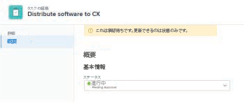
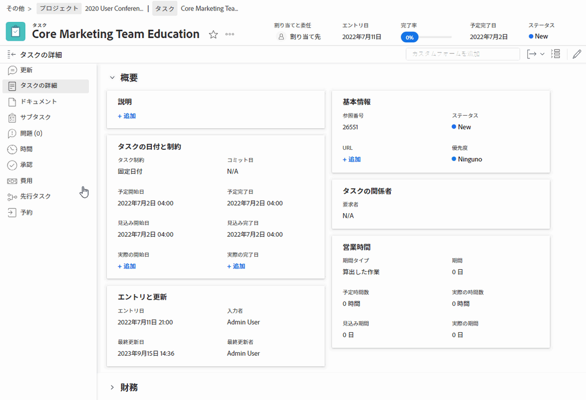
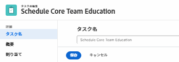
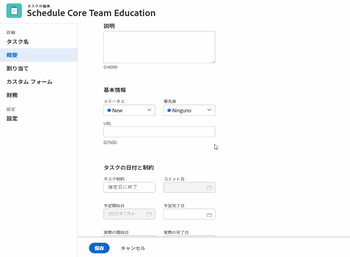
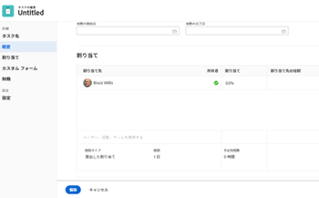
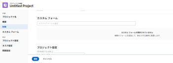
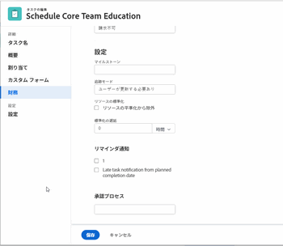

# タスクを編集

<!--

(NOTE: some information in this area is repeated in the following articles. If you need to update a fied, update it in both:

** Task finances in details

** Task information in overview)

-->

自分で作成したタスクに関する情報、または Contribute または Manage 権限を持っているタスクに関する情報を編集できます。

## アクセス要件

この記事の手順を実行するには、次のアクセス権が必要です。

<table style="table-layout:auto"> 
 <col> 
 <col> 
 <tbody> 
  <tr> 
   <td role="rowheader">Adobe Workfront plan*</td> 
   <td> 
任意 
 </td> 
  </tr> 
  <tr> 
   <td role="rowheader">Adobe Workfront license*</td> 
   <td> 
仕事以上
 </td> 
  </tr> 
  <tr> 
   <td role="rowheader">アクセスレベル*</td> 
   <td> 
タスクおよびプロジェクトへのアクセスを編集
 
<b>メモ</b>

まだアクセス権がない場合は、Workfront管理者に、アクセスレベルに追加の制限を設定しているかどうかを問い合わせてください。 Workfront管理者がアクセスレベルを変更する方法について詳しくは、 <a href="../../../administration-and-setup/add-users/configure-and-grant-access/create-modify-access-levels.md" class="MCXref xref">カスタムアクセスレベルの作成または変更</a>.
 </td>
</tr> 
  <tr> 
   <td role="rowheader">オブジェクト権限</td> 
   <td> 
    <ul> 
     <li> 
タスクに権限を付与して、タスクの詳細領域でタスクを編集する 
 </li> 
     <li> 
タスクに対する権限を管理して、タスクを編集ボックスで編集します
 </li> 
    </ul> 
    <ul> 
     <li> 
プロジェクトに対する権限を投稿するか、それ以上に設定します
 </li> 
    </ul> 
追加のアクセス権のリクエストについて詳しくは、 <a href="../../../workfront-basics/grant-and-request-access-to-objects/request-access.md" class="MCXref xref">オブジェクトへのアクセスのリクエスト </a>.
 </td> 
  </tr> 
 </tbody> 
</table>

&#42;保有しているプラン、ライセンスの種類、アクセス権を確認するには、Workfront管理者に問い合わせてください。

## タスク編集の制限

タスクを編集できない場合がある制限がいくつかあります。

タスクを編集する際は、次の点に注意してください。

* タスクトリガーの通知を更新する（現在のステータスのプロジェクトの場合）。 タスクに割り当てられたユーザーが混乱するのを避けるには、プロジェクトのステータスが「現在」の場合に、編集タスクをできるだけ制限します。
* 承認プロセス内のタスクは編集できません。 承認プロセスでのタスクのログ時間またはステータスの更新のみ可能です。

   

* ステータスが「完了」、「無効」、「承認待ち」のプロジェクト上のタスクに対するドキュメントの編集や追加は、 Workfront管理者またはグループ管理者が「プロジェクト環境設定」領域でこの機能を有効にした場合にのみ実行できます。 プロジェクトの環境設定の詳細については、 [システム全体のプロジェクト環境設定の指定](../../../administration-and-setup/set-up-workfront/configure-system-defaults/set-project-preferences.md).

* プロジェクトが「完了」、「無効」とマークされている、または承認プロセス中の場合、タスクに関する次の情報をいつでも編集できます。

   * ログ時間
   * 既存の費用を編集
   * カスタムフォームを添付

## リスト内のタスクの編集

リストのビューに表示されるインライン編集フィールドを使用して、タスクのリスト内のタスク情報を編集できます。

リスト内のタスクの編集について詳しくは、 [リスト内のタスクの編集](../../../manage-work/tasks/manage-tasks/edit-tasks-in-a-list.md).

## サマリーを使用してリスト内のタスクを編集する

概要パネルを使用して、リスト内のタスクを編集できます。 概要パネルでのタスクの編集について詳しくは、 [リスト内のタスクの編集](../../../manage-work/tasks/manage-tasks/edit-tasks-in-a-list.md) 記事。

## 「タスクを編集」ボックスでタスクを編集します

「タスクの編集」領域または「タスクの詳細」領域を使用してタスクを編集できます。 次の手順では、「タスクの編集」ボックスでタスクを編集する方法を説明します。

1. 次をクリック： **メインメニュー** アイコン  Adobe Workfrontの右上隅にある

1. クリック **プロジェクト**&#x200B;をクリックし、プロジェクト名をクリックして開きます。
1. クリック **タスク** をクリックします。
1. 編集するタスクをクリックします。
1. （オプション）タスクに関する限定的な情報を編集するには、 **タスクの詳細** をクリックします。

   

   次の「タスクの詳細」セクションの領域で、情報の編集を検討してください。

   * **概要**

      この領域は、デフォルトで展開されます。

   * **カスタムフォーム**

      税関フォームの名前は、オブジェクトにカスタムフォームが添付されている場合にのみ表示されます。

   * **財務**
   >[!NOTE]
   >
   >Workfront管理者またはグループ管理者がレイアウトテンプレートを変更した方法に応じて、「タスクの詳細」領域のフィールドが再配置されたり表示されない場合があります。 詳しくは、 [レイアウトテンプレートを使用して詳細ビューをカスタマイズする](../../../administration-and-setup/customize-workfront/use-layout-templates/customize-details-view-layout-template.md).

   「タスクの詳細」セクションに表示されるフィールドについて詳しくは、

   以下の説明に従って、「タスクを編集」ボックスのタスクの編集を続行します。

   「詳細」セクションの情報を編集するには、次の手順を実行します。

   1. （オプション） **すべて折りたたむ** アイコン  右上隅で、すべての領域を折りたたみます。
   1. （オプションおよび条件付き）領域が折りたたまれている場合、 **右向き矢印**  各領域の横に、編集する領域を展開します。
   1. 「タスクの詳細」タブでの情報の編集の詳細については、次の記事を参照してください。

      * [「タスクの詳細の概要」領域でタスク情報を管理します](../../../manage-work/tasks/manage-tasks/task-information-in-overview.md)
      * [[ タスクの詳細 ] セクションでタスクの財務を管理します](../../../manage-work/tasks/manage-tasks/task-finances-in-details.md)
   1. （オプション）タスクにカスタムフォームが添付されていない場合は、 **カスタムフォームを追加** フィールドに値を入力し、リストに表示されるタイミングで選択して、 **変更を保存**.
   1. （オプション） **書き出し** アイコン  概要およびカスタムフォームの情報を書き出すには、PDF・ファイルに **書き出し**. 次の中から選択します。

      * すべてを選択（少なくとも 1 つのカスタムフォームが添付されている場合にのみ表示）
      * 概要
      * 1 つまたは複数のカスタムフォームの名前

      PDFファイルがコンピューターにダウンロードされます。

      

      詳しくは、 [カスタムフォームとオブジェクトの詳細のエクスポート](../../../workfront-basics/work-with-custom-forms/export-custom-forms-details.md).

1. タスクに関するすべての情報を編集するには、 **詳細** メニュー  タスク名の横にあるをクリックし、 **編集**.

   または

   タスクのリストから、タスクを選択し、 **編集** アイコン  をクリックします。

   「タスクを編集」(Edit Task) ボックスが開きます。

   >[!IMPORTANT]
   >
   >「編集」オプションを表示するには、タスクに対する管理権限が必要です。

   すべてのタスクフィールドは、「タスクを編集」ボックスで使用でき、左側のパネルに表示される領域でグループ化されます。

   >[!NOTE]
   >
   >Workfront管理者またはグループ管理者がレイアウトテンプレートを変更した方法に応じて、「タスクの詳細」領域のフィールドが再配置されたり表示されない場合があります。 詳しくは、 [レイアウトテンプレートを使用して詳細ビューをカスタマイズする](../../../administration-and-setup/customize-workfront/use-layout-templates/customize-details-view-layout-template.md).

   次のセクションのいずれかで、情報の指定を検討します。

   * [タスク名](#task-name)
   * [概要](#overview)
   * [割り当て](#assignments)
   * [カスタムフォーム](#Custom%C2%A0F)
   * [財務](#finance)
   * [設定](#settings)

   >[!NOTE]
   >
   >Workfrontの管理者またはグループ管理者がレイアウトテンプレートを設定する方法に応じて、「タスクを編集」ボックスのフィールドが再配置されたり、表示されなかったりする場合があります。 詳しくは、 [レイアウトテンプレートを使用して詳細ビューをカスタマイズする](../../../administration-and-setup/customize-workfront/use-layout-templates/customize-details-view-layout-template.md).

### タスク名 {#task-name}

1. 上記の説明に従って、タスクの編集を開始します。
1. クリック **タスク名** をクリックします。

   

1. タスクの名前を更新します。

1. クリック **保存** または次のセクションに進みます。

### 概要 {#overview}

1. 上記の説明に従って、タスクの編集を開始します。
1. クリック **概要** をクリックします。

   

1. タスクに関する次の情報を更新します。

   <table style="table-layout:auto"> 
    <col> 
    <col> 
    <tbody> 
     <tr> 
      <td role="rowheader">説明</td> 
      <td>タスクに関する追加情報を追加します。 </td> 
     </tr> 
     <tr> 
      <td colspan="2" role="rowheader">「基本情報」セクション </td> 
     </tr> 
     <tr> 
      <td role="rowheader">ステータス</td> 
      <td> 
タスクのステータスを選択します。このステータスは、タスクが開発のどの段階にあるかを示します。
 
<b>ヒント</b>

   タスクヘッダーでタスクのステータスを更新できます。 
 </td>
   </tr> 
     <tr> 
      <td role="rowheader">優先度</td> 
      <td> 
これは、タスクを優先順位付けできる視覚的なフラグです。 
 
次のオプションから選択します。 
 
       <ul> 
      <li> 
 なし
 </li> 
      <li> 
 低 
 </li> 
      <li> 
標準 
 </li> 
      <li> 
高 
 </li> 
      <li> 
 緊急 
 </li> 
       </ul> 
Workfront管理者が選択したプロジェクトの環境設定によっては、優先度の名前が異なる場合があります。 タスクの優先度について詳しくは、 <a href="../../../manage-work/tasks/task-information/task-priority.md" class="MCXref xref">タスクの優先度を更新</a>. 
 </td> 
     </tr> 
     <tr> 
      <td colspan="2" role="rowheader">「タスクの日付と制約」セクション </td> 
     </tr> 
     <tr> 
      <td role="rowheader">タスクの制約</td> 
      <td> 
タスク制約を指定して、タスクを完了するタイミングを決定します。 
 
次のオプションから選択します。 
 
       <ul> 
      <li> 
固定日付 
 
を指定します。 <strong>計画開始</strong> および <strong>計画完了日</strong>. 
 </li> 
      <li> 
指定日に開始 
 
を指定します。 <strong>計画開始日</strong>. 
 </li> 
      <li> 
指定日に終了 
 
を指定します。 <strong>計画完了日</strong>. 
 </li> 
       </ul> 
       <ul> 
      <li> 
できるだけ早く
 </li> 
      <li> 
できるだけ遅く
 </li> 
      <li> 
最も早い空き時間
 </li> 
      <li> 
 最も遅い空き時間
 </li> 
      <li> 
指定日までに開始 
 </li> 
      <li> 
計画開始日の指定
 </li> 
      <li> 
指定日以後に開始 
 
を指定します。 <strong>計画開始日</strong>. 
 </li> 
      <li> 
 完了 指定の日まで
 
を指定します。 <strong>計画完了日</strong>. 
 </li> 
      <li> 
 完了 次の値より前
 
を指定します。 <strong>計画完了日</strong>
 </li> 
       </ul> 
タスク制約の詳細については、 <a href="../../../manage-work/tasks/task-constraints/task-constraint-overview.md" class="MCXref xref">タスク制約の概要</a>.
 </td> 
     </tr> 
     <tr> 
      <td role="rowheader">コミットの日時</td> 
      <td> 
タスクに割り当てられたユーザーが、タスクを完了させるためにコミットする日付です。 これは、「計画完了日」とは異なる場合があります。 委託人のみがこのフィールドを編集できます。Workfrontでのコミット日について詳しくは、 <a href="../../../manage-work/projects/updating-work-in-a-project/overview-of-commit-dates.md" class="MCXref xref">コミット日の概要</a>. 
 </td> 
     </tr> 
     <tr> 
      <td role="rowheader">計画開始日時</td> 
      <td> 
タスクを開始する予定の日時。 タスクの計画開始日は、次のような要因によって設定され、影響を受けます。
 
       <ul> 
      <li>タスクの計画開始日に対するシステム全体の優先度に応じて、既定では、プロジェクトの新しいタスクの開始日は今日にすることも、プロジェクトの開始日にすることもできます。 プロジェクトに関連付けられたグループのグループ管理者も、グループに対してこの環境設定を設定できます。 システムレベルまたはグループレベルのタスク環境設定の詳細については、 <a href="../../../administration-and-setup/set-up-workfront/configure-system-defaults/set-task-issue-preferences.md" class="MCXref xref">システム全体のタスクと問題の環境設定を構成</a>.</li> 
      <li>タスクの先行タスクに応じて、予定開始日がWorkfrontによって選択され、先行タスクの終了後の次の使用可能な日付、または先行タスクの関係に応じて開始日になります。 先行関係の詳細については、「 <a href="../../../manage-work/tasks/use-prdcssrs/predecessors-overview.md" class="MCXref xref">タスクの先行タスクの概要</a>.</li> 
      <li>プロジェクトマネージャまたはタスク所有者は、タスク制約が [ 固定日付 ] または [ 開始日 ] の場合に、計画開始日を手動で設定できます。 タスク制約の詳細については、 <a href="../../../manage-work/tasks/task-constraints/task-constraint-overview.md" class="MCXref xref">タスク制約の概要</a>.</li> 
       </ul> </td> 
     </tr> 
     <tr> 
      <td role="rowheader">計画完了日時</td> 
      <td> 
タスクが計画された際に示される、完了予定日。 計画完了日は、次の要因で設定できます。
 
       <ul> 
      <li>計画完了日は、タスクの期間を計画開始日に追加することで、計画開始日から計算されます。 プロジェクトマネージャーまたはWorkfrontがタスクの期間を指定すると、計画完了日がトリガーに更新されます。 予定日が変更された場合、多くの場合、の期間が更新されたことが原因です。</li> 
      <li>プロジェクトマネージャまたはタスク所有者は、タスク制約が [ 固定日付 ] または [ 終了日 ] の場合に、計画完了日を手動で設定できます。 タスク制約の詳細については、 <a href="../../../manage-work/tasks/task-constraints/task-constraint-overview.md" class="MCXref xref">タスク制約の概要</a>.</li> 
      <li>タスクの期間タイプが変更され、タスクのリソース数が同時に変更される場合は、計画完了日も変更されます。 期間のタイプについて詳しくは、 <a href="../../../manage-work/tasks/taskdurtn/task-duration-and-duration-type.md" class="MCXref xref">タスクの期間と期間のタイプの概要</a>.</li> 
       </ul> </td> 
     </tr> 
     <tr> 
      <td role="rowheader">実際の開始日時</td> 
      <td> 
タスクの実績開始日を指定します。 通常、デフォルト値は、タスクのステータスを「処理中」に変更すると自動的に設定されます。 実際の開始日は、プロジェクトマネージャまたはタスク所有者が手動で変更することもできます。 
 </td> 
     </tr> 
     <tr> 
      <td role="rowheader">実際の完了日時</td> 
      <td> 
タスクが完了する実際の日時を指定します。 タスクが完了した既定の日時は、常に、ステータスが [ 完了 ] になった実際の日時と一致します。 実際の完了日は、プロジェクトマネージャまたはタスク所有者が手動で変更することもできます。 
 </td> 
     </tr> 
     <tr> 
      <td role="rowheader"><b>作業時間セクション</b></td> 
     </tr> 
     <tr> 
      <td role="rowheader">作業量 </td> 
      <td>

   
タスクの完了に必要な労力の量。 プロジェクトマネージャは、タスクの完了に必要な作業量を見積もる際に、予定時間の代わりにこのフィールドを使用することにします。 このフィールドは、次の条件を満たした場合にのみ表示されます。
 
      <ul> 
      <li> 
タスクには「シンプルな期間」タイプがあります。 
 
<b>ヒント</b>

   タスクの [ 期間の種類 ] を変更すると、このフィールドは淡色表示になります。 
 </li>
   <li>プロジェクトマネージャーが、プロジェクトの [ 作業時間を使用 ] フィールドでタスクの [ 計画時間 ] を自動的に計算できるようにしました。 </li> 
      </ul> 
      
次のオプションから選択します。
 
      <ul> 
      <li>小</li> 
      <li>中 （これは新しいタスクのデフォルト値です）</li> 
      <li>大</li> 
      </ul> 
      
<b>メモ</b>

   作業量を更新すると、タスク「計画時間」が更新される場合があります。 プロジェクトの [ 更新タイプ ] が [ 自動 ] の場合は、更新が直ちに行われます。 プロジェクトの「更新タイプ」が「手動」の場合は、更新された計画時間を確認するために、タイムラインを再計算する必要があります。 

   
計画時間ではなく作業量を使用して作業量を見積もる方法については、 <a href="../../../manage-work/tasks/task-information/work-effort.md" class="MCXref xref">作業量の概要</a>. 
 
    </td> 
     </tr> 
    </tbody> 
   </table>

1. クリック **保存** または次のセクションに進みます。

### 割り当て {#assignments}

1. 上記の説明に従って、タスクの編集を開始します。
1. クリック **割り当て** をクリックします。

   

1. クリック **担当者、役割、チームの検索** タスクに割り当てるユーザー、役割、またはチームの名前を入力し、タスクをクリックするか、Enter キーを押してタスクをリストに表示します。

   >[!NOTE]
   >
   >ユーザーの名前に特殊文字が含まれている場合は、その特殊文字を検索フィールドに含める必要があります。

   >[!TIP]
   >
   >複数のユーザー、ジョブの役割またはチームを割り当てることができます。 アクティブなユーザー、ジョブの役割およびチームのみを割り当てることができます。
   >
   >非アクティブ化前にユーザー、ジョブの役割、またはチームが割り当てられた場合、そのユーザーは作業項目に割り当てられたままになります。 この場合、次の操作をお勧めします。
   >
   >* 作業項目をアクティブなリソースに再割り当てする。
   >* 非アクティブなチームのユーザをアクティブなチームに関連付け、作業項目をアクティブなチームに再割り当てします。

1. （オプション）担当者がタスクの主要な担当者かどうかを指定するには、 **所有者** ラジオボタンをクリックします。 チームをタスクの主な担当者にすることはできません。
1. （条件付きおよびオプション）次のフィールドを更新します。

   <table style="table-layout:auto"> 
    <col> 
    <col> 
    <tbody> 
     <tr> 
      <td role="rowheader">期間タイプ</td> 
      <td> 
これは、次の間の関係を識別します。 
 
       <ul> 
      <li> 
タスクに割り当てられたリソースの数 
 </li> 
      <li> 
タスクの完了に必要な総作業量 
 </li> 
      <li> 
 タスクの総期間。 
 </li> 
       </ul> 
Workfront管理者  またはグループ管理者 システムまたはグループ内のタスクのデフォルトの「期間の種類」設定を選択します。 プロジェクトの既定値の設定については、 <a href="../../../administration-and-setup/set-up-workfront/configure-system-defaults/set-project-preferences.md" class="MCXref xref">システム全体のプロジェクト環境設定の指定</a>. 
 
期間タイプを使用すると、タスクのニーズに基づいて一貫したリソースの割り当てを設定できます。 タスクの期間の種類について詳しくは、 <a href="../../../manage-work/tasks/taskdurtn/task-duration-and-duration-type.md" class="MCXref xref">タスクの期間と期間のタイプの概要</a>. 
 
次のオプションから選択します。 
 
       <ul> 
      <li> 
算出した割り当て 
 </li> 
      <li> 
 算出した作業 
 </li> 
      <li> 
作業優先 
 </li> 
      <li> 
シンプル
 </li> 
       </ul> </td> 
     </tr> 
     <tr data-mc-conditions="QuicksilverOrClassic.Quicksilver"> 
      <td role="rowheader">発生ごとの所要時間</td> 
      <td> 
これは、繰り返しタスクの親にのみ表示されます。 各繰り返しタスクの期間が表示されます。 繰り返しタスクの作成について詳しくは、 <a href="../../../manage-work/tasks/create-tasks/create-recurring-tasks.md" class="MCXref xref">繰り返しタスクの作成</a>. 
 
 <b>メモ</b>

   個々の定期タスクで変更された期間は、このフィールドに示される値を表示しません。 
 </td>
   </tr> 
     <tr> 
      <td role="rowheader">期間</td> 
      <td> 
      
 
      
 
      
タスクが完了するまで、タスクを開いたままにしておく時間です。 
 
      
<b>重要</b>

   タスク期間は通常、計画開始日から計画完了日までの時間なので、プロジェクトのタイムラインに影響します。

   
タスクの期間と時間の単位を指定するには、次の手順を実行します。
 
      <ul> 
      <li> 
時間の長さを入力し、ドロップダウンメニューで使用できる時間の単位から選択します。
 
<b>ヒント</b>

      タスクリストのタスクの期間を更新する場合、時間の単位の省略形を使用できます。 
 </li> 
      </ul> 
      
 次の表の通常の時間または経過時間オプションから選択できます。 
 
      <table style="table-layout:auto"> 
      <col> 
      <col data-mc-conditions=""> 
      <tbody> 
      <tr> 
      <td>時間の単位</td> 
      <td>省略形</td> 
      </tr> 
      <tr> 
      <td>分</td> 
      <td>月</td> 
      </tr> 
      <tr> 
      <td>時間</td> 
      <td>H</td> 
      </tr> 
      <tr> 
      <td>日. これがデフォルトです。 </td> 
      <td>削</td> 
      </tr> 
      <tr> 
      <td>週</td> 
      <td>水</td> 
      </tr> 
      <tr> 
      <td>月</td> 
      <td>火</td> 
      </tr> 
      <tr> 
      <td>経過時間数 (分)</td> 
      <td>EM</td> 
      </tr> 
      <tr> 
      <td>経過時間数</td> 
      <td>EH</td> 
      </tr> 
      <tr> 
      <td>経過日数</td> 
      <td>ED</td> 
      </tr> 
      <tr> 
      <td>経過週数</td> 
      <td>新規</td> 
      </tr> 
      <tr> 
      <td>経過月数</td> 
      <td>ET</td> 
      </tr> 
      </tbody> 
   </table>

   
<b>メモ</b>

   
経過時間は、タスクの期間の時間の単位です。 休日、週末、休日を含むタスクの計画開始日から計画完了日までの時間です。 つまり、経過時間は暦日の経過です。

   通常の時間は、休日、週末、休日を考慮し、タスクの期間から除外します。 タスクの期間について詳しくは、 <a href="../../../manage-work/tasks/taskdurtn/task-duration-and-duration-type.md" class="MCXref xref">タスクの期間と期間のタイプの概要</a>. 

   
 
   
 </td> 
   </tr> 
   <tr> 
   <td role="rowheader">予定時間数</td> 
   <td> 
タスクの予定時間数を時間単位で指定します。 タスクの担当者がタスクを完了するのにかかる実際の時間です。 [ 期間の種類 ] が [ 割り当ての計算 ] に設定されている場合は、タスクの予定時間数のみ指定できます。 期間のタイプについて詳しくは、 <a href="../../../manage-work/tasks/taskdurtn/task-duration-and-duration-type.md" class="MCXref xref">タスクの期間と期間のタイプの概要</a>.
 </td> 
   </tr> 
   <tr> 
   <td role="rowheader">割り振り</td> 
   <td> 
タスク制約が [ 作業量 ] または [ 作業量主導 ] の場合は、 <strong>配分%</strong> （割り当て率）を割り当てます。 担当者がこのタスクに費やすことができる、担当者のスケジュールからの時間です。 担当者の割り当て率を変更すると、タスクの予定時間が変更されます。 
 
タスク制約が「単純」の場合は、次の項目を指定できます。
 
      <ul> 
      <li> 
各担当者の割り当て時間。
 </li> 
      <li> 
タスクの予定時間
 </li> 
      <li> 
タスクの期間
 </li> 
      </ul> </td> 
   </tr> 
   <tr> 
   <td role="rowheader">割り当て先の役割</td> 
   <td> 
次の中からロールを選択： <strong>担当者の役割</strong> ドロップダウンメニュー（担当者を担当者として選択した場合） 担当者がこのタスクで実行できる役割です。 
 
<b>ヒント</b>

   プロファイル内の各担当者に関連付けられているジョブの役割のみがドロップダウンメニューに表示されます。
 </td>
   </tr> 
      </tbody> 
      </table>

1. クリック **保存** または次のセクションに進みます。

### カスタムフォーム

タスクをプロジェクトに追加する際にタスクに自動的に添付されるデフォルトのカスタムフォームを定義できます。 すべての新規タスクに既定のタスクのカスタムフォームを含めるようにプロジェクトを設定する方法については、この記事の「タスク」の節を参照してください [プロジェクトを編集](../../../manage-work/projects/manage-projects/edit-projects.md).

1. 上記の説明に従ってタスクの編集を開始します。
1. クリック **カスタムForms** 左側のパネルで、またはカスタムフォームが既に添付されている場合は、その名前をクリックします。

   

1. クリック **カスタムフォームを追加** タスクに関連付けるカスタムフォームを選択します。 カスタムフォームをこのフィールドで選択できるようにするには、事前にカスタムフォームを作成する必要があります。 リストには、アクティブなカスタムフォームのみが表示されます。

   カスタムフォームの作成について詳しくは、 [カスタムフォームの作成または編集](../../../administration-and-setup/customize-workfront/create-manage-custom-forms/create-or-edit-a-custom-form.md)1 つのタスクに最大 10 個のカスタムフォームを追加できます。

1. （条件付き）タスクにカスタムフォームを添付する場合、フォーム上のフィールドを編集します。 タスクを保存する前に、すべての必須フィールドを指定する必要があります。

   >[!NOTE]
   >
   >Workfront管理者がカスタムフォームのセクションに対して権限を設定した方法に応じて、すべてのユーザーが特定のカスタムフォームの同じフィールドを表示または編集できるわけではありません。 カスタムフォームのセクション内のフィールドを編集する権限は、タスク自体に対する権限によって異なります。 タスク権限の設定については、 [タスクの共有](../../../workfront-basics/grant-and-request-access-to-objects/share-a-task.md).

1. クリック **保存** または次のセクションに進みます。

### 財務 {#finance}

1. タスクの編集を開始します ( [タスクを編集](#Edit2) 」の節を参照してください。
1. クリック **金融** をクリックします。

   

1. 次のフィールドを更新します。

   <table style="table-layout:auto"> 
    <col> 
    <col> 
    <tbody> 
     <tr> 
      <td role="rowheader">コストの種類</td> 
      <td> 
タスクのコストタイプを指定します。 これにより、タスクの時間数に基づいて、タスクのコストを計算する方法が決まります。 
 
次のオプションから選択します。 
 
       <ul> 
        <li> 
コストなし
 </li> 
        <li> 
固定 (毎時) 
 </li> 
        <li> 
 ユーザー (毎時) 
 </li> 
        <li> 
 役割 (毎時)
 </li> 
       </ul> 
コストの追跡について詳しくは、 <a href="../../../manage-work/projects/project-finances/track-costs.md" class="MCXref xref">コストの追跡</a> . Workfront管理者またはグループ管理者が、システムまたはグループ内のタスクのデフォルトのコストタイプ設定を選択します。 プロジェクトの既定値の設定については、 <a href="../../../administration-and-setup/set-up-workfront/configure-system-defaults/set-project-preferences.md" class="MCXref xref">システム全体のプロジェクト環境設定の指定</a> .
 </td> 
     </tr> 
     <tr> 
      <td role="rowheader">収益タイプ</td> 
      <td> 
タスクの収益タイプを指定します。 これにより、タスクの時間数に基づいて、タスクの売上高の計算方法が決まります。 
 
次のオプションから選択します。 
 
       <ul> 
      <li> 
 請求不可 
 </li> 
      <li> 
ユーザー (毎時) 
 </li> 
      <li> 
役割 (毎時) 
 </li> 
      <li> 
固定 (毎時) 
 </li> 
      <li> 
ユーザー (毎時) (上限付き) 
 </li> 
      <li> 
役割 (毎時) (上限付き) 
 </li> 
      <li> 
ユーザー (毎時) + 固定 
 </li> 
      <li> 
役割 (毎時) + 固定 
 </li> 
      <li> 
固定収益 
 </li> 
       </ul> 
売上高の追跡について詳しくは、<a href="../../../manage-work/projects/project-finances/billing-and-revenue-overview.md" class="MCXref xref">請求と売上高の概要</a> . 
 
Workfront管理者またはグループ管理者が、システムまたはグループのタスクのデフォルトの売上高の種類設定を選択します。 プロジェクトの既定値の設定については、 <a href="../../../administration-and-setup/set-up-workfront/configure-system-defaults/set-project-preferences.md" class="MCXref xref">システム全体のプロジェクト環境設定の指定</a>.
 </td> 
     </tr> 
    </tbody> 
   </table>

1. クリック **保存** または、次のセクションに進みます。

### 設定 {#settings}

1. タスクの編集を開始します ( [タスクを編集](#Edit2) 」の節を参照してください。
1. クリック **設定** をクリックします。

   

1. 次のフィールドを更新します。

   <table style="table-layout:auto"> 
    <col> 
    <col> 
    <tbody> 
     <tr> 
      <td role="rowheader">追跡モード</td> 
      <td> 
タスクの進捗状況ステータスの追跡方法を指定します。 
 
次のオプションから選択します。 
 
       <ul> 
      <li> 
 ユーザーが更新する必要あり 
 </li> 
      <li> 
予定通り 
 </li> 
      <li> 
遅延警告を無視
 </li> 
      <li> 
 自動完了 
 </li> 
      <li> 
先行タスク 
 </li> 
       </ul> 
タスクのトラッキングモードについて詳しくは、 <a href="../../../manage-work/tasks/task-information/task-tracking-mode.md" class="MCXref xref">タスクトラッキングモードの概要</a>.
 </td> 
     </tr> 
     <tr> 
      <td role="rowheader">リソースの標準化</td> 
      <td> 
を選択します。 <strong>リソースの平準化から除外</strong> フィールドを指定します。
 </td> 
     </tr> 
     <tr> 
      <td role="rowheader">標準化の遅延</td> 
      <td> 
[ 平準化遅延 ] を時間単位で指定します。 
 
 遅延の平準化の詳細については、 <a href="../../../manage-work/tasks/task-information/task-leveling-delay.md" class="MCXref xref">タスクの平準化遅延の更新</a>. 
 </td> 
     </tr> 
     <tr> 
      <td role="rowheader">承認プロセス</td> 
      <td> 
タスクに関連付ける承認プロセスを選択します。 Workfront管理者は、タスクに関連付ける前に、システムレベルの承認プロセスを定義する必要があります。 承認プロセスへの管理者アクセス権を持つユーザーは、グループ固有の承認プロセスを作成することもできます。 
 
承認プロセスの作成について詳しくは、 <a href="../../../administration-and-setup/customize-workfront/configure-approval-milestone-processes/create-approval-processes.md">作業項目の承認プロセスの作成</a>. 承認プロセスを追加する際は、次の点を考慮してください。 
 
       <ul>

   <li> 
アクティブな承認プロセスのみがリストに表示されます。 
 </li>

   <li> 
システム全体およびグループ固有の承認プロセスがリストに表示されます。 プロジェクトの承認プロセス以外のグループに関連付けられている承認プロセスは、リストに表示されません。 

   
<b>重要</b>

   プロジェクトのグループが変更されると、以前に添付されていたグループ固有の承認プロセスが、単一使用の承認プロセスになります。 プロジェクトのグループに対する変更や承認プロセスの変更が承認設定に及ぼす影響について詳しくは、 <a href="../../../administration-and-setup/customize-workfront/configure-approval-milestone-processes/how-changes-affect-group-approvals.md">グループと承認プロセスの変更が、割り当てられた承認プロセスに及ぼす影響</a>. 

   </li>

   <li> 
タスクをプロジェクトに追加する際にタスクに自動的に添付されるデフォルトの承認プロセスを定義できます。 デフォルトのタスク承認プロセスを含むようにプロジェクトを設定する方法については、この記事の「タスク」の節を参照してください <a href="../../../manage-work/projects/manage-projects/edit-projects.md" class="MCXref xref">プロジェクトを編集</a>. 
 </li>

   <li> 
一括編集タスクでは、次のシナリオが存在します。 
 
      <ul> 
      <li> 
同じグループから複数のタスクを選択すると、システムレベルとグループレベルの両方の承認プロセスがこのフィールドに表示されます。 
 </li> 
      <li> 
異なるグループから複数のタスクを選択すると、このフィールドにはシステムレベルの承認プロセスのみが表示されます。 
 </li> 
      <li> 
タスクに 1 回限りの承認プロセスが添付されている場合、選択したシステムレベルまたはグループレベルの承認プロセスに置き換えられます。 
 </li>

   </ul> </li> 
      </ul> </td> 
     </tr> 
    </tbody> 
   </table>
    </li>

1. 「**保存**」をクリックします。

<!--notes from the table: 
(NOTE: this bullet stays here although the sections it might appear in are QS only, so we can use the snippet for both Qs and classic)
       -->

## タスクヘッダーでのタスクの編集（制限あり）

タスクのヘッダー内の限られた量の情報を編集できます。

タスクヘッダーに表示されるフィールドは、システム管理者またはグループ管理者がカスタマイズできます。 詳しくは、 [レイアウトテンプレートを使用したオブジェクトヘッダーのカスタマイズ](../../../administration-and-setup/customize-workfront/use-layout-templates/customize-object-headers.md).

デフォルトでは、次のフィールドがプロジェクトヘッダーに含まれます。

* タスク名
* 完了率
* 割り当て
* 計画完了日時

   >[!CAUTION]
   >
   >一部のタスク制約やその他の依存関係によっては、このフィールドの編集が妨げられる場合があります。 タスク制約の詳細は、 [タスク制約の概要](../../../manage-work/tasks/task-constraints/task-constraint-overview.md).

* ステータス
* 現在の承認プロセスで承認者として設定されている場合、承認の決定をおこないます

## タスクを一括編集

リスト内のタスクに加えた変更を自動的に保存する場合は、リスト内のタスクを一括で編集し、同時にすべての情報を更新することができます。

タスクを一括保存する方法について詳しくは、この記事の「タスクを一括編集する」の節を参照してください [リスト内のタスクの編集](../../../manage-work/tasks/manage-tasks/edit-tasks-in-a-list.md).
