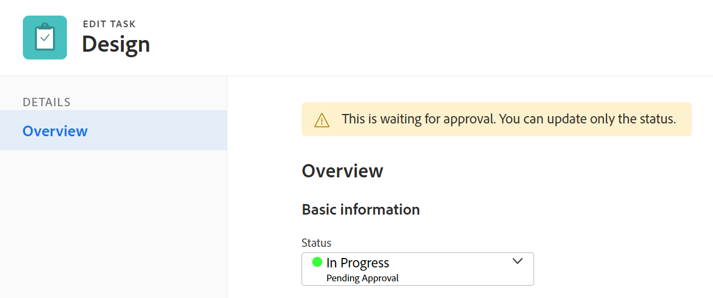
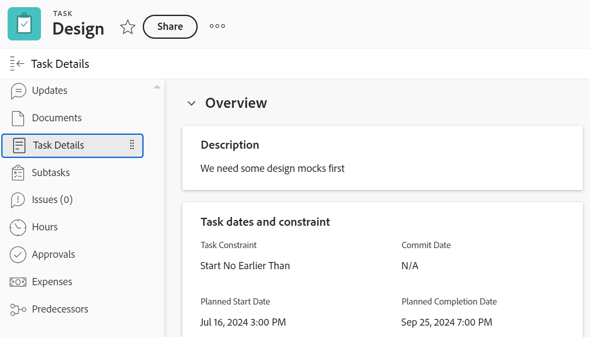
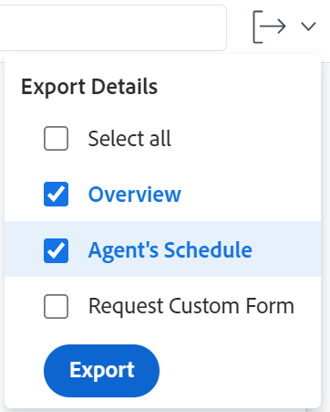
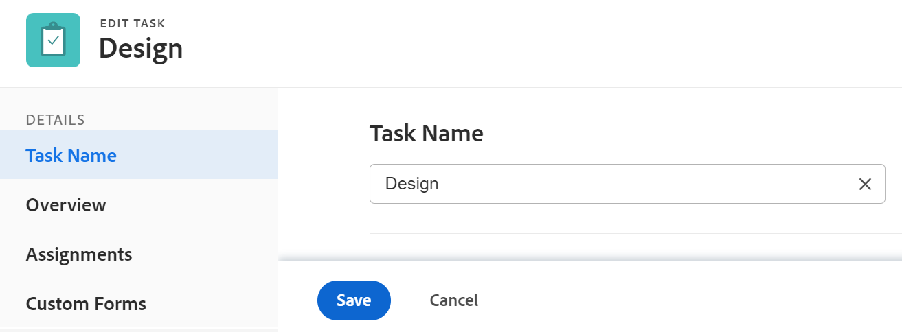
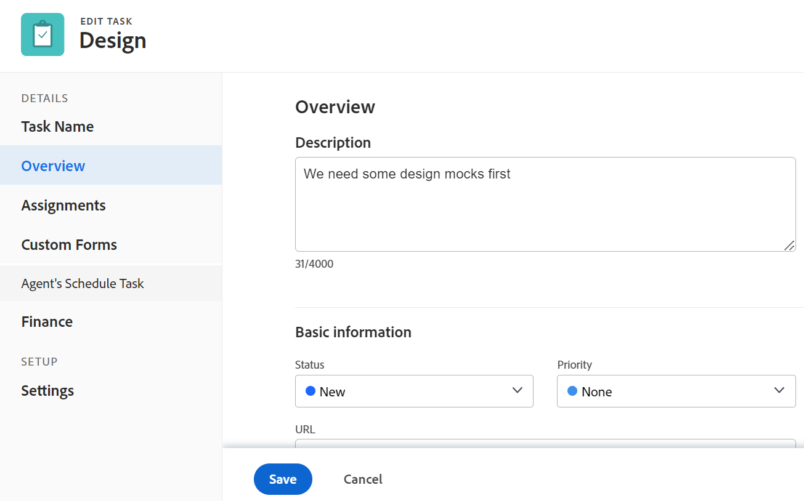
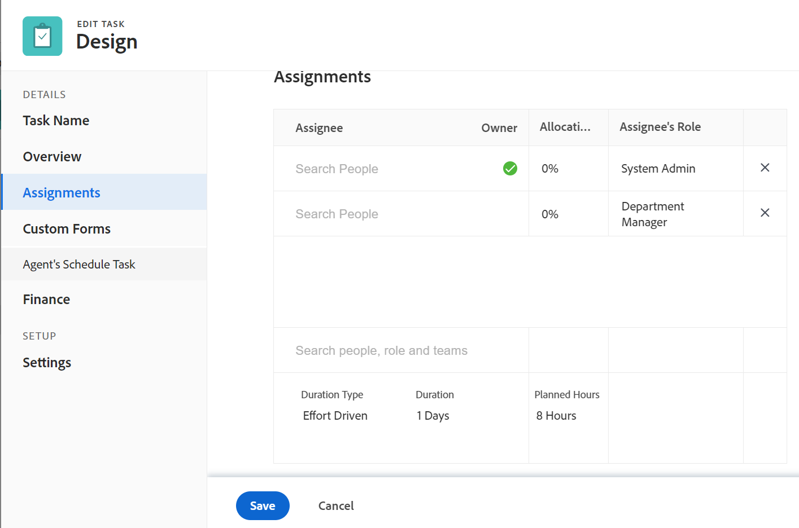
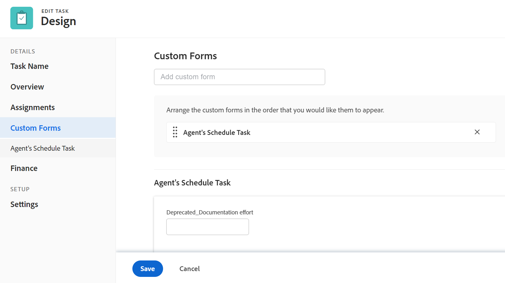
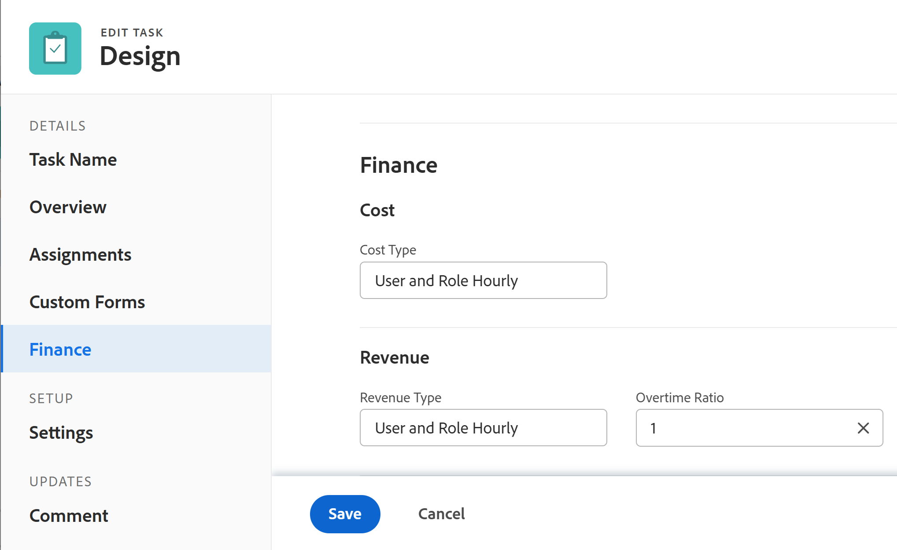
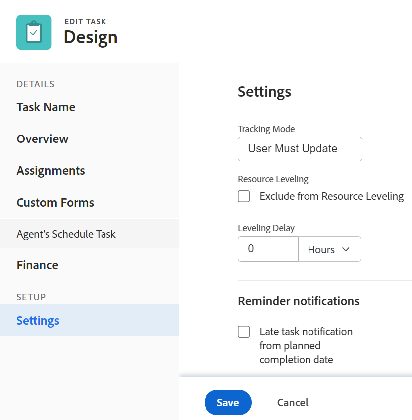
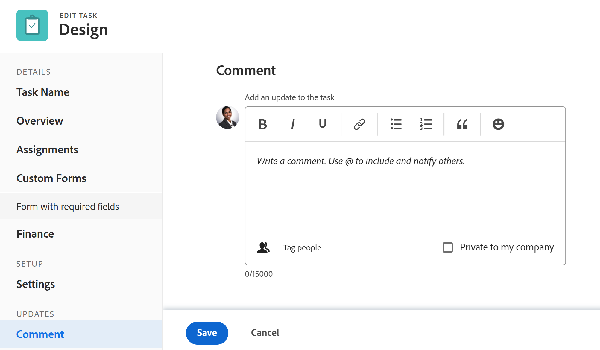

# タスクの編集

{{highlighted-preview}}

<!--Audited: 10/2025-->

<!--take out prod and preview references at release, or new and old experience-->

<!--

(NOTE: some information in this area is repeated in the following articles. If you need to update a field, update it in both:

** Task finances in details

** Task information in overview)

-->

<!--

 

The highlighted information on this page refers to functionality not yet generally available. It is available only in the Preview environment for all customers. The same features will also be available in the Production environment for all customers starting with  a week from the Preview release.      

For more information, see [Second Quarter 2026 release overview](/help/quicksilver/product-announcements/product-releases/26-q2-release-activity/26-q2-release-overview.md).

-->

自分で作成したタスクに関する情報、または Contribute または Manage 権限を持っているタスクに関する情報を編集できます。

## アクセス要件

+++ 展開すると、この記事の機能のアクセス要件が表示されます。 

<table style="table-layout:auto"> 
 <col> 
 <col> 
 <tbody> 
  <tr> 
   <td role="rowheader">Adobe Workfront パッケージ</td> 
   <td>  
ユーザーおよび役割の時間別収益タイプとコストタイプを使用し、残業率を追加するには：Workflow Ultimate

      
その他のすべての設定を編集し、その他のすべての収益タイプとコストタイプを使用するには：任意のWorkfrontまたはワークフローパッケージ
  </td> 
  </tr> 
  <tr> 
   <td role="rowheader">Adobe Workfront プラン</td> 
   <td> 
標準

   
Work またはそれ以上
 </td> 
  </tr> 
  <tr> 
   <td role="rowheader">アクセスレベル</td> 
   <td> 
タスクおよびプロジェクトへのアクセスを編集
 </td> 
  </tr> 
  <tr> 
   <td role="rowheader">オブジェクト権限</td> 
   <td> 
    <ul> 
     <li> 
タスクの詳細エリアで次の情報を編集するためのタスクへの参加権限： 

     <ul>
     <li>説明</li>
     <li>ステータス</li>
     </ul>  
      </li> 
     <li> 
詳細エリアと「タスクを編集」ボックスのすべての情報を編集するためのタスクへの管理権限：
 </li> 
    </ul> 
    <ul> 
     <li> 
プロジェクトに対する参加以上の権限
 </li> 
    </ul> </td> 
  </tr> 
 </tbody> 
</table>

* 詳しくは、[Workfront ドキュメント ](/help/quicksilver/administration-and-setup/add-users/access-levels-and-object-permissions/access-level-requirements-in-documentation.md)のアクセス要件を参照してください。

+++

<!--
Old:

<table style="table-layout:auto"> 
 <col> 
 <col> 
 <tbody> 
  <tr> 
   <td role="rowheader">Adobe Workfront plan</td> 
   <td> 
Any 
 </td> 
  </tr> 
  <tr> 
   <td role="rowheader">Adobe Workfront license*</td> 
   <td> 
Standard

   
Work or higher
 </td> 
  </tr> 
  <tr> 
   <td role="rowheader">Access level</td> 
   <td> 
Edit access to Tasks and Projects
 </td> 
  </tr> 
  <tr> 
   <td role="rowheader">Object permissions</td> 
   <td> 
    <ul> 
     <li> 
Contribute permissions to a task to edit the following information in the Task Details area: 

     <ul>
     <li>Description</li>
     <li>Status</li>
     </ul>  
      </li> 
     <li> 
Manage permissions to a task to edit all the information in the Details area and the Edit Task box
 </li> 
    </ul> 
    <ul> 
     <li> 
Contribute or higher permissions to the project
 </li> 
    </ul> </td> 
  </tr> 
 </tbody> 
</table>
-->

## タスクの編集に関する制限

タスクを編集できない場合がある制限がいくつかあります。

タスクを編集する際は、次の点に注意してください。

* 「現在」ステータスのプロジェクトのタスクトリガーの通知の更新：タスクに割り当てられたユーザーが混乱するのを避けるには、プロジェクトのステータスが「現在」の場合に編集タスクをできる限り制限します。
* 承認プロセス内のタスクは編集できません。承認プロセスでのタスクのログ時間またはステータスの更新のみが可能です。

  

* 完了、無効または承認保留中のステータスを持つプロジェクトのタスクに対するドキュメントの編集や追加は、Workfront 管理者またはグループ管理者がプロジェクト環境設定エリアでこの機能を有効にした場合にのみ行うことができます。プロジェクトの環境設定について詳しくは、[システム全体のプロジェクト環境設定の指定](../../../administration-and-setup/set-up-workfront/configure-system-defaults/set-project-preferences.md)を参照してください。

* プロジェクトが「完了」、「無効」とマークされている、または「承認プロセス中」の場合、タスクに関する次の情報をいつでも編集できます。

   * 時間のログ記録
   * 既存の費用の編集
   * カスタムフォームの添付

* 他のユーザーは、タスクに対して行った更新を表示する前に、ページを更新する必要があります。

## リスト内のタスクの編集

リストのビューに表示されるインライン編集フィールドを使用して、タスクのリスト内のタスク情報を編集できます。

リスト内のタスクの編集について詳しくは、[リスト内のタスクの編集](../../../manage-work/tasks/manage-tasks/edit-tasks-in-a-list.md)を参照してください。

## 概要を使用してリスト内のタスクを編集

概要パネルを使用して、リスト内のタスクを編集できます。概要パネルでのタスクの編集について詳しくは、[リスト内のタスクの編集](../../../manage-work/tasks/manage-tasks/edit-tasks-in-a-list.md)の「概要パネルでのタスクの編集」を参照してください。

## 「タスクを編集」ボックスでのタスクの編集

タスクの編集エリアまたはタスクの詳細エリアを使用してタスクを編集できます。次の手順では、「タスクを編集」ボックスでタスクを編集する方法を説明します。

{{step1-click-main-menu}}

1. **プロジェクト**&#x200B;をクリックし、プロジェクトの名前をクリックして開きます。
1. 左側のパネルの&#x200B;**タスク**&#x200B;をクリックします。
1. 編集するタスクをクリックします。
1. （オプション）タスクに関する限定的な情報を編集するには、左側のパネルで「**タスクの詳細**」をクリックします。

   

   タスクの詳細セクションの次のエリアにある情報を編集することを検討してください。

   * **概要**

     この領域は、デフォルトで展開されます。

   * **カスタムフォーム**

     カスタムフォームの名前は、オブジェクトにカスタムフォームがアタッチされている場合にのみ表示されます。

   * **財務**

   >[!NOTE]
   >
   >Workfront 管理者またはグループ管理者がレイアウトテンプレートを変更した方法に応じて、タスクの詳細エリアのフィールドが並べ替えられたり、表示されなかったりする場合があります。詳しくは、[レイアウトテンプレートを使用して詳細ビューをカスタマイズ](../../../administration-and-setup/customize-workfront/use-layout-templates/customize-details-view-layout-template.md)を参照してください。

   タスクの詳細セクションに表示されるフィールドの詳細については、次に説明するように、「タスクの編集」ボックスでタスクを編集します。

   「詳細」セクションの情報を編集するには、次の手順を実行します。

   1. （オプション）右上隅の&#x200B;**すべて折りたたむ** アイコン をクリックして、すべての領域を折りたたみます。
   1. （オプションおよび条件付き）領域が折りたたまれたら、各領域の横にある&#x200B;**右向き矢印** をクリックして、編集する領域を展開します。
   1. 「タスクの詳細」タブでの情報の編集について詳しくは、次の記事を参照してください。

      * [「タスク詳細概要」領域でのタスク情報の管理](../../../manage-work/tasks/manage-tasks/task-information-in-overview.md)
      * [タスクの詳細セクションでのタスクの財政の管理](../../../manage-work/tasks/manage-tasks/task-finances-in-details.md)

   1. （オプション）タスクにカスタムフォームが添付されていない場合は、「**カスタムフォームの追加**」フィールドに値を入力を開始し、リストに表示されたらフォームを選択して、「**変更を保存**」をクリックします。
   1. （オプション）「**書き出し**」アイコン「」をクリックして、概要およびカスタムフォーム情報をPDF ファイルに書き出してから、「**書き出し**」をクリックします。 次の中から選択します。

      * すべてを選択（1 つ以上のカスタムフォームが添付されている場合にのみ表示）
      * 概要
      * 1 つまたは複数のカスタムフォームの名前

      PDF ファイルがお使いのコンピューターにダウンロードされます。

      

      詳しくは、[カスタムフォームとオブジェクトの詳細の書き出し](../../../workfront-basics/work-with-custom-forms/export-custom-forms-details.md)を参照してください。

1. （条件付き）タスクに関するすべての情報を編集するには、タスクに対する管理権限を持つユーザーとして、タスクの名前の横にある&#x200B;**詳細** メニューをクリックし、**編集**&#x200B;をクリックします。

   または

   タスクのリストからタスクを選択し、リストの上部にある&#x200B;**編集** アイコン をクリックします。

   タスクを編集ボックスが開きます。

   >[!IMPORTANT]
   >
   >「編集」オプションを表示するには、タスクの管理権限が必要です。

   すべてのタスクフィールドが、タスクを編集ボックスで使用でき、左側のパネルに表示されるエリアでグループ化されます。

   >[!NOTE]
   >
   >Workfront 管理者またはグループ管理者がレイアウトテンプレートを変更した方法に応じて、タスクの詳細エリアのフィールドが並べ替えられたり、表示されなかったりする場合があります。詳しくは、[レイアウトテンプレートを使用して詳細ビューをカスタマイズ](../../../administration-and-setup/customize-workfront/use-layout-templates/customize-details-view-layout-template.md)を参照してください。

   次のセクションのいずれかに情報を指定することを検討してください。

   * [タスク名](#task-name)
   * [概要](#overview)
   * [割り当て](#assignments)
   * [カスタムフォーム](#Custom%C2%A0F)
   * [財務](#finance)
   * [設定](#settings)
   * [コメント](#comment)

   >[!NOTE]
   >
   >Workfront管理者またはグループ管理者がレイアウトテンプレートを設定する方法によっては、「タスクを編集」ボックスのフィールドが再配置されたり、表示されないことがあります。 詳しくは、[レイアウトテンプレートを使用して詳細ビューをカスタマイズ](../../../administration-and-setup/customize-workfront/use-layout-templates/customize-details-view-layout-template.md)を参照してください。

### タスク名 {#task-name}

1. 上記の説明に従って、タスクの編集を開始します。
1. 左側のパネルで&#x200B;**タスク名**&#x200B;をクリックします。

   タスクを編集ボックスの

1. タスクの名前をアップデートします。

1. 「**保存**」をクリックするか、以降のセクションの編集を続けます。

### 概要 {#overview}

1. 上記の説明に従って、タスクの編集を開始します。
1. 左側のパネルで「**承認**」をクリックします。

   

1. タスクに関する以下の情報をアップデートします。

   <table style="table-layout:auto"> 
    <col> 
    <col> 
    <tbody> 
     <tr> 
      <td role="rowheader">説明</td> 
      <td>タスクに関する追加情報を追加します。 </td> 
     </tr> 
     <tr> 
      <td colspan="2" role="rowheader">「基本情報」セクション </td> 
     </tr> 
     <tr> 
      <td role="rowheader">ステータス</td> 
      <td> 
タスクがどの開発段階にあるのかを示すタスクのステータスを選択します。
 
<b>ヒント</b>

   タスクのステータスを、タスクのヘッダーでアップデートできます。 

   
Workfrontまたはグループ管理者は、タスクステータスの名前をカスタマイズできます。 詳しくは、<a href="/help/quicksilver/administration-and-setup/customize-workfront/creating-custom-status-and-priority-labels/create-or-edit-a-status.md"> ステータスの作成または編集</a>を参照してください。 
      </td> 
     </tr> 
     <tr> 
      <td role="rowheader">優先度</td> 
      <td> 
タスクの優先順位を視覚的に示すフラグです。 
 
次のオプションから選択します。 
 
       <ul> 
      <li> 
 なし
 </li> 
      <li> 
 低 
 </li> 
      <li> 
標準 
 </li> 
      <li> 
高 
 </li> 
      <li> 
 緊急 
 </li> 
       </ul> 
Workfront 管理者が選択したプロジェクト設定に応じて、優先順位の名前が異なる場合があります。タスクの優先度については、<a href="../../../manage-work/tasks/task-information/task-priority.md" class="MCXref xref">タスクの優先度の更新</a>.を参照してください。 
 </td> 
     </tr> 
     <tr> 
      <td colspan="2" role="rowheader"> タスクの日付と制約の節 </td> 
     </tr> 
     <tr> 
      <td role="rowheader">タスクの制約</td> 
      <td> 
タスクをいつ完了する必要があるかを、タスクの制約を指定して決定します。 
 
次のオプションから選択します。 
 
       <ul> 
      <li> 
固定日付 
 
<strong>予定開始日</strong>と<strong>予定完了日</strong>を指定します。 
 </li> 
      <li> 
指定日に開始 
 
<strong>予定開始日</strong>を指定します。 
 </li> 
      <li> 
指定日に終了 
 
<strong>予定完了日</strong>を指定します。 
 </li> 
       </ul> 
       <ul> 
      <li> 
できるだけ早く
 </li> 
      <li> 
できるだけ遅く
 </li> 
      <li> 
最も早い空き時間
 </li> 
      <li> 
 最も遅い空き時間
 </li> 
      <li> 
指定日までに開始 
 </li> 
      <li> 
予定開始日を指定します。
 </li> 
      <li> 
指定日以後に開始 
 
<strong>予定開始日</strong>を指定します。 
 </li> 
      <li> 
 これよりも遅く終了しない
 
<strong>予定完了日</strong>を指定します。 
 </li> 
      <li> 
 これよりも早く終了しない
 
<strong>予定完了日</strong>を指定します。
 </li> 
       </ul> 
タスクの制約について詳しくは、<a href="../../../manage-work/tasks/task-constraints/task-constraint-overview.md" class="MCXref xref">タスクの制約の概要</a>を参照してください。
 </td> 
     </tr> 
     <tr> 
      <td role="rowheader">コミット日時</td> 
      <td> 
これは、タスクに割り当てられたユーザーがそのタスクの完了期限として約束する日付です。これは、予定完了日とは異なる場合があります。 担当者のみがこのフィールドを編集できます。Workfront でのコミット日について詳しくは、<a href="../../../manage-work/projects/updating-work-in-a-project/overview-of-commit-dates.md" class="MCXref xref">コミット日の概要</a>を参照してください。 
 </td> 
     </tr> 
     <tr> 
      <td role="rowheader">予定開始日時</td> 
      <td> 
タスクの開始がいつに予定されているか。タスクの予定開始日が設定され、次のような様々な要因の影響を受けます。
 
       <ul> 
      <li>タスクの開始予定日に関するシステム全体の環境設定に応じて、プロジェクトの新規タスクの開始日は、デフォルトで本日またはプロジェクトの開始日になります。プロジェクトに関連付けられたグループのグループ管理者も、グループに対してこの環境設定を行うことができます。システムレベルまたはグループレベルのタスク環境設定について詳しくは、<a href="../../../administration-and-setup/set-up-workfront/configure-system-defaults/set-task-issue-preferences.md" class="MCXref xref">システム全体のタスクとイシューの環境設定の指定</a>を参照してください。</li> 
      <li>タスクの先行タスクに応じて、予定開始日は、先行タスクの終了後（または先行タスク関係によっては開始後）の次の設定可能な日付として Workfront によって選択されます。先行タスク関係について詳しくは、<a href="../../../manage-work/tasks/use-prdcssrs/predecessors-overview.md" class="MCXref xref">タスク先行タスクの概要</a>を参照してください。</li> 
      <li>タスクの制約が「固定日付」または「指定日に開始」のいずれかである場合、プロジェクトマネージャーまたはタスク責任者は、予定開始日を手動で設定できます。タスクの制約について詳しくは、<a href="../../../manage-work/tasks/task-constraints/task-constraint-overview.md" class="MCXref xref">タスクの制約の概要</a>を参照してください。</li> 
       </ul> </td> 
     </tr> 
     <tr> 
      <td role="rowheader">予定完了日時</td> 
      <td> 
タスクの計画時に予想される完了日。Workfrontでは、次の要素を使用して予定完了日を設定します。
 
       <ul> 
      <li>予定完了日は、予定開始日にタスクの期間を加算することによって、予定開始日から計算されます。プロジェクトマネージャーまたは Workfront 管理者がタスクの期間を指定すると、予定完了日の更新がトリガーされます。予定日が変更された場合、タスクの期間が更新されたことが原因であることが多くあります。</li> 
      <li>タスクの制約が「固定日付」か「指定日に終了」のいずれかである場合、プロジェクトマネージャーまたはタスク責任者は、予定完了日を手動で設定できます。タスクの制約について詳しくは、<a href="../../../manage-work/tasks/task-constraints/task-constraint-overview.md" class="MCXref xref">タスク制約の概要</a>を参照してください。</li> 
      <li>タスクの期間タイプが変更され、同時にタスクのリソース数が変更されると、予定完了日も変更されます。期間のタイプについて詳しくは、<a href="../../../manage-work/tasks/taskdurtn/task-duration-and-duration-type.md" class="MCXref xref">タスクの期間と期間のタイプの概要</a>を参照してください。</li> 
       </ul> </td> 
     </tr> 
     <tr> 
      <td role="rowheader">実際の開始日時</td> 
      <td> 
タスクの実際の開始日を指定します。通常、タスクのステータスを「進行中」に変更すると、デフォルトは自動的に入力されます。 実際の開始日は、プロジェクトマネージャーまたはタスク責任者が手動で変更することもできます。 
 </td> 
     </tr> 
     <tr> 
      <td role="rowheader">実際の完了日時</td> 
      <td> 
タスクが完了する実際の日時を指定します。タスクが完了するデフォルトの日付と時刻は、ステータスが「完了」になる実際の日時と常に一致します。実際の完了日は、プロジェクトマネージャーまたはタスク責任者が手動で変更することもできます。 
 </td> 
     </tr> 
     <tr> 
      <td role="rowheader"><b>「作業時間」セクション</b></td> 
     </tr> 
     <tr> 
      <td role="rowheader">作業量 </td> 
      <td>

   
タスクの完了に必要な工数。プロジェクトマネージャーは、タスクの完了に必要な作業量を見積もる際に、予定時間数の代わりにこのフィールドを使用することにします。このフィールドは、次の条件を満たした場合にのみ表示されます。
 
      <ul> 
      <li> 
タスクにはシンプルな期間タイプがあります。 
 
<b>ヒント</b>

   タスク期間タイプを変更すると、このフィールドはグレー表示になります。 
 </li>
   <li>プロジェクトマネージャーが、プロジェクトの「作業量を使うとタスクの予定時間数を自動的に計算できます」フィールドを有効にしてある。 </li> 
      </ul> 
      
次のオプションから選択します。
 
      <ul> 
      <li>小</li> 
      <li>中（新しいタスクのデフォルト値）</li> 
      <li>大</li> 
      </ul> 
      
<b>メモ</b>

   工数を更新すると、タスクの予定時間数が更新される可能性があります。プロジェクトの更新タイプが「自動」の場合、更新は即時に行われます。プロジェクト更新タイプが「手動」の場合、更新された予定時間数を確認するには、タイムラインを再計算する必要があります。 

   
予定時間数ではなく作業量を使用してタスク量を見積もる方法について詳しくは、<a href="../../../manage-work/tasks/task-information/work-effort.md" class="MCXref xref">作業量の概要</a>を参照してください。 
 
    </td> 
     </tr> 
    </tbody> 
   </table>

1. 「**保存**」をクリックするか、次の節に進みます。

### 割り当て {#assignments}

>[!TIP]
>
>タスクの割り当てを一括編集すると、選択したタスク間で値が異なるフィールドに対して、複数の値インジケーターが表示されます。
>
>選択した各タスクの個々の割り当てを表示することはできません。

1. 上記の説明に従って、タスクの編集を開始します。
1. 左側のパネルで「**割り当て**」をクリックします。

   タスクを編集ボックスの

1. **ユーザー、役割、またはチームを検索**&#x200B;をクリックし、タスクに割り当てるユーザー、役割、またはチームの名前を入力し始めます。その後、そのタスクをクリックするか、リストに表示されたらEnter キーを押します。

   >[!TIP]
   >
   >* ユーザーの名前に特殊文字が含まれている場合は、その特殊文字を検索フィールドに含める必要があります。
   >* 複数のユーザー、担当業務やチームを割り当てることができます。アクティブなユーザー、担当業務およびチームのみを割り当てることができます。
   >
   >* 非アクティブ化前にユーザー、担当業務やチームが、非アクティブ化される前に割り当てられた場合、ユーザー、担当業務やチームは作業アイテムに割り当てられたままになります。この場合、以下の操作をお勧めします。
   >
   >* 作業アイテムをアクティブなリソースに再割り当てする。
   >* 非アクティブ化されたチームのユーザーをアクティブなチームに関連付け、作業アイテムをアクティブなチームに再割り当てする。

1. （オプション）担当者の名前にカーソルを合わせ、**プライマリを作成**&#x200B;をクリックして、担当者が主要な担当者であるか、タスクのオーナーであるかを示します。 チームをタスクのプライマリ担当者にすることはできません。
1. （オプション）次のフィールドを更新します。

   <table style="table-layout:auto"> 
    <col> 
    <col> 
    <tbody> 
     <tr> 
      <td role="rowheader">期間タイプ</td> 
      <td> 
これにより、以下の項目間の関係が明らかになります。 
 
       <ul> 
      <li> 
タスクに割り当てられたリソースの数 
 </li> 
      <li> 
タスクの完了に必要な合計作業量 
 </li> 
      <li> 
 タスクの合計期間。 
 </li> 
       </ul> 
Workfront管理者またはグループ管理者は、システムまたはグループ内のタスクのデフォルトの期間タイプ設定を選択します。 プロジェクトのデフォルト設定について詳しくは、<a href="../../../administration-and-setup/set-up-workfront/configure-system-defaults/set-task-issue-preferences.md" class="MCXref xref"> システム全体のタスクとイシューの環境設定の設定</a>を参照してください。 
 
期間タイプを使用すると、タスクのニーズに基づいて一貫したリソース割り当てを設定できます。タスクの期間タイプについて詳しくは、<a href="../../../manage-work/tasks/taskdurtn/task-duration-and-duration-type.md" class="MCXref xref">タスク継続期間と期間タイプの概要</a>を参照してください。 
 
次のオプションから選択します。 
 
       <ul> 
      <li> 
予定割り当て時間 
 </li> 
      <li> 
 予定作業 
 </li> 
      <li> 
残存作業時間の優先 
 </li> 
      <li> 
シンプル
 </li> 
       </ul> </td> 
     </tr> 
     <tr data-mc-conditions="QuicksilverOrClassic.Quicksilver"> 
      <td role="rowheader">発生ごとの所要時間</td> 
      <td> 
これは、定期タスクの親にのみ表示されます。タスクが作成された時点で定義された、各定期タスクの期間が表示されます。定期タスクの作成について詳しくは、<a href="../../../manage-work/tasks/create-tasks/create-recurring-tasks.md" class="MCXref xref">定期タスクの作成</a>を参照してください。 
 
 <b>メモ</b>

   個々の定期タスクで変更された期間には、このフィールドに示された値は表示されません。 
 </td>
   </tr> 
     <tr> 
      <td role="rowheader">期間</td> 
      <td> 
      
 
      
 
      
タスクが完了するまでタスクを開いたままにしておくことができる時間です。 
 
      
<b>重要</b>

   タスク期間は通常、予定開始日から予定完了日までの時間で、プロジェクトのタイムラインに影響します。

   
タスクの期間と時間の単位を指定するには、以下を行います。
 
      <ul> 
      <li> 
時間の長さを入力し、ドロップダウンメニューに表示される時間の単位から選択します。
 
<b>ヒント</b>

      タスクリストのタスクの期間を更新する際は、時間の単位の省略形を使用できます。 
 </li> 
      </ul> 
      
 次の表にある通常時間または経過時間のオプションから選択できます。 
 
      <table style="table-layout:auto"> 
      <col> 
      <col data-mc-conditions=""> 
      <tbody> 
      <tr> 
      <td>時間の単位</td> 
      <td>省略形</td> 
      </tr> 
      <tr> 
      <td>分</td> 
      <td>M</td> 
      </tr> 
      <tr> 
      <td>時間</td> 
      <td>H</td> 
      </tr> 
      <tr> 
      <td>日数： これがデフォルトです。 </td> 
      <td>D</td> 
      </tr> 
      <tr> 
      <td>週</td> 
      <td>W</td> 
      </tr> 
      <tr> 
      <td>か月</td> 
      <td>T</td> 
      </tr> 
      <tr> 
      <td>経過時間数 (分)</td> 
      <td>EM</td> 
      </tr> 
      <tr> 
      <td>経過時間数</td> 
      <td>EH</td> 
      </tr> 
      <tr> 
      <td>経過日数</td> 
      <td>ED</td> 
      </tr> 
      <tr> 
      <td>経過週数</td> 
      <td>EW</td> 
      </tr> 
      <tr> 
      <td>経過月数</td> 
      <td>ET</td> 
      </tr> 
      </tbody> 
   </table>

   
<b>メモ</b>

   
経過時間は、タスクの期間の時間単位です。タスクの予定開始日から予定完了日までの時間で、休日、週末および休暇を含みます。つまり、経過時間はカレンダーの日数の経過です。

   通常の時間は、休日、週末および休暇を考慮し、これらをタスクの期間から除外します。タスクの期間について詳しくは、<a href="../../../manage-work/tasks/taskdurtn/task-duration-and-duration-type.md" class="MCXref xref">タスクの期間と期間のタイプの概要</a>を参照してください。 

   
 
      
 </td> 
      </tr> 
      <tr> 
      <td role="rowheader">予定時間数</td> 
      <td> 
タスクの予定時間数を時間単位で指定します。 これは、タスクの担当者が完了するのにかかる実際の時間です。 期間タイプが「計算済み割り当て」に設定されている場合にのみ、タスクの予定時間数を指定できます。 期間のタイプについて詳しくは、<a href="../../../manage-work/tasks/taskdurtn/task-duration-and-duration-type.md" class="MCXref xref">タスクの期間と期間のタイプの概要</a>を参照してください。
 
      <b>メモ</b>
      

      繰り返しタスクを作成する場合、予定時間数はそれぞれの繰り返しタスクの時間です。親タスクの予定時間数は、すべてのタスクからのすべての予定時間数の合計です。繰り返しタスクの作成について詳しくは、<a href="../../../manage-work/tasks/create-tasks/create-recurring-tasks.md" class="MCXref xref">繰り返しタスクを作成</a>を参照してください。
      

   </td> 
      </tr> 
      <tr> 
      <td role="rowheader">配分</td> 
      <td> 
タスクの制約事項が「予定作業」または「残存作業時間の優先」である場合は、それぞれの担当者の<strong>配分 ％</strong>（配分率）を指定します。これは、担当者がスケジュールからこのタスクに費やすことができる時間です。担当者の配分率を変更すると、タスクの予定時間数が変更されます。 
 
タスクの制約事項が「シンプル」の場合は、以下の項目を指定することができます。
 
         <ul> 
         <li> 
それぞれの担当者の時間配分数。
 </li> 
         <li> 
タスクの予定時間数
 </li> 
         <li> 
タスクの期間
 </li> 
         </ul> </td> 
      </tr> 
      <tr> 
      <td role="rowheader">割り当て先の役割</td> 
      <td> 
個人を担当者として選択した場合は、「<strong>担当者の役割</strong>」ドロップダウンメニューから役割を選択します。これは、担当者がこのタスクで果たすことができる役割です。 
 
<b>ヒント</b>

   プロファイル内で各担当者に関連付けられている担当業務のみがドロップダウンメニューに表示されます。
 </td>
   </tr>
   </tbody>
   </table>

1. 「**保存**」をクリックするか、以降のセクションの編集を続けます。

### カスタムフォーム

タスクがプロジェクトに追加されるときに、タスクに自動的に添付されるデフォルトのカスタムフォームを定義できます。すべての新規タスクにデフォルトのタスクカスタムフォームを含めるようにプロジェクトを設定する方法について詳しくは、[プロジェクトを編集](../../../manage-work/projects/manage-projects/edit-projects.md)の記事にある「タスク」の節を参照してください。

1. 上記の説明に従ってタスクの編集を開始します。
1. 左側のパネルで&#x200B;**カスタムフォーム**&#x200B;をクリックするか、カスタムフォームが既に添付されている場合には、その名前をクリックします。

   

1. 「**カスタムフォームを追加**」をクリックし、タスクに関連付けるカスタムフォームまたはフォームを選択します。このフィールドでカスタムフォームを選択できるようにするには、まずカスタムフォームを作成する必要があります。アクティブなカスタムフォームのみがリストに表示されます。

   カスタムフォームの作成について詳しくは、[ カスタムフォームの作成](/help/quicksilver/administration-and-setup/customize-workfront/create-manage-custom-forms/form-designer/design-a-form/design-a-form.md)を参照してください。最大10個のカスタムフォームをタスクに追加できます

1. （条件付き）カスタムフォームをタスクに添付した場合は、フォーム上の任意のフィールドを編集します。タスクを保存する前に、すべての必須フィールドを指定する必要があります。

   >[!NOTE]
   >
   >Workfront 管理者がカスタムフォーム内のセクションに権限を設定する方法によっては、特定のカスタムフォーム上の同じフィールドを誰もが表示または編集できるわけではありません。カスタムフォームのセクション内のフィールドを編集する権限は、タスク自体に対する権限によって異なります。タスク権限の設定については、[タスクの共有](../../../workfront-basics/grant-and-request-access-to-objects/share-a-task.md)を参照してください。

1. 「**保存**」をクリックするか、以降のセクションの編集を続けます。

### 財務 {#finance}

1. [タスクを編集](#Edit2)の節の説明に従って、タスクの編集を開始します。
1. 左側のパネルで「**財務**」をクリックします。

   

1. 次のフィールドを更新します。

   <table style="table-layout:auto"> 
    <col> 
    <col> 
    <tbody> 
     <tr> 
      <td role="rowheader">コストタイプ</td> 
      <td> 
タスクのコストタイプを指定します。これにより、タスクの時間数に基づいて、タスクのコストの計算方法が決まります。 
 
次のオプションから選択します。 
 
       <ul> 
        <li> 
コストなし
 </li> 
        <li> 
固定 (毎時) 
 </li> 
        <li> 
 ユーザー (毎時) 
 </li> 
        <li> 
 役割（毎時）
 </li> 
        <li> 
  ユーザーと役割（時間単位） 
 </li> 
       </ul> 
コストの追跡について詳しくは、<a href="../../../manage-work/projects/project-finances/track-costs.md" class="MCXref xref">コストの追跡</a>を参照してください。システムまたはグループのタスクに対するデフォルトのコストタイプ設定は、Workfront 管理者またはグループ管理者が選択します。プロジェクトのデフォルトの設定については、<a href="../../../administration-and-setup/set-up-workfront/configure-system-defaults/set-project-preferences.md" class="MCXref xref">システム全体のプロジェクトの環境設定の指定</a>を参照してください。
 </td> 
     </tr> 
     <tr> 
      <td role="rowheader">収益タイプ</td> 
      <td> 
タスクの収益タイプを指定します。これにより、タスクの時間数に基づいて、タスクの収益の計算方法が決まります。 
 
次のオプションから選択します。 
 
       <ul> 
      <li> 
 請求不可 
 </li> 
      <li> 
ユーザー (毎時) 
 </li> 
      <li> 
役割（毎時） 
 </li> 
      <li> 
  ユーザーと役割（時間単位） 
 </li> 
      <li> 
固定 (毎時) 
 </li> 
      <li> 
ユーザー (毎時) (キャップ付き) 
 </li> 
      <li> 
役割（毎時）（キャップ付き） 
 </li> 
      <li> 
  キャップ付きのユーザーと役割（時間単位） 
 </li> 
      <li> 
ユーザー（毎時）+ 固定 
 </li> 
      <li> 
役割（毎時）+ 固定 
 </li> 
      <li> 
  ユーザーと役割の時間単位プラス固定
 </li> 
      <li> 
固定収益 
 </li> 
       </ul> 
収益のトラッキングについて詳しくは、<a href="../../../manage-work/projects/project-finances/billing-and-revenue-overview.md" class="MCXref xref">請求と収益の概要</a>および<a href="/help/quicksilver/manage-work/projects/project-finances/overview-revenue-cost-hierarchy.md">収益とコスト階層の概要</a>を参照してください。 
 
システムまたはグループのタスクに対する収益タイプのデフォルト設定は、Workfront 管理者またはグループ管理者が選択します。プロジェクトのデフォルトの設定については、<a href="../../../administration-and-setup/set-up-workfront/configure-system-defaults/set-project-preferences.md" class="MCXref xref">システム全体のプロジェクトの環境設定の指定</a>を参照してください。
 </td> 
     </tr> 
     <tr>
      <td>時間外労働率</td> 
      <td>
タスクの残業乗数（1.5または2.0など）を入力します。デフォルトは1.0 （乗数なし）です。 詳しくは、<a href="/help/quicksilver/manage-work/projects/project-finances/define-overtime-ratio.md">残業率の定義</a>を参照してください。

「残業率」フィールドを表示するには、次の手順を実行します。

       <ul>
       <li>タスクの収益タイプは、ユーザーと役割の時間単位である必要があります。 詳しくは、<a href="/help/quicksilver/manage-work/projects/project-finances/overview-revenue-cost-hierarchy.md">収益とコスト階層の概要</a>を参照してください。</li>
       <li>このフィールドは、レイアウトテンプレートで、タスクの詳細ビューの「財務」領域で有効にする必要があります。 詳しくは、<a href="/help/quicksilver/administration-and-setup/customize-workfront/use-layout-templates/customize-details-view-layout-template.md"> レイアウトテンプレートを使用した詳細ビューのカスタマイズ </a>を参照してください。</li>
       </ul>
      </td>
     </tr>
    </tbody> 
   </table>

1. 「**保存**」をクリックするか、以降のセクションの編集を続けます。

### 設定 {#settings}

1. [タスクを編集](#Edit2)の節の説明に従って、タスクの編集を開始します。
1. 左側のパネルで「**設定**」をクリックします。

   タスクを編集ボックスの

1. 次のフィールドを更新します。

   <table style="table-layout:auto"> 
    <col> 
    <col> 
    <tbody> 
     <tr> 
      <td role="rowheader">トラッキングモード</td> 
      <td> 
タスクの進捗ステータスの追跡方法を指定します。 
 
次のオプションから選択します。 
 
       <ul> 
      <li> 
 ユーザーが更新する必要あり 
 </li> 
      <li> 
予定通りを想定 
 </li> 
      <li> 
遅延警告を無視
 </li> 
      <li> 
 オートコンプリート 
 </li> 
      <li> 
先行タスク 
 </li> 
       </ul> 
タスクのトラッキングモードについて詳しくは、<a href="../../../manage-work/tasks/task-information/task-tracking-mode.md" class="MCXref xref">タスクトラッキングモードの概要</a>を参照してください。
 </td> 
     </tr> 
     <tr> 
      <td role="rowheader">リソースの標準化</td> 
      <td> 
タスクに割り当てられたリソースを標準化から除外する場合は、「<strong>リソースの標準化から除外</strong>」フィールドを選択します。
 </td> 
     </tr> 
     <tr> 
      <td role="rowheader">標準化の遅延</td> 
      <td> 
レベリング遅延を時間単位で指定します。 
 
 平準化の遅延について詳しくは、<a href="../../../manage-work/tasks/task-information/task-leveling-delay.md" class="MCXref xref">タスクの平準化の遅延をアップデート</a>を参照してください。 
 </td> 
     </tr> 
     <tr> 
      <td role="rowheader">承認プロセス</td> 
      <td> 
タスクに関連付ける承認プロセスを選択します。システムレベルの承認プロセスをタスクに関連付けるには、Workfront 管理者がこのプロセスを事前に定義しておく必要があります。承認プロセスへの管理者アクセス権を持つユーザーは、グループ固有の承認プロセスを作成することもできます。 
 
承認プロセスの作成について詳しくは、<a href="../../../administration-and-setup/customize-workfront/configure-approval-milestone-processes/create-approval-processes.md">作業アイテムの承認プロセスの作成</a>を参照してください。承認プロセスを追加する際は、次の点を考慮してください。 
 
       <ul>

   <li> 
アクティブな承認プロセスのみがリストに表示されます。 
 </li>

   <li> 
システム全体およびグループ固有の承認プロセスがリストに表示されます。プロジェクトの承認プロセス以外のグループに関連付けられている承認プロセスは、リストに表示されません。 

   
<b>重要</b>

   プロジェクトのグループが変更されると、以前付随していたグループ固有の承認プロセスが、単一使用承認プロセスになります。プロジェクトのグループに対する変更や承認プロセスの変更が承認設定に及ぼす影響について詳しくは、<a href="../../../administration-and-setup/customize-workfront/configure-approval-milestone-processes/how-changes-affect-group-approvals.md">グループと承認プロセスの変更が割り当てられた承認プロセスに及ぼす影響</a>を参照してください。 

   </li>

   <li> 
タスクがプロジェクトに追加されるときに、タスクに自動的に添付されるデフォルトの承認プロセスを定義できます。デフォルトのタスク承認プロセスを含めるようにプロジェクトを設定する方法については、<a href="../../../manage-work/projects/manage-projects/edit-projects.md" class="MCXref xref">プロジェクトの編集</a>の記事で「タスク」の節を参照してください。 
 </li>

   <li> 
タスクを一括編集する場合は、次のシナリオが存在します。 
 
      <ul> 
      <li> 
同じグループから複数のタスクを選択すると、システムレベルとグループレベルの承認プロセスの両方がこのフィールドに表示されます。 
 </li> 
      <li> 
異なるグループから複数のタスクを選択すると、このフィールドにはシステムレベルの承認プロセスのみが表示されます。 
 </li> 
      <li> 
タスクに 1 回限りの承認プロセスが添付されている場合、選択したシステムレベルまたはグループレベルの承認プロセスに置き換えられます。 
 </li>

   </ul> </li> 
      </ul> </td> 
     </tr> 
    </tbody> 
   </table>
    </li>

1. 「**保存**」をクリックするか、以降のセクションの編集を続けます。

<!--notes from the table: 
(NOTE: this bullet stays here although the sections it might appear in are QS only, so we can use the snippet for both Qs and classic)
       -->

### コメント

1. [タスクを編集](#Edit2)の節の説明に従って、タスクの編集を開始します。
1. 左側のパネルで「**コメント**」をクリックします。

   

1. 提供されたスペースにアップデートを追加します。
1. （オプション）次のいずれかをアップデートに追加します。

   * ユーザーまたはチームを&#x200B;**人物をタグ付け** エリアで更新に追加するか、@を使用して更新に含めます。
   * 「**会社に対して非公開**」チェックボックスを選択して、更新を会社内のユーザーに対して非公開に保ちます。

   >[!TIP]
   >
   >会社に対する&#x200B;**非公開**&#x200B;設定は、Workfront プロファイルが会社に関連付けられている場合にのみ使用できます。

1. 「**保存**」をクリックします。

## タスクヘッダーでのタスクの編集（制限あり）

タスクヘッダーでは、わずかですが情報を編集できます。

システム管理者またはグループ管理者は、タスクヘッダーに表示されるフィールドをカスタマイズできます。詳しくは、[レイアウトテンプレートを使用したオブジェクトヘッダーのカスタマイズ](../../../administration-and-setup/customize-workfront/use-layout-templates/customize-object-headers.md)を参照してください。

デフォルトでは、次のフィールドがタスクヘッダーに含まれます。

* タスク名
* 完了率

  詳しくは、[ タスクの完了率の表示と更新](/help/quicksilver/manage-work/projects/updating-work-in-a-project/view-update-percent-complete-for-tasks.md)を参照してください。
* 割り当て
* 予定完了日

  >[!CAUTION]
  >
  >タスクの制約やその他の依存関係により、タスクの予定完了日を編集できない場合があります。 タスクの制約については、[タスクの制約の概要](../../../manage-work/tasks/task-constraints/task-constraint-overview.md)を参照してください。

* ステータス
* 現在の承認プロセスで承認者として設定されている場合、承認の決定を行う

## タスクを一括編集

リスト内のタスクに加えた変更を自動的に保存する場合は、リスト内のタスクを一括で編集し、そのすべての情報を同時に更新できます。

タスクを一括保存する方法について詳しくは、[ リスト内のタスクを編集](../../../manage-work/tasks/manage-tasks/edit-tasks-in-a-list.md)の記事の「タスクを一括編集」の節を参照してください。

<!--
Temporary content while changing Assignments area: 

Editing assignments is different in the Edit Task box depending on which environment you choose.

#### Edit the Assignments area in the Production environment

>[!NOTE]
>
>Some customers can edit Assignments in the Edit Task box in their Production environments the same way they edit them in their Preview environment.
>
>For information about editing tasks in the Preview environment, see the section [Edit the Assignments area in the Preview environment](#edit-the-assignments-area-in-the-preview-environment) in this article. 

1. Begin editing your task as described above.
1. Click **Assignments** in the left panel.

      The Assignments area opens in the new experience. 

1. (Conditional) Using the new experience, do the following:
 
   1. Start typing the name of a user, job role, or team in the **Search people, role or team** field, then select them when they display in the list

      Or

      Click **Assign to me** to assign the task to yourself. 

   1. Update the following information:

         <table style="table-layout:auto"> 
         <col> 
         <col> 
         <tbody> 
         <tr> 
         <td role="rowheader">Duration Type</td> 
         <td> 
This identifies the relationship between the following: 
 
         <ul> 
         <li> 
The number of resources assigned to a task 
 </li> 
         <li> 
The total effort required to complete the task 
 </li> 
         <li> 
 The total duration of the task. 
 </li> 
         </ul> 
Your Workfront administrator or a group administrator selects the default Duration Type setting for the tasks in your system or your group. For information about setting project defaults, see <a href="../../../administration-and-setup/set-up-workfront/configure-system-defaults/set-task-issue-preferences.md" class="MCXref xref">Configure system-wide task and issue preferences</a>. 
 
Duration Types enable you to set consistent resource assignments based on the needs of the task. For more information about the Duration Type of a task, see <a href="../../../manage-work/tasks/taskdurtn/task-duration-and-duration-type.md" class="MCXref xref">Overview of Task Duration and Duration Type</a>. 
 
Select from the following options: 
 
         <ul> 
         <li> 
Calculated Assignment 
 </li> 
         <li> 
 Calculated Work 
 </li> 
         <li> 
Effort Driven 
 </li> 
         <li> 
Simple
 </li> 
         </ul> </td> 
         </tr> 
         <td role="rowheader">Duration per Occurrence</td> 
         <td> 
This displays only on the parent of recurring tasks. It displays the duration of each recurring task, as defined when the task was created. For information about creating recurring tasks, see <a href="../../../manage-work/tasks/create-tasks/create-recurring-tasks.md" class="MCXref xref">Create recurring tasks</a>. 
 
 <b>NOTE</b>          
         Durations modified in individual recurring tasks do not display the value indicated in this field. 
 </td> 
         </tr>
         <tr> 
         <td role="rowheader">Duration</td> 
         <td> 
         
 
         
 
         
This is the amount of time that you allow a task to remain open before it is completed. 
 
         
<b>IMPORTANT</b>
      
         Because the task duration is typically the amount of time between the Planned Start and the Planned Completion Dates, it affects the timeline of the project.
 
      
         
To indicate the Duration of the task and the unit of time do the following:
 
         <ul> 
         <li> 
Type the length of time and select from the units of time available in the drop-down menu.
 
<b>TIP</b>

         When you update the Duration of tasks in a task list, you can use the abbreviation for the unit of time. 
 </li> 
         </ul> 
         
 You can choose from the regular time or elapsed time options in the following table: 
 
         <table style="table-layout:auto"> 
         <col> 
         <col data-mc-conditions=""> 
         <tbody> 
         <tr> 
         <td>Unit of Time</td> 
         <td>Abbreviation</td> 
         </tr> 
         <tr> 
         <td>Minutes</td> 
         <td>M</td> 
         </tr> 
         <tr> 
         <td>Hours</td> 
         <td>H</td> 
         </tr> 
         <tr> 
         <td>Days. This is the default. </td> 
         <td>D</td> 
         </tr> 
         <tr> 
         <td>Weeks</td> 
         <td>W</td> 
         </tr> 
         <tr> 
         <td>Months</td> 
         <td>T</td> 
         </tr> 
         <tr> 
         <td>Elapsed Minutes</td> 
         <td>EM</td> 
         </tr> 
         <tr> 
         <td>Elapsed Hours</td> 
         <td>EH</td> 
         </tr> 
         <tr> 
         <td>Elapsed Days</td> 
         <td>ED</td> 
         </tr> 
         <tr> 
         <td>Elapsed Weeks</td> 
         <td>EW</td> 
         </tr> 
         <tr> 
         <td>Elapsed Months</td> 
         <td>ET</td> 
         </tr> 
         </tbody> 
         </table> 

         
<b>NOTE</b>
         
         
Elapsed time is a unit of time for a task's Duration. It is the time between the Planned Start Date and the Planned Completion Date of a task that includes holidays, weekends, and time off. In other words, elapsed time is the passage of calendar days. 

         Regular time takes into account holidays, weekends, and time off and excludes them from the Duration of the task. For more information about task duration, see <a href="../../../manage-work/tasks/taskdurtn/task-duration-and-duration-type.md" class="MCXref xref">Overview of Task Duration and Duration Type</a>. 

         </td> 
         </tr> 
         <tr> 
         <td role="rowheader">Planned Hours</td> 
         <td> 
Specify the number of Planned Hours for the task, in hours. This is the amount of actual time that it would take the assignees of the task to complete it. You can only specify the number of Planned Hours for a task when the Duration Type is set to Calculated Assignment. For more information about duration types, see <a href="../../../manage-work/tasks/taskdurtn/task-duration-and-duration-type.md" class="MCXref xref">Overview of Task Duration and Duration Type</a>.
 
         <b>NOTE</b>
         

         When creating recurring tasks, the Planned Hours are those of each occurrence. The Planned Hours of the parent tasks are the total of all Planned Hours from all the occurrences. For information about creating recurring tasks, see <a href="../../../manage-work/tasks/create-tasks/create-recurring-tasks.md" class="MCXref xref">Create recurring tasks</a>.
         

         
         </td> 
         </tr> 
         </tbody> 
         </table>
      
   
      <!--
      <tr> 
      <td role="rowheader">Allocation</td> 
      <td> 
If your Task Constraint is Calculated Work or Effort Driven, specify the <strong>Allocation %</strong> (allocation percentage) for each assignee. This is the amount of time from the schedule of the assignee that they can spend on this task. Changing the allocation percentage for an assignee will change the Planned Hours of a task. 
 
When the Task Constraint is Simple, you can specify the following:
 
         <ul> 
         <li> 
Allocation Hours of each assignee.
 </li> 
         <li> 
Planned Hours of the task
 </li> 
         <li> 
Duration of the task
 </li> 
         </ul> </td> 
      </tr> 
      <tr> 
      <td role="rowheader">Assignee's Role</td> 
      <td> 
Select a role from the <strong>Assignee's Role</strong> drop-down menu when you selected a person as an assignee. This is the role that the assignee can fulfill on this task. 
 
<b>TIP</b>
         Only the job roles associated with each assignee in their profile appear in the drop-down menu.
 </td> 
         </tr>
         </tbody> 
         </table>**********************

   1. (Optional) Click **Switch to old experience** at the bottom of the **Edit Task** box. 
      The Assignments area opens in the old experience. 
   
      

1. (Conditional) Using the old experience, do the following: 

   1. Click **Search people, roles, or teams** and start typing the name of a user, role, or team that you want to assign to the task, then click it or press Enter when it displays on the list.

      >[!TIP]
      >
      >* If the user's name contains a special character, you must include the special character in the search field.
      >* You can assign multiple users, job roles, or teams. You can assign only active users, job roles, and teams.
      >
      >* If a user, job role, or a team was assigned before they were deactivated, they remain assigned to the work item. In this case, we recommend the following: 
      >
      >* Reassign the work item to active resources. 
      >* Associate the users in a deactivated team with an active team and reassign the work item to the active team. 

   1. (Optional) Hover over an assignee's name, then click **Make Primary** to indicate whether an assignee is the primary assignee or the owner of the task. A team cannot be the primary assignee of a task. 
   1. (Optional) Update the following fields: 

      <table style="table-layout:auto"> 
      <col> 
      <col> 
      <tbody> 
      <tr> 
         <td role="rowheader">Duration Type</td> 
         <td> 
This identifies the relationship between the following: 
 
         <ul> 
         <li> 
The number of resources assigned to a task 
 </li> 
         <li> 
The total effort required to complete the task 
 </li> 
         <li> 
 The total duration of the task. 
 </li> 
         </ul> 
Your Workfront administrator or a group administrator selects the default Duration Type setting for the tasks in your system or your group. For information about setting project defaults, see <a href="../../../administration-and-setup/set-up-workfront/configure-system-defaults/set-task-issue-preferences.md" class="MCXref xref">Configure system-wide task and issue preferences</a>. 
 
Duration Types enable you to set consistent resource assignments based on the needs of the task. For more information about the Duration Type of a task, see <a href="../../../manage-work/tasks/taskdurtn/task-duration-and-duration-type.md" class="MCXref xref">Overview of Task Duration and Duration Type</a>. 
 
Select from the following options: 
 
         <ul> 
         <li> 
Calculated Assignment 
 </li> 
         <li> 
 Calculated Work 
 </li> 
         <li> 
Effort Driven 
 </li> 
         <li> 
Simple
 </li> 
         </ul> </td> 
      </tr> 
      <tr data-mc-conditions="QuicksilverOrClassic.Quicksilver"> 
         <td role="rowheader">Duration per Occurrence</td> 
         <td> 
This displays only on the parent of recurring tasks. It displays the duration of each recurring task, as defined when the task was created. For information about creating recurring tasks, see <a href="../../../manage-work/tasks/create-tasks/create-recurring-tasks.md" class="MCXref xref">Create recurring tasks</a>. 
 
 <b>NOTE</b> 
         
         Durations modified in individual recurring tasks do not display the value indicated in this field. 
 </td> 
      </tr> 
      <tr> 
         <td role="rowheader">Duration</td> 
         <td> 
         
 
         
 
         
This is the amount of time that you allow a task to remain open before it is completed. 
 
         
<b>IMPORTANT</b>
         
         Because the task duration is typically the amount of time between the Planned Start and the Planned Completion Dates, it affects the timeline of the project.
 
         
         
To indicate the Duration of the task and the unit of time do the following:
 
         <ul> 
         <li> 
Type the length of time and select from the units of time available in the drop-down menu.
 
<b>TIP</b>

         When you update the Duration of tasks in a task list, you can use the abbreviation for the unit of time. 
 </li> 
         </ul> 
         
 You can choose from the regular time or elapsed time options in the following table: 
 
         <table style="table-layout:auto"> 
         <col> 
         <col data-mc-conditions=""> 
         <tbody> 
         <tr> 
         <td>Unit of Time</td> 
         <td>Abbreviation</td> 
         </tr> 
         <tr> 
         <td>Minutes</td> 
         <td>M</td> 
         </tr> 
         <tr> 
         <td>Hours</td> 
         <td>H</td> 
         </tr> 
         <tr> 
         <td>Days. This is the default. </td> 
         <td>D</td> 
         </tr> 
         <tr> 
         <td>Weeks</td> 
         <td>W</td> 
         </tr> 
         <tr> 
         <td>Months</td> 
         <td>T</td> 
         </tr> 
         <tr> 
         <td>Elapsed Minutes</td> 
         <td>EM</td> 
         </tr> 
         <tr> 
         <td>Elapsed Hours</td> 
         <td>EH</td> 
         </tr> 
         <tr> 
         <td>Elapsed Days</td> 
         <td>ED</td> 
         </tr> 
         <tr> 
         <td>Elapsed Weeks</td> 
         <td>EW</td> 
         </tr> 
         <tr> 
         <td>Elapsed Months</td> 
         <td>ET</td> 
         </tr> 
         </tbody> 
      </table> 

         
<b>NOTE</b>
            
         
Elapsed time is a unit of time for a task's Duration. It is the time between the Planned Start Date and the Planned Completion Date of a task that includes holidays, weekends, and time off. In other words, elapsed time is the passage of calendar days. 

         Regular time takes into account holidays, weekends, and time off and excludes them from the Duration of the task. For more information about task duration, see <a href="../../../manage-work/tasks/taskdurtn/task-duration-and-duration-type.md" class="MCXref xref">Overview of Task Duration and Duration Type</a>. 

         
 
         
 </td> 
         </tr> 
         <tr> 
         <td role="rowheader">Planned Hours</td> 
         <td> 
Specify the number of Planned Hours for the task, in hours. This is the amount of actual time that it would take the assignees of the task to complete it. You can only specify the number of Planned Hours for a task when the Duration Type is set to Calculated Assignment. For more information about duration types, see <a href="../../../manage-work/tasks/taskdurtn/task-duration-and-duration-type.md" class="MCXref xref">Overview of Task Duration and Duration Type</a>.
 
         <b>NOTE</b>
         

         When creating recurring tasks, the Planned Hours are those of each occurrence. The Planned Hours of the parent tasks are the total of all Planned Hours from all the occurrences. For information about creating recurring tasks, see <a href="../../../manage-work/tasks/create-tasks/create-recurring-tasks.md" class="MCXref xref">Create recurring tasks</a>.
         

         
         </td> 
         </tr> 
         <tr> 
         <td role="rowheader">Allocation</td> 
         <td> 
If your Task Constraint is Calculated Work or Effort Driven, specify the <strong>Allocation %</strong> (allocation percentage) for each assignee. This is the amount of time from the schedule of the assignee that they can spend on this task. Changing the allocation percentage for an assignee will change the Planned Hours of a task. 
 
When the Task Constraint is Simple, you can specify the following:
 
            <ul> 
            <li> 
Allocation Hours of each assignee.
 </li> 
            <li> 
Planned Hours of the task
 </li> 
            <li> 
Duration of the task
 </li> 
            </ul> </td> 
         </tr> 
         <tr> 
         <td role="rowheader">Assignee's Role</td> 
         <td> 
Select a role from the <strong>Assignee's Role</strong> drop-down menu when you selected a person as an assignee. This is the role that the assignee can fulfill on this task. 
 
<b>TIP</b>
         
         Only the job roles associated with each assignee in their profile appear in the drop-down menu.
 </td> 
            </tr> 
            </tbody> 
            </table>

1. Click **Save** or continue with the following sections.

#### Edit the Assignments area in the Preview environment
-->