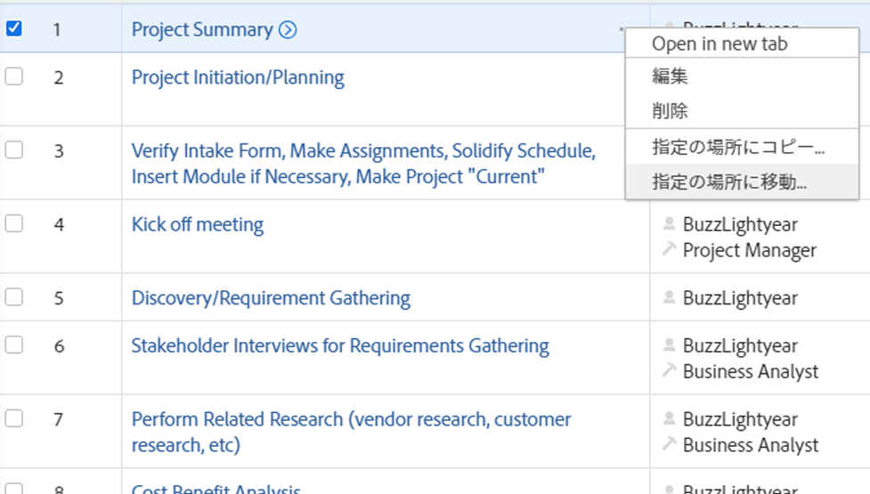
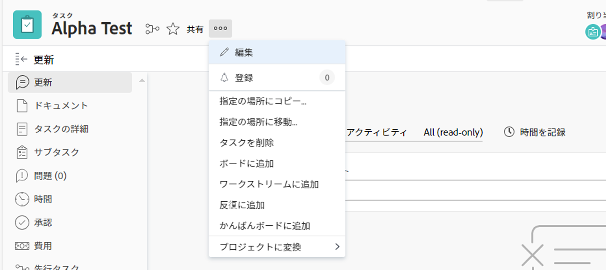
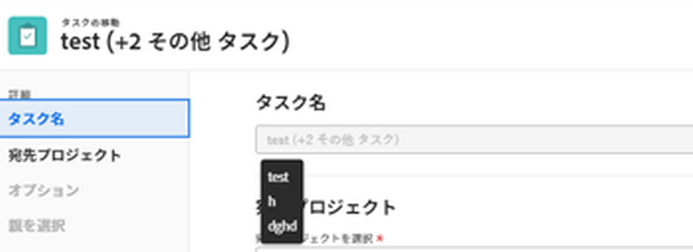
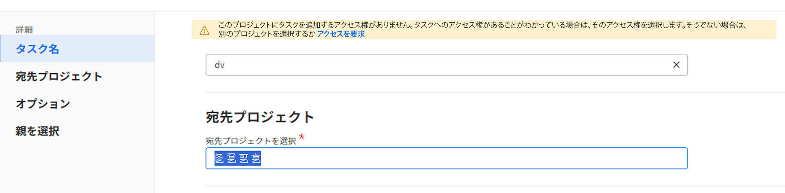

# タスクの移動

次のオブジェクト間でAdobe Workfront内のタスクを移動できます。

* プロジェクトへのアドホックタスク。
* プロジェクトから別のプロジェクトへのタスク。
* 別のプロジェクトの別の親の下にあるプロジェクトのタスク。
* 同じプロジェクト内の別の親の下のタスク。

タスクをタスクレベルで移動することも、タスクのリストからタスクを移動することもできます。
1 つのタスクを移動することも、複数のタスクをタスクのリストから一度に移動することもできます。

## アクセス要件

この記事の操作を実行するには、次のアクセス権が必要です。

<table style="table-layout:auto"> 
 <col> 
 <col> 
 <tbody> 
  <tr> 
   <td role="rowheader">Adobe Workfront plan*</td> 
   <td> 
任意
 </td> 
  </tr> 
  <tr> 
   <td role="rowheader">Adobe Workfrontライセンス*</td> 
   <td> 
仕事以上
 </td> 
  </tr> 
  <tr> 
   <td role="rowheader">アクセスレベル設定*</td> 
   <td> 
タスクおよびプロジェクトへのアクセスを編集
 
<b>メモ</b>

まだアクセス権がない場合は、Workfront管理者に、アクセスレベルに追加の制限を設定しているかどうかを問い合わせてください。 Workfront管理者がアクセスレベルを変更する方法について詳しくは、 <a href="../../../administration-and-setup/add-users/configure-and-grant-access/create-modify-access-levels.md" class="MCXref xref">カスタムアクセスレベルの作成または変更</a>.
 </td>
</tr> 
  <tr> 
   <td role="rowheader">オブジェクトの権限</td> 
   <td> 
タスクに対する権限の管理
 
タスクを追加できる権限をプロジェクトに与えるか、それ以上の権限を持つ
 
追加のアクセス権のリクエストについて詳しくは、 <a href="../../../workfront-basics/grant-and-request-access-to-objects/request-access.md" class="MCXref xref">オブジェクトへのアクセスのリクエスト </a>.
 </td> 
  </tr> 
 </tbody> 
</table>

*保有するプラン、ライセンスの種類、アクセス権を確認するには、Workfront管理者にお問い合わせください。

## タスクの移動に関する考慮事項

タスクを移動する際は、次の点に注意してください。

* あるプロジェクトから別のプロジェクトにタスクを移動すると、タスクの日付が再計算される場合があります。 再計算では、新しいプロジェクトで使用されるスケジュールと、プロジェクトのスケジュール元情報が考慮されます。

* 移動プロセス中に、タスクに関連付けられた一部の項目を移動したタスクに移動することを選択できます。 ただし、デフォルトでは、次のオブジェクトは移動されたタスクに転送されます。

   * イシュー
   * ログに記録された時間数
   * ユーザーコメント
   * カスタムフォームとカスタムフィールド情報
   * サブタスク

次の項目は、デフォルトではタスクと共に移動しません。

* マイルストーン

## リスト内のタスクの移動

1. 移動する 1 つまたは複数のタスクを含むプロジェクトに移動します。
1. クリック **タスク** をクリックして、タスクリストを表示します。
1. 次をクリック： **プランモード** アイコン  そして **自動保存** 切り替えを有効にして、移動する 1 つまたは複数のタスクを選択します。

   

   >[!IMPORTANT]
   >
   >タスクを移動するには、 **自動保存** 切り替えは無効です。

1. （オプションおよび条件付き）同じプロジェクト内で選択したタスクを移動する場合は、選択したタスクをクリックし、タスクをドラッグして、プロジェクト上で移動する場所にドロップします。

   タスクをプロジェクト上の正しい場所にドロップした後、タスク階層に加えた変更は直ちに保存されます。 各タスクに関連するすべての情報は、タスクと共に移動されます。

1. （条件付き）移動する 1 つ以上のタスクを選択し、次のいずれかの操作を行います。

   * 次をクリック： **その他** メニュー  タスクリストの上部で、「 **移動先**.
   * 選択したタスクを右クリックし、「 **移動先**.
   * 1 つのタスクを選択する場合、 **その他** メニュー  リスト内のタスク名の横にあるをクリックし、 **移動先**.

   

   「タスクを移動」ボックスが表示されます

1. タスクの移動を続行します（「 」の節を参照）。 [タスクレベルでのタスクの移動](#move-a-task-at-the-task-level) この記事では、手順 4 から始めます。

   <!--
   is this still accurate?!
   -->

## タスクレベルでのタスクの移動 {#move-a-task-at-the-task-level}

タスクをタスクのリストから移動する以外に、タスクを開いた後に、タスクレベルでタスクを移動することもできます。

1. タスクを検索して、Workfrontシステム内でタスクを検索します。
1. タスクの名前をクリックして開きます。
1. 次をクリック： **その他** ドロップダウンメニュー  タスク名の横にあるをクリックし、 **移動先**. [ タスクの移動 ] ボックスが表示されます。

   

1. （オプション） **タスク名**. 新しい名前で新しい場所にタスクが移動します。 Workfrontは、タスクの元の名前を記録しません。

   >[!TIP]
   >
   >リスト内の複数のタスクを移動する場合は、「タスク名」フィールドが灰色表示になり、編集できなくなります。 「タスク名」フィールドにマウスポインターを置くと、選択したすべてのタスクのリストが表示されます。
   >
   >
   >

1. 名前を入力 **宛先プロジェクト** タスクを移動する場所 **宛先プロジェクトを選択** フィールドに入力します。

   同じプロジェクト内でタスクを移動する場合は、現在のプロジェクトの名前を入力します。

   >[!TIP]
   >
   >* プロジェクトの名前では、大文字と小文字が区別されます。
   >* 「参照番号」の入力を開始したり、プロジェクトの ID を入力したりすることもできます。 これは、同じ名前のプロジェクトを区別するのに役立ちます。
   >* リストには 100 個のプロジェクトのみが表示されます。

1. （条件付き）クリック **アクセスのリクエスト** 選択したプロジェクトへのアクセス権を持っていない場合に、プロジェクトへのアクセス権を要求します。
1. （条件付き）タスクを宛先プロジェクトのタスクの 1 つに追加するアクセス権がある場合は、アクセス権を要求せずに、タスクを選択した宛先プロジェクトに移動し続けます。

   

   >[!TIP]
   >
   >Workfront管理者がタスクをプロジェクトに追加できない場合、選択したプロジェクトが承認待ち、完了または無効の場合にも、同様のメッセージが表示されます。 詳しくは、 [システム全体のプロジェクト環境設定の指定](../../../administration-and-setup/set-up-workfront/configure-system-defaults/set-project-preferences.md).

1. （オプション）「 **オプション** 左パネル内

   または

   下にスクロールして、 **オプション** 「タスクを移動」ボックスの「 」セクションで、以下の表に示す項目のいずれかの選択を解除して、移動したタスクから削除します。 デフォルトでは、すべてのオプションが選択されています。

   >[!IMPORTANT]
   >
   >オプションリストで項目の選択を解除すると、データが失われます。 既存のタスクからの情報は削除され、復元できません。

   <table style="table-layout:auto"> 
    <col> 
    <col> 
    <tbody> 
     <tr> 
      <td role="rowheader">すべて選択</td> 
      <td>タスクを新しい場所に移動する際にタスクからすべての情報を削除するには、このオプションの選択を解除します。 </td> 
     </tr> 
     <tr> 
      <td role="rowheader">制約</td> 
      <td> 
タスク制約は、プロジェクトスケジュールモードの設定に基づいて、[ 可能な限り早く ] または [ 可能な限り遅く ] に設定されます。
 
 選択すると、タスクの現在の制約がタスクと共に転送されます。 
 
      
<b>メモ</b>

   日付固有の制約を持つタスクを別のプロジェクトに移動またはコピーし、タスクの制約日が新しいプロジェクトの日付の外にある場合、タスク制約が [ 可能な限り早く ]、[ 可能な限り遅く ] に変わるか、プロジェクトの計画開始日または計画完了日が調整されます。

   次に、日付固有の制約の例を示します。
   <ul>
      <li> 開始日</li>
      <li> 指定日に終了</li>
      <li> 指定日以後に開始</li>
      <li> 指定日までに開始</li>
      </ul>

   タスクの制約と、タスクの制約やプロジェクトの日付がどのように影響を受けるかについては、 <a href="../../../manage-work/tasks/task-constraints/task-constraint-overview.md" class="MCXref xref">タスク制約の概要</a> 特定の制約を探します。
 </td>
   </tr> 
     <tr> 
      <td role="rowheader">割り当て</td> 
      <td> 
すべての割り当てがタスクから削除されます。 
 </td> 
     </tr> 
     <tr> 
      <td role="rowheader">承認プロセス</td> 
      <td>すべての承認プロセスがタスクから削除されます。</td> 
     </tr> 
     <tr> 
      <td role="rowheader">進捗状況</td> 
      <td>タスクのステータスは「新規」です。 それ以外の場合は、既存のタスクのステータスが保持されます。 </td> 
     </tr> 
     <tr> 
      <td role="rowheader">財務情報</td> 
      <td>タスクの財務情報が削除され、Workfrontがタスクの「コストタイプ」を「コストなし」に、「売上高タイプ」を「請求不可」に更新します。 </td> 
     </tr> 
     <tr> 
      <td role="rowheader">すべての先行タスク</td> 
      <td> 
選択すると、タスクを別のプロジェクトに移動すると、依存関係がプロジェクト間の先行プロジェクトになります。 
 </td> 
     </tr> 
     <tr> 
      <td role="rowheader">ドキュメント</td> 
      <td> 
タスクに添付されたドキュメントは、移動されたタスクには転送されません。 これには、バージョン、配達確認およびリンクされたドキュメントが含まれます。
 
ドキュメントの承認は含まれません。 タスクを移動したときにドキュメント承認を移動することはできません。
 
      <b>メモ</b>

   タスクでドキュメントを移動しないように選択した場合、ドキュメントは削除され、30 日間ごみ箱に入れられます。 管理者は復元でき、移動したタスクで復元されます。

   タスクを移動した後に削除した場合、復元したドキュメントは、復元元の管理者のユーザーページの「ドキュメント」領域に配置されます。

   </td> 
     </tr> 
     <tr> 
      <td role="rowheader">リマインダー通知</td> 
      <td>タスクのリマインダーは、移動されたタスクには転送されません。 </td> 
     </tr> 
     <tr> 
      <td role="rowheader">費用</td> 
      <td>タスクに記録された費用は、移動されたタスクには転送されません。 </td> 
     </tr> 
     <tr> 
      <td role="rowheader">権限</td> 
      <td> 
Workfrontは、タスクの共有リストに表示されているすべてのエンティティの名前を削除します。 
 </td> 
     </tr> 
    </tbody> 
   </table>

1. （オプション）「 **親を選択** 左パネル内

   または

   をスクロールします。 **親を選択** [ ] セクションで、移動したタスクの親にするタスクを、移動先のプロジェクトで選択します。

   >[!TIP]
   >
   >リスト内の複数のタスクを移動するように選択すると、選択したすべてのタスクが、選択した親の子になります。

   次のいずれかの操作を行って、親を選択します。

   * タスクリストで、プロジェクトプランの親の 1 つを選択します。
   * 検索アイコンをクリックします。  親タスクを名前で検索します。

   タスクがリストに表示されます。

   

1. 親が見つかったら、その親のラジオボタンを選択します。

   親タスクを選択しない場合、タスクはサブタスクではなくメインタスクとして移動され、移動先のプロジェクトのタスクリストの最後に配置されます。

1. クリック **タスクを移動**

   または

   クリック **タスクを移動** リスト内の複数のタスクを選択する場合。

   移動されたタスクは、指定されたプロジェクト上に存在し、親タスクのサブタスク、またはプロジェクト上の最後のタスクのどちらかになります。
