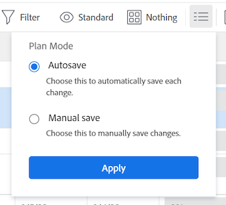
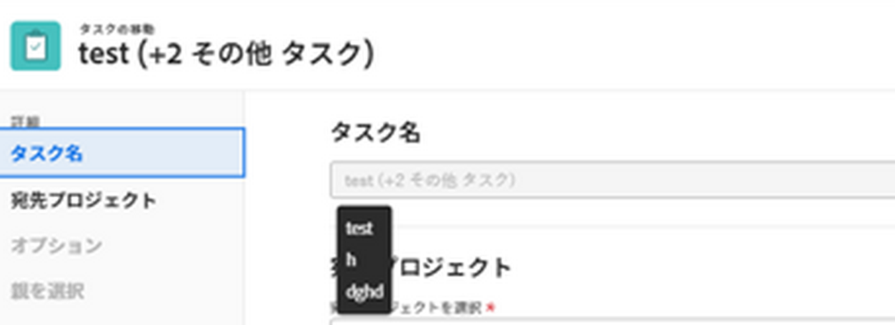
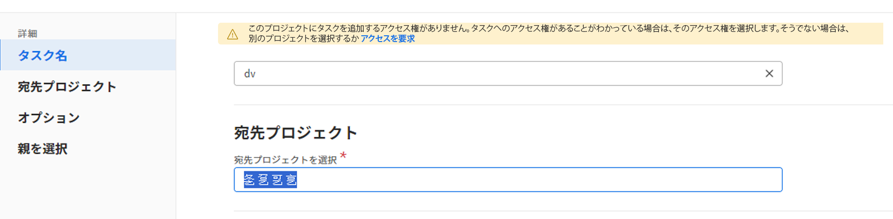
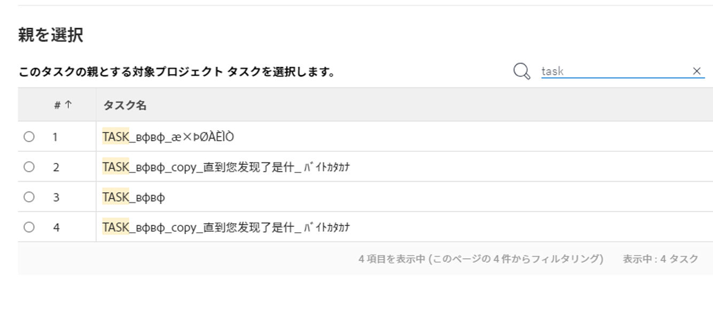

# タスクの移動

<!--Audited: 5/2025-->

<!--
The highlighted information on this page refers to functionality not yet generally available. It is available only in the Preview environment for all customers. After the monthly releases to Production, the same features are also available in the Production environment for customers who enabled fast releases.    

For information about fast releases, see [Enable or disable fast releases for your organization](/help/quicksilver/administration-and-setup/set-up-workfront/configure-system-defaults/enable-fast-release-process.md). 
-->

Adobe Workfront では、次のオブジェクト間でタスクを移動できます。

* プロジェクトに対するアドホックタスク。
* プロジェクトから別のプロジェクトへのタスク。
* 別のプロジェクトの別の親の下にあるプロジェクトのタスク。
* 同じプロジェクト内の別の親の下のタスク。

タスクをタスクレベルで移動したり、タスクのリストからタスクを移動したりできます。

1つのタスクを移動することも、タスクのリストから一度に複数のタスクを移動することもできます。

## アクセス要件

+++ 展開すると、この記事の機能のアクセス要件が表示されます。 

<table style="table-layout:auto"> 
 <col> 
 <col> 
 <tbody> 
  <tr> 
   <td role="rowheader">Adobe Workfront パッケージ</td> 
   <td> 
任意
 </td> 
  </tr> 
  <tr> 
   <td role="rowheader">Adobe Workfront プラン</td> 
   <td> 
標準 
 
 
Work またはそれ以上
 </td> 
  </tr> 
  <tr> 
   <td role="rowheader">アクセスレベル設定</td> 
   <td> 
タスクおよびプロジェクトへのアクセスを編集
 </td> 
  </tr> 
  <tr> 
   <td role="rowheader">オブジェクト権限</td> 
   <td> 
タスクに対する権限を管理
 
タスクの追加が可能な、プロジェクトに対する参加以上の権限
  </td> 
  </tr> 
 </tbody> 
</table>

詳しくは、[Workfront ドキュメントのアクセス要件](/help/quicksilver/administration-and-setup/add-users/access-levels-and-object-permissions/access-level-requirements-in-documentation.md)を参照してください。

+++

<!--
Old:

<table style="table-layout:auto"> 
 <col> 
 <col> 
 <tbody> 
  <tr> 
   <td role="rowheader">Adobe Workfront plan</td> 
   <td> 
Any
 </td> 
  </tr> 
  <tr> 
   <td role="rowheader">Adobe Workfront license</td> 
   <td> 
New: Standard 
 
 
or
  

Current: Work or higher 
 </td> 
  </tr> 
  <tr> 
   <td role="rowheader">Access level configurations</td> 
   <td> 
Edit access to Tasks and Projects
 </td> 
  </tr> 
  <tr> 
   <td role="rowheader">Object permissions</td> 
   <td> 
Manage permissions to the tasks
 
Contribute or higher permissions to the project with ability to Add Tasks
  </td> 
  </tr> 
 </tbody> 
</table>
-->

## タスクを移動する際の考慮事項

タスクを移動する際は、以下の点を考慮してください。

* システム管理者またはグループ管理者は、「ユーザーがタスクを移動できるようにする」設定や「設定」エリアの「ログ時間に関する問題」設定に応じて、ログ時間が発生したタスクの移動を禁止することができます。 詳しくは、[システム全体のタスクおよびイシューの環境設定の指定](/help/quicksilver/administration-and-setup/set-up-workfront/configure-system-defaults/set-task-issue-preferences.md)を参照してください。

* あるプロジェクトから別のプロジェクトにタスクを移動すると、タスクの日付が再計算される場合があります。再計算では、新規プロジェクトが使用するスケジュールと、プロジェクトのスケジュールの基点情報が考慮されます。

* 移動プロセス中に、タスクに関連付けられている一部の項目を、移動したタスクに移動できます。 ただし、デフォルトでは、次のオブジェクトは移動されたタスクに転送されます。

   * イシュー
   * ログに記録された時間数
   * ユーザーコメント
   * カスタムフォームとカスタムフィールド情報
   * サブタスク

* デフォルトでは、次の項目はタスクと一緒に移動しません。

   * マイルストーン

## リスト内のタスクを移動

{{step1-to-projects}}

1. **プロジェクト** ページで、移動するタスクまたはタスクを含むプロジェクトを選択します。
1. 左パネルの「**タスク**」をクリックしてタスクリストを表示します。
1. **プランモード** アイコン をクリックし、**自動保存** トグルが有効になっていることを確認してから、移動するタスクを選択します。

   

   >[!IMPORTANT]
   >
   >「**自動保存**」切替スイッチが無効な場合は、タスクを移動できません。

1. （オプションおよび条件付き）選択したタスクを同じプロジェクト内で移動する場合は、選択したタスクをクリックし、プロジェクト上の移動先にドラッグ&amp;ドロップします。 タスク階層が変更されると、すぐに保存され、各タスクに関連付けられた情報がタスクとともに移動されます。

1. （条件付き）移動する 1 つ以上のタスクを選択し、次のいずれかの操作を行います。

   * タスクリストの上部にある&#x200B;**詳細** メニューをクリックし、**移動先**&#x200B;をクリックします。
   * 選択したタスクを右クリックし、**移動先**&#x200B;をクリックします。
   * 1つのタスクを選択する際に、リスト内のタスク名の横にあるタスクリスト **の**&#x200B;詳細詳細アイコンをクリックし、**移動先**&#x200B;をクリックします。

   「**タスクを移動**」ボックスが表示されます。

1. この記事の「[&#x200B; タスクレベルでのタスクの移動](#move-a-task-at-the-task-level)」の節で説明しているように、タスクの移動を続行します。

   <!--
   is this still accurate?!
   -->

## タスクレベルでタスクを移動 {#move-a-task-at-the-task-level}

タスクのリストからタスクを移動するだけでなく、タスクを開いた後にタスクレベルで移動することもできます。

1. Workfront システム内のタスクを検索して見つけます。
1. タスクの名前をクリックして開きます。
1. タスク名の横にある&#x200B;**詳細** ドロップダウンメニューをクリックし、**移動先**&#x200B;をクリックします。 **タスクの移動** サイドパネルが表示されます。

1. （オプション）**タスク名**&#x200B;を更新します。タスクは、新しい場所の新しい名前で移動します。

   >[!TIP]
   >
   >リスト内の複数のタスクを移動する場合、**タスク名** フィールドはグレー表示になり、編集できません。 **タスク名** フィールドにカーソルを合わせると、選択したすべてのタスクのリストが表示されます。
   >
   >
   >

1. 「**宛先プロジェクトを選択**」フィールドに、タスクの移動先となるプロジェクトの名前を入力します。 同じプロジェクト内でタスクを移動する場合は、現在のプロジェクトの名前を入力します。

   >[!TIP]
   >
   >* プロジェクト名では大文字と小文字が区別されます。
   >* プロジェクトを検索するには、参照番号を入力するか、プロジェクトのIDを入力します。 これにより、同じ名前のプロジェクトを区別できます。
   >* リストには 100 個のプロジェクトのみが表示されます。

1. （条件付き）プロジェクトにアクセスできない場合は、**アクセスをリクエスト**&#x200B;をクリックします。
1. （条件付き）宛先プロジェクトのいずれかのタスクにタスクを追加するアクセス権がある場合は、アクセス権を要求せずにタスクを宛先プロジェクトに引き続き移動します。

   

   >[!TIP]
   >
   >Workfront管理者がこれらのプロジェクトにタスクを追加できない場合、選択したプロジェクトが「承認待ち」、「完了」、または「停止」の場合にも、同様のメッセージが表示されます。 詳しくは、[システム全体のプロジェクト環境の設定](../../../administration-and-setup/set-up-workfront/configure-system-defaults/set-project-preferences.md)を参照してください。

1. （オプション）「**オプション**」セクションで、次の表に示す項目のいずれかを選択解除して、移動したタスクから削除します。 デフォルトでは、すべてのオプションが選択されています。

   >[!IMPORTANT]
   >
   >**Options** リストの項目を選択解除すると、データが失われます。 既存のタスクの情報は削除され、復元できません。

   <table style="table-layout:auto"> 
    <col> 
    <col> 
    <tbody> 
     <tr> 
      <td role="rowheader">すべて選択</td> 
      <td>タスクを新しい場所に移動する際にタスクからすべての情報を削除するには、このオプションの選択を解除します。 </td> 
     </tr> 
     <tr> 
      <td role="rowheader">制約</td> 
      <td> 
タスク制約は、プロジェクトのスケジュールモードの設定に応じて、「できるだけ早く」または「できるだけ遅く」に設定されます。
 
 選択すると、タスクの現在の制約がタスクと共に転送されます。 
 
      
注意：日付固有の制約を持つタスクを別のプロジェクトに移動またはコピーする場合、そのタスクの制約の日付が新しいプロジェクトの日付の外にある場合、タスク制約は「可能な限り早く」または「可能な限り遅く」に変更されるか、プロジェクトの予定開始日または予定完了日が調整されます。

   次に、日付固有の制約の例を示します。
   <ul>
      <li> 開始日</li>
      <li> 指定日に終了</li>
      <li> 指定日以降に開始</li>
      <li> 指定日までに開始</li>
      </ul>

   詳しくは、<a href="../../../manage-work/tasks/task-constraints/task-constraint-overview.md" class="MCXref xref">タスク制約の概要</a>を参照してください。
 </td>
   </tr> 
     <tr> 
      <td role="rowheader">割り当て</td> 
      <td> 
すべての割り当てがタスクから削除されます。 
 </td> 
     </tr> 
     <tr> 
      <td role="rowheader">承認プロセス</td> 
      <td>すべての承認プロセスがタスクから削除されます。</td> 
     </tr> 
     <tr> 
      <td role="rowheader">進捗状況</td> 
      <td>タスクのステータスは「新規」に設定されます。 それ以外の場合は、既存のタスクのステータスが保持されます。 </td> 
     </tr> 
     <tr> 
      <td role="rowheader">財務情報</td> 
      <td>タスクの財務情報が削除され、Workfront ではタスクの「コストタイプ」を「コストなし」に、「収益タイプ」を「請求不可」に更新します。 </td> 
     </tr> 
     <tr> 
      <td role="rowheader">すべての先行タスク</td> 
      <td> 
選択すると、タスクを別のプロジェクトに移動する際に、依存関係がプロジェクト間の先行タスクになります。 
 </td> 
     </tr> 
     <tr> 
      <td role="rowheader">ドキュメント</td> 
      <td> 
タスクに添付されたドキュメントは、移動されたタスクに転送されません。 これには、バージョン、プルーフ、およびリンクされたドキュメントが含まれます。
 
これには、ドキュメントの承認は含まれません。 タスクを移動する際に、ドキュメント承認を移動することはできません。
 
      
注：タスクと一緒にドキュメントを移動しないことを選択した場合、ドキュメントは削除され、30日間ごみ箱に入れられます。 管理者はそれらのドキュメントを復元でき、移動先のタスクで復元されます。 

   
タスクを移動した後に削除すると、復元されたドキュメントは、ドキュメントを復元した管理者のユーザーページのドキュメントエリアに配置されます。

   </td> 
     </tr> 
     <tr> 
      <td role="rowheader">リマインダー通知</td> 
      <td>タスクのリマインダーは、移動先のタスクには転送されません。 </td> 
     </tr> 
     <tr> 
      <td role="rowheader">費用</td> 
      <td>タスクに記録された費用は、移動先のタスクには転送されません。 </td> 
     </tr> 
     <tr> 
      <td role="rowheader">権限</td> 
      <td> 
Workfront は、タスクの共有リストに表示されているすべてのエンティティの名前を削除します。 
 </td> 
     </tr> 
    </tbody> 
   </table>

1. （オプション）「**親を選択**」セクションで、移動されたタスクの親となる宛先プロジェクト内のタスクを選択します。

   >[!TIP]
   >
   >リスト内の複数のタスクを移動するように選択すると、選択したすべてのタスクが、選択した親の子になります。

   次のいずれかの操作を行って、親を選択します。

   * タスクリストのプロジェクト計画で親の 1 つを選択します。
   * 検索アイコン  をクリックし、名前で親タスクを検索します。

   タスクがリストに表示されます。

   

   >[!NOTE]
   >
   >親タスクを選択しない場合、タスクはサブタスクではなくメインタスクとして移動され、宛先プロジェクトのタスクリストの最後に配置されます。

1. 「**タスクを移動**」をクリックします。 タスクは、親タスクのサブタスクまたはプロジェクトの最後のタスクとして、指定されたプロジェクトに移動します。
