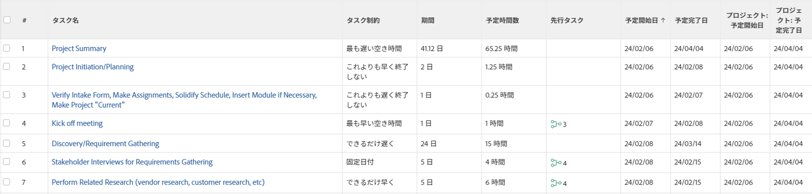
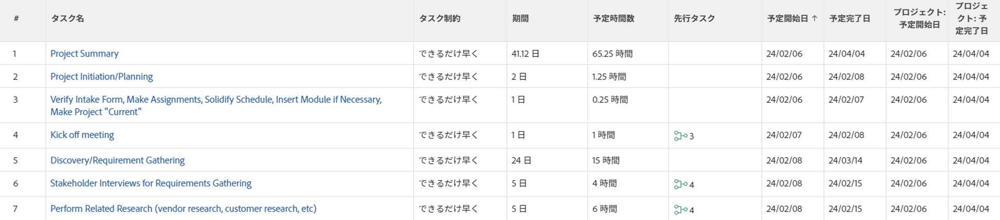

# タスク制約の概要：できるだけ遅く

可能な限り遅く (ALAP) は、タスクの完了時間を可能な限りプロジェクトの終わりに近い位置に配置するAdobe Workfront Task Constraint です。

この制約を使用すると、先行タスクまたは依存タスクが再スケジュールされる場合があります。

先行関係の詳細については、「 [タスクの先行タスクを使用](../../../manage-work/tasks/use-prdcssrs/use-task-predecessors.md).

プロジェクトで「完了日からスケジュール」のスケジュール・モードを使用し、タスクの「開始日」に「プロジェクト計画日に基づく」がシステムまたはグループのデフォルトのスケジュール・モードを使用する場合は、デフォルトの制約が「可能な限り遅延」になります。

新しいタスクの既定の制約を設定する場所については、を参照してください。 [システム全体のタスクと問題の環境設定を構成](../../../administration-and-setup/set-up-workfront/configure-system-defaults/set-task-issue-preferences.md).

タスクのタスク制約を更新する方法については、 [タスクのタスク制約の更新](../../../manage-work/tasks/task-constraints/update-task-constraint-of-task.md).

<!--

<h2>Use the As Late As Possible Task Constraint</h2>

(NOTE: replaced with new article linked above) 

To update the Task Constraint to As Late As Possible:&nbsp;

<ol>
<li value="1">Go to a task whose Task Constraint you want to update.</li>
<li value="2"> 
Click the <strong>More</strong> icon  next to the task name, then click&nbsp;<strong>Edit</strong>.
 </li>
<li value="3"> 
In the&nbsp;<strong>Overview</strong>&nbsp;section, expand the&nbsp;<strong>Task Constraint</strong>&nbsp;drop-down menu.
 </li>
<li value="4"> 
Select&nbsp;<strong>As Late As Possible</strong>.
 </li>
<li value="5">Click <strong>Save Changes</strong>.&nbsp;</li>
</ol>

-->

## 最新の利用可能な時間と可能な限り遅い時間の違い

<!--

(NOTE:&nbsp;[! This section is duplicated in "Latest Available Time"] - inserted a snippet for both articles (Alina)) 

-->

Latest Available Time 制約は、次の条件が存在する場合、 As Late Ass Foxable 制約とは異なります。

* プロジェクトは開始日からスケジュールされています
* プロジェクト内のタスクには先行タスク関係があります
* 後続タスクには、柔軟なタスク制約があります

この場合：

* **最新の利用可能時間：** 先行タスクに対して [ 最新の利用可能時間 ] 制約を使用すると、後続タスクの柔軟な制約が優先されます。

   **例：** たとえば、タスク A はタスク B の先行タスクです。タスク A には最新の利用可能時間制約が、タスク B には [ 可能な限り早く ] 制約が設定されます。 この場合、タスク A は、可能な限りプロジェクトの開始に近い状態にスケジュールされます。

   

* **できるだけ遅くまで、** このシナリオでは、先行タスクに対して [ 可能な限り遅延 ] 制約を使用すると、先行タスクが優先されます。

   **例：** たとえば、タスク A はタスク B の先行タスクです。タスク A には可能な限り遅い制約、タスク B には可能な限り早い制約があります。 この場合、タスク A は可能な限りプロジェクトの終わり近くにスケジュールされます。

   

 

<!--

(NOTE: this content was here before but it was wrong - according to this issue in Hub, per Dev, the correct functionality is in the snippet above: https://hub.workfront.com/task/6193c6910004bce9de07cda7757f3ce8/updates?email-source=subscribedCommunication) 

The Latest&nbsp;Available Time constraint differs from the As Late&nbsp;As Possible constraint when the following criteria exist:

<ul>
<li> The project is scheduled From Completion </li>
<li> Tasks in the project have a predecessor relationship </li>
<li> The predecessor task has a flexible task constraint </li>
</ul>

 In this situation: 

<ul>
<li> 
<strong>Latest Available Time:</strong> Using the Latest&nbsp;Available Time constraint on the successor task gives priority to flexible constraint of the predecessor.
 
For example, Task A is a predecessor to Task B. Task B has the Latest&nbsp;Available Time constraint and Task A has the As Soon&nbsp;As Possible constraint. In this situation, the task is scheduled as close&nbsp;to the start&nbsp;of the project as possible.
 </li>
<li> 
<strong>As Late As Possible:</strong> In this scenario, using the As Late&nbsp;As Possible constraint on the successor task gives the priority to the successor task.
 
For example, Task A is a predecessor to Task B. Task B has the As Late&nbsp;As Possible&nbsp;constraint and Task A has the As Soon&nbsp;As Possible constraint. In this situation, the task is scheduled as close to the end&nbsp;of the project as possible.
 </li>
</ul>

-->
