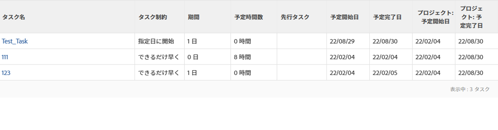
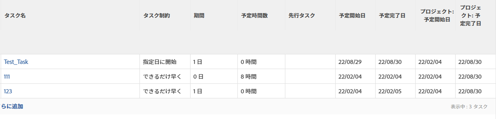

# タスクの制約の概要：最も早い空き時間

最も早い空き時間は、先行タスク関係を考慮した後で、最も早い空き時間にタスクを開始するようにスケジュール設定するタスクの制約です。

タスクでタスクの制約を更新する方法については、[タスクでタスクの制約を更新](../../../manage-work/tasks/task-constraints/update-task-constraint-of-task.md)を参照してください。

<!--

(NOTE: replaced with new article linked above) 

-->

<!--

To update the Task Constraint to Earliest Available Time:

-->

<!--
   <li value="1" data-mc-conditions="QuicksilverOrClassic.Draft mode">Go to a task whose constraint you want to modify. </li>
   -->

<!--
   
Click <strong>Edit Task</strong>.

   -->

<!--
   
Click the <strong>More</strong> icon  next to the task name, then click <strong>Edit</strong>.

   -->

<!--
   
In the <strong>Overview</strong> section, expand the <strong>Task Constraint</strong> drop-down menu.

   -->

<!--
   
Select <strong>Earliest Available Time</strong>.

   -->

<!--
   <li value="5" data-mc-conditions="QuicksilverOrClassic.Draft mode">Click <strong>Save Changes</strong>.</li>
   -->

## 最も早い空き時間とできるだけ早くの違い

<!--

(NOTE: [! This section is duplicated in "Earliest Available Time"])

-->

「最も早い空き時間」の制約は、次の条件がすべて存在する場合、「できるだけ早く」の制約とは異なります。

* プロジェクトは完了からスケジュールされます
* プロジェクト内のタスクには、先行タスク関係があります
* 先行タスクには、柔軟なタスクの制約があります

この状況では、次のようになります。

* **最も早い空き時間：**&#x200B;後続タスクに「最も早い空き時間」の制約を使用すると、先行タスクの柔軟な制約が優先されます。

  **例**

  タスク A がタスク B の先行タスクであるとします。タスク B には「最も早い空き時間」の制約が適用され、タスク A には「できるだけ遅く」の制約が適用されます。この場合、タスク B はプロジェクトの完了にできるだけ近いタイミングでスケジュールされます。

  

* **できるだけ早く：**&#x200B;このシナリオでは、後続タスクに「できるだけ早く」の制約を使用すると、後続タスクが優先されます。

  **例**

  タスク A がタスク B の先行タスクであるとします。タスク B には「できるだけ早く」の制約が適用され、タスク A には「できるだけ遅く」の制約が適用されます。この場合、タスク B はプロジェクトの開始にできるだけ近いタイミングでスケジュールされます。

  
