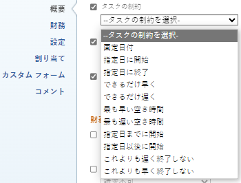

# タスク制約の概要：これよりも早く終了しない

「これよりも早く終了しない」（FNET）は、指定した日付以降にタスクを完了するようにスケジュールするタスク制約です。

## 「これよりも早く終了しない」制約の概要

タスクに対して「これよりも早く終了しない」（FNET）制約を使用する場合は、以下の点を考慮してください。

* プロジェクトが「完了日から」にスケジュールされる場合は、この制約を使用する必要があります。この場合、他の依存タスクを強制的に「危険あり」と表示する前に、タスクにソフト制約を与えることができます。
* 「**開始日から**」にスケジュールされたプロジェクトで FNET を使用すると、タスクは制約により「できるだけ早く」という制約の場合と同じようにスケジュールされます。
* FNET 制約を使用しているタスクを別のプロジェクトに移動またはコピーすると、制約の日付およびプロジェクトの開始日や完了日によって、タスクの制約またはプロジェクトの日付が変更される可能性があります。次のシナリオが存在します。

   * 宛先プロジェクトが開始からスケジュールされている場合：

      * タスクの制約の指定日がプロジェクトの予定開始日よりも前の場合、タスクの制約はできるだけ早くに変更されます。
      * タスクの制約の指定日がプロジェクトの予定完了日よりも後の場合、プロジェクトの予定完了日はタスクの完了の制約の指定日と一致するように変更されます。

   * 宛先プロジェクトが完了からスケジュールされている場合：

      * タスクの制約の指定日がプロジェクトの完了日よりも後の場合、タスクの制約はできるだけ遅くに変更されます。
      * タスクの制約の指定日がプロジェクトの予定開始日よりも前の場合、プロジェクトの予定開始日はタスクの開始の制約の指定日に一致するように変更されます。

   * プロジェクトのスケジュールに関係なく、タスクの制約の指定日がプロジェクトの開始日と完了日の範囲内にある場合、タスクの制約やプロジェクトの日付は変更されません。

  タスクの移動について詳しくは、[タスクの移動](../../../manage-work/tasks/manage-tasks/move-tasks.md)を参照してください。タスクのコピーについて詳しくは、[タスクのコピーと複製](../../../manage-work/tasks/manage-tasks/copy-and-duplicate-tasks.md)を参照してください。

  タスクでタスクの制約を更新する方法については、[タスクでタスクの制約を更新](../../../manage-work/tasks/task-constraints/update-task-constraint-of-task.md)を参照してください。

<!--

<h2>Use the Finish No Earlier Than constraint</h2>

(NOTE: replaced with new article linked above)&nbsp;

To update the Task Constraint to Finish No Earlier Than:

<ol>
<li value="1">Go to a task whose Task Constraint you want to update.</li>
<li value="2"> 
Click the <strong>More</strong> icon  next to the task name, then click <strong>Edit</strong>.
 </li>
<li value="3"> 
In the <strong>Overview</strong> section, expand the <strong>Task Constraint</strong> drop-down menu.
 </li>
<li value="4"> 
Select <strong>Finish No Earlier Than</strong>.
 
  
 </li>
<li value="5"> 
Specify a <strong>Planned Completion Date</strong>.
 
The task must complete no earlier than this date. 
 </li>
<li value="6">Click <strong>Save Changes.</strong> </li>
</ol>

-->
