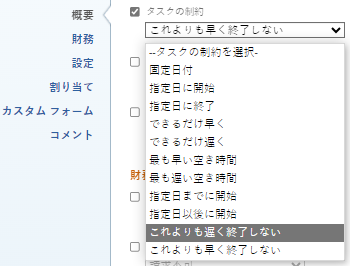

# タスク制約の概要：次の日までに完了

[ 指定日までに終了 ] (FNLT) は、指定した日付より前にタスクを完了するようにスケジュールするタスク制約です。

## 「次の日までに完了」制約の概要

タスクに対して Finish No Later (FNLT) 制約を使用する場合は、次の点を考慮してください。

* プロジェクトが「開始日から」にスケジュールされる場合は、この制約を使用する必要があります。 この場合、タスクにソフト制約を指定してから、他の依存タスクを [ リスク ] として強制的に表示させることができます。
* FNLT 制約を「完了日からのスケジュール」プロジェクトで使用する場合、この制約では、「可能な限り遅延」タスクと同様にタスクがスケジュールされます。
* FNET 制約のあるタスクを別のプロジェクトに移動またはコピーすると、タスクの制約やプロジェクトの日付は、制約の日付と、プロジェクトの開始日と完了日に応じて変わる場合があります。 次のシナリオが存在します。

   * 宛先プロジェクトが開始からスケジュールされたとき：

      * タスクの制約日がプロジェクトの「計画開始日」よりも前の場合、タスク制約は「可能な限り早く」に変わります。
      * タスクの制約日がプロジェクトの「計画完了日」より後の場合、プロジェクトの「計画完了日」は、タスクの完了制約日に合わせて変更されます。

      * 宛先プロジェクトが「完了から」でスケジュールされる場合：

         * タスクの制約日が [ プロジェクト完了日 ] より後の場合、タスクの制約は [ 可能な限り遅く ] に変わります。
         * タスクの制約日がプロジェクトの計画開始日より前の場合、プロジェクトの計画開始日はタスクの開始日に合わせて変更されます。
      * プロジェクトのスケジュールに関係なく、タスクの制約日がプロジェクトの開始日と終了日の範囲内にある場合、タスク制約やプロジェクトの日付は変更されません。

   タスクの移動について詳しくは、 [タスクを移動](../../../manage-work/tasks/manage-tasks/move-tasks.md). タスクのコピーについて詳しくは、 [タスクのコピーと複製](../../../manage-work/tasks/manage-tasks/copy-and-duplicate-tasks.md).

タスクのタスク制約を更新する方法については、 [タスクのタスク制約の更新](../../../manage-work/tasks/task-constraints/update-task-constraint-of-task.md).

<!--

<h2>Use the Finish No Later Than constraint</h2>

To update the Task Constraint to Finish No Later Than:

<ol>
<li value="1">Go to a task whose Task Constraint you want to update.</li>
<li value="2"> 
Click the <strong>More</strong> icon  next to the task name, then click <strong>Edit</strong>.
 </li>
<li value="3">In the <strong>Overview</strong> section, expand the <strong>Task Constraint</strong> drop-down menu.</li>
<li value="4"> 
Select <strong>Finish No Later Than</strong>.
 
  
 </li>
<li value="5"> 
Specify a <strong>Planned Completion Date</strong>.
 
You must complete the task on and not later than this date. 
 </li>
<li value="6">Click <strong>Save Changes</strong>.</li>
</ol>

-->
