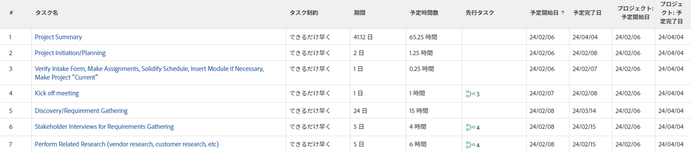

# タスク制約の概要：最も遅い空き時間

最も遅い空き時間（LAT）は、Adobe Workfront のタスクの制約の一種です。

## タスクの制約「最も遅い空き時間」を使用

LAT 制約を使用すると、プロジェクト内の先行タスクと後続タスクの関係を考慮した後で、最も遅い空き時間にタスクを開始するようにスケジュール設定できます。

この制約は、先行タスクや後続タスクの再スケジュールを強制しない点で、「できるだけ早く」の制約とは異なります。関連付けられているタスクのスケジュールにのみ影響し、他のタスクとの関係に基づいて、最も遅い空き時間に設定されます。

タスクでタスクの制約を更新する方法については、[タスクでタスクの制約を更新](../../../manage-work/tasks/task-constraints/update-task-constraint-of-task.md)を参照してください。

<!--

To update the Task Constraint to Latest Available Time:

(NOTE: replaced with new article linked above) 

<ol>
<li value="1">Go to a task whose Task Constraint you want to update.</li>
<li value="2"> 
Click the <strong>More</strong> icon  next to the task name, then click <strong>Edit</strong>.
 </li>
<li value="3">In the <strong>Overview</strong> section, expand the <strong>Task Constraint</strong> drop-down menu.</li>
<li value="4"> 
Select <strong>Latest Available Time</strong>.
 </li>
<li value="5">Click <strong>Save Changes</strong>.</li>
</ol>

-->

## 「最も遅い空き時間」と「できるだけ遅く」の違い

<!--

(NOTE: [! This section is duplicated in "As Late As Possible"] - inserted snippet in both (Alina)) 

-->

次の条件に該当する場合、「最も遅い空き時間」の制約は「できるだけ遅く」の制約とは異なります。

* プロジェクトが開始日からスケジュールされています
* プロジェクト内のタスクには、先行タスク関係があります
* 後続タスクに柔軟なタスクの制約があります

この状況では、次のようになります。

* **最も遅い空き時間：**&#x200B;先行タスクで「最も遅い空き時間」の制約を使用すると、後続タスクの柔軟な制約が優先されます。

  **例：**&#x200B;例えば、タスク A がタスク B の先行タスクであるとします。タスク A には「最も遅い空き時間」の制約が適用され、タスク B には「できるだけ早く」の制約が適用されます。この場合、タスク A はプロジェクトの開始にできるだけ近いタイミングでスケジュールされます。

  

* **できるだけ遅く：**&#x200B;このシナリオでは、先行タスクに「できるだけ遅く」の制約を適用すると、先行タスクが優先されます。

  **例：**&#x200B;例えば、タスク A がタスク B の先行タスクであるとします。タスク A には「できるだけ遅く」の制約が適用され、タスク B には「できるだけ早く」の制約が適用されます。この場合、タスク A はプロジェクトの終了にできるだけ近いタイミングでスケジュールされます。

  

<!--

(NOTE: this content was here before but it was wrong - according to this issue in Hub, per Dev, the correct functionality is in the snippet above: https://hub.workfront.com/task/6193c6910004bce9de07cda7757f3ce8/updates?email-source=subscribedCommunication) 

The Latest Available Time constraint differs from the As Late As Possible constraint when the following criteria exist:

<ul>
<li> The project is scheduled From Completion </li>
<li> Tasks in the project have a predecessor relationship </li>
<li> The predecessor task has a flexible task constraint </li>
</ul>

 In this situation: 

<ul>
<li> 
<strong>Latest Available Time:</strong> Using the Latest Available Time constraint on the successor task gives priority to flexible constraint of the predecessor.
 
For example, Task A is a predecessor to Task B. Task B has the Latest Available Time constraint and Task A has the As Soon As Possible constraint. In this situation, Task B is scheduled as close to the start of the project as possible.
 </li>
<li> 
<strong>As Late As Possible:</strong> In this scenario, using the As Late As Possible constraint on the successor task gives the priority to the successor task.
 
For example, Task A is a predecessor to Task B. Task B has the As Late As Possible constraint and Task A has the As Soon As Possible constraint. In this situation, Task B is scheduled as close to the end of the project as possible.
 </li>
</ul>

-->
