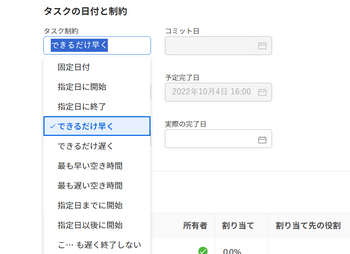

# タスクのタスク制約の更新

タスクの制約は、タスクをプロジェクトで開始および終了するタイミングを決定します。 詳しくは、 [タスク制約の概要](../../../manage-work/tasks/task-constraints/task-constraint-overview.md).

## アクセス要件

タスクのタスク制約を変更するには、次の条件が必要です。

<table style="table-layout:auto"> 
 <col> 
 <col> 
 <tbody> 
  <tr> 
   <td role="rowheader">Adobe Workfront plan*</td> 
   <td> 
任意 
 </td> 
  </tr> 
  <tr> 
   <td role="rowheader">Adobe Workfront license*</td> 
   <td> 
仕事以上
 </td> 
  </tr> 
  <tr> 
   <td role="rowheader">アクセスレベル設定*</td> 
   <td> 
プロジェクトへのアクセス権を表示または高くする
 
タスクへのアクセスを編集
 
注意：まだアクセス権がない場合は、Workfront管理者に、アクセスレベルに追加の制限を設定しているかどうかを問い合わせてください。 Workfront管理者がアクセスレベルを変更する方法について詳しくは、 <a href="../../../administration-and-setup/add-users/configure-and-grant-access/create-modify-access-levels.md" class="MCXref xref">カスタムアクセスレベルの作成または変更</a>.
 </td> 
  </tr> 
  <tr> 
   <td role="rowheader">オブジェクト権限</td> 
   <td> 
タスクへのアクセスを管理 
 
追加のアクセス権のリクエストについて詳しくは、 <a href="../../../workfront-basics/grant-and-request-access-to-objects/request-access.md" class="MCXref xref">オブジェクトへのアクセスのリクエスト </a>.
 </td> 
  </tr> 
 </tbody> 
</table>

&#42;保有しているプラン、ライセンスの種類、アクセス権を確認するには、Workfront管理者に問い合わせてください。

## タスクのタスク制約の更新

1. クリック **メインメニュー** > **プロジェクト**」、「プロジェクト」の順にクリックしてアクセスします。
1. 次をクリック： **タスク** 」セクションを使用して、
1. クリック **タスクの詳細** 左側のパネルで、「概要」領域で、 **タスク制約**.

   

1. 次のオプションから選択します。

   | 固定日付 | 詳しくは、 [タスク制約の概要：固定日付](../../../manage-work/tasks/task-constraints/fixed-dates.md). |
   |---|---|
   | 指定日に開始 | 詳しくは、 [タスク制約の概要：開始日](../../../manage-work/tasks/task-constraints/must-start-on.md). |
   | 指定日に終了 | 詳しくは、 [タスク制約の概要：終了日](../../../manage-work/tasks/task-constraints/must-finish-on.md). |
   | できるだけ早く | 詳しくは、 [タスク制約の概要：できるだけ早く](../../../manage-work/tasks/task-constraints/as-soon-as-possible.md). |
   | できるだけ遅く | 詳しくは、 [タスク制約の概要：できるだけ遅く](../../../manage-work/tasks/task-constraints/as-late-as-possible.md). |
   | 最も早い空き時間 | 詳しくは、 [タスク制約の概要：最古の利用可能時間](../../../manage-work/tasks/task-constraints/earliest-available-time.md). |
   | 最新の利用可能時間 | 詳しくは、 [タスク制約の概要：最新の利用可能時間](../../../manage-work/tasks/task-constraints/latest-available-time.md). |
   | 指定日までに開始 | 詳しくは、 [タスク制約の概要：次の日までに開始](../../../manage-work/tasks/task-constraints/start-no-later-than.md). |
   | 指定日以後に開始 | 詳しくは、 [タスク制約の概要：次の日までに開始](../../../manage-work/tasks/task-constraints/start-no-earlier-than.md). |
   | これよりも遅く終了しない | 詳しくは、 [タスク制約の概要：次の日までに完了](../../../manage-work/tasks/task-constraints/finish-no-later-than.md). |
   | 次よりも前に完了 | 詳しくは、 [タスク制約の概要：次よりも前に完了](../../../manage-work/tasks/task-constraints/finish-no-earlier-than.md). |

   {style=&quot;table-layout:auto&quot;}

1. クリック **保存** **変更点**.

 
