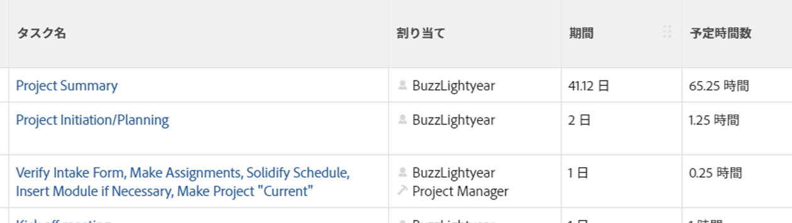
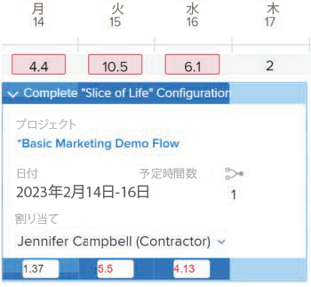

# 計画時間の概要

<!-- Audited: 01/2024 -->

タスク、タスク、またはプロジェクトに関連付けられた計画時間は、割り当てられたユーザーがタスク、タスク、またはプロジェクトを完了するのに必要な時間を表します。

## Adobe Workfrontでの予定時間に関する考慮事項

* 計画時間は、主にAdobe Workfrontの作業項目（タスクと問題）と関連しています。 作業項目からの計画時間は、プロジェクトの計画時間にロールアップされます。
* デフォルトでは、Workfrontはタスクまたはタスクの期間内のすべての日にタスクとタスクの計画時間を均等に配分します。
* ユーザーとロールがタスクとタスクに割り当てられると、タスクとタスクからの予定時間が、ユーザーまたはロールの割り当てに関連付けられます。
* Workfrontのリソース管理ツールを使用する場合は、タスクと問題に対して予定時間の値を定義する必要があります。
* 一部の期間タイプに対してのみ、タスクに対する計画時間の値を変更できます。

  タスクの期間タイプに関するタスクの予定時間の変更の詳細については、「 [期間タイプに基づくタスク予定時間の更新](#update-task-planned-hours-based-on-duration-type) 」を参照してください。

* 問題に関する計画時間の値は、いつでも変更できます。
* プロジェクトの計画時間または親タスクの値は、すべてのタスクとサブタスクの全計画時間の合計になるので、変更できません。
* リソース管理ツールを使用してユーザー割り当てを管理すると、タスク、タスク、問題、プロジェクトの予定時間数、および作業項目に関連付けられた割り当ての時間数が変わる場合があります。

## プロジェクトの計画時間と計画時間 {#planned-hours-on-tasks-vs-planned-hours-on-projects}

[ 予定時間 ] タスクから、プロジェクトの予定時間にロールアップします。 案件からの予定時間は、プロジェクトの予定時間には必ずしも含まれません。

この項では、タスクとプロジェクトの計画時間の違いについて説明します。 また、プロジェクトにまとまる問題の計画時間を表示できる場所も説明します。

### タスクに関する予定時間 {#planned-hours-on-tasks}

タスクの予定時間は、タスクの実績作業時間にかかる推定時間を示します。 デフォルトでは、Workfrontは各タスクの期間内に、各日に予定時間の合計を均等に配分します。 1 日の計画時間数は、タスクの 1 日の割り当てになります。 タスクが複数のリソースに割り当てられている場合、デフォルトでは、各リソースに 1 日の時間数が同じ割り当てられます。

ワークロード・バランサを使用して、タスクに割り当てられたユーザーの日次割り当てを変更できます。 これにより、タスクの期間の種類が「単純」の場合に、タスクの予定時間を更新することもできます。 詳細については、この記事の「ユーザー割り当てを管理する際のタスク予定時間の更新」の節を参照してください [ワークロードバランサーでのユーザー割り当ての管理](../../../resource-mgmt/workload-balancer/manage-user-allocations-workload-balancer.md).

タスクにサブタスクが含まれる場合、親タスクの予定時間は、任意のサブタスクに関するすべての予定時間の合計になります。 親タスクの予定時間は更新できません。

>[!NOTE]
>
>「計画時間」とは異なり、親タスクの実績時間は、親タスクに直接記録される時間です。 子タスクの実績時間の合計を表すものではありません。\
>実際の時間について詳しくは、 [実際の時間の表示](../../../manage-work/tasks/task-information/actual-hours.md).

### プロジェクトに関する計画時間 {#planned-hours-on-projects}

プロジェクトの予定時間数は編集できません。 プロジェクトの計画時間は、プロジェクトのすべてのタスクから計算されたすべての計画時間の合計です。

計画時間の計算に問題が含まれるかどうかは、計画時間を表示するプロジェクト内の場所によって異なります。 プロジェクト内の次の場所で、プロジェクトの計画時間を表示できます。

* **「プロジェクトの詳細」セクションと「プロジェクトを編集」ボックス**：プロジェクト上のタスクに関する予定時間のみが考慮されます。 [ プロジェクトの詳細 ] セクションまたは [ プロジェクトの編集 ] ボックスでプロジェクトの予定時間の合計数を表示する場合、プロジェクトの問題に対する予定時間は考慮されません。

* **ワークロードバランサー**：プロジェクトのワークロードバランサーに、ワークロードバランサーに表示されるタスクに関連付けられた計画時間のみが表示されます。 ユーザーの 1 日の割り当ては、ワークロードバランサーの 1 日の計画時間を変更できます。
* **使用率セクション**：タスクに割り当てられたユーザーとプロジェクトの問題に関連する計画時間は、「使用率」セクションでプロジェクトの計画時間の合計数を表示する際に考慮されます。
* **ロール割り当てパネル** タスク・リスト：ジョブ・ロールに割り当てられているタスクとプロジェクトのタスクの予定時間、またはジョブ・ロールに関連付けられているユーザーがこの領域に表示されます。 未割り当てまたはチームに割り当てられているタスクやタスクに関連する計画時間は、この領域には表示されません。 詳しくは、 [役割割り当てパネルでのプロジェクト予定時間の表示](../../../manage-work/projects/planning-a-project/view-planed-hours-in-role-allocation-panel.md).

## タスクの期間全体での計画時間の配分

デフォルトでは、Workfrontは、計画時間をタスクの期間全体に均等に配分し、プロジェクトスケジュールの可用性に応じて、タスクの 1 日ごとに計画時間数を均等に割り当てます。

たとえば、タスクを午後 4 時に開始するように設定し、スケジュールがタスクの最初の日に 1 時間残っている場合、Workfrontはタスクの最初の日に 1 時間計画時間を配置し、残りの予定時間をタスクの期間の残りの日間で均等に割り振ります。

>[!NOTE]
>
>1 日あたりの計画時間または 1 日あたりの配分は、タスクの期間中の各日の計画時間の配分です。 タスクに割り当てが 1 つある場合、この数は割り当てごとの予定時間数を表します。 タスクに複数の割り当てがある場合、割り当てごとの予定時間数は、タスクの [ 予定時間数/日 ] とは異なります。 複数の割り当てを持つタスクの日別予定時間数は、Workfrontに表示されません。

## 計画時間の値の検索と理解

計画時間の値は、Workfrontの様々な領域で検索できます。

表示される計画時間数は、プロジェクト上の作業項目に基づくものか、表示する領域とオブジェクトに応じて異なる方法で計算されます。

予定時間は、Workfrontの次の領域にあります。

* [プロジェクト、タスクまたはイシューの「詳細」セクション](#the-details-section-of-a-project-task-or-issue)
* [「タスクを編集」または「問題を編集」ボックス](#the-edit-task-or-edit-issue-box)
* [レポート](#reports)
* [ワークロードバランサー](#the-workload-balancer)
* [リソースプランナー](#the-resource-planner)
* [使用率レポート](#the-utilization-report)
* [役割割り当てパネル](#the-role-allocation-panel)

### プロジェクト、タスクまたはイシューの「詳細」セクション {#the-details-section-of-a-project-task-or-issue}

タスク、問題、またはプロジェクトの [ 詳細 ] セクションの [ 予定時間 ] は、アイテムに関連付けられた合計予定時間です。

プロジェクトの予定時間の詳細については、 [プロジェクトの計画時間と計画時間](#planned-hours-on-tasks-vs-planned-hours-on-projects) 」の節を参照してください。

### 「タスクを編集」または「問題を編集」ボックス {#the-edit-task-or-edit-issue-box}

タスクまたはタスクの [ 編集 ] ボックスの [ 予定時間 ] は、各アイテムの予定時間の合計です。

プロジェクトの予定時間の詳細については、 [プロジェクトの計画時間と計画時間](#planned-hours-on-tasks-vs-planned-hours-on-projects) 」の節を参照してください。

タスクの場合は、特定の期間タイプに対してのみ計画時間数を編集できます。 詳しくは、 [期間タイプに基づくタスク予定時間の更新](#update-task-planned-hours-based-on-duration-type) 」の節を参照してください。

「割り当て」領域で、タスクまたはタスクに割り当てられた各ユーザーまたはジョブの役割に対する計画時間の個々の割り当てを表示できます。

### レポート {#reports}

プロジェクト、タスクおよび発行レポートに、[ 予定時間 ] フィールドを追加できます。

既定では、[ 予定時間 ] 列はタスクリストの [ 標準 ] ビューに含まれます。

タスク、発行、またはプロジェクトの予定時間レポートは、各項目の [ 詳細 ] セクションまたは [ 編集 ] ボックスに表示される、各項目の合計予定時間です。

レポートの作成について詳しくは、 [カスタムレポートの作成](../../../reports-and-dashboards/reports/creating-and-managing-reports/create-custom-report.md).

>[!NOTE]
>
>プロジェクト（財務データ）レポートを作成し、日付別にグループ化する場合、計画時間には、プロジェクト上のタスクのタイムラインに応じて、プロジェクトの計画時間の一部が表示されます。 デフォルトでは、Workfrontはタスク期間の各日に対して予定時間を均等に配分します。 特定の期間の計画時間は、プロジェクト（財務データ）レポートのその期間のWorkfrontが設定した均等配分に一致します。

<!--
### The Scheduling areas  {#the-scheduling-areas}

The Planned Hours for tasks and issues display in the Scheduling areas in the Planned Hours field.

You can view the daily allocation of Planned Hours for each user assigned to a task or an issue in the Scheduling areas.

The daily hour amount represents one of the following:

* the default amount equally distributed by Workfront for each day of the Duration of the tasks or issues
* the adjusted daily allocation managed by resource managers.

  For information about adjusting daily allocations in the Scheduling tools, see [Manage user allocations in the Scheduling areas](../../../resource-mgmt/resource-scheduling/manage-allocations-scheduling-areas.md).
-->

### ワークロードバランサー {#the-workload-balancer}

タスク、タスクおよびプロジェクトに対する次の計画時間は、タスク、問題またはプロジェクト名の右側にあるワークロード・バランサに表示されます。

* タスクおよびタスクの場合は、それらに関連する予定時間が表示されます。
* プロジェクトの場合は、画面に表示されるタスクと問題からの計画時間数。

  >[!TIP]
  >
  >ワークロード・バランサは、プロジェクトの計画時間のすべてを、プロジェクトの「詳細」領域に表示されるように表示するわけではありません。

タスクまたはワークロードバランサーでタスクに割り当てられた各ユーザーの計画時間の日次割り当てを表示できます。

「計画時間」の 1 日の時間数は、次のいずれかを表します。 

* タスク、問題またはプロジェクトの期間の各日にWorkfrontが均等に配分するデフォルトの金額
* リソースマネージャが管理する調整済みの日次配分

  ワークロード・バランサでの日次割当ての調整の詳細は、 [ワークロードバランサーでのユーザー割り当ての管理](../../../resource-mgmt/workload-balancer/manage-user-allocations-workload-balancer.md).

### リソースプランナー {#the-resource-planner}

リソース・プランナは、プロジェクト、タスクおよびタスクの計画時間を表示します。

リソース・プランナの「PLN」列で、作業項目に関連付けられたユーザーとジョブのロールに対する計画時間の週次割当を表示できます。

>[!TIP]
>
>ワークロード・バランサの日次割当調整は、リソース・プランナのタスクと問題に対する週次割当に影響を与えます。

各オブジェクトの計画時間数は、リソース・プランナに適用するビューに応じて異なります。 詳しくは、 [リソースプランナーのプロジェクトビューとロールビューの時間、工数、コスト情報の概要](../../../resource-mgmt/resource-planning/overview-of-planner-hour-fte-cost-information-in-role-project-views.md).

タスクと問題に関する週次の予定時間数は、次のいずれかを表します。

* タスクまたは問題の期間の各日にWorkfrontが均等に配分するデフォルトの週別金額
* ワークロード・バランサのリソース・マネージャが管理する調整済の週次配分

  ワークロード・バランサでの日次割当ての調整の詳細は、 [ワークロードバランサーでのユーザー割り当ての管理](../../../resource-mgmt/workload-balancer/manage-user-allocations-workload-balancer.md).

プロジェクト、ユーザー、ロールの週別の金額は、タスクおよび関連する問題に関する週別の計画時間数の影響を受けます。

### 使用率レポート {#the-utilization-report}

プロジェクトの計画時間は、各タスクおよび発行の割り当てに関連付けられた時間です。

>[!IMPORTANT]
>
>なお、[ 稼働状況 ] レポートの [ 計画時間 ] は、タスクや問題自体ではなく、割り当てに関連付けられています。 [ 稼働状況 ] レポートの [ 計画時間 ] は、プロジェクトのタスクと問題に関する [ 計画時間 ] と必ずしも一致しません。 ただし、予定時間は、タスクおよびタスクに関する割り当てに関連する時間と一致します。

「稼働状況」レポートには、次のタイプの計画時間が表示されます。

* 含まれるプロジェクトの全期間にわたる、プロジェクト上のすべての割り当ての計画時間の合計
* 指定した日付範囲のすべての割り当ての計画時間の合計（個々の週または月を指定できます）。

  ワークロード・バランサを使用してユーザーの日次割り当てを調整した場合、使用率レポートで選択した日付にタスクの期間または問題の期間の一部のみが含まれている場合は、特定の日付範囲の計画時間に影響が及ぶ可能性があります。 ユーザーの日次配分の調整について詳しくは、 [ワークロードバランサーでのユーザー割り当ての管理](../../../resource-mgmt/workload-balancer/manage-user-allocations-workload-balancer.md).

詳しくは、 [リソース使用率情報の表示](../../../resource-mgmt/resource-utilization/view-utilization-information.md).

### 役割割り当てパネル

[ 役割の割り当て ] パネルの [ 計画時間 ] は、プロジェクトの全期間にわたって、タスクまたは問題に割り当てられた各ジョブの役割に関連する計画時間数を表します。 この数値は、リソース・プランナからのロール「計画時間」に一致します。

>[!TIP]
>
ユーザーに関連付けられた計画時間は、役割割り当てパネルに表示されません。

詳しくは、 [ワークロードバランサーのプロジェクトおよびイニシアチブの役割割り当てを表示します](../../../scenario-planner/show-role-allocation-workload-balancer.md).

## 期間タイプに基づくタスク予定時間の更新 {#update-task-planned-hours-based-on-duration-type}

タスクの期間タイプが特定の場合に限り、タスクの編集時にタスクの計画時間の合計を更新できます。

次のシナリオが存在します。

* タスクの予定時間は、タスクの編集時に [ 計算された割り当て ] または [ 標準の期間の種類 ] を使用した場合にのみ変更できます。

  計算された割り当て期間の種類の詳細については、 [期間タイプの概要：計算割り当て](../../../manage-work/tasks/taskdurtn/calculated-assignment.md).

  シンプルな期間のタイプについて詳しくは、 [期間タイプの概要：シンプル](../../../manage-work/tasks/taskdurtn/simple-duration-type.md).

* タスクへのユーザーの割り当てを管理する際には、単純期間タイプのタスクに対してのみ、ワークロード・バランサのタスク計画時間を更新できます。 ワークロード・バランサでのユーザー割り当ての管理の詳細は、 [ワークロードバランサーでのユーザー割り当ての管理](../../../resource-mgmt/workload-balancer/manage-user-allocations-workload-balancer.md).
* 期間タイプが「作業主導」または「計算作業時間」のタスクに対しては、計画時間を変更できません。 この場合、Workfrontはタスクの期間に基づいて計画時間を決定します。ただし、この場合、計画時間は常に期間（時間）と等しく、割り当てられたリソースの割合配分の影響を受けません。

  労力に基づく期間タイプの詳細は、 [期間タイプの概要：労力に基づく](../../../manage-work/tasks/taskdurtn/effort-driven.md).

  計算された期間のタイプについて詳しくは、 [期間タイプの概要：計算作業時間](../../../manage-work/tasks/taskdurtn/calculated-work.md).

## ユーザー割り当て管理時のタスク計画時間の更新

タスクに対するユーザーまたはジョブの役割の割り当てを手動で更新する場合は、タスクの予定時間を更新できます。 これは、タスクの期間タイプがシンプルの場合にのみ可能です。

詳しくは、 [期間タイプの概要：シンプル](../../../manage-work/tasks/taskdurtn/simple-duration-type.md).

ワークロード・バランサを使用する際に、タスクに割り当てられたユーザーとロールの全体割り当てを更新するか、ユーザーの日次割り当てを更新できます。

タスクの全体的なユーザーおよびジョブの役割の割り当てを管理する方法については、 [タスクに関するユーザーと役割の割り当て時間を管理](../../../manage-work/tasks/assign-tasks/manage-allocation-hours-on-tasks.md).

タスクの日次割り当ての管理について詳しくは、 [ワークロードバランサーでのユーザー割り当ての管理](../../../resource-mgmt/workload-balancer/manage-user-allocations-workload-balancer.md).

タスクのユーザーロールまたはジョブロールの割り当てを手動で更新する場合、次のシナリオが存在します。

* 個々のユーザーまたはロールの割り当てを手動で更新して、タスク「計画時間」に対する変更をトリガーしない場合、タスクの割り当てを追加、削除、または置換する際に、計画時間は変更されません。 タスクに新しい割り当てを追加すると、個々の割り当てがすべての担当者間で再配分されます。
* 割付を手動で更新してタスク「計画時間」に対する変更をトリガーすると、タスクから割り当てを削除すると、計画時間が減少します。 割り当てを置き換えても、変更されない状態が保たれます。
* 割当てを手動で更新して、タスクに対する変更をトリガーし、タスクに割り当てを追加した場合、新しい割り当ては、既定で 0 時間割り当てられます。 タスクに対する配分を手動で更新する必要があります。これは、予定時間に影響を与える可能性があります。
* 割当を手動で更新して、タスク「計画時間」に対する変更をトリガーし、タスクに対するすべての割当を削除した場合、「計画時間」は変更されません。
* 割付を手動で更新して、タスクに対する変更をトリガーし、タスクに対するすべての割り当てを削除すると、「予定時間」も削除され、タスクの「予定時間」は 0 になります。

>[!NOTE]
>
例えば、タスクに 10 時間の計画時間があり、2 人の担当者がある場合、デフォルトでは各割り当て時間は 5 時間になります。
>
* ワークロード・バランサを使用して個々のユーザー割り当てまたは日次割り当てを更新せず、タスクから担当者の一部または全部を削除した場合、「計画時間」タスクは 10 時間のままです。
* 割当ての割当てを 4 時間と 6 時間に手動で変更し、6 時間に割り当てられたユーザーとその職務ロールを削除すると、「計画時間」タスクは 4 時間に更新されます。 4 時間に割り当てられているユーザーも削除し、削除したユーザーに関連付けられたジョブの役割を維持した場合、タスクの予定時間は 4 時間のままです。 4 時間に割り当てられた最後のユーザーと、そのジョブの役割が未割り当てのままの場合、タスク「計画時間」は 0 になります。

## 作業工数を使用してタスクの計画時間を自動的に更新

作業量を使用してタスクの完了に必要な作業量を見積もると、タスクの計画時間数が自動的に更新されます。 これは、単純期間タイプのタスクに対してのみ可能です。

作業量を使用して作業量を見積もる方法については、 [作業量の概要](../../../manage-work/tasks/task-information/work-effort.md).

<!--

(NOTE: this issue has the explanation of how Planned Hours should work - from Vazgen and Anna: https://hub.workfront.com/issue/6217dced00730b7034c4b808339a35ce/

-->

<!--

Details of their comments: 

-->

<!--

Anna Asatryan

3/22/2022 At 3:16 PM

&nbsp;

to Mark Paul, Corrie Butler, Arman Simonyan, Gagik Khalatyan, Alina Wilson, Artur Sargsyan, Vazgen Babayan, Anna Asatryan

I have done some rough calculations on what the planned hours/revenues should look like Book.xlsx . And if we look, for example at the 2 users highlighted in one of the screenshots their planned hours look way off from what the calculation looks like in the spreadsheet (i.e. equally distributed allocation). When looking at the Workload balancer (the second screenshot), as an example for the user Yashas Mitta, I can see that the allocation has been modified. Obviously the utilization report calculates the allocations based on the modified contouring using the new work per day calculation. The project financial report uses the old, equal distribution of allocation along the full duration of the task. Hence. there is a difference when grouping per periods.

Vazgen Babayan

I believe we will need to prioritise syncing the project financial data report with the new work per day.

Alina Wilson

@Anna Asatryan , do you have a definition of what we should say in documentation (glossary, for example) for how the Planned Hours (or Planned Revenue) is calculated, keeping in mind that we don't document the concept of "workPerDay". We call them "daily allocations", for example, but let me know if that's accurate, too.

Vazgen Babayan

Last Thursday at 3:13 PM

I think an important note here is that regardless the calculation, even if the both views used the same formula, they will not display the same data, because the underlying data sources are different. The Financial Data report does not respect user-entered allocations in Workload Balancer at this moment. So there will be a clear discrepancy, as Anna showed in her message. My recommendation for communication will be to explain that the data sources are different so there can be a mismatch in data and that we will look into addressing that on our roadmap.

Alina Wilson

So far, I hear you guys say this (with my questions for confirmation/ comments in bold):

- the utilization report calculates the allocations based on the modified contouring using the new work per day calculation (so this is what we see in the Workload Balancer, right?)

- the project financial report uses the old, equal distribution of allocation along the full duration of the task (this is before the daily allocations for example were modified in the WB, right?)

I have these additional questions:

- what does the Project Details show? Which Planned Hours, for instance - because earlier, we had a question about this also. - which numbers?

- what does any Planned Hours/ Planned Revenue field that can be pulled in any other report (outside of Financial Data and Utilization reports) show? - which numbers?

- are there any other areas I am not thinking of that we need to document, @Corrie Butler

I will try to document all the possible areas where these display but please help. Thanks!

Vazgen Babayan

Last Saturday at 3:41 PM

<ul>
<li> 
Confirming the first two points 
 </li>
</ul>

For the following questions

<ul>
<li> 
Project details show an aggregated sum of task planned hours. It doesn't have anything to do with the work per day because it always deals with total numbers for the whole duration of the Project/Task.
 </li>
<li> 
Same thing applies to the Planned Hours and Planned Revenue fields in reports - they show totals for the whole Project/Task duration and thus have no use of work per day.
 </li>
<li> 
Can't think of any other fields related to this right now.
 </li>
<li> 
In general, if I were to summarize the system behavior, it's as follows:
 </li>
<li> 
Every area that only deals with total numbers of Planned Hours / Planned Revenue, uses the numbers entered on the tasks. Those are Task / Project Details, reports exposing those fields.
 </li>
<li> 
Areas that deal with time-sensitive portions of Planned Hours / Planned Revenue, use work per day. Those are all Resource Management tools - Workload Balancer, Resource Planner, Utilization Report, importing projects via Scenario Planner.
 </li>
<li> 
All the areas in the second point support user-edited allocations made in Workload Balancer.
 </li>
<li> 
Scheduling area and Project Financial Data reports use the old version of the work per day, which doesn't respect user-edited allocations from Workload Balancer.
 </li>
<li> 
Scheduling will be removed this year, and we need to do work to move the Project Financial Data reports to the new work per day sometime after Q3.
 </li>
</ul>

Alina Wilson

@Vazgen Babayan , one clarifying question: when you say "Scheduling and Project Financial Data reports use the old version of the work per day, which doesn't respect user-edited allocations from WB" - you mean that those use the system default which spreads the allocations evenly, correct? Because you can edit (daily) allocations in Scheduling tools, but it doesn't use that, correct? It uses the default of the daily allocation that the system figures out when dividing the Planned Hours by the number of days in the Duration. Please let me know. And thanks!

Anna Asatryan

Yesterday at 11:42 AM

@Alina Wilson , that's correct, when saying "Scheduling and Project Financial Data reports use the old version of the work per day, which doesn't respect user-edited allocations from WB" Vazgen meant that it spreads the allocation evenly.

As for the scheduling, the allocation modification that's being done there isn't reflected anywhere else in the application other than in the Scheduling itself. That's probably one of the reasons it's being deprecated.

-->

<!--

   

-->

<!--

(NOTE: everything below is drafted because I replaced it with the table above)

-->

<!--

You can find the Planned Hours information on tasks, issues, or projects in the following locations:

-->

<!--

The Planned Hours in the Details  section  of a task, issue, or project are the total Planned Hours of the respective item. 

Finding the Planned Hours in the Details  section  is identical for tasks, issues, and projects. 
 <note type="tip">
You cannot edit the Planned Hours of projects manually, as they are a calculation of all Planned Hours of all the tasks on the project.
</note>

To locate the Planned Hours value on the Details  section  of a task: 

<ol>
<li value="1">Go to a task for which you want to review the Planned Hours.</li>
<li value="2"> 
Click <strong>Task Details</strong> in the left panel. 
 </li>
<li value="3"> 
Click the <strong>Overview</strong> area and notice the Planned Hours value.
 
This value represents the time it would take the user assigned to the task to complete it. 
 </li>
</ol>

-->

<!--

<h3> </h3>

The Planned Hours in the Edit box of a task, issue, or project are the total Planned Hours of the respective item. 

Finding the Planned Hours while editing a task or an issue is identical. 
 <note type="tip">
You cannot edit the Planned Hours of projects manually, as they are a calculation of all Planned Hours of all the tasks on the project.
</note>

To locate the value of Planned Hours while editing a task:

<ol>
<li value="1">Go to the task or issue you want to view Planned Hours for.</li>
<li value="2"> 
Click the <strong>More</strong> icon  next to the task name, then click <strong>Edit</strong>.
 
The Planned Hours are located in the <strong>Overview</strong> section. 
 </li>
</ol>

-->

<!--

The Planned Hours column is included in the Standard view of a task list, by default. For issues and projects, you can add it to the view, when you are editing the view or when you build a report. 

The Planned Hours in a task, issue, or project report are the total Planned Hours of the respective item as they display in the Details  section  or the Edit box of the items. 

Adding the Planned Hours column to a project view is similar to building a view in a project report. 

To show Planned Hours in a project report:

<ol>
<li value="1"> 
Click the <strong>Main Menu</strong> icon  in the upper-right corner of Workfront, then click <strong>Reports</strong>. 
 </li>
<li value="2">Click <strong>New Report</strong>, then choose <strong>Project</strong> as your object.</li>
<li value="3">Click <strong>Add Column</strong>, and start typing <strong>Planned Hours</strong> when the <strong>Show in this column</strong> drop-down field is displayed. Select the field when it appears in the list.</li>
<li value="4"> 
Click <strong>Save + Close</strong> to save the report. 
 
The Planned Hours column shows the total number of Planned Hours on each project. 
 </li>
</ol>

-->

<!--

Planned Hours in Resource Management tools
 <note type="important">
When viewing Planned Hours in the Resource Management tools by a specific time frame, the daily allocations for each work item and the daily allocations for the resources assigned to the work items during that time frame can influence the daily Planned Hours of projects or work items.
</note>

You can see the value of Planned Hours for your tasks, issues, or projects when using the following Resource Management tools:

<ul>
<li> 
Resource Planner
 
For information about using the Resource Planner, see <a href="../../../resource-mgmt/resource-planning/get-started-resource-planner.md" class="MCXref xref">Resource Planner overview</a>.
 </li>
<li> 
Utilization Report.
 
For information about the utilization report, see <a href="../../../reports-and-dashboards/reports/using-built-in-reports/resource-utilization-report.md" class="MCXref xref">Overview of the Resource Utilization report</a>.
 </li>
<li>

Workload Balancer or Scheduling areas in the following sections:

<ul>
<li>Scheduling or Workload Balancer sections in the Resourcing area</li>
<li>Scheduling or Workload Balancer section at the project level</li>
<li>Schedule or Workload Balancer section at the team level</li>
</ul>

 
For information about scheduling resources, see <a href="../../../resource-mgmt/resource-scheduling/get-started-resource-scheduling.md" class="MCXref xref">Get started with Resource Scheduling</a>.
 
For information about the Workload Balancer, see <a href="../../../resource-mgmt/workload-balancer/overview-workload-balancer.md" class="MCXref xref">Workload Balancer overview</a>. 
 </li>
<li> 
<b>Role Allocation panel</b> in the project  task list or  Workload Balancer: The Planned Hours for the tasks and the issues on the project that are assigned to a job role or a user associated with a job role are taken into account in this area. For more information, see <a href="../../../manage-work/projects/planning-a-project/view-planed-hours-in-role-allocation-panel.md" class="MCXref xref">View project Planned Hours in the Role Allocation panel</a>. 
 </li>
</ul>

-->
