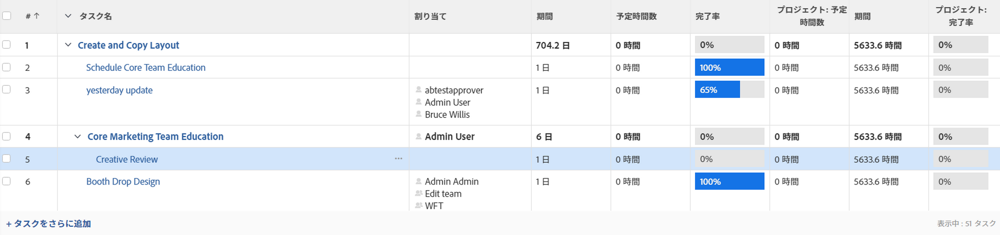
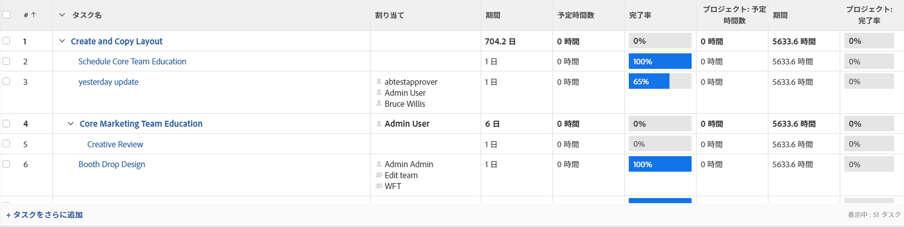

# プロジェクトの完了率の概要

プロジェクトのプロジェクト完了率値は、プロジェクト内のタスクの予定期間または予定時間数のいずれかに基づいて計算されます。Adobe Workfront 管理者またはグループ管理者は、プロジェクト環境設定エリアで情報を設定するときに、システムの完了率を計算するときに考慮される値を定義します。

プロジェクト環境設定について詳しくは、[システム全体のプロジェクト環境設定](../../../administration-and-setup/set-up-workfront/configure-system-defaults/set-project-preferences.md)を参照してください。

プロジェクトの完了率は、その各サブタスクの期間または予定時間数に基づいています。

同様に、プロジェクトの完了率は、プロジェクト内の各主要タスクの期間または予定時間数に基づいています。

主要なタスクは、親タスクと子のないスタンドアロンタスクです。

>[!TIP]
>
>主要なタスクはプロジェクト計画ではインデントされません。

## Workfront による完了率計算方法

* [タスクの完了率を更新](#update-the-percent-complete-on-a-task)
* [Workfront による親タスクの完了率の計算方法](#how-workfront-calculates-percent-complete-on-a-parent-task)
* [Workfront によるプロジェクトの完了率の計算方法](#how-workfront-calculates-percent-complete-on-a-project)

### タスクの完了率を更新 {#update-the-percent-complete-on-a-task}

タスクの完了率を手動で変更できます。これは計算ではありません。

Workfront は、個々のタスクの完了率を使用して、その親タスクの完了率またはプロジェクトの完了率を計算します。

タスクの完了率の更新については、[タスクの完了率の表示と更新](../../../manage-work/projects/updating-work-in-a-project/view-update-percent-complete-for-tasks.md)を参照してください。

### Workfront による親タスクの完了率 {#how-workfront-calculates-percent-complete-on-a-parent-task}

Workfront またはグループ管理者がシステムまたはグループレベルでプロジェクト環境設定で選択した内容に応じて、親タスクの完了率は、タスクの期間または予定時間数のいずれかに基づいて計算されます。

次のシナリオを考慮してください。

* システムが予定時間数に基づいて完了率を計算する場合、親タスクの完了率は次の式を使用して計算されます。

  `Parent Task Percent Complete = (((Task 1 Planned Hours * Task 1 Percent Complete) + (Task 2 Planned Hours * Task 2 Percent Complete))/Total Planned Hours of Parent)*100`

  親の合計予定時間数は、各子のすべての予定時間数の合計を表します。

  

* システムが期間に基づいて完了率を計算する場合、親タスクの完了率は次の式を使用して計算されます。

  `Parent Task Percent Complete = (((Task 1 Duration * Task 1 Percent Complete) + (Task 2 Duration * Task 2 Percent Complete))/ Total Duration of Parent)*100`

  

  >[!IMPORTANT]
  >
  >親タスクの合計期間は、子タスクのすべての期間の合計です。例えば、それぞれの期間が 1 日と 2 日である 2 つの子を持つ親タスクは、2 つの子が同じ日に開始可能できる場合でも、合計期間は 3 日になります。

### Workfront によるプロジェクトの完了率の計算方法 {#how-workfront-calculates-percent-complete-on-a-project}

ワークフロントまたはグループ管理者がシステムレベルまたはグループレベルでプロジェクト環境設定で選択した内容に応じて、プロジェクトの完了率は、プロジェクトの主要タスクの期間または予定時間数のいずれかに基づいて計算されます。

* システムが予定時間数に基づいて完了率を計算する場合、プロジェクトの完了率は次の式を使用して計算されます。

  `Project Percent Complete =(((Task 1 Planned Hours * Task 1 Percent Complete) + (Task 2 Planned Hours * Task 2 Percent Complete))/Total Planned Hours of the Project)*100`

  プロジェクトの合計予定時間数は、プロジェクトのすべての主要タスクの予定時間数の合計です。

  

  >[!NOTE]
  >
  >タスク 1 またはタスク 2 は、親タスクまたはスタンドアロンタスクのみにすることができます。子タスクの予定時間数と完了率は、この計算では使用されません。

* システムが期間に基づいて完了率を計算する場合、プロジェクトの完了率は次の式を使用して計算されます。

  `Project Percent Complete = (((Task 1 Duration * Task 1 Percent Complete) + (Task 2 Duration * Task 2 Percent Complete))/Duration of the Project)*100`

  >[!IMPORTANT]
  >
  >プロジェクトの期間は、完了率が表示される主要タスクのすべての期間の合計です。例えば、期間が 2 日のスタンドアロンタスクと期間が 5 日の親タスクがあり、それらの作業が完了しているプロジェクトでは、2 つのタスクが同じ日に開始できる場合でも、合計期間は 7 日になります。

  

  >[!NOTE]
  >
  >タスク 1 またはタスク 2 は、親タスクまたはスタンドアロンタスクのみにすることができます。子タスクの期間および完了率は、この計算では使用されません。

## 期間を使用したプロジェクトの完了率の例完了率

タスクの期間を使用してプロジェクトの完了率を計算する場合は、次の例を考慮してください。

次の情報は、プロジェクトの完了率を計算するために使用されます。

* スタンドアロンタスクの完了率（タスク 1 ～ 20%）
* 親タスクの完了率（タスク 2 - 25%）
* タスク 1 の期間（5 日）
* タスク 2 の期間（2 日）
* プロジェクトの期間（7 日）

期間を使用してプロジェクトの完了率を計算するには、次の手順を実行します。

`Project Percent Complete = (((Task 1 Duration * Task 1 Percent Complete) + (Task 2 Duration * Task 2 Percent Complete))/Duration of the Project)*100`

または

`(((5*0.2)+(2*0.25))/7)*100= 21.43%`

<!--drafted, this was the old example:

When using the Planned Duration of the tasks to calculate the percent complete of a project, consider the following example:

percent_complete_on_project_example.png

Only the parent task (Task 1) and the standalone task (Task 8) are used to calculate the percent complete of the project.

The secondary parents of Task 1 are used to calculate the percent complete of the main parent (Task 1).

To calculate the percent complete of the main parent (Task 1), first calculate the percent complete of its secondary parents:

Task 5 Percent Complete = ((14 * 0.75 + 12 * 0.25)/(12 + 14))*100 = 51.92%

Task 2 Percent Complete = ((5 * 0.7 + 2 * 0.5)/(5 + 2))*100 = 64.29 %

Then, to calculate the percent complete of the main parent (Task 1), use the following formula:

Task 1 Percent Complete =((56 * 0.5192 + 7 * 0.6429)/63)*100 = 53.29%

To calculate the percent complete of the project, you will need to have the following numbers ready:

Task 1 Duration (63 hours) and Percent Complete (53.29%)
Task 8 Duration (100 hours) and Percent Complete (4%)
Now, to calculate the percent complete of the project, use the following formula:

Project Percent Complete =((100 * 0.04 + 63 * 0.5329))/163)*100 = 23.05%
-->