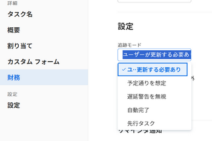

# タスクのトラッキングモードの設定

Adobe Workfront でタスクの進捗状態がどのように更新されるかは、タスクのトラッキングモードで決まります。

タスクのトラッキングモードについては、[タスクのトラッキングモードの概要](../../../manage-work/tasks/task-information/task-tracking-mode.md)を参照してください。

## アクセス要件

<!--drafted for P&P - replace the table:

<table style="table-layout:auto"> 
 <col> 
 <col> 
 <tbody> 
  <tr> 
   <td role="rowheader"><a href="https://www.workfront.com/plans" target="_blank">Adobe Workfront plan</a>*</td> 
   <td> 
Any
 </td> 
  </tr> 
  <tr> 
   <td role="rowheader"><a href="../../../administration-and-setup/add-users/access-levels-and-object-permissions/wf-licenses.md" class="MCXref xref">Adobe Workfront licenses overview</a>*</td> 
   <td> 
Current license: Standard
 
   Or
   
Legacy license: Work or higher
 
   </td> 
  </tr> 
  <tr> 
   <td role="rowheader">Access level configurations*</td> 
   <td> 
Edit access to Tasks 
 
<b>NOTE</b>
   
   If you still don't have access, ask your Workfront administrator if they set additional restrictions in your access level. For information on how a Workfront administrator can modify your access level, see <a href="../../../administration-and-setup/add-users/access-levels-and-object-permissions/wf-licenses.md" class="MCXref xref">Adobe Workfront licenses overview</a>
 </td> 
  </tr> 
  <tr> 
   <td role="rowheader">Object permissions</td> 
   <td> 
Manage permissions on a task
 
For information on requesting additional access, see <a href="../../../workfront-basics/grant-and-request-access-to-objects/request-access.md" class="MCXref xref">Request access to objects </a>.
 </td> 
  </tr> 
 </tbody> 
</table>
-->

この記事の手順を実行するには、次のアクセス権が必要です。

<table style="table-layout:auto"> 
 <col> 
 <col> 
 <tbody> 
  <tr> 
   <td role="rowheader"><a href="https://www.workfront.com/plans" target="_blank">Adobe Workfront プラン</a>*</td> 
   <td> 
任意
 </td> 
  </tr> 
  <tr> 
   <td role="rowheader"><a href="../../../administration-and-setup/add-users/access-levels-and-object-permissions/wf-licenses.md" class="MCXref xref">Adobe Workfront ライセンスの概要</a>*</td> 
   <td> 
ワークまたはそれ以上
 </td> 
  </tr> 
  <tr> 
   <td role="rowheader">アクセスレベル設定*</td> 
   <td> 
タスクへのアクセスを編集 
 
メモ：まだアクセス権がない場合は、アクセスレベルに追加の制限が設定されていないかどうか Workfront 管理者にお問い合わせください。Workfront 管理者がアクセスレベルを変更する方法について詳しくは、<a href="../../../administration-and-setup/add-users/access-levels-and-object-permissions/wf-licenses.md" class="MCXref xref">Adobe Workfront ライセンスの概要</a>を参照してください。
 </td> 
  </tr> 
  <tr> 
   <td role="rowheader">オブジェクト権限</td> 
   <td> 
タスクの管理権限
 
追加のアクセス権のリクエストについて詳しくは、<a href="../../../workfront-basics/grant-and-request-access-to-objects/request-access.md" class="MCXref xref">オブジェクトへのアクセス権のリクエスト</a>を参照してください。
 </td> 
  </tr> 
 </tbody> 
</table>

&#42;保有するプラン、ライセンスタイプ、アクセス権を確認するには、Workfront 管理者にお問い合わせください。

## タスクのトラッキングモードの設定

トラッキングモードを設定するには、次の手順に従います。

1. トラッキングモードを設定するタスクに移動します。
1. タスク名の横にある&#x200B;**その他**&#x200B;アイコン  をクリックしたあと、「**編集**」をクリックします。

   タスクの編集ダイアログボックスが開きます。

1. 「**設定**」セクションで、**トラッキングモード**&#x200B;ドロップダウンメニューを使用して、タスクのトラッキングモードを選択します。

   

1. 次のオプションから選択します。

   * ユーザーが更新する必要あり（これがデフォルトのオプションです）
   * 予定通りを想定
   * 遅延警告を無視
   * 自動完了
   * 先行タスク

   トラッキングモードのオプションについて詳しくは、[タスクのトラッキングモードの概要](../../../manage-work/tasks/task-information/task-tracking-mode.md)を参照してください。

1. 「**保存**」をクリックします。
