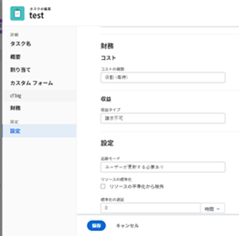

# タスクの平準化遅延の更新

プロジェクトのタスクスケジュール間に競合が生じる場合があります。 リソースとタスクを再スケジュールして、すべてのタスクを実際のスケジュール内で完了できるように、リソースのレベルを上げたり、リソースの競合に対処したりできます。 タスクの平準化の詳細については、 [ガントチャートのリソースレベル設定](../../../manage-work/gantt-chart/use-the-gantt-chart/level-resources-in-gantt.md).

プロジェクトマネージャまたはタスクの担当者として、個々のタスクに平準化遅延を追加して、リソースまたはスケジュールの競合を考慮することもできます。 つまり、Adobe Workfrontでタスクをレベル付けすると、より現実的なスケジュールに従ってリソースの競合を回避できるように、遅延を伴ってタスクをスケジュールする場合があります。

タスクに平準化遅延を追加すると、タスクの [ 完了予定日 ] が調整されます。 完了予定日について詳しくは、 [プロジェクト、タスクおよび問題に関する予定完了日の概要](../../../manage-work/projects/planning-a-project/project-projected-completion-date.md).

## アクセス要件

この記事の手順を実行するには、次のアクセス権が必要です。

<table style="table-layout:auto"> 
 <col> 
 <col> 
 <tbody> 
  <tr> 
   <td role="rowheader">Adobe Workfront plan*</td> 
   <td> 
任意
 </td> 
  </tr> 
  <tr> 
   <td role="rowheader">Adobe Workfront license*</td> 
   <td> 
仕事以上
 </td> 
  </tr> 
  <tr> 
   <td role="rowheader">アクセスレベル設定*</td> 
   <td> 
タスクおよびプロジェクトへのアクセスを編集
 
注意：まだアクセス権がない場合は、Workfront管理者に、アクセスレベルに追加の制限を設定しているかどうかを問い合わせてください。 Workfront管理者がアクセスレベルを変更する方法について詳しくは、 <a href="../../../administration-and-setup/add-users/configure-and-grant-access/create-modify-access-levels.md" class="MCXref xref">カスタムアクセスレベルの作成または変更</a>.
 </td> 
  </tr> 
  <tr> 
   <td role="rowheader">オブジェクト権限</td> 
   <td> 
タスクに対する権限の管理 
 
プロジェクトに対する権限の寄稿
 
追加のアクセス権のリクエストについて詳しくは、 <a href="../../../workfront-basics/grant-and-request-access-to-objects/request-access.md" class="MCXref xref">オブジェクトへのアクセスのリクエスト </a>.
 </td> 
  </tr> 
 </tbody> 
</table>

&#42;保有しているプラン、ライセンスの種類、アクセス権を確認するには、Workfront管理者に問い合わせてください。

## タスクに平準化延期期間を追加する

1. 平準化延期期間を追加するタスクに移動します。
1. 次をクリック： **その他のアイコン** タスク名の右に移動し、 **編集**.

   

1. クリック **設定**.

   

1. 次を指定： **平準化遅延**、時間単位で、時間の単位を選択します。\
   リソースの競合が原因で、リソースがタスクの開始を遅らせる時間です。

   時間の単位に対して、次のオプションから選択します。

   * 分
   * 時間. これがデフォルトです。
   * 日
   * 週
   * 月
   * 経過時間数 (分)
   * 経過時間数
   * 経過日数
   * 経過週数
   * 経過月数

   >[!TIP]
   >
   >経過時間は、タスクの期間の時間の単位です。 休日、週末、休日を含むタスクの計画開始日から計画完了日までの時間です。 つまり、経過時間は暦日の経過です。

1. クリック **保存**. 

 
