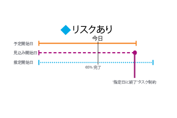
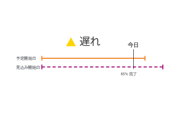
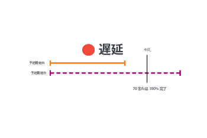

# タスクの進捗状況ステータスの概要

Adobe Workfrontは、タスクのタイムライン全体でのタスクの進行状況を調べることで、タスクの進捗状況ステータスを決定します。 タスクの進捗状況ステータスの値に基づいて、プロジェクトの条件を決定するようにWorkfrontを設定できます。 プロジェクトの条件の設定について詳しくは、この記事を参照してください。 [プロジェクト条件と条件タイプの概要](../../../manage-work/projects/manage-projects/project-condition-and-condition-type.md).

## タスクの進捗状況ステータスを決定する条件

プロジェクトの進捗状況ステータスについて詳しくは、 [プロジェクトの進行状況ステータスの概要](../../../manage-work/projects/planning-a-project/project-progress-status.md).

タスクの進行状況の追跡について詳しくは、 [タスクトラッキングモードの概要](../../../manage-work/tasks/task-information/task-tracking-mode.md).

タスクの進捗状況ステータスは、以下の条件に基づいて決定されます。

<table> 
 <col> 
 <col> 
 <thead> 
  <tr> 
   <th> 
<strong>進捗状態</strong> 
 </th> 
   <th> 
<strong>条件の決定</strong> 
 </th> 
  </tr> 
 </thead> 
 <tbody> 
  <tr valign="top"> 
   <td scope="col"> 
 
 
<strong>予定通り</strong> 
 </td> 
   <td scope="col"> 
タスクが考慮されます <strong>オンタイム</strong> すべての計画日が予定日と一致する場合 また、この進捗状況ステータスは、プロジェクトが予定より早く、予定日が予定日より前になる可能性もあります。
 
予定日について詳しくは、 <a href="../../../manage-work/projects/planning-a-project/project-projected-completion-date.md" class="MCXref xref">プロジェクト、タスクおよび問題に関する予定完了日の概要</a>.
 
「計画完了日」タスクの詳細は、次の記事を参照してください。
 
    <ul> 
     <li> 
<a href="../../../manage-work/tasks/task-information/task-planned-start-date.md" class="MCXref xref">タスクの計画開始日の概要</a> 
 </li> 
     <li> 
<a href="../../../manage-work/tasks/task-information/task-planned-completion-date.md" class="MCXref xref">タスクの概要計画完了日</a> 
 </li> 
    </ul> </td> 
  </tr> 
  <tr> 
   <td>

 
<strong>リスクあり</strong> 
 </td> 
   <td>
タスクが考慮されます <strong>リスク</strong> 「推定完了日」が「計画完了日」より後で、「予定完了日」より後の場合。 これは、タスクに <strong>終了日</strong> または <strong>開始日</strong> ただし、完了率またはタスクの先行タスク関係は、指定した日付で終了または開始できないことを示します。 

 タスク制約の設定 <strong>終了日</strong> 計画完了日を特定の日付に手動で設定します。 この例の「予定完了日」は、計画完了日と一致します。 この制約の場合、Workfrontはタスクを分析し、完了率に基づいて、タスクが終了するタイミングを計算します。 この計算は、「予定期限」として保存されます。 「予定期日」が「予定完了日」より後の場合、タスクは遅延するリスクがあると見なされます。 
 
 タスク制約の設定 <strong>開始日</strong> 計画開始日を特定の日付に手動で設定します。 この例では、「予定開始日」が「計画開始日」と一致します。 この制約の場合、Workfrontはタスクを分析し、先行タスクとの関係に基づいて開始するタイミングを計算します。 この計算は「予定開始日」として保存されます。 指定した開始日にタスクを開始できない強制先行タスクがある場合、[ 予定開始日 ] は [ 予定完了日 ] より後になる場合があります。 タスクが遅れるリスクがあると見なされます。 
 
注意：通常、推定日は、次の場合を除き、推定日と一致します。 <strong>開始日</strong> または <strong>終了日</strong> が使用されます。 この場合、推定日は、完了率およびその他の要因（先行関係）に基づいて引き続き計算されますが、予定日は、手動で設定された計画日と一致させられます。
 </td> 
  </tr> 
  <tr> 
   <td> 
<strong>遅れ</strong> 
 </td> 
   <td> 
タスクは <strong>後ろ</strong> 「予測完了日」が「計画完了日」より後か、予測完了日より前の場合。
 
「予測完了日」は、前の進捗状況に基づいてタスクが完了するタイミングをリアルタイムで表示します。 タスクは遅れて開始されましたが、「計画完了日」と「予定完了日」は未来の日付であり、タスクは予定どおりに完了する可能性があるので、まだ遅れているとは見なされません。
 
注意：この <strong>後ろ</strong> および <strong>リスク</strong> 進行状況のステータスは、ほぼ同じです。 しかし、 <strong>リスク</strong> いずれか、または両方の予定日に、強制的にタスク制約（終了日、開始日、固定日付）が設定されていることを示します。 タスクに強制制約がない場合、予測日は推定日と同じになり、現在のタスクの進捗状況に基づく完了日のシステム計算が反映されます。 「計画完了日」と「予定完了日」は未来のままであり、タスクが予定どおりに完了している可能性があるので、タスクはまだ遅延と見なされません。 推定日および推定日について詳しくは、 <a href="../../../manage-work/tasks/task-information/differentiate-projected-estimated-dates.md" class="MCXref xref">予測日と推定日の区別 </a>.
 </td> 
  </tr> 
  <tr valign="top"> 
   <td> 
<strong>遅延</strong> 
 </td> 
   <td> 
タスクは <strong>遅延</strong> 計画完了日が今日の日付より前の場合。 
 </td> 
  </tr> 
 </tbody> 
</table>

<!--hiding this because some users find the images confusing, as they don't really show the dates mentioned in the descriptions above. Keep the pictures though, in case some users will complain that we hid them. 

## How task Progress Status updates over time

The different date types in our projects tell us how tasks are progressing over time:

* On Time

  

* At Risk

  

* Behind

  

* Late

  

-->