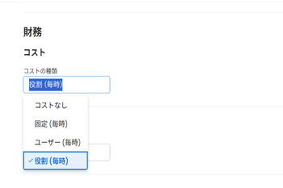

# タスクのコストタイプを更新

タスクの「計画原価」と「実績原価」と「労務原価」は、各タスクの「原価タイプ」で決定されます。

プロジェクト内の個々のタスクに対してコストタイプを設定できます。 各コストタイプは、「計画原価」と「実績原価」の値に影響を与えます。

Adobe Workfrontでのコストの追跡について詳しくは、 [コストの追跡](../../../manage-work/projects/project-finances/track-costs.md).

## アクセス要件

この記事の手順を実行するには、次のアクセス権が必要です。

<table style="table-layout:auto"> 
 <col> 
 <col> 
 <tbody> 
  <tr> 
   <td role="rowheader">Adobe Workfront plan*</td> 
   <td> 
任意
 </td> 
  </tr> 
  <tr> 
   <td role="rowheader">Adobe Workfront license*</td> 
   <td> 
計画 
 </td> 
  </tr> 
  <tr> 
   <td role="rowheader">アクセスレベル設定*</td> 
   <td> 
プロジェクト、タスク、および財務データへのアクセスを編集
 
注意：まだアクセス権がない場合は、Workfront管理者に、アクセスレベルに追加の制限を設定しているかどうかを問い合わせてください。 Workfront管理者がアクセスレベルを変更する方法について詳しくは、 <a href="../../../administration-and-setup/add-users/configure-and-grant-access/create-modify-access-levels.md" class="MCXref xref">カスタムアクセスレベルの作成または変更</a>.
 </td> 
  </tr> 
  <tr> 
   <td role="rowheader">オブジェクト権限</td> 
   <td> 
プロジェクトに対する権限の貢献
 
タスクに対する権限の管理
 
追加のアクセス権のリクエストについて詳しくは、 <a href="../../../workfront-basics/grant-and-request-access-to-objects/request-access.md" class="MCXref xref">オブジェクトへのアクセスのリクエスト </a>.
 </td> 
  </tr> 
 </tbody> 
</table>

&#42;保有しているプラン、ライセンスの種類、アクセス権を確認するには、Workfront管理者に問い合わせてください。

## 個々のタスクのコストタイプの設定

1. コストタイプを設定するタスクに移動します。
1. クリック **タスクの詳細** 左のパネルで、を展開します。 **金融** 領域
1. ダブルクリック **コストタイプ** タスクに適用するコストタイプを選択します。

   

   次のオプションから選択します。

   * コストなし
   * 固定 (毎時)
   * ユーザー (毎時)
   * 役割 (毎時)

   各タスクのコストタイプの詳細については、 [コストの追跡](../../../manage-work/projects/project-finances/track-costs.md).

1. クリック **保存** **変更点** **.**
