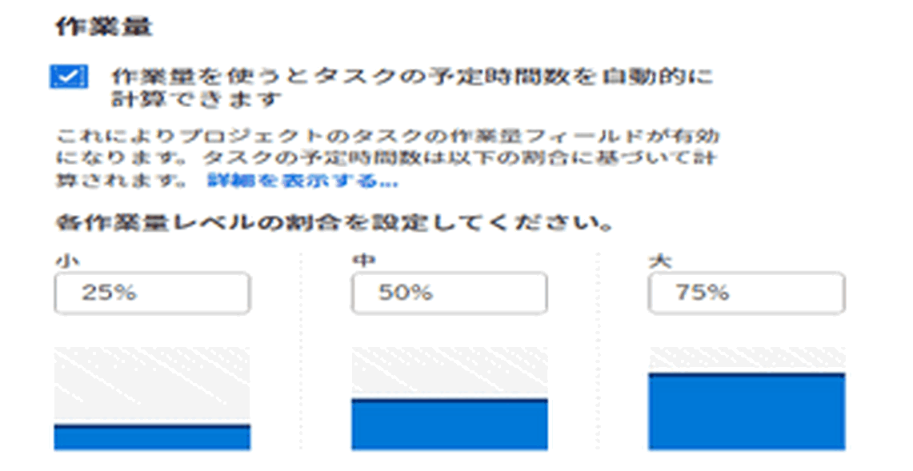
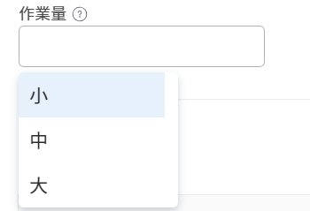

# 作業量の概要

<!--Audited: 01/2024-->

<!--
(NOTE: Linked to the UI >> in the Project/ Template edit box > Tasks area> Learn more)
-->

プロジェクトマネージャは、プロジェクトでのタスクの完了に必要な作業量を見積もる方法を決定できます。 次のいずれかの指標を使用して、タスクの完了に必要な作業量を見積もります。

<table style="table-layout:auto"> 
 <col> 
 <col> 
 <tbody> 
  <tr> 
   <td role="rowheader">予定時間数</td> 
   <td> <p> タスクに割り当てられたリソースがタスクを完了するのに要する時間数を示す、手動の数値エントリまたはAdobe Workfrontの計算値です。 </p> <p>計画時間に関して次の点を考慮します。 </p> 
    <ul> 
     <li>これはデフォルトのメソッドです。 </li> 
     <li>「期間タイプ」が「計算割当」または「簡易」のタスクに対してのみ、手動で計画時間を更新できます。 </li> 
    </ul> <p>予定時間については、 <a href="../../../manage-work/tasks/task-information/planned-hours.md" class="MCXref xref">計画時間の概要</a>. </p> </td> 
  </tr> 
  <tr> 
   <td role="rowheader">作業量 </td> 
   <td> <p>タスクの完了に 1 日あたりの作業量が小、中、大のどれになるかを定義する手動のラベルです。 <!--
      <MadCap:conditionalText data-mc-conditions="QuicksilverOrClassic.Draft mode">
       The level of effort is estimated to be a percentage of the daily amount of working time. (NOTE: keep this drafted. Vazgen said it's not needed, but waiting for feedback from users)
      </MadCap:conditionalText>
     --> </p> <p>作業量に関して、次の点を考慮します。</p> 
    <ul> 
     <li>このフィールドは、単純期間タイプのタスクでのみ使用できます。 </li> 
     <li>このラベルの使用を有効にして、プロジェクトレベルで関連付けられる作業時間の割合を定義できます。 </li> 
    </ul> </td> 
  </tr> 
 </tbody> 
</table>

この記事では、作業量とは何か、およびタスクの作業量を見積もる際に、作業量をどのように使用するかについて説明します。

>[!NOTE]
>
>計画された時間と作業量が相互に影響し合います。 「計画時間」を更新すると、作業工数が更新され、「作業工数」を更新すると、タスクの計画時間が更新されます。

## アクセス要件

この記事の手順を実行するには、次のアクセス権が必要です。

<table style="table-layout:auto"> 
 <col> 
 <col> 
 <tbody> 
  <tr> 
   <td role="rowheader">Adobe Workfrontプラン</td> 
   <td> <p>任意</p> </td> 
  </tr> 
  <tr> 
   <td role="rowheader">Adobe Workfront license*</td> 
   <td> <p>現在：プラン </p>
   または
   <p>新規：標準 </p>
    </td> 
  </tr> 
  <tr> 
   <td role="rowheader">アクセスレベルの設定</td> 
   <td> <p>プロジェクトとタスクへのアクセスを編集</p> </td> 
  </tr> 
  <tr> 
   <td role="rowheader">オブジェクトの権限</td> 
   <td> <p>プロジェクトおよびそのタスクに対する権限の管理</p>  </td> 
  </tr> 
 </tbody> 
</table>

&#42;保有するプラン、ライセンスの種類、アクセス権を確認するには、Workfront管理者に問い合わせてください。 詳しくは、 [Workfrontドキュメントのアクセス要件](/help/quicksilver/administration-and-setup/add-users/access-levels-and-object-permissions/access-level-requirements-in-documentation.md).

## 作業量を使用する際の考慮事項

* プロジェクトタスクに予定時間が 0 時間あり、[ 作業時間を使用してプロジェクトのタスクの予定時間を自動的に計算する ] 設定を有効にした場合、それらに関連付けられる既定の作業時間レベルは [ 中 ] になります。 単純な期間タイプのタスクでは、計画時間が自動的に更新されます。 詳しくは、  [作業量のレベル](#levels-of-work-effort) 」を参照してください。
* プロジェクトタスクの計画時間が 0 より大きく、[ 作業時間を使用してプロジェクトの計画時間を自動的に計算する ] 設定を有効にした場合、作業時間のレベルは、[ 簡易期間タイプの計画時間 ] タスクの量を変更せずに、計画時間数に応じて更新されます。 詳しくは、 [Workfrontが計画時間に基づいて作業工数を計算する方法](#how-workfront-calculates-work-effort-based-on-planned-hours) 」を参照してください。
* プロジェクトタスクに予定時間が 0 時間あり、[ 作業時間の使用 ] を有効にして、プロジェクトの [ 予定時間 ] 設定を自動的に計算した後、[ 作業時間 ] のレベルを [ 中 ] から [ 中 ]、[ 大 ] に更新すると、[ 予定時間 ] も更新されます。 詳しくは、 [Workfrontが作業工数に基づいて計画時間を計算する方法](#how-workfront-calculates-planned-hours-based-on-work-effort) 」を参照してください。
* タスクを編集し、同時にタスクの「計画時間」と「作業時間」の両方を変更すると、「計画時間」は指定した値で更新されますが、「作業時間」の値は更新された計画時間に基づいて計算されます。
* タスクの作業量の値を更新すると、期間は計画時間に基づいて自動計算されなくなります。 期間タスクの計算方法について詳しくは、 [期間タイプの概要：シンプル](../../../manage-work/tasks/taskdurtn/simple-duration-type.md).
* タスクの「期間の種類」を「シンプル」から「その他」に変更すると、「作業量」フィールドはタスクで非表示になります。 計画時間は変更されません。
* 親タスクの作業量レベルは更新できません。 親タスクの作業量レベルは、すべての子タスクの積み上げであるタスクの計画時間数に基づいて自動的に計算されます。 親タスクについて詳しくは、 [サブタスクを作成](../../../manage-work/tasks/create-tasks/create-subtasks.md).

## 予定時間ではなく作業量の使用を有効にする

1. プロジェクトに移動し、 **その他** メニュー を選択し、次に **編集**.
1. クリック **タスク設定**、「 」、「 」オプションの順に選択します。**作業工数を使用してタスクの計算時間を自動的に計算**. デフォルトでは、このオプションは選択されていません。

   

   プロジェクトで作業量の使用を有効にする方法の詳細については、 [プロジェクトを編集](../../../manage-work/projects/manage-projects/edit-projects.md) 記事。

1. クリック **タスク** 左側のパネルで、タスクの名前をクリックしてアクセスします。
1. 次をクリック： **その他** メニュー を選択し、次に **編集**. タスクに「シンプルな期間」タイプが含まれていることを確認します。

   >[!TIP]
   >
   >タスクの作業量は、「タスクの詳細」セクションでも更新できます。

1. Adobe Analytics の **概要** 「 」領域で、「作業量」ドロップダウンメニューをクリックして、タスクを完了するのに必要な作業量を修正します。

   

   タスクの「作業量」フィールドを更新する方法の詳細については、次の記事を参照してください。

   * 「概要」セクション ( [タスクを編集](../../../manage-work/tasks/manage-tasks/edit-tasks.md) 記事
   * [「タスクの詳細の概要」領域でタスク情報を管理します](../../../manage-work/tasks/manage-tasks/task-information-in-overview.md)

## 作業量のレベル {#levels-of-work-effort}

プロジェクトマネージャは、プロジェクトに対して 3 つのレベルの作業量を指定できます。 各作業レベルは、ユーザーがタスクを完了するのに必要な 1 日の時間の割合を表します。

作業量のレベルを設定する際には、「このタスクに割り当てられたユーザーが時間内に完了するために 1 日に費やすべき時間はどれくらいか」という質問を自分に問いかける必要があります。

次の表に、作業量のレベルと、対応するデフォルトの割合を示します。 プロジェクトマネージャーは、組織のニーズに合わせて割合を更新できます。 これは、プロジェクトの編集時に行います。 プロジェクトの編集について詳しくは、 [プロジェクトを編集](../../../manage-work/projects/manage-projects/edit-projects.md).

Workfrontの管理者は、「セットアップ」の「プロジェクトの環境設定」領域で、1 日あたりの標準時間を定義します。 これは、作業時間と見なされる 1 日の時間です。 Workfrontのインスタンスに対するプロジェクトの環境設定について詳しくは、 [システム全体のプロジェクト環境設定の指定](../../../administration-and-setup/set-up-workfront/configure-system-defaults/set-project-preferences.md).

>[!NOTE]
>
>以下の例では、Workfront管理者が「 1 営業日あたりの標準時間」の値を 8 時間に設定していると仮定します。

<table style="table-layout:auto"> 
 <col> 
 <col> 
 <tbody> 
  <tr> 
   <td>作業量のレベル</td> 
   <td>割合 (%) の値</td> 
  </tr> 
  <tr> 
   <td>小 </td> 
   <td>タスクを完了するための小規模な作業レベルは、「通常の作業時間」（1 作業日あたりの時間）の 25%に設定されます。 つまり、このレベルの作業量を割り当てたタスクは、1 日に完了するまでに最大 2 時間かかる必要があります。 <code>(0.25*8=2)</code></td> 
  </tr> 
  <tr> 
   <td>中</td> 
   <td> <p>タスクを完了するための中レベルの労力は、「通常の作業時間」（1 作業日あたりの時間）の 50%に設定されます。 つまり、このレベルの作業量を割り当てたタスクが 1 日で完了するまでに 2 時間以上 6 時間未満かかる必要があります。 <code>(0.50*80=4)</code> </p> <p>注意：プロジェクトで [ 作業時間を使用してタスクの自動計算を行う ] 設定が有効になっている場合、この設定が有効になる前の予定時間が 0 時間のタスクの既定の設定です。 これにより、タスク「計画時間」が 4 時間に更新されます。 </p> </td> 
  </tr> 
  <tr> 
   <td>大</td> 
   <td>タスクの完了にかかる大規模な作業レベルは、「通常の作業時間」（1 作業日あたりの時間）の 75%に設定されます。 つまり、このレベルの作業量を割り当てたタスクは、1 日で完了するのに 6 時間以上かかる必要があります。 <code>(0.75*8=6)</code></td> 
  </tr> 
 </tbody> 
</table>

## Workfrontが作業工数に基づいて計画時間を計算する方法 {#how-workfront-calculates-planned-hours-based-on-work-effort}

[ 作業時間の使用 ] を有効にしてプロジェクトのタスクの計画時間数を自動的に計算すると、Workfrontは次の数式を使用して、[ 簡易期間の種類 ] のタスクの計画時間数を計算します。

```
Task Planned Hours = Number of days in task Duration * Work Effort percentage * Typical hours per work day
```

例えば、期間が 3 日で、作業時間が中程度のタスクの予定時間は 12 時間です。

```
Planned Hours = 3*4=12
```

ここで、「標準時間（1 稼働日あたり）」の値は 8 時間です。

>[!TIP]
>
>タスクを複数のリソースに割り当てると、タスクの期間の 1 日ごとに、各リソースに対して計画時間が均等に配分されます。

## Workfrontが計画時間に基づいて作業工数を計算する方法 {#how-workfront-calculates-work-effort-based-on-planned-hours}

[ 作業時間の使用 ] を有効にして、プロジェクトの [ 予定時間 ] 設定を自動的に計算し、既にタスクの予定時間を設定している場合、またはタスクの予定時間数を編集した場合、Workfrontは [ 作業時間 ] の値を更新します。

Workfrontでは、次の式を使用して、計画時間に従って作業工数のレベルを更新します。

```
Work Effort level = Task Planned Hours / Duration / Typical hours per work day
```

例えば、期間が 2 日のタスクがあり、予定時間を 8 時間から 20 時間に更新すると、タスクの作業量は中から大に更新されます。

```
Work Effort level = 20 / 2 / 8 = 125 % = Large
```

## タスクとプロジェクトの作業量の検索

* [プロジェクトの作業量](#work-effort-for-projects)
* [タスクの作業量](#work-effort-for-tasks)

### プロジェクトの作業量 {#work-effort-for-projects}

次の領域にあるプロジェクトの「作業量」セクションを見つけることができます。

* 「プロジェクトを編集」ボックスの「タスク設定」領域

### タスクの作業量 {#work-effort-for-tasks}

タスクの「作業量」フィールドは、次の領域にあります。

* 「タスクを編集」ボックスの「概要」領域
* [ 作業時間 ] 領域の [ タスクの詳細 ] セクションの [ 概要 ] 領域
* タスクリストまたはレポート
