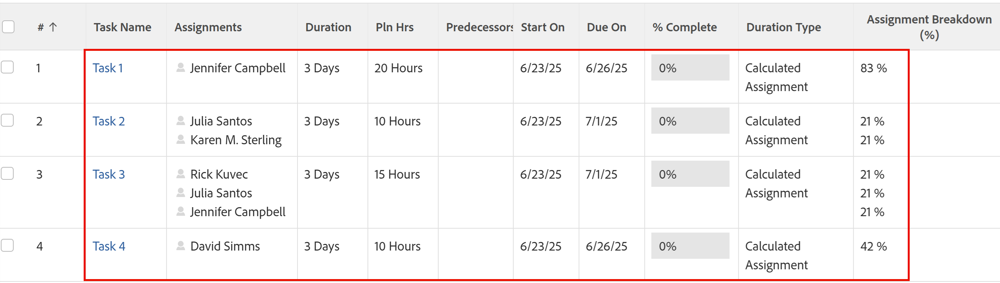

# 期間タイプの概要：算出した割り当て

<!-- Audited: 5/2025 -->

予定割り当て時間は、Adobe Workfront のタスクに設定できる期間タイプです。 Workfront の期間タイプに関する一般情報については、[タスク期間と期間タイプの概要](../../../manage-work/tasks/taskdurtn/task-duration-and-duration-type.md)を参照してください。

## 予定割り当て時間の期間タイプの概要

<!--
<p data-mc-conditions="QuicksilverOrClassic.Draft mode">(NOTE: This Hub issue has a powerpoint that highlights information that is useful to users when using Calculated Assignment duration type. I don't think we can use the powerpoint, because it's old. I also don't know if the things they discuss are still relevant, since the PP is from 2015. I've closed the issue, but I'm putting a link here just in case the info is useful. https://hub.workfront.com/issue/5a9dd7d5007d02a8966014557c23cc89/updates)</p>
-->

* 予定割り当て時間の期間タイプを使用する場合は、タスクの期間と予定時間数の両方を指定する必要があります。 次に、Workfront は、予定時間数を期間内の時間数で割り、タスクに割り当てられたリソース数で配分率（割り当て）を各リソースに対して計算します。 各リソースの配分率は、同じ値で均等に配分されます。 この場合、各リソースの配分値を変更することはできません。
* Workfrontまたはグループ管理者は、システムまたはグループのデフォルトの期間タイプを「計算済み割り当て」に設定できます。 この場合、すべての新しいタスクは、この期間タイプで作成されます。 システムレベルまたはグループレベルのプロジェクト環境設定の一部として、タスクやイシューの環境設定を変更する方法については、[システム全体のタスクとイシュー環境を設定](../../../administration-and-setup/set-up-workfront/configure-system-defaults/set-task-issue-preferences.md)を参照してください。

  この場合、タスクのデフォルトの期間は 1 日、デフォルトの予定時間数は 0 時間になります。 プロジェクトマネージャーがより正確な期間を設定し、予定時間数フィールドに現実的な見積もりを入力しない限り、リソースの割り当てが不十分として表示されます。

次の状況では、予定割り当て時間が推奨される期間タイプです。

* 割り当てにアクティビティのウィンドウがあるが、作業を完了するために割り当てられた期間全体を取っていない場合。 例えば、週の終わりまでにレポートをスーパーバイザーに提出するように割り当てられているとします。 5日間の期間がありますが、文書のドラフト作成には10時間しかかかりません。
* プロジェクトマネージャーは、予定期間と予定作業量を個別に見積もることができるため、1 つのリソースが 1 つのタスクに割り当てられる場合。

  同じ結果に対して予定作業の期間タイプを使用できますが、予定時間数の計算値に影響を与えるには、プロジェクトマネージャーがリソースの配分率を入力する必要があります。 これにより、プロジェクト計画の難易度が高まり、所要時間も長くなります。

各リソースの配分率は、次のように計算します。

```
Planned Hours / Duration / Number of Resources = Allocation Percentage for each resource
```

例えば、次に説明するシナリオでは、各タスクの期間は 3 日です。 プロジェクトマネージャーは、期間（3 日または 24 時間）と予定時間数の両方を手動で入力します。その結果、配分率（または割り当て率）は、次のように計算されます。



## タスクの期間タイプを予定割り当て時間に変更

タスクの期間タイプの変更について詳しくは、[タスクの期間タイプの更新](../../../manage-work/tasks/taskdurtn/update-duration-type-of-task.md)を参照してください。

<!--
<p data-mc-conditions="QuicksilverOrClassic.Draft mode">(NOTE: replaced with new article linked above)</p>
-->

<!--
<ol data-mc-conditions="QuicksilverOrClassic.Draft mode">
<li value="1">Go to a task for which you want to change the Duration Type.</li>
<li value="2"> <p data-mc-conditions="QuicksilverOrClassic.Quicksilver">Click <strong>Task Details</strong> in the left panel, then in the Overview area double click <strong>Duration Type</strong>. </p> </li>
<li value="3">Select <strong>Calculated Assignment</strong> from the drop-down menu.</li>
<li value="4">Click <strong>Save</strong> <strong>Changes</strong>.</li>
</ol>
-->
