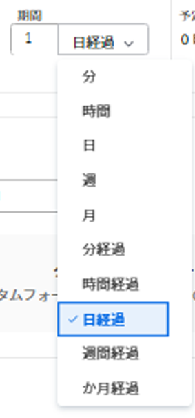
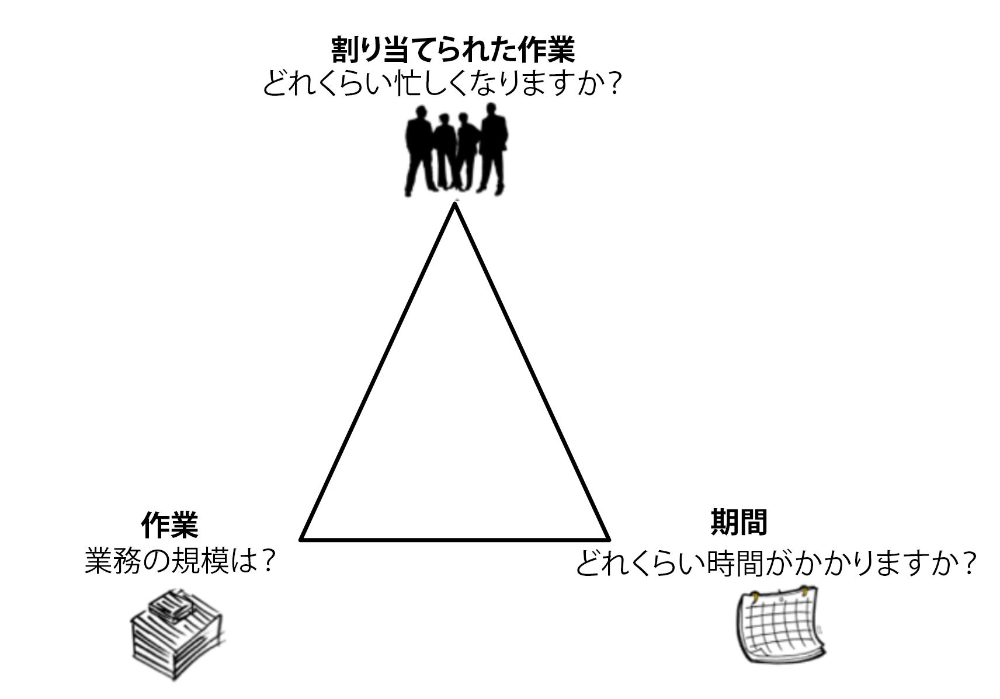

# タスクの期間と期間のタイプの概要

<!-- Audited: 12/2023 -->

タスク期間とは、タスクの計画完了日と計画開始日の差です。 「期間」は、タスクが完了するまでに使用できる期間を示します。

タスクの期間タイプは、タスクに割り当てられたリソースの数、総作業量、およびタスクの総期間との関係を識別します。

## タスク期間の概要

タスクの [ 実績開始日 ] と [ 実績完了日 ] が、プロジェクトのスケジュール、主担当者、または既定のスケジュールのスケジュール外にある場合、タスクの [ 期間 ] は 0 になります。

**例：** 午前 9 時に開始し、午後 12 時に終了するスケジュールと、午後 2 時に開始し、午後 4 時に終了するようにスケジュールされているタスクがある場合、タスクの「期間」は 0 になります。

Adobe Workfrontで期間を計算する際には、次の 2 つのシナリオが考えられます。

* タスクがユーザーWorkfrontに割り当てられている場合、は次のいずれかのスケジュールを使用し、この順序で期間を計算します。

   1. Workfrontでは、ユーザーのスケジュールが考慮されます。
   1. ユーザーがスケジュールに関連付けられていない場合、Workfrontではプロジェクトのスケジュールが考慮されます。
   1. プロジェクトがスケジュールに関連付けられていない場合、Workfrontではシステムのデフォルトスケジュールが考慮されます。 スケジュールについて詳しくは、 [スケジュールの作成](../../../administration-and-setup/set-up-workfront/configure-timesheets-schedules/create-schedules.md).

* タスクが複数のユーザーに割り当てられている場合：

   1. Workfrontは、プロジェクトのスケジュールまたは主な担当者のスケジュールを考慮します。

  タスクが複数のユーザーに割り当てられる際にWorkfrontが使用するスケジュールは、Workfront管理者が決定します。 詳しくは、 [システム全体のプロジェクト環境設定の指定](../../../administration-and-setup/set-up-workfront/configure-system-defaults/set-project-preferences.md).

  手順は、Workfrontが期間の計算に使用するスケジュールを理解した後の最初のシナリオと似ています。

>[!NOTE]
>
>プライマリ担当者がプロジェクトでのオフタイムを考慮すると、タスクの予定日が調整される場合がありますが、タスクの期間は変わりません。 プロジェクトを計画する際にプライマリ担当者が離職した時間を考慮する方法については、  [システム全体のプロジェクト環境設定の指定](../../../administration-and-setup/set-up-workfront/configure-system-defaults/set-project-preferences.md).

## タスク期間の時間の単位

タスクの期間は、通常の時間と、計画開始日から計画完了日までの経過時間の両方で指定できます。

リスト内のタスクの期間を更新する際に、Workfrontの時間の単位を示す以下の略語を使用できます。

| 時間の単位 | 省略形 |
|---|---|
| 分 | 月 |
| 時間 | H |
| 日。 これがデフォルトです。 | 削 |
| 週間 | W |
| 月 | 火 |
| 分経過 | EM |
| 時間経過 | EH |
| 日経過 | ED |
| 週間経過 | 新規 |
| か月経過 | ET |

{style="table-layout:auto"}

**例：** タスクの期間を 3 日の経過日にする場合は、タスクリストの「期間」フィールドに「3 ED」と入力します。  また、タスクの編集時または「タスクの詳細」セクションで、使用可能なドロップダウンメニューから、期間の単位を選択することもできます。 タスクの編集について詳しくは、 [タスクを編集](../../../manage-work/tasks/manage-tasks/edit-tasks.md).

<!--

(NOTE: stays QS only forever; for the pictures below: make the first one classic at preview time and the second one stays QS always. The second one is yellow >> take out at 21.2 production!!)

-->

タスクの期間を示す際は、次の点に注意してください。

* 経過時間は、タスクの期間の時間の単位です。 休日、週末、休日を含むタスクの計画開始日から計画完了日までの時間です。 つまり、経過時間は暦日の経過です。
* 通常の時間は、休日、週末、休日を考慮し、タスクの期間から除外します。

* タスクの期間を週単位で指定すると、Workfrontは、Workfront管理者が設定した「プロジェクト環境設定」領域で設定した「標準稼働日/週」と「標準稼働時間/日」の設定に基づいて、期間を日単位と時間単位で計算します。
* Workfrontでは、期間を月単位で計算する際、1 か月間にデフォルトの 4 週間の期間を使用します。

## タスク期間タイプの概要

タスクの期間タイプを管理すると、タスクのニーズに基づいて一貫したリソースの割り当てを設定できます。

期間のタイプは、次の質問に答えるのに役立ちます。

* 私たちはどのくらい忙しいのですか？
* 仕事の規模は？
* どれくらいかかるの？

## 期間のタイプを定義

<table border="1" cellspacing="15" cellpadding="1"> 
 <col> 
 <col> 
 <col> 
 <thead> 
  <tr> 
   <th scope="row">
<strong>期間タイプ</strong>
</th> 
   <th scope="col"> 
<strong>関数</strong> 
 </th> 
   <th scope="col"> 
<strong>リソースが影響を及ぼす要因</strong> 
 </th> 
  </tr> 
 </thead> 
 <tbody> 
  <tr> 
   <th scope="col"> 
<strong>計算された割り当て</strong> 
 </th> 
   <td scope="col"> 
タスクの各担当者の割り当て率を計算します。 
 
この期間タイプを選択すると、タスクの個々の期間と計画時間を入力できます。 Workfrontは、計画時間をタスクの期間内の時間数で割り、次にタスクに割り当てられたリソース数で割って、各担当者の割り当てを計算します。
 
詳しくは、 <a href="../../../manage-work/tasks/taskdurtn/calculated-assignment.md" class="MCXref xref">期間タイプの概要：計算割り当て</a>.
 </td> 
   <td scope="col">タスクに割り当て先を追加または削除する際に、期間と予定時間は変更されません。 </td> 
  </tr> 
  <tr> 
   <th scope="col"> 
<strong>計算作業時間</strong> 
 </th> 
   <td scope="col"> 
タスクを完了するために必要な計画時間（労力）を決定します。
 
通常は、タスクに割り当てられたリソースがタスクの期間全体に割り当てられる場合に使用されます。
 
この期間タイプを選択すると、タスクの個々の期間を入力できます。 Workfrontは、期間内の日数に、スケジュール内の作業時間数と、タスクに割り当てられた担当者数を掛けて、タスクの計画時間を計算します。 
 
各担当者の割り当て率を手動でタスクに変更し、計画時間を短縮できます。
 
詳しくは、 <a href="../../../manage-work/tasks/taskdurtn/calculated-work.md" class="MCXref xref">期間タイプの概要：計算作業時間</a>.
 </td> 
   <td scope="col"> 
割り当て先がタスクに追加されると、予定時間が増加します。 
 
割り当て先がタスクから削除されると、予定時間が減少します。
 </td> 
  </tr> 
  <tr> 
   <th scope="col"> 
<strong>作業優先</strong>
 </th> 
   <td scope="col"> 
リソースの数に基づいて計画時間を決定します。
 
この期間タイプを選択すると、タスクの個々の期間を入力できます。 Workfrontは、期間内の日数にスケジュール内の作業時間数を掛け、その数をタスクに割ってタスクの計画時間数を計算します。 
 
各担当者の割り当て率をタスクに手動で変更することはできますが、計画時間数は変わりません。
 
詳しくは、 <a href="../../../manage-work/tasks/taskdurtn/effort-driven.md" class="MCXref xref">期間タイプの概要：労力に基づく</a>.
 </td> 
   <td scope="col"> 
割り当て先がタスクから削除されると、予定時間が増加します。
 
割り当て先がタスクに追加されると、予定時間が減少します。 
 
担当者数やスケジュールの変更に関係なく、期間は変更されません。 
 
期間は「予定時間」と等しくなります。 「計画期間」は、「計画時間」を担当者数で割った値と等しくなります。
 </td> 
  </tr> 
  <tr> 
   <th scope="col"> 
<strong>シンプル</strong> 
 </th> 
   <td scope="col"> 
各担当者が割り当てられる時間数に基づいて、計画時間と期間（この期間タイプで同じ）を決定します。 
 
Workfrontは、各担当者の計画割り当て時間を合計して、計画時間を計算します。 
 
各担当者が割り当てる時間数を手動で変更し、それに応じて計画時間数と期間数を変更することができます。 すべての担当者に割り当てられた時間の合計を選択した場合、その数は各担当者に均等に割り振られます。
 
詳しくは、 <a href="../../../manage-work/tasks/taskdurtn/simple-duration-type.md" class="MCXref xref">期間タイプの概要：シンプル</a>.
 </td> 
   <td scope="col"> 
割り当てる時間の合計数を選択すると、割り当て先間で時間が均等に配分されます。 ただし、プロジェクトマネージャは、各担当者の時間を手動で調整できます。 
 
タスクの予定時間と期間は、単純期間タイプをインラインで、またはタスクレベルで編集できます。 
 
アジャイルチームがタスクに割り当てられている場合、期間のタイプは自動的に「シンプル」に設定され、変更できません。 アジャイルチームのタスク期間は 0 分を超える必要があります。
 </td> 
  </tr> 
 </tbody> 
</table>

## 新しいタスクの期間タイプ

新しいタスクの「期間タイプ」は、システムで設定された「期間タイプ」と一致します。 デフォルトの期間タイプは、「割り当てを計算」です。 Workfront管理者またはグループ管理者は、ご使用のシステムまたはプロジェクトに関連付けられたグループのデフォルトの期間タイプを更新できます。 詳しくは、 [システム全体のタスクと問題の環境設定を構成する](../../../administration-and-setup/set-up-workfront/configure-system-defaults/set-task-issue-preferences.md).

## タスクの期間タイプの変更

タスクの期間の種類の変更について詳しくは、 [タスクの期間タイプの更新](../../../manage-work/tasks/taskdurtn/update-duration-type-of-task.md).
