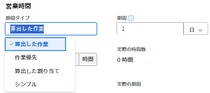

# タスクの期間タイプを更新

タスクの期間タイプは、タスクに割り当てられたリソースの数、合計作業量およびタスクの合計期間の関係性を特定します。詳しくは、[タスクの期間と期間タイプの概要](../../../manage-work/tasks/taskdurtn/task-duration-and-duration-type.md)を参照してください。

## アクセス要件

タスクの期間タイプを変更するには、次の操作が必要です。

<table style="table-layout:auto"> 
 <col> 
 <col> 
 <tbody> 
  <tr> 
   <td role="rowheader">Adobe Workfront プラン*</td> 
   <td> 
任意 
 </td> 
  </tr> 
  <tr> 
   <td role="rowheader">Adobe Workfront ライセンス*</td> 
   <td> 
ワークまたはそれ以上
 </td> 
  </tr> 
  <tr> 
   <td role="rowheader">アクセスレベル設定*</td> 
   <td> 
プロジェクトに対する表示以上のアクセス権
 
タスクへのアクセスを編集
 
メモ：まだアクセス権がない場合は、アクセスレベルに追加の制限が設定されていないかどうか Workfront 管理者にお問い合わせください。Workfront 管理者がアクセスレベルを変更する方法について詳しくは、<a href="../../../administration-and-setup/add-users/configure-and-grant-access/create-modify-access-levels.md" class="MCXref xref">カスタムアクセスレベルの作成または変更</a>を参照してください。
 </td> 
  </tr> 
  <tr> 
   <td role="rowheader">オブジェクト権限</td> 
   <td> 
タスクへのアクセスを管理 
 
追加のアクセス権のリクエストについて詳しくは、<a href="../../../workfront-basics/grant-and-request-access-to-objects/request-access.md" class="MCXref xref">オブジェクトへのアクセス権のリクエスト</a>を参照してください。
 </td> 
  </tr> 
 </tbody> 
</table>

&#42;保有するプラン、ライセンスタイプ、アクセス権を確認するには、Workfront 管理者に問い合わせてください。

## タスクの期間タイプを更新

この記事で説明されているように、タスクの期間タイプを更新する以外に、タスクの編集時や高度な割り当てを行う際に期間タイプを更新することもできます。詳しくは、以下を参照してください。

* [タスクを編集](../../../manage-work/tasks/manage-tasks/edit-tasks.md)
* [高度な割り当てを作成](../../../manage-work/tasks/assign-tasks/create-advanced-assignments.md)

タスクの期間タイプを更新するには、次の手順に従います。

1. **メインメニュー**／**プロジェクト**&#x200B;をクリックし、プロジェクトをクリックしてアクセスします。
1. 左側のパネルで、「**タスク**」をクリックします。
1. 左側のパネルメニューで「**タスクの詳細**」をクリックし、概要エリアで「**期間タイプ**」をクリックします。

   

1. 次のオプションから選択します。

   | 期間タイプ | 詳細情報 |
   |---|---|
   | 予定作業 | 詳しくは、[期間タイプの概要：予定作業](../../../manage-work/tasks/taskdurtn/calculated-work.md)を参照してください。 |
   | 残存作業時間の優先 | 詳しくは、[期間タイプの概要：残存作業時間の優先](../../../manage-work/tasks/taskdurtn/effort-driven.md)を参照してください。 |
   | 予定割り当て時間 | 詳しくは、[期間タイプの概要：予定割り当て時間](../../../manage-work/tasks/taskdurtn/calculated-assignment.md)を参照してください。 |
   | シンプル | 詳しくは、[期間タイプの概要：シンプル](../../../manage-work/tasks/taskdurtn/simple-duration-type.md)を参照してください。 |

1. 「**変更を保存**」をクリックします。
