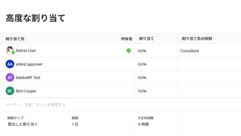

# タスクの予定時間数と期間のシンプルな期間タイプでの更新

デフォルトでは、予定時間数に基づいてシンプル期間タイプのタスクの期間が計算されます。ただし、Workfront の特定のエリアでは、予定時間数タスクとシンプル期間のタスクの期間を手動で編集することもできます。

タスクの予定時間数と期間は、「割り当て」のシンプル期間タイプのインラインまたはタスクレベルで編集できます。

情報をインラインで編集する方法について詳しくは、[Adobe Workfront のリスト内の項目のインライン編集](../../../workfront-basics/navigate-workfront/use-lists/inline-edit-objects.md)を参照してください。

この記事では、「割り当て」のタスクレベルでシンプル期間タイプを使って、タスクの予定時間数と期間を更新する方法について説明します。

## アクセス要件

この記事の手順を実行するには、次のアクセス権が必要です。

<table style="table-layout:auto"> 
 <col> 
 <col> 
 <tbody> 
  <tr> 
   <td role="rowheader">Adobe Workfront プラン*</td> 
   <td> 
任意
 </td> 
  </tr> 
  <tr> 
   <td role="rowheader">Adobe Workfront ライセンス*</td> 
   <td> 
ワークまたはそれ以上
 </td> 
  </tr> 
  <tr> 
   <td role="rowheader">アクセスレベル設定*</td> 
   <td> 
タスクへのアクセスの編集
 
メモ：まだアクセス権がない場合は、アクセスレベルに追加の制限が設定されていないかどうか Workfront 管理者にお問い合わせください。Workfront 管理者がアクセスレベルを変更する方法について詳しくは、<a href="../../../administration-and-setup/add-users/configure-and-grant-access/create-modify-access-levels.md" class="MCXref xref">カスタムアクセスレベルの作成または変更</a>を参照してください。
 </td> 
  </tr> 
  <tr> 
   <td role="rowheader">オブジェクト権限</td> 
   <td> 
タスクに対する管理権限
 
追加のアクセス権のリクエストについて詳しくは、<a href="../../../workfront-basics/grant-and-request-access-to-objects/request-access.md" class="MCXref xref">オブジェクトへのアクセス権のリクエスト</a>を参照してください。
 </td> 
  </tr> 
 </tbody> 
</table>

&#42;保有するプラン、ライセンスタイプ、アクセス権を確認するには、Workfront 管理者に問い合わせてください。

## タスクの予定時間数と期間のシンプルな期間タイプでの更新

>[!IMPORTANT]
>
>シンプルな期間タスクで期間を手動で更新すると、予定時間数に基づく期間の計算が停止します。

「高度な割り当て」ボックスでシンプル期間タイプを使って、タスクの予定時間数と期間を編集するには：

1. タスクのリストで、期間タイプを変更するタスクの名前をクリックします。
1. 次のいずれかの操作を行います。

   * タスクの名前の横にある&#x200B;**その他**&#x200B;アイコン  をクリックし、「**編集**」、「**割り当て**」の順にクリックします。
   * タスクヘッダーの「割り当て」で「**割り当て先**」または割り当ての名前をクリックし、「**詳細**」をクリックします。

1. すべての割り当ての **予定時間数**&#x200B;の合計値を入力します（例：10 時間）。予定時間数の合計は、タスクに割り当てられたすべてのリソースに均等に配分されます。
1. （オプション）タスクに割り当てられた各リソースの予定時間数を手動で調整します。タスクの予定時間の合計数は、リソースに個別に割り当てられた新しい時間を反映して更新されます。
1. タスクの&#x200B;**期間**&#x200B;の値を入力します（例：2 日）。

   

1. 「**保存**」をクリックします。
