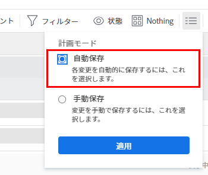

# タスクを連鎖させて先行タスクの関係を作成

Adobe Workfront では、複数の方法で先行タスクの関係を作成できます。方法の 1 つは、タスクを連鎖させることです。

先行タスクについて詳しくは、[先行タスクの概要](../../../manage-work/tasks/use-prdcssrs/predecessors-overview.md)を参照してください。

タスクを連結することにより、各タスクの関係を自分で手動で作成するのではなく、システムが選択したタスクに先行タスクの関係を自動的に作成できるようにすることができます。タスク間では、異なる先行タスクの関係タイプを引き続き使用できます。

## アクセス要件

この記事の手順を実行するには、次のアクセス権が必要です。

<table style="table-layout:auto"> 
 <col> 
 <col> 
 <tbody> 
  <tr> 
   <td role="rowheader">Adobe Workfront プラン*</td> 
   <td> 
任意
 </td> 
  </tr> 
  <tr> 
   <td role="rowheader">Adobe Workfront ライセンス*</td> 
   <td> 
プラン 
 </td> 
  </tr> 
  <tr> 
   <td role="rowheader">アクセスレベル設定*</td> 
   <td> 
タスクおよびプロジェクトへのアクセスを編集
 
メモ：まだアクセス権がない場合は、アクセスレベルに追加の制限が設定されていないかどうか Workfront 管理者にお問い合わせください。Workfront 管理者がアクセスレベルを変更する方法について詳しくは、<a href="../../../administration-and-setup/add-users/configure-and-grant-access/create-modify-access-levels.md" class="MCXref xref">カスタムアクセスレベルの作成または変更</a>を参照してください。
 </td> 
  </tr> 
  <tr> 
   <td role="rowheader">オブジェクト権限</td> 
   <td> 
タスクおよびプロジェクトに対する権限の管理
 
追加のアクセス権のリクエストについて詳しくは、<a href="../../../workfront-basics/grant-and-request-access-to-objects/request-access.md" class="MCXref xref">オブジェクトへのアクセス権のリクエスト</a>を参照してください。
 </td> 
  </tr> 
 </tbody> 
</table>

&#42;保有するプラン、ライセンスタイプ、アクセス権を確認するには、Workfront 管理者に問い合わせてください。

## タスクを連鎖させて先行タスクの関係を作成

1. 連鎖させたいタスクが含まれるプロジェクトに移動します。
1. 左パネルで「**タスク**」をクリックします。
1. （条件付き）タスクリストの右上隅にある「**自動保存**」を選択し、連鎖させたいタスクを選択します。

   

   >[!IMPORTANT]
   >
   >タスクへの変更を手動で保存する場合、またはタスクの保存にタイムライン計画モードを使用する場合は、タスクリスト内のタスクを連鎖することはできません。

1. 選択したタスクを右クリックし、「**連鎖**」を選択します。
1. 次の依存関係タイプから選択します。

   * **終了 - 開始**
   * **終了 - 終了**
   * **開始 - 開始**
   * **開始 - 終了**

   先行タスクの依存関係タイプについて詳しくは、[タスク依存関係タイプの概要](../../../manage-work/tasks/use-prdcssrs/task-dependency-types.md)を参照してください。

1. （オプション）一部のタスクが以前に連鎖されている場合は、「**連鎖解除**」をクリックします。

   >[!CAUTION]
   >
   >タスクの一括編集時にチェーン解除オプションを使用すると、連続する先行タスクのみが削除されます。

   選択した先行タスクの関係によってリンクされました。
