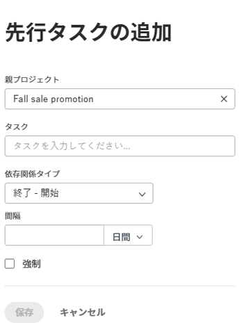

# 先行タスク領域を使用した先行タスク関係の作成

先行タスクを使用して、開始または完了するのに他のタスクに依存するタスクをリンクすることができます。例えば、招待状（先行タスク）を送信する前にパーティー（依存タスク）を主催することはありません。

この記事では、タスク内の「先行タスク」タブを使用して、先行タスクを設定する方法について説明します。

タスクの一覧で先行タスクを設定する方法について詳しくは、[タスクリストでの先行タスクの関係の作成](../../../manage-work/tasks/use-prdcssrs/create-predecessors-on-task-list.md)を参照してください。

タスクの先行タスクは、Adobe Workfront の以下のエリアに表示されます。

* 依存タスクの「先行タスク」セクション内
* ガントチャート内
* 先行タスク列のタスクリスト内

先行タスクについて詳しくは、[先行タスクの概要](../../../manage-work/tasks/use-prdcssrs/predecessors-overview.md)を参照してください。

## アクセス要件

この記事の手順を実行するには、次のアクセス権が必要です。

<table style="table-layout:auto"> 
 <col> 
 <col> 
 <tbody> 
  <tr> 
   <td role="rowheader">Adobe Workfront プラン*</td> 
   <td> 
任意
 </td> 
  </tr> 
  <tr> 
   <td role="rowheader">Adobe Workfront ライセンス*</td> 
   <td> 
プラン 
 </td> 
  </tr> 
  <tr> 
   <td role="rowheader">アクセスレベル設定*</td> 
   <td> 
タスクおよびプロジェクトへのアクセスを編集
 
メモ：まだアクセス権がない場合は、アクセスレベルに追加の制限が設定されていないかどうか Workfront 管理者にお問い合わせください。Workfront 管理者がアクセスレベルを変更する方法について詳しくは、<a href="../../../administration-and-setup/add-users/configure-and-grant-access/create-modify-access-levels.md" class="MCXref xref">カスタムアクセスレベルの作成または変更</a>を参照してください。
 </td> 
  </tr> 
  <tr> 
   <td role="rowheader">オブジェクト権限</td> 
   <td> 
タスクおよびプロジェクトに対する権限の管理
 
追加のアクセス権のリクエストについて詳しくは、<a href="../../../workfront-basics/grant-and-request-access-to-objects/request-access.md" class="MCXref xref">オブジェクトへのアクセス権のリクエスト</a>を参照してください。
 </td> 
  </tr> 
 </tbody> 
</table>

&#42;保有するプラン、ライセンスタイプ、アクセス権を確認するには、Workfront 管理者に問い合わせてください。

## タスクの先行タスクの作成

1. 依存タスクとして指定するタスクに移動し、左パネルの&#x200B;**先行タスク**&#x200B;をクリックします。

   「**さらに表示**」をクリックしてから、「**先行タスク**」をクリックする必要がある場合があります。

1. 「**+ 先行タスクの追加**」をクリックします。
1. （オプション）プロジェクト間の先行タスクを追加するには、「**親プロジェクト**」フィールドに別のプロジェクトの名前を入力し、先行タスクとして使用するタスクの名前を入力します。

   プロジェクト間の先行タスクについて詳しくは、[プロジェクト間の先行タスクの作成](../../../manage-work/tasks/use-prdcssrs/cross-project-predecessors.md)を参照してください。

1. 先行タスクとして指定するタスクの名前を入力します。

   

1. **依存関係タイプ**&#x200B;を選択します。

   タスクの依存関係タイプについて詳しくは、[タスク依存関係タイプの概要](../../../manage-work/tasks/use-prdcssrs/task-dependency-types.md)を参照してください。

1. **ラグ**&#x200B;の量（日単位）を指定します。

   ラグタイプの詳細については、を参照してくださ&#x200B;い。 [ラグタイプの概要](../../../manage-work/tasks/use-prdcssrs/lag-types.md).

1. 2 つのタスク間の先行タスクの関係を強制する場合は、「**強制**」を選択します。

   先行タスクの強制について詳しくは、[先行タスクの強制](../../../manage-work/tasks/use-prdcssrs/enforced-predecessors.md)を参照してください。

1. 「**保存**」をクリックします。
