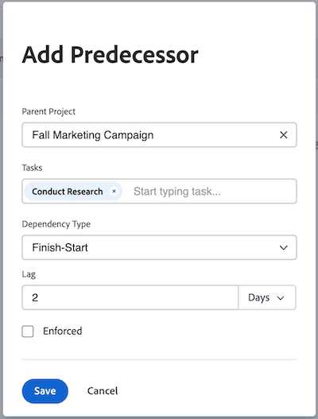

# 先行タスク領域を使用した先行タスク関係の作成

<!-- Audited: 5/2025 -->

先行タスクを使用して、開始または完了するのに他のタスクに依存するタスクをリンクすることができます。例えば、招待状（先行タスク）を送信する前に、パーティ（依存タスク）をホストしたくはありません。

この記事では、タスク内の「先行タスク」タブを使用して、先行タスクを設定する方法について説明します。

タスクの一覧で先行タスクを設定する方法について詳しくは、[タスクリストでの先行タスクの関係の作成](../../../manage-work/tasks/use-prdcssrs/create-predecessors-on-task-list.md)を参照してください。

タスクの先行タスクは、Adobe Workfront の以下のエリアに表示されます。

* 依存タスクの「先行タスク」セクション内
* ガントチャート内
* 先行タスク列のタスクリスト内

先行タスクについて詳しくは、[先行タスクの概要](../../../manage-work/tasks/use-prdcssrs/predecessors-overview.md)を参照してください。

## アクセス要件

+++ 展開すると、この記事の機能のアクセス要件が表示されます。

この記事の手順を実行するには、次のアクセス権が必要です。

<table style="table-layout:auto"> 
 <col> 
 <col> 
 <tbody> 
  <tr> 
   <td role="rowheader">Adobe Workfront プラン</td> 
   <td> 
任意
 </td> 
  </tr> 
  <tr> 
   <td role="rowheader">Adobe Workfront プラン</td> 
   <td> 
   
新規：標準 

   
または 

   
現在：プラン 
 </td> 
  </tr> 
  <tr> 
   <td role="rowheader">アクセスレベル設定</td> 
   <td> 
タスクおよびプロジェクトへのアクセスを編集
 
メモ：まだアクセス権がない場合は、アクセスレベルに追加の制限が設定されていないかどうか Workfront 管理者にお問い合わせください。Workfront 管理者がアクセスレベルを変更する方法について詳しくは、<a href="../../../administration-and-setup/add-users/configure-and-grant-access/create-modify-access-levels.md" class="MCXref xref">カスタムアクセスレベルの作成または変更</a>を参照してください。
 </td> 
  </tr> 
  <tr> 
   <td role="rowheader">オブジェクト権限</td> 
   <td> 
タスクおよびプロジェクトに対する権限の管理
 
追加のアクセス権のリクエストについて詳しくは、<a href="../../../workfront-basics/grant-and-request-access-to-objects/request-access.md" class="MCXref xref">オブジェクトへの利用申請</a>を参照してください。
 </td> 
  </tr> 
 </tbody> 
</table>

この表の情報について詳しくは、[Workfront ドキュメントのアクセス要件](/help/quicksilver/administration-and-setup/add-users/access-levels-and-object-permissions/access-level-requirements-in-documentation.md)を参照してください。

+++

## タスクの先行タスクの作成

1. 依存タスクとして指定するタスクに移動します。

1. 左側のパネルで、「**先行タスク**」をクリックします。

1. 「**先行タスク**」セクションで、「**+先行タスクを追加**」をクリックします。 **先行タスクの追加** ダイアログボックスが開きます。

1. （任意）プロジェクト間の先行タスクを追加するには、「**親プロジェクト**」フィールドのプロジェクト名を別のプロジェクトに置き換えます。

   詳しくは、[ プロジェクト間先行タスクの作成 ](../../../manage-work/tasks/use-prdcssrs/cross-project-predecessors.md) を参照してください。

1. **タスク** フィールドに、先行タスクとして指定する 1 つ以上のタスクの名前を入力し、ドロップダウンに表示されたら選択します。

1. **依存関係タイプ**&#x200B;を選択します。

   詳しくは、[ タスク依存関係タイプの概要 ](../../../manage-work/tasks/use-prdcssrs/task-dependency-types.md) を参照してください。

1. **間隔** の値を入力します。

   詳しくは、&#x200B;[ 間隔の種類の概要 ](../../../manage-work/tasks/use-prdcssrs/lag-types.md) を参照してください。

   

1. 2 つのタスク間の先行タスク関係を適用する場合は、「**適用**」チェックボックスを選択します。

   詳しくは、[ 先行タスクの適用 ](../../../manage-work/tasks/use-prdcssrs/enforced-predecessors.md) を参照してください。

1. **保存**&#x200B;をクリックします。
