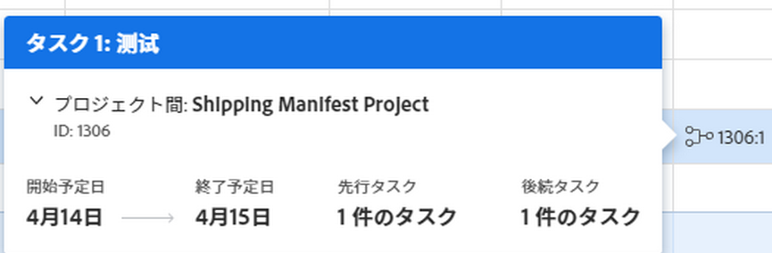

# タスクリストでの先行タスク関係の作成

<!-- Audited: 5/2025 -->

先行タスクを使用して、開始または完了するのに他のタスクに依存するタスクをリンクすることができます。例えば、招待状（先行タスク）を送信する前にパーティー（依存タスク）を主催することはありません。

この記事では、タスクリストで先行タスクを作成する方法を説明します。

タスクの先行タスクは、Adobe Workfront の以下のエリアに表示されます。

* 先行タスク列のタスクリスト。
* ガントチャートで表示します。
* 依存タスクの先行タスク セクション内

詳しくは、[タスクの先行タスクの概要](../../../manage-work/tasks/use-prdcssrs/predecessors-overview.md)を参照してください。

## アクセス要件

+++ 展開すると、この記事の機能のアクセス要件が表示されます。

<table style="table-layout:auto"> 
 <col> 
 <col> 
 <tbody> 
  <tr> 
   <td role="rowheader">Adobe Workfront パッケージ</td> 
   <td> 
任意
 </td> 
  </tr> 
  <tr> 
   <td role="rowheader">Adobe Workfront プラン</td> 
   <td>
標準
 
   
プラン
 </td> 
  </tr> 
  <tr> 
   <td role="rowheader">アクセスレベル設定</td> 
   <td> 
タスクおよびプロジェクトへのアクセスを編集
 </td> 
  </tr> 
  <tr> 
   <td role="rowheader">オブジェクト権限</td> 
   <td> 
タスクおよびプロジェクトに対する権限の管理
</td> 
  </tr> 
 </tbody> 
</table>

詳しくは、[Workfront ドキュメントのアクセス要件](/help/quicksilver/administration-and-setup/add-users/access-levels-and-object-permissions/access-level-requirements-in-documentation.md)を参照してください。

+++

<!--Old:

<table style="table-layout:auto"> 
 <col> 
 <col> 
 <tbody> 
  <tr> 
   <td role="rowheader">Adobe Workfront plan</td> 
   <td> 
Any
 </td> 
  </tr> 
  <tr> 
   <td role="rowheader">Adobe Workfront license</td> 
   <td> 
Standard 

Plan 
 </td> 
  </tr> 
  <tr> 
   <td role="rowheader">Access level configurations</td> 
   <td> 
Edit access to Tasks and Projects
 
Note: If you still don't have access, ask your Workfront administrator if they set additional restrictions in your access level. 
 </td> 
  </tr> 
  <tr> 
   <td role="rowheader">Object permissions</td> 
   <td> 
Manage permissions to the tasks and the project
 </td> 
  </tr> 
 </tbody> 
</table>-->

## 先行タスクを作成

{{step1-to-projects}}

1. **プロジェクト** ページでプロジェクトを選択します。
1. 左パネルの「**タスク**」をクリックします。
1. **ビュー** ドロップダウンで、**先行タスク** 列を表示するビューを選択するか、現在のビューに列を追加します。

1. 依存タスクとして指定するタスクを選択します。
1. タスクの **先行タスク** 列内をクリックします。
1. 選択したタスクの先行タスクとして指定するタスク番号を入力し、**Enter** キーを押します。

   >[!TIP]
   >
   >プロジェクト間先行タスクを追加するには、次の手順を実行します。
   >
   >1. **プランモード**&#x200B;アイコンをクリックし、「**自動保存**」を選択します。
   >
   >1. 先行タスクのプロジェクトの参照番号、コロン、およびタスク番号を入力します。 例えば、*765021:12* と入力した場合は、先行タスクのプロジェクトの参照番号は 765021 で、先行タスクがそのプロジェクトのタスク番号 12 になります。
   >
   >1. この先行タスクの依存関係タイプを追加します。詳しくは[プロジェクト間の先行タスクを作成](/help/quicksilver/manage-work/tasks/use-prdcssrs/cross-project-predecessors.md)を参照してください。
   >
   >1. **Enter** キーを押します。
   >
   >**重要**
   >
   >タスクリストが手動保存モードで表示されている場合は、プロジェクト間先行タスクを追加できません。

   先行タスクが完了とマークされると、先行タスクのアイコンが緑色に変わります。これは、依存タスクの作業準備ができたことを示します。

   「先行タスク」列で使用できる関係タイプについて詳しくは、[&#x200B; タスク先行タスクの概要 &#x200B;](../../../manage-work/tasks/use-prdcssrs/predecessors-overview.md) を参照してください。

## 先行タスクの詳細を表示

タスクリストから先行タスクの詳細をすばやく表示できます。

1. タスクリストで、「先行タスク **列の先行タスク番号にポインタを合わせ** す。 先行タスクの詳細を含むボックスが表示されます。

   

   以下の詳細が表示されます。

   **先行タスク名：**&#x200B;参照されている先行タスクの名前。先行タスクのタスク番号が含まれます。タスク名をクリックして開きます。

   **プロジェクト名：**&#x200B;先行タスクが存在するプロジェクトの名前。プロジェクトは、タスクと同じプロジェクトに先行タスクが属している場合は現在のプロジェクトとして識別され、異なるプロジェクトに先行タスクが属している場合はクロスプロジェクトとして識別されます。プロジェクト間先行タスクについて詳しくは、[プロジェクト間先行タスクの作成](../../tasks/use-prdcssrs/cross-project-predecessors.md)を参照してください。

   プロジェクトの詳細を展開すると、プロジェクトの予定開始日と予定終了日、状況、ステータス、完了率、所有者を確認することができます。プロジェクト間の場合は、「**プロジェクトを表示**」をクリックして、プロジェクトを開くことができます。

   **ID：**&#x200B;先行プロジェクトが配置されているプロジェクトの参照番号。

   **予定開始：**&#x200B;先行タスクの予定開始日。

   **予定終了日：**&#x200B;先行タスクの予定完了日。

   **先行タスクの数：** 参照されている先行タスクの先行タスクの数。

   **後続タスク数：** 参照されている先行タスクの後続タスク（または依存タスク）の数。
