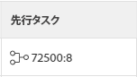
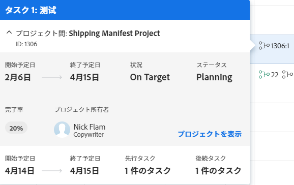

# プロジェクト間先行タスクの作成

<!--Audited: 12/2023-->

プロジェクト間の先行タスクとは、別のプロジェクト内の別のタスク（後続タスクと呼ばれます）が依存するタスクです。先行タスクとは、依存（後続）タスクよりも優先されるタスクです。たとえば、依存タスクを開始する前に、先行タスクを「完了」とマークする必要がある依存関係を作成できます。

Adobe Workfrontを使用すると、1 つのプロジェクト内の先行タスクが許可されるのと同じように、他のプロジェクト内のタスクに依存するタスクを設定できます。

>[!INFO]
>
>例えば、掘削会社には 1 つのバックホーしかなく、2 つのプロジェクトにはバックホーを使用する必要があるタスクがあります。 プロジェクトマネージャは、最初のプロジェクトのタスクを、2 番目のプロジェクトのタスクの先行タスクにすることができます。 これは、最初のプロジェクトが終了したときに、2 つ目のプロジェクトでバックホーの使用を開始できることを示しています。

プロジェクト間の先行タスクを通じてプロジェクトをリンクする場合、プライマリプロジェクト（先行タスクがあるプロジェクト）の日付は、セカンダリプロジェクト（後続タスクがあるプロジェクト）に影響します。

>[!TIP]
>
>セカンダリプロジェクトの更新された日付を表示するには、プロジェクトのタイムラインを再計算する必要があります。タイムラインの再計算について詳しくは、[プロジェクトのタイムライン再計算の設定](../../../administration-and-setup/set-up-workfront/configure-system-defaults/configure-timeline-recalculations-projects.md)を参照してください。

先行タスクの関係について詳しくは、[タスクの先行タスクの概要](../../../manage-work/tasks/use-prdcssrs/predecessors-overview.md)を参照してください。

## アクセス要件

この記事の手順を実行するには、次のアクセス権が必要です。

<table style="table-layout:auto"> 
 <col> 
 <col> 
 <tbody> 
  <tr> 
   <td role="rowheader">Adobe Workfront プラン</td> 
   <td> 
任意
 </td> 
  </tr> 
  <tr> 
   <td role="rowheader">Adobe Workfront ライセンス</td> 
   <td> 
新規：標準 
 
   または
   
現在：プラン 

   </td> 
  </tr> 
  <tr> 
   <td role="rowheader">アクセスレベル設定*</td> 
   <td> 
タスクおよびプロジェクトへのアクセスを編集
 </td> 
  </tr> 
  <tr> 
   <td role="rowheader">オブジェクト権限</td> 
   <td> 
タスクおよびプロジェクトに対する権限の管理
 </td> 
  </tr> 
 </tbody> 
</table>

この表の情報の詳細については、 [Workfrontドキュメントのアクセス要件](/help/quicksilver/administration-and-setup/add-users/access-levels-and-object-permissions/access-level-requirements-in-documentation.md).

## プロジェクト間先行タスクを作成

1. 後続のタスク（依存タスク）に移動します。
1. 左側のパネルで&#x200B;**先行タスク**&#x200B;をクリックします。
1. 「**先行タスクの追加**」をクリックします。
1. Adobe Analytics の **親プロジェクト** [ ] フィールドに、現在のタスクの先行タスクにするタスクを含むプロジェクトの名前を入力します。
1. 名前がドロップダウンリストに表示されたら、クリックします。
1. Adobe Analytics の **タスク** フィールドに、現在のタスクの先行タスクにするタスクの名前を入力します。
1. 先行タスクと依存タスクの間の関係を定義するには、次の情報を指定します。

   * **依存関係の種類：** 先行タスクと依存タスクの関係を選択します。 デフォルトの関係は「終了 - 開始」です。これは、依存タスクを開始する前に先行タスクを終了する必要があることを意味します。様々な依存タイプについて詳しくは [タスクの依存関係タイプの概要](../../../manage-work/tasks/use-prdcssrs/task-dependency-types.md)を参照してください。

   * **ラグ：**&#x200B;強制的な先行タスクが完了してから、依存タスクが開始できるまでの経過時間を指定します。各種のラグの詳細については、 [ラグタイプの概要](../../../manage-work/tasks/use-prdcssrs/lag-types.md).

   * **強制：**&#x200B;このオプションを選択した場合、2 つのタスク間の依存関係を、ユーザーが早期にタスクを開始することによって回避することはできません。例えば、タスク A とタスク B の間の関係を強制にすると、タスク A が完了するまでタスク B は開始できません。先行タスクの強制について詳しくは、[先行タスクの強制](../../../manage-work/tasks/use-prdcssrs/enforced-predecessors.md)を参照してください。

     このオプションを選択しない場合、依存関係はユーザーに対する提案のように扱われます。例えば、ユーザーはタスク A が完了する前にタスク B を開始できます。

1. 「**保存**」をクリックします。

   プロジェクト間の先行タスクを持つタスクには、先行タスクが属するプロジェクトの参照番号と、タスクの番号がコロンで区切られて、タスクリストの [ 先行タスク ] 列に表示されます。

   

   先行タスクが完了とマークされると、先行タスクのアイコンが緑色に変わります。これは、依存タスクの作業準備ができたことを示します。

   この値の上にポインタを合わせると、先行タスク、プロジェクト、日付に関する詳細情報が表示されます。[ 詳細 ] ボックスの [ プロジェクト間の先行タスク ] をクリックして、タスクを開きます。

   前任者のプロジェクトの詳細を表示するには、ホバーウィンドウの上部をクリックします。

   クリック **プロジェクトを見る** 前任者のプロジェクトを開く。

   

   >[!TIP]
   >
   >   「**プロジェクトを見る**」オプションは、プロジェクト間の先行タスクを表示する場合にのみ表示されます。

