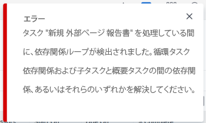
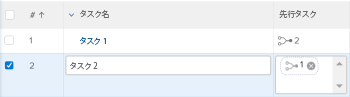

# タスク依存関係ループの概要

タスクに先行タスク関係を追加すると、依存関係ループが発生する場合があります。先行タスクについて詳しくは、[タスクの先行タスクの概要](../../../manage-work/tasks/use-prdcssrs/predecessors-overview.md)を参照してください。

## 依存関係ループの概要

依存関係ループは、相互に依存する複数のタスクが完了すると発生します。 Adobe Workfrontでは、依存関係ループが発生する場合、タスク間に先行タスク関係を作成することはできません。

**例：**&#x200B;タスク 2 はタスク 1 の先行タスクで、タスク 1 の作業を開始する前にタスク 2 を完了する必要があります。

タスク 1 をタスク 2 の先行タスクにしようとすると、タスク 1 はタスク 2 が完了するまで開始できないけれど、タスク 2 はタスク 1 が終了するまで開始できないので、依存関係ループエラーが発生します。

## 依存関係ループに関する考慮事項

* 依存関係ループには、2 つ以上のタスクを含めることができます。先行タスク関係に接続するタスクの親の数は、依存関係ループを作成する親の数になる場合があります。
* また、親を子の先行タスクにしようとすると、依存関係のループが発生する場合もあります。
* 依存関係ループの場合、タスクまたはプロジェクトを保存することはできません。依存関係ループを修正するには、エラーメッセージに表示されるタスク間の先行タスク関係を再評価し、競合を削除してから、タスクまたはプロジェクトを保存する必要があります。

