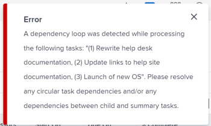
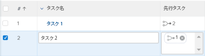

# タスク依存関係ループの概要

タスクに先行タスク関係を追加すると、依存関係ループが発生する場合があります。 先行タスクについて詳しくは、[タスクの先行タスクの概要](../../../manage-work/tasks/use-prdcssrs/predecessors-overview.md)を参照してください。

## 依存関係ループの概要

依存関係ループは、相互に依存して完了する2つ以上のタスクがある場合に発生します。 Adobe Workfrontでは、依存関係ループを作成する場合、タスク間に先行タスク関係を作成できません。

**例：**&#x200B;タスク 2 はタスク 1 の先行タスクで、タスク 1 の作業を開始する前にタスク 2 を完了する必要があります。

タスク 1 をタスク 2 の先行タスクにしようとすると、タスク 1 はタスク 2 が完了するまで開始できないけれど、タスク 2 はタスク 1 が終了するまで開始できないので、依存関係ループエラーが発生します。

## 依存関係ループに関する考慮事項

* 依存関係ループには、2 つ以上のタスクを含めることができます。 先行タスク関係に接続するタスクの親の数は、依存関係ループを作成する親の数になる場合があります。
* また、親を子の先行タスクにしようとすると、依存関係のループが発生する場合もあります。
* 依存関係ループの場合、タスクまたはプロジェクトを保存することはできません。 依存関係ループを修正するには、エラーメッセージにリストされているタスク間の先行タスク関係を再評価し、タスクまたはプロジェクトを保存する前に競合を削除する必要があります。

