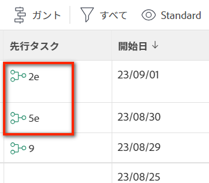

# 先行タスクを適用

先行タスクとは、他のタスクが完了に依存するタスクのことです。 先行タスクの関係は、タスクの開始日と完了日に影響を与え、最終的にはプロジェクトのタイムラインに影響を与えます。

先行タスクの詳細については、 [タスクの先行タスクの概要](../../../manage-work/tasks/use-prdcssrs/predecessors-overview.md).

タスク間の先行タスクの関係を設定することで、依存タスクの開始と終了が先行タスクの開始と終了に依存する方法を定義します。 これは、異なる依存関係タイプを使用しておこないます。

依存タイプの詳細は、 [タスク依存関係タイプの概要](../../../manage-work/tasks/use-prdcssrs/task-dependency-types.md).

## 実行される先行タスクの概要

>[!IMPORTANT]
>
>先行タスクの関係を尊重する必要がある場合は、先行タスクを実行する必要があります。 先行タスクを強制しないと、依存タスクは、依存タイプに関係なく、先行タスクの開始と終了とは独立して開始および終了できます。

プロジェクトに先行タスクを設定する場合は、先行タスクの関係を強制できます。

先行タスクが強制された場合、後続タスクは先行タスクが完了する前に開始できません。 たとえば、タスク A とタスク B の間で [ 終了日 ] と [ 開始日 ] の関係を設定すると、タスク A が完了とマークされるまで、タスク B は開始できません（[ 新規 ] の状態を維持し、[ 完了率 ] は 0%のままにする必要があります）。 関係の強制は、すべての先行タイプに適用されます。

## アクセス要件

この記事の手順を実行するには、次のアクセス権が必要です。

<table style="table-layout:auto"> 
 <col> 
 <col> 
 <tbody> 
  <tr> 
   <td role="rowheader">Adobe Workfront plan*</td> 
   <td> 
任意
 </td> 
  </tr> 
  <tr> 
   <td role="rowheader">Adobe Workfront license*</td> 
   <td> 
計画 
 </td> 
  </tr> 
  <tr> 
   <td role="rowheader">アクセスレベル設定*</td> 
   <td> 
タスクおよびプロジェクトへのアクセスを編集
 
注意：まだアクセス権がない場合は、Workfront管理者に、アクセスレベルに追加の制限を設定しているかどうかを問い合わせてください。 Workfront管理者がアクセスレベルを変更する方法について詳しくは、 <a href="../../../administration-and-setup/add-users/configure-and-grant-access/create-modify-access-levels.md" class="MCXref xref">カスタムアクセスレベルの作成または変更</a>.
 </td> 
  </tr> 
  <tr> 
   <td role="rowheader">オブジェクト権限</td> 
   <td> 
タスクおよびプロジェクトに対する権限の管理
 
追加のアクセス権のリクエストについて詳しくは、 <a href="../../../workfront-basics/grant-and-request-access-to-objects/request-access.md" class="MCXref xref">オブジェクトへのアクセスのリクエスト </a>.
 </td> 
  </tr> 
 </tbody> 
</table>

&#42;保有しているプラン、ライセンスの種類、アクセス権を確認するには、Workfront管理者に問い合わせてください。

## タスクレベルで先行タスクを適用する

1. 先行タスクを実行する後続タスクに移動します。
1. クリック **先行タスク** 左のパネルで、 **先行タスクを追加**. クリックが必要になる場合があります **さらに表示**&#x200B;を、 **先行タスク**.
1. （条件付き）プロジェクト間の先行プロジェクトを追加する場合は、 **親プロジェクト** フィールドに入力し、別のプロジェクトに置き換えます。
1. 先行タスクの名前を指定します。 **タスク** フィールドに入力します。
1. 次を指定： **依存タイプ** この 2 つのタスクの間で

   デフォルト **依存タイプ** が **終了 — 開始**.

1. を選択します。 **強制** フィールドを使用して、先行者を強制します。
1. 「**保存**」をクリックします。

## タスクリストで先行タスクを適用する

1. プロジェクトのタスクリストに移動します。
1. 次の **表示** ドロップダウンメニューで、 **標準ビュー**.

1. 前任者に指定するタスクの数をメンタルメモに記録します。
1. 先行タスクを実行する後続タスクを検索します。
1. 内 **先行タスク** 列には、先行タスクの番号を入力し、その後に&quot;e&quot;を付けます。 たとえば、選択したタスクの先行タスクとしてタスク番号 1 を追加するには、&quot;1e&quot;と入力します。
1. [Enter] をクリックして、タスクの先行情報を保存します。

   
