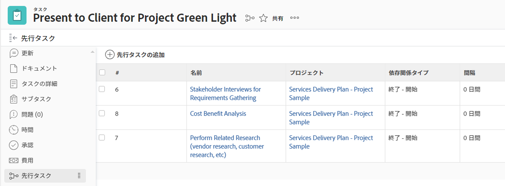
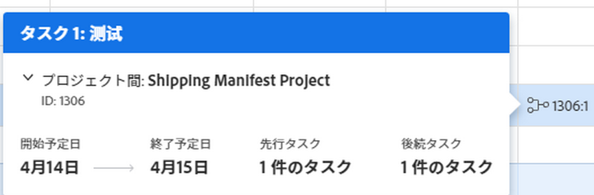
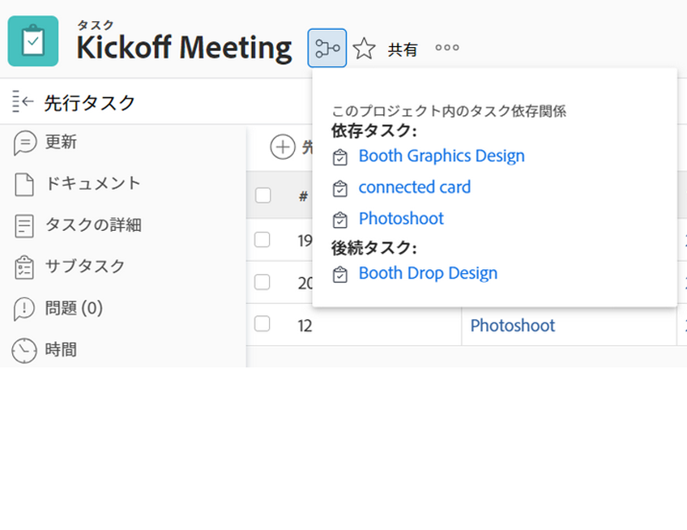

# タスクの先行タスクの概要

<!-- 

CONTEXT SENSITIVE HELP article. DO NOT CHANGE THE NAME OF THE ARTICLE/ DO NOT MOVE OR DELETE! -->

先行タスクとは、別のタスク（後続タスクまたは依存タスクと呼ばれる）が依存するタスクです。 Adobe Workfrontは、5 種類の先行依存関係をサポートしています。 先行依存関係を理解するには、 [タスク依存関係タイプの概要](../../../manage-work/tasks/use-prdcssrs/task-dependency-types.md).

## 先行タスクの概要

プロジェクトのタイムラインを理解するには、前者機能を理解することが重要です。

タスク間の先行タスクの関係は、1 つのプロジェクト内と複数のプロジェクト間の両方に存在します。

複数プロジェクトの依存関係がある場合は、プロジェクト間の先行タスクを確立できます。

先行タスクと後続タスクが同じプロジェクトに属しているか、2 つの異なるプロジェクトに属しているかに関わらず、依存関係とタイムラインは同じ方法で計算されます。

先行タスクに関しては、プロジェクトタイムラインは次の影響を受けます。

* 先行者の依存関係
* ラグの値とタイプ\
   依存関係とラグの両方について詳しくは、 [タスクリスト内の先行タスク値の例](#examples-of-predecessor-values-in-a-task-list).

たとえば、タスク A がタスク B の先行タスクで、タスク B に [ 可能な限り早く ] というタスク制約がある場合、Workfrontは、先行タスクが適用されているかどうかに関係なく、タスク A の予定完了日の直後に、予定開始日を割り当てます。

先行関係を理解するには、次の点を理解する必要があります。

* **依存関係の種類：** 先行タスクは、様々な依存タイプによってリンクされます。 依存関係のタイプについて詳しくは、 [タスク依存関係タイプの概要](../../../manage-work/tasks/use-prdcssrs/task-dependency-types.md).

* **前任者を強制する：** 先行タスクを適用する場合、後続タスクは先行タスクが完了するまで開始できません。 後続タスクは、先行タスクが終了した直後に開始と表示されます。

   Workfrontでは、先行タスクが完了するまで、「処理中」または「完了」とマークすることは許可されません。 ただし、Workfrontでは、タスクに時間を報告することを許可します。\
   先行タスクの適用の詳細については、 [先行タスクを適用](../../../manage-work/tasks/use-prdcssrs/enforced-predecessors.md).

* **ラグ：** 依存関係にラグを作成して、先行タスクの完了後、および後続タスクの開始前に遅延を生成できます。 ラグは、プロジェクトのタイムラインに影響を与えます。

   ラグタイプについては、 [ラグタイプの概要](../../../manage-work/tasks/use-prdcssrs/lag-types.md).

## 先行関係を作成

先行タスクを作成するには、次の記事を参照してください。

* タスクの [ 先行タスク ] タブを使用して先行タスクを設定するには、 [[ 先行タスク ] 領域を使用して先行タスク関係を作成する](../../../manage-work/tasks/use-prdcssrs/create-predecessors-in-predecessors-area.md).
* タスクリストに先行タスクを設定するには、 [タスクリストに先行タスク関係を作成する](../../../manage-work/tasks/use-prdcssrs/create-predecessors-on-task-list.md).
* タスクを連結して先行関係を確立するには、 [タスクを連結して先行タスク関係を作成](../../../manage-work/tasks/use-prdcssrs/create-predecessors-by-chaining-tasks.md).
* プロジェクト間の先行タスクを確立するには、 [プロジェクト間の先行タスクの作成](../../../manage-work/tasks/use-prdcssrs/cross-project-predecessors.md).

## タスクの先行タスクを見つける {#locate-the-predecessors-of-a-task}

タスクの先行タスクを検索するには、次のいずれかを実行します。

* 作業中のプロジェクトに移動し、次の操作を実行します。

   1. 先行タスクを検索するタスクを見つけ、タスクをクリックします。
   1. クリック **先行タスク** をクリックします。 クリックが必要になる場合があります **さらに表示**&#x200B;を、 **先行タスク**.
   1. 先行者が属するプロジェクトの名前が **プロジェクト** 列。

      この **#** 列には、先行タスク番号が表示されます。 例えば、「6」はプロジェクトの 6 番目のタスクを意味します。

      

* 作業中のプロジェクトに移動し、次の操作を実行します。

   1. 次をクリック： **タスク** タブをクリックします。
   1. を選択します。 **標準ビュー** をタスクリストの最上部に表示します。
   1. この **先行タスク** 列には、先行タスクの番号が表示されます。

      プロジェクト間の先行タスクの場合、[ 先行タスク ] 列には、先行タスクが属するプロジェクトの参照番号とタスクの番号がコロンで区切って表示されます。

      先行タスクが完了とマークされると、先行タスクのアイコンが緑色に変わります。 これは、依存タスクの作業準備ができたことを示します。

      この値の上にマウスポインターを置くと、先行プロジェクト、日付に関する詳細情報が表示されます。

      

## タスクリスト内の先行タスク値の例 {#examples-of-predecessor-values-in-a-task-list}

タスクの一覧で先行タスクを表示すると、次の種類の先行タスクと、それぞれの依存タイプとラグの値が表示されます。

* **1fs -** 先行タスク番号は 1 です。 依存関係の種類は Finish-Start です。 プロジェクトタイムラインで、このタスクはタスク 1 の終了直後に開始するようにスケジュールされます。 それでも、「処理中」または「完了」としてマークできます。
* **1 -** 先行タスク番号は 1 です。 これはと同じです。 **1fs**&#x200B;で、 **fs** は、Workfrontの既定の先行関係です。

* **1fse -** 先行タスク番号は 1 です。 依存関係の種類は Finish-Start-Enforced です。 プロジェクトタイムラインで、このタスクはタスク 1 の終了直後に開始と表示されます。 Workfrontでは、タスク 1 が完了するまで、「処理中」または「完了」とマークすることは許可されません。 ただし、Workfrontでは、タスクに時間を報告することを許可します。
* **1fs+3d -** 先行タスク番号は 1 です。 依存関係のタイプは「完了 — 開始」で、ラグタイムは 3 日です。 プロジェクトタイムラインで、このタスクは、タスク 1 が完了してから 3 営業日が経過した後に開始と表示されます。
* **1fs-3d -** 先行タスク番号は 1 です。 依存関係のタイプは「完了 — 開始」で、ラグタイムは 3 日です。 プロジェクトタイムラインでは、このタスクは先行タスクが終了する 3 営業日前の開始と表示されます。
* **1fs+3de**  — 先行タスク番号は 1 です。 依存関係のタイプは Finish-Start-Enforced で、ラグタイムは 3 日です。 プロジェクトタイムラインで、このタスクは、タスク 1 が完了してから 3 営業日が経過した後に開始と表示されます。 Workfrontでは、タスク 1 が完了するまで、「処理中」または「完了」とマークすることは許可されません。 ただし、Workfrontでは、タスクに時間を報告することを許可します。

   >[!NOTE]
   >
   >適用される値 (**e**) は、前に使用したものではなく、Lag に追加する必要があります。

* **4515:2** 先行タスク番号は 2 です。  — これは、開始に対する完了で、参照番号を持つプロジェクト内の先行プロジェクトとの非強制の依存関係です **4515**;先行タスク番号： **2**.

## 先行情報の表示

Workfrontの次の領域で、先行者情報を表示できます。 これには、プロジェクト間の先行タスクに関する情報が含まれます。

* タスクレベルの「先行タスク」セクションで、

   「先行タスク」セクションでの先行タスク情報の表示の詳細については、「 [タスクの先行タスクを見つける](#locate-the-predecessors-of-a-task) 」を参照してください。

* ガントチャートで使用します。

   ガントチャートでの先行タスクの表示については、 [ガントチャートでの情報の表示方法を設定します](../../../manage-work/gantt-chart/use-the-gantt-chart/configure-info-on-gantt-chart.md).

* タスクリスト内。

   タスクリストのタスクの先行タスクに関する情報を表示するには、次のいずれかを実行します。

   * タスクのリストに組み込みの標準ビューを適用します。

      標準ビューで先行情報を表示する方法については、「 [タスクの先行タスクを見つける](#locate-the-predecessors-of-a-task) 」を参照してください。

   * タスクビューまたはレポートを作成し、そのビューに Predecessors 列を追加します。

      先行情報を含むタスクのカスタマイズビューの作成の詳細については、「 [表示：先行者の詳細](../../../reports-and-dashboards/reports/custom-view-filter-grouping-samples/view-predecessor-details.md).

* タスクにアクセスする際のタスクヘッダー。

   
