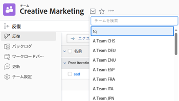

# チームの作成

チームを作成すると、デフォルトでチームの所有者になります。

チームのレポートを作成し、[!UICONTROL 所有者名]フィールドをレポートに含める際に、すべてのチームのチーム所有者が表示されます。（レポートの作成について詳しくは、[カスタムレポートの作成](../../reports-and-dashboards/reports/creating-and-managing-reports/create-custom-report.md)を参照してください。）

[!DNL Adobe Workfront] 管理者が[!UICONTROL 設定]エリアからチームを作成する方法について詳しくは、[[!UICONTROL 設定]エリアからのチームの作成](../../administration-and-setup/add-users/create-and-manage-teams/create-a-team-from-setup.md)を参照してください。

## アクセス要件

この記事の手順を実行するには、次のアクセス権が必要です。

<table style="table-layout:auto"> 
 <col> 
 </col> 
 <col> 
 </col> 
 <tbody> 
  <tr> 
   <td role="rowheader"><strong>[!DNL Adobe Workfront] プラン*</strong></td> 
   <td> 
任意
 </td> 
  </tr> 
  <tr> 
   <td role="rowheader"><strong>[!DNL Adobe Workfront] ライセンス*</strong></td> 
   <td> 
[!UICONTROL Plan] 
 </td> 
  </tr> 
 </tbody> 
</table>

&#42;保有するプランやライセンスの種類を確認するには、[!DNL Workfront] 管理者にご連絡ください。

## チームの作成

1. Adobe Workfront の右上隅で、**[!UICONTROL メインメニュー]**&#x200B;アイコン 、**[!UICONTROL チーム]**&#x200B;の順にクリックします。

1. **[!UICONTROL チームの切り替え]**&#x200B;アイコン  、「**[!UICONTROL 新規チームの作成]**」の順にクリックします。

   

1. 表示される&#x200B;**[!UICONTROL 新規チーム]**&#x200B;ボックスに、次の情報を入力します。

   * **[!UICONTROL チーム名]：**&#x200B;新規チームの名前を入力します。
   * **[!UICONTROL グループ]**：チームを関連付けられたグループに割り当てる場合は、グループの名前を入力し始め、表示されたら名前を選択します。

     適切なグループにポインタを合わせ、横に表示される情報アイコン  をクリックすると、適切なグループがチームに関連付けられていることを確認できます。グループの上位のグループの階層や管理者など、グループに関する情報が一覧表示されるツールチップが表示されます。

     >[!NOTE]
     >
     >チームがグループまたはサブグループに割り当てられると、そのグループまたはサブグループのグループ管理者は、チームのメンバーにならなくてもチームを管理できます。グループ管理者は、メインメニューからチーム領域に移動し、チームを切り替え矢印  をクリックし、管理するグループに割り当てられているすべてのチームのリストを表示します。

   * **[!UICONTROL これはアジャイルチームです]：**&#x200B;この新しいチームをアジャイルチームに設定する場合は、このオプションを選択します。

     アジャイルチームについて詳しくは、[アジャイルチームの作成](../../agile/get-started-with-agile-in-workfront/create-an-agile-team.md)を参照してください。

   * **[!UICONTROL チームメンバー]：**&#x200B;チームに追加するユーザーの名前を入力し始め、ドロップダウンリストに表示されたら名前を選択します。

     複数のユーザーをチームに追加するには、このプロセスを繰り返します。

     チームに追加できるユーザー数に制限はありません。ただし、これらのチームに対して作業管理が複雑すぎる可能性があるので、1 つのチームで過度に多くのユーザーを含めないようにすることをお勧めします。

   * **[!UICONTROL 説明]：**&#x200B;チームの説明を入力します。

     チームを選択すると、チーム領域の右上に説明が表示されます。

     >[!NOTE]
     >
     >説明が長い場合は、クリックすると完全な説明がポップアップで表示されます。チーム設定を編集するアクセス権がある場合は、ポップアップで直接説明を編集することもできます。

1. 「**[!UICONTROL 作成]**」をクリックします。
