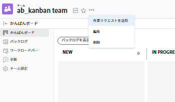

# チームを非アクティブ化

関連する履歴データを保持したまま、使用しなくなったチームを非アクティブ化できます。 [!DNL Adobe Workfront] 管理者は、セットアップの「チーム」領域からいつでもチームを再アクティブ化できます。 チームを非アクティブ化すると、チームは次の領域に表示されなくなります。

<table style="table-layout:auto"> 
 <col> 
 <col> 
 <tbody> 
  <tr> 
   <td> 
    <ul> 
     <li> 
カスタムフォームの先頭に入力するフィールド
 </li> 
    </ul> 
    <ul> 
     <li> 
オブジェクトの共有ダイアログ
 </li> 
     <li> 
[!UICONTROL ユーザープロファイル ]*
 </li> 
    </ul> </td> 
   <td> 
    <ul> 
     <li> 
[!UICONTROL チーム ] 領域のメイン選択ドロップダウンメニュー
 </li> 
     <li> 
[!UICONTROL 割り当て ] typeahead
 </li> 
     <li> 
プロジェクトの [!UICONTROL かんばんに追加 ] ボードダイアログ
 </li> 
    </ul> </td> 
  </tr> 
 </tbody> 
</table>

非アクティブなチームは、チームを検索しても表示されませんが、には表示されます [!UICONTROL ホームチーム] およびその他のチーム（非アクティブ化の前にユーザーがチームに割り当てられた場合）

## アクセス要件

この記事の手順を実行するには、次のアクセス権が必要です。

<table style="table-layout:auto"> 
 <col> 
 <col> 
 <tbody> 
  <tr> 
   <td role="rowheader"><strong>[!DNL Adobe Workfront] 計画*</strong></td> 
   <td> 
任意
 </td> 
  </tr> 
  <tr> 
   <td role="rowheader"><strong>[!DNL Adobe Workfront] ライセンス*</strong></td> 
   <td> 
計画
 </td> 
  </tr> 
 </tbody> 
</table>

&#42;保有するプランやライセンスの種類を確認するには、 [!DNL Workfront] 管理者。

## チームを非アクティブ化

アクティベーションを解除する前にチームに割り当てられた作業は、すべて割り当てられたままになります。 チームを非アクティブ化する前に、作業を再割り当てすることをお勧めします。

>[!TIP]
>
>非アクティブなチームが割り当てられたままのタスクや問題をフィルタリングするレポートを作成できます。

リクエストキューを使用する場合、ルーティングルールでデフォルトチームとして割り当てられたチームを非アクティブ化しても、チームはそのまま残り、リクエストは非アクティブなチームにルーティングされます。 チームを非アクティブ化する前に、アクティブなチームでルーティングルールを更新することをお勧めします。

1. 次をクリック： **[!UICONTROL メインメニュー]** アイコン  Adobe Workfrontの右上隅で、 **[!UICONTROL チーム]**.
1. 次をクリック： **[!DNL Switch team]** アイコンをクリックし、ドロップダウンメニューから新しいチームを選択するか、検索バーでチームを検索します。
1. 次をクリック： **[!UICONTROL 詳細]** メニューから、 **[!UICONTROL 編集]**.

   

1. をクリア **[!UICONTROL アクティブ]** チェックボックスをオンにします。
1. クリック **[!UICONTROL 変更を保存]**.

## 既知の制限事項

非アクティブなチームは、次の領域に表示されます。

* の「所有者」フィールド [!DNL Workfront Goals]. 追加のライセンスが必要です。 [!DNL Adobe Workfront Goals]. 詳しくは、 [の基本を学ぶ [!DNL Adobe Workfront Goals]](../../workfront-goals/goal-management/getting-started-with-wf-goals.md).
